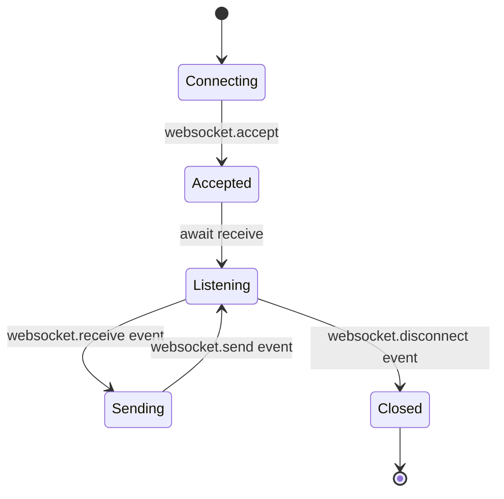

# Lecture 2 — WSGI, ASGI, and the Python Web Standards

> **Duration:** ~2 hours of reading + hands-on.
> **Outcome:** You can define WSGI and ASGI without looking them up, write a "hello world" app at each layer, and explain why two standards exist instead of one.

In Lecture 1 you saw that HTTP is plain text. In this lecture you'll see how Python applications *receive* that text and *produce* a response. The answer is two protocols: **WSGI** for synchronous apps (Flask, Django pre-3.x, most Django code today) and **ASGI** for async-capable apps (FastAPI, Starlette, Django 5 async views). Every Python web framework either implements one of these, or both.

---

## 1. The problem these standards solve

Before WSGI existed (mid-1990s through 2009), every Python web framework re-invented its own way to integrate with a web server. If you wanted to run Django on Apache, you used `mod_python`. If you wanted Pylons on Apache, you used a different module. Want to switch from Apache to nginx? Rewrite the integration. Want to test your app without a real server? Tough — your app is wedded to Apache's internals.

The Python community wanted to break that. Two goals:

1. **App authors** should write their app once and run it on *any* compliant server.
2. **Server authors** should write a server once and host *any* compliant app.

That's it. Same goal as the Java Servlet spec, the Ruby Rack spec, the Node.js `http.Server` interface — but for Python.

In 2003, Phillip J. Eby drafted **PEP 333**, the original WSGI. In 2010 it was rewritten for Python 3 as **PEP 3333**. ASGI followed in 2018, born out of Django Channels' need to handle WebSockets — something WSGI fundamentally cannot do.

---

## 2. WSGI — the synchronous standard

### The interface in one line

> **A WSGI app is a callable that takes two arguments — `environ` (dict) and `start_response` (function) — and returns an iterable of `bytes`.**

That's it. The simplest WSGI app you can write is:

```python
def app(environ, start_response):
    start_response("200 OK", [("Content-Type", "text/plain")])
    return [b"Hello, WSGI!"]
```

That **8-line function** is a complete, conformant Python web application. You can run it on Gunicorn, uWSGI, Waitress, Apache+mod_wsgi, or the stdlib reference server `wsgiref` — without changing a byte.

### What `environ` contains

`environ` is a plain `dict`. The server populates it from the incoming HTTP request. Standard keys (subset):

| Key | Meaning | Example |
|-----|---------|---------|
| `REQUEST_METHOD` | The HTTP verb | `"GET"` |
| `PATH_INFO` | The path | `"/articles/42"` |
| `QUERY_STRING` | Everything after `?` | `"page=2&sort=desc"` |
| `SERVER_NAME` | Server's hostname | `"example.com"` |
| `SERVER_PORT` | Server's port | `"443"` |
| `HTTP_HOST` | The `Host` request header | `"example.com"` |
| `HTTP_USER_AGENT` | The `User-Agent` header | `"Mozilla/5.0..."` |
| `CONTENT_TYPE` | Request body content-type | `"application/json"` |
| `CONTENT_LENGTH` | Request body length | `"42"` |
| `wsgi.input` | A file-like object you read the body from | (a stream) |
| `wsgi.url_scheme` | `"http"` or `"https"` | |

Every request header `Foo-Bar` shows up as `HTTP_FOO_BAR` — uppercased, dashes to underscores, prefixed with `HTTP_`.

### What `start_response` does

`start_response` is a function the server passes you. **You must call it exactly once** before yielding any body bytes. Its signature is:

```python
start_response(status: str, headers: list[tuple[str, str]], exc_info=None)
```

- `status` is a string like `"200 OK"`.
- `headers` is a list of `(name, value)` tuples.

After you call `start_response`, you return (or yield) an iterable of `bytes`. The server writes those bytes to the socket, in order.

### A complete, slightly-realistic WSGI app

```python
from urllib.parse import parse_qs

def app(environ, start_response):
    method = environ["REQUEST_METHOD"]
    path   = environ["PATH_INFO"]
    query  = parse_qs(environ.get("QUERY_STRING", ""))

    if path == "/":
        body = b"<h1>Hello, WSGI world.</h1>"
        start_response("200 OK", [("Content-Type", "text/html; charset=utf-8")])
        return [body]

    if path == "/echo" and method == "POST":
        size = int(environ.get("CONTENT_LENGTH") or 0)
        body = environ["wsgi.input"].read(size)
        start_response("200 OK", [("Content-Type", "application/octet-stream")])
        return [body]

    start_response("404 Not Found", [("Content-Type", "text/plain")])
    return [b"Not found"]
```

You can serve this with one extra line:

```python
from wsgiref.simple_server import make_server
make_server("", 8000, app).serve_forever()
```

Visit `http://localhost:8000/`. You're running a real HTTP server, with no framework at all.

### Where WSGI is in your stack

```
┌────────────────────────────────────────────────┐
│  Browser / curl  ─ HTTP/1.1 over TCP ─▶  Nginx │
└────────────────────────────────────────────────┘
                        │  (reverse proxy)
                        ▼
┌────────────────────────────────────────────────┐
│  Gunicorn (WSGI server)                        │
└────────────────────────────────────────────────┘
                        │  (WSGI calls)
                        ▼
┌────────────────────────────────────────────────┐
│  Django.WSGIHandler (your app's WSGI callable) │
└────────────────────────────────────────────────┘
                        │  (Django middleware → view)
                        ▼
                  Your view function
```

In Django you never write a WSGI callable by hand — `django.core.wsgi.get_wsgi_application()` produces one for you. But understanding what's underneath makes the framework feel less like magic.

### What WSGI cannot do

WSGI is *synchronous*. Every request blocks one worker until it returns. That makes three things impossible (or extremely awkward):

1. **WebSockets.** Long-lived bidirectional connections don't fit "one request → one response."
2. **Server-Sent Events (SSE).** Same problem — the response stays open.
3. **Native `async` views.** You can't `await` inside a WSGI callable; the worker doesn't have an event loop.

For a long time the answer was "use a separate process with Tornado / Twisted for those endpoints." That was painful. Hence ASGI.

---

## 3. ASGI — the async standard

### The interface in one line

> **An ASGI app is an `async` callable that takes three arguments — `scope` (dict), `receive` (async function), `send` (async function) — and returns nothing.**

The simplest ASGI app:

```python
async def app(scope, receive, send):
    assert scope["type"] == "http"
    await send({
        "type": "http.response.start",
        "status": 200,
        "headers": [(b"content-type", b"text/plain")],
    })
    await send({
        "type": "http.response.body",
        "body": b"Hello, ASGI!",
    })
```

This works. Save it as `app.py` and run `uvicorn app:app`.

### What `scope` contains

Where WSGI's `environ` is one flat dict, ASGI's `scope` is structured. Key fields:

| Field | Type | Meaning |
|-------|------|---------|
| `type` | `str` | `"http"`, `"websocket"`, `"lifespan"` — the protocol |
| `http_version` | `str` | `"1.1"`, `"2"` |
| `method` | `str` | `"GET"` |
| `path` | `str` | `"/articles"` |
| `query_string` | `bytes` | `b"page=2"` |
| `headers` | `list[tuple[bytes, bytes]]` | Raw, lowercase header names |
| `client` | `(host, port)` | The client socket address |
| `server` | `(host, port)` | The server socket address |

Notice headers are `bytes`, not `str`. ASGI is strict about that.

### What `receive` and `send` do

ASGI splits the world into "events" you send and receive. For HTTP requests you receive `http.request` events and send `http.response.start` then `http.response.body` events.

That **event-pump model** is why ASGI can handle WebSockets — those just become a different `scope["type"]` with different event names.

### What a WebSocket app looks like

```python
async def app(scope, receive, send):
    if scope["type"] != "websocket":
        return
    await send({"type": "websocket.accept"})
    while True:
        event = await receive()
        if event["type"] == "websocket.receive":
            await send({"type": "websocket.send", "text": event["text"].upper()})
        elif event["type"] == "websocket.disconnect":
            break
```

That's a complete WebSocket echo server that uppercases everything the client sends. **WSGI cannot do this. ASGI can.** That's the entire reason ASGI exists.



*ASGI's event-pump model as a state machine: accept, then loop receiving and sending events until disconnect.*

---

## 4. WSGI vs ASGI side-by-side

| | **WSGI** | **ASGI** |
|---|---|---|
| Year | 2003 (PEP 333), 2010 (PEP 3333) | 2018 |
| Concurrency model | Synchronous, blocking | Async, event-loop-based |
| Protocols | HTTP only | HTTP + WebSockets + lifespan + (extensible) |
| Frameworks | Django (legacy / classic), Flask, Bottle, Pyramid | FastAPI, Starlette, Django 5 async, Litestar, Sanic |
| Servers | Gunicorn, uWSGI, Waitress, mod_wsgi | Uvicorn, Hypercorn, Daphne, Granian |
| Function shape | `def app(environ, start_response): -> Iterable[bytes]` | `async def app(scope, receive, send) -> None` |
| Headers | `environ["HTTP_FOO_BAR"]`, strings | `scope["headers"]`, list of `(bytes, bytes)` |
| Body | Read sync from `wsgi.input` | Async iterate via `receive()` |
| Sweet spot | CPU-bound or DB-bound apps where each request is fast | I/O-bound, many slow upstreams, real-time |

### "But which one should I use?"

In 2026, the honest answer:

- **Building a new public app from scratch and unsure?** Pick **Django 5** with the async-capable views. You get the WSGI ecosystem when you want it and ASGI when you need it.
- **Building a JSON API for someone else's frontend or for mobile?** Pick **FastAPI**.
- **Building real-time / chat / streaming?** ASGI all the way. FastAPI, Starlette, or Django Channels.
- **Working on a legacy code base on Flask?** Stay on Flask + WSGI. Don't rewrite for fashion.

We will use **both** standards in this course because in real life you do too.

---

## 5. The servers that host them

A *framework* is what you write your application in. A *server* is what listens on the socket. They're separate concerns.

### WSGI servers you should know

- **Gunicorn** — the default. `gunicorn myapp.wsgi:application -w 4`. Pre-forks workers; rock-solid.
- **uWSGI** — older, more powerful, more painful to configure. Still used in many shops.
- **Waitress** — pure Python, easy on Windows, single-process.
- **mod_wsgi** — Apache module. Use only if you're already running Apache.

### ASGI servers you should know

- **Uvicorn** — the default. Built on `uvloop` and `httptools`. Fast. `uvicorn myapp.asgi:app`.
- **Hypercorn** — supports HTTP/2 + HTTP/3 out of the box.
- **Daphne** — the original ASGI server, from the Django Channels team.
- **Granian** — newer, Rust-based, very fast. Reasonable choice in 2026.

### What you'll actually use

For local development: **Uvicorn** (`uvicorn main:app --reload`) or `python manage.py runserver` for Django.

For production: **Gunicorn with Uvicorn workers** — `gunicorn myapp.asgi:app -k uvicorn.workers.UvicornWorker -w 4`. This gives you Gunicorn's process management with Uvicorn's async I/O. Best of both.

---

## 6. Translating between the two

You might be wondering: can the same app speak both WSGI and ASGI? Yes — with adapters.

- `asgiref.wsgi.WsgiToAsgi` wraps a WSGI app and serves it under an ASGI server.
- `asgiref.sync.async_to_sync` and `sync_to_async` let you mix sync and async code at the function level.

Django 5 uses these internally. A Django project has *both* `wsgi.py` and `asgi.py` and you pick which one your server uses.

---

## 7. Try it yourself

The exercises directory has two small files for this lecture:

- `exercises/exercise-02-stdlib-server.py` — an `http.server` based mini-server (NOT WSGI; the stdlib's high-level HTTP server is its own thing)
- `exercises/exercise-03-wsgi-hello-world.py` — a WSGI app served by `wsgiref`

Run both. Hit them with `curl -v`. Notice the response is identical from the client's point of view — that's the whole point of a standard.

---

## 8. Common pitfalls

1. **Forgetting to call `start_response`.** Your WSGI app must call it exactly once before returning.
2. **Returning `str` instead of `bytes`.** WSGI requires `bytes`. (`b"hello"`, not `"hello"`.)
3. **Mixing sync code in an async ASGI handler.** A 2-second `time.sleep` in an async view blocks the *entire event loop*, not just the current request. Use `asyncio.sleep`, or `sync_to_async(...)` for unavoidable sync code.
4. **Treating headers as `str` in ASGI.** They're `bytes`. Always.
5. **Running Uvicorn in production with `--reload`.** Don't. `--reload` is for development only.

---

## 9. Self-check

- Why does ASGI exist when WSGI already did?
- What is the smallest possible WSGI app? (Write it from memory.)
- Why do ASGI headers use `bytes` and WSGI's `environ` headers use `str`?
- You have a Django project. Which file does Gunicorn import? Which does Uvicorn import?
- Your async view calls a blocking `requests.get(...)`. Why is that bad? What should you do instead?

---

## 10. What you can skip for now

- The PEP 3333 details on file wrappers, `wsgi.file_wrapper`, exception handling, error streams.
- ASGI's `lifespan` protocol (we'll see it in Week 7).
- Building a custom ASGI server (we'll never need to).

Read both PEPs in full when you encounter a deep bug. Until then, this lecture is enough.

---

## Further reading

- **PEP 3333 — Python Web Server Gateway Interface v1.0.1**:
  <https://peps.python.org/pep-3333/>
- **ASGI specification**:
  <https://asgi.readthedocs.io/en/latest/>
- **Django docs — How to deploy with WSGI**:
  <https://docs.djangoproject.com/en/stable/howto/deployment/wsgi/>
- **Django docs — How to deploy with ASGI**:
  <https://docs.djangoproject.com/en/stable/howto/deployment/asgi/>
- **Andrew Godwin's "Django Channels and ASGI" talk** (the origin story):
  <https://www.aeracode.org/2018/02/19/python-async-simplified/>

Next: [Lecture 3 — The Python Web Framework Landscape](./03-the-python-web-framework-landscape.md).
