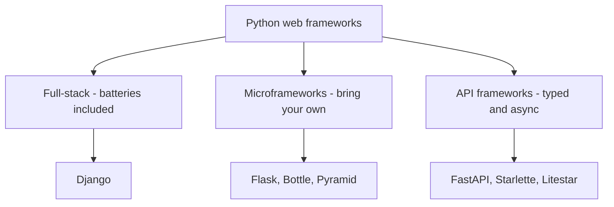

# Lecture 3 — The Python Web Framework Landscape

> **Duration:** ~2 hours of reading + the "Django by hand" walkthrough.
> **Outcome:** You can name the major Python web frameworks, describe each in two sentences, and pick the right one for a given problem statement with a defensible reason.

You've seen what HTTP is and what WSGI/ASGI are. Now we look at the libraries built on top — the part you actually write code against.

---

## 1. The taxonomy

There are dozens of Python web frameworks. They split cleanly into three buckets:

### Bucket 1 — Full-stack ("batteries included")

Comes with an ORM, an admin, a template engine, auth, sessions, migrations, forms, security middleware. You can build a real app on day one without choosing 30 libraries.

- **Django** — the canonical full-stack. Boring, mature, ubiquitous. We use it extensively.

### Bucket 2 — Microframeworks ("you bring the batteries")

Routing + request/response objects. You pick everything else.

- **Flask** — the canonical microframework. WSGI. C1 Week 9 already covers it.
- **Bottle** — a single-file microframework. Mostly historical.
- **Pyramid** — somewhere between micro and full-stack. Used to be huge; now niche.

### Bucket 3 — API frameworks ("typed, async, OpenAPI-first")

Built for JSON APIs. Pydantic-typed. ASGI. Auto-generated OpenAPI docs.

- **FastAPI** — the canonical API framework. We use it extensively.
- **Starlette** — what FastAPI is built on. Use directly when you want less magic.
- **Litestar** — newer FastAPI competitor; bigger built-in feature set.
- **Sanic** — was the first popular async framework. Still around.
- **Tornado** — old, async-first, used at scale (Facebook, Quora). Niche now.



*The three buckets Python web frameworks split into, with this course's picks in bold above.*

We will use **Django** and **FastAPI** in this course. Below, here's why.

---

## 2. Django — the batteries-included giant

### Stats

- Born 2003 at the Lawrence Journal-World newspaper.
- Open-sourced 2005.
- Still actively developed by the Django Software Foundation.
- 80,000+ GitHub stars.
- Used by Instagram, Pinterest, Spotify, Mozilla, NASA, *The Washington Post*.

### What it gives you out of the box

| Subsystem | What it does | Module |
|-----------|--------------|--------|
| ORM | SQL via Python classes | `django.db.models` |
| Migrations | Schema versioning | `django.db.migrations` |
| Admin | Auto-generated CRUD UI for your models | `django.contrib.admin` |
| Auth | User model, password hashing, login/logout | `django.contrib.auth` |
| Sessions | Cookie-backed sessions | `django.contrib.sessions` |
| Templates | Server-rendered HTML | `django.template` |
| Forms | Validation, CSRF, rendering | `django.forms` |
| URL routing | Path-based, regex-based, name-based | `django.urls` |
| Security middleware | CSRF, XSS, clickjacking, host header | `django.middleware.security` |
| Email | SMTP, console, file, in-memory backends | `django.core.mail` |
| Caching | Memcached, Redis, DB, local memory | `django.core.cache` |
| File storage | Local + pluggable (S3, etc.) | `django.core.files` |
| i18n / l10n | Translation, formatting | `django.utils.translation` |
| Test client | In-memory request/response, no real server needed | `django.test` |

You can build a real, multi-table, authenticated, admin-equipped web app on top of Django on day one. Nothing else in the Python ecosystem matches that scope.

### Django's philosophy in three lines

- **Convention over configuration.** Every Django project has the same layout. New hires onboard fast.
- **DRY (Don't Repeat Yourself).** Define your model once; the migration, admin, form, and serializer all derive from it.
- **Loose coupling.** Apps inside a project are isolated. You can reuse them.

### When to use Django

- **Content sites, dashboards, internal tools, marketplaces.** Anything where the data model is rich and you need an admin UI for ops people.
- **Server-rendered HTML.** The template system is mature and the form system handles 90% of HTML form cases out of the box.
- **You want to ship and you don't want to bikeshed library choices.**
- **You're alone or in a small team.** Django gives you so much for free that you don't need to coordinate as much.

### When NOT to use Django

- **Pure JSON API with no HTML at all.** Django + Django REST Framework works, but FastAPI is leaner.
- **Heavy async / streaming / WebSocket workload.** Django 5 has async views, but Django's idioms are sync-first. FastAPI feels more natural.
- **You hate "magic."** Django has a lot of conventions, signals, and metaprogramming. Some engineers find this opaque.

---

## 3. FastAPI — the typed async API framework

### Stats

- Born 2018 by Sebastián Ramírez (`tiangolo`).
- 75,000+ GitHub stars (caught up to Django).
- Used by Microsoft, Netflix, Uber, OpenAI for internal services.
- Built on **Starlette** (ASGI framework) and **Pydantic** (data validation).

### What it gives you

- **Async by default.** Define views with `async def`. Run on Uvicorn.
- **Type hints drive everything.** Type your function parameters; FastAPI parses request, validates, serializes response.
- **Free OpenAPI docs.** Browse `/docs` (Swagger UI) and `/redoc` to get auto-generated, interactive API documentation. No effort.
- **Dependency injection.** Express "this endpoint needs a database session" as a function parameter; FastAPI resolves it.
- **Background tasks, WebSockets, file uploads, security utilities — all built in.**

### A complete FastAPI endpoint

```python
from fastapi import FastAPI
from pydantic import BaseModel

app = FastAPI()

class Article(BaseModel):
    title: str
    body: str
    published: bool = False

@app.post("/articles", status_code=201)
async def create_article(article: Article) -> Article:
    # Save to DB here…
    return article
```

That's it. From this code FastAPI produces:

- A validated `Article` from the request body (rejects malformed payloads with `422 Unprocessable Entity` automatically).
- An OpenAPI schema with both the input and output shapes.
- A Swagger UI you can click through at `/docs`.
- A `201 Created` response with the JSON of the article you returned.

You'd write three or four times more code to do the same in Flask. Django + DRF would be somewhere in between.

### When to use FastAPI

- **Public JSON APIs.** OAuth-protected APIs, mobile backends, microservices.
- **Real-time stuff.** WebSockets, server-sent events, long-running streams.
- **Heavy fan-out / fan-in.** Calling 20 upstream services per request — async/`gather` makes this concurrent.
- **Strong typing matters.** When your API is the *product* (used by other teams, consumed by SDKs), the rigor of Pydantic pays off.

### When NOT to use FastAPI

- **Heavy server-rendered HTML.** FastAPI can do it (via Jinja2), but Django's template + form system is more mature.
- **You need a CMS-like admin out of the box.** Django ships one; FastAPI doesn't.
- **The team is junior on async.** Async Python is genuinely harder to debug than sync. Don't pick FastAPI just because it's trendy.

---

## 4. Flask — the microframework you might already know

- ~70,000 GitHub stars.
- Born 2010 by Armin Ronacher as an April Fools joke that turned real.
- Synchronous, WSGI.
- Extremely flexible, extremely "you pick everything."

### When Flask wins

- **Tiny, focused services.** A health-check endpoint, a webhook receiver, a CSV-to-JSON converter — a 200-line Flask app is clearer than a Django project.
- **Educational use.** Easiest framework to read line-by-line. We used it in C1 Week 9 for that reason.
- **You have strong opinions about every dependency.** Flask defers them all to you.

### When Flask loses

- **Anything growing past 5 routes that involves a database.** You'll end up reinventing pieces of Django poorly.
- **Anything needing async.** Quart (Flask's async sibling) exists but momentum is on FastAPI's side.
- **Anything where an admin or auth would save you a week.** Use Django.

In C16 we mention Flask in lectures but don't build anything new with it. C1 Week 9 has the Flask material.

---

## 5. Starlette, Litestar, Sanic, Tornado — the rest of the picture

### Starlette

What FastAPI is built on. Use it directly when you want FastAPI's speed and async without Pydantic's validation. Smaller surface area. Used by FastAPI itself, by the SSE/WebSocket parts of FastAPI, and by people who want max control.

### Litestar

Newer (2022). Marketed as a more feature-complete FastAPI alternative. Has its own ORM (Advanced Alchemy), more first-class plugins for things like DTOs, channels, controllers. Real and reasonable choice in 2026, especially if you find FastAPI's plugin ecosystem too à-la-carte. We don't use it here only because FastAPI is the better-known choice and the patterns transfer.

### Sanic

The original async framework. Predates Starlette. Still maintained. Mostly chosen by teams who started early and never had a reason to switch.

### Tornado

The original *really* old one. Battle-tested at huge scale (FriendFeed → Facebook). Async-first but its API predates `async/await`. Mostly legacy now; if you join a Tornado shop, learn it; otherwise skip.

---

## 6. Decision matrix

For the questions you'll most often face:

| Problem | Right answer | Why |
|---------|--------------|-----|
| "Build a dashboard with login + reports + admin" | **Django** | Admin + auth + ORM for free |
| "Build a JSON API for our mobile app" | **FastAPI** | Async, OpenAPI, Pydantic |
| "Add WebSockets to our existing Django site" | **Django Channels** | Stays in the Django ecosystem |
| "Webhook receiver that calls 5 services per request" | **FastAPI** | Async fan-out wins |
| "Static site generator" | None — use **Pelican** or **Hugo** | A framework is overkill |
| "Internal CRUD on top of an existing DB" | **Django + inspectdb** | Generate models from schema |
| "Replace a slow Flask app" | **Profile first**, then maybe FastAPI | Often the bottleneck is the DB, not the framework |
| "Real-time chat" | **FastAPI** or **Django Channels** | Both can do it; pick by team familiarity |
| "ML model inference API" | **FastAPI** | Pydantic for typed contracts, async for batching |
| "GraphQL backend" | **Strawberry** (works with both Django and FastAPI) | Mature, type-driven |

---

## 7. Why we use both Django and FastAPI in this course

The pattern most real Python shops converge on:

- **Django** for the parts that involve humans editing content (admin, dashboard, marketing site, server-rendered HTML).
- **FastAPI** for the parts that other software talks to (mobile, frontend SPA, partner integrations, internal microservices).

They share the same database. They share the same Python codebase. They are deployed together but address different audiences.

You'll build exactly this architecture in this course. By Week 7 you have a Django side and a FastAPI side reading from the same Postgres.

---

## 8. Django "by hand" — the exercise that ends Week 1

The Django tutorial starts with `django-admin startproject mysite`. That command writes 5 files and 50 lines of code, and most people copy-paste their way through the next 12 chapters without ever knowing what those 50 lines do.

Your **mini-project** this week is to skip `startproject` and build a Django project from a completely empty folder. You'll write `manage.py`, `settings.py`, `urls.py`, and the project's `__init__.py` yourself. There's nothing magical in any of them — once you've typed them out once, you'll never feel intimidated by a generated Django project again.

The mini-project spec is in [`mini-project/README.md`](../mini-project/README.md). Don't peek until you've finished the lectures and exercises.

---

## 9. Common framework-choice mistakes

1. **Picking by trendiness.** "FastAPI is faster" is true on a microbenchmark but irrelevant when your bottleneck is the database.
2. **Picking by familiarity.** "I know Flask so I'll use Flask for everything." Fine for prototypes. Costly past 3,000 LOC.
3. **Picking by "modern."** Old frameworks (Django) are old because they work. New frameworks haven't survived their first decade yet.
4. **Picking the same thing for everything.** Use Django for the admin, FastAPI for the API. Mature teams mix.
5. **Picking before measuring.** Build the smallest possible version of the feature in the framework you know. If it's fast enough, you're done.

---

## 10. Self-check

- Name three things Django gives you that Flask doesn't.
- Why does FastAPI auto-generate OpenAPI docs? What machinery makes that possible?
- What ASGI framework is FastAPI built on?
- Your team is 4 engineers shipping an internal tool with login, dashboards, and 30 admin tables. Which framework?
- Your team is 2 engineers building a public mobile-app backend with 50 JSON endpoints, OAuth, and 1M requests/day. Which framework?
- Your team is 1 engineer prototyping a webhook receiver that has to be live by Friday. Which framework?

If you can answer those three confidently, you're ready for the rest of C16.

---

## Further reading

- **Django at a glance** — official one-pager: <https://docs.djangoproject.com/en/stable/intro/overview/>
- **FastAPI features tour**: <https://fastapi.tiangolo.com/features/>
- **Flask documentation index**: <https://flask.palletsprojects.com/en/stable/>
- **Litestar comparison with FastAPI**: <https://docs.litestar.dev/latest/usage/launching-applications.html>
- **"Choosing a Python web framework" — official Python docs guide**: <https://wiki.python.org/moin/WebFrameworks>

---

That's the end of Lecture 3. Take the [quiz](../quiz.md), then start on the [mini-project](../mini-project/README.md).
