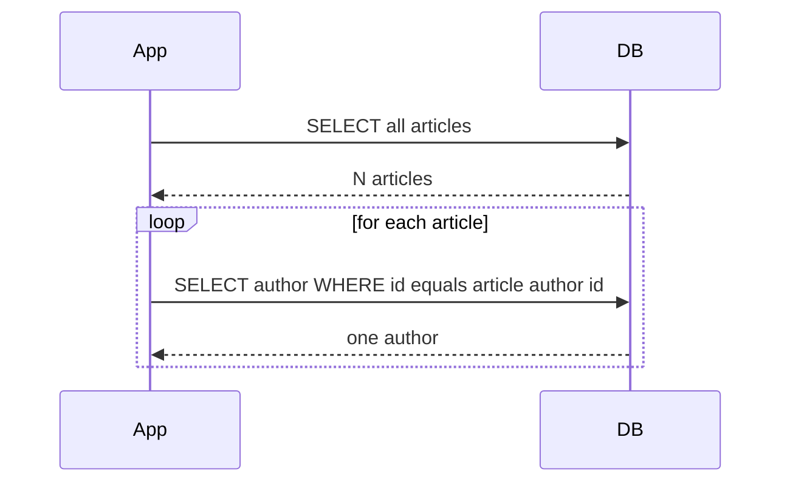

# Lecture 3 — The QuerySet API and the Admin

> **Duration:** ~2 hours. **Outcome:** You can write queries that compile to one or two SQL statements (not N+1), and you can register a model with the admin and customize it to be genuinely useful.

## 1. The QuerySet

A `QuerySet` represents a database query that hasn't run yet.

```python
articles = Article.objects.filter(status="published")  # no SQL yet
```

SQL is executed only when the QuerySet is **consumed**: by `list()`, by iteration, by `len()`, by slicing with an exact end, by `bool()`. This **laziness** is the most important property to internalize.

### The everyday methods

```python
Article.objects.all()                                    # SELECT * FROM article
Article.objects.filter(status="published")               # WHERE status = 'published'
Article.objects.exclude(status="draft")                  # WHERE status <> 'draft'
Article.objects.get(slug="hello-world")                  # WHERE slug=... — raises if 0 or >1
Article.objects.first()                                  # ... LIMIT 1
Article.objects.last()                                   # reverse-ordered ... LIMIT 1
Article.objects.count()                                  # SELECT COUNT(*)
Article.objects.exists()                                 # SELECT 1 ... LIMIT 1
Article.objects.order_by("-created_at")                  # ORDER BY created_at DESC
Article.objects.values("title", "slug")                  # SELECT title, slug — returns dicts
Article.objects.values_list("title", flat=True)          # → flat list of titles
```

Chainable. Every method returns a new `QuerySet` you can chain further:

```python
Article.objects.filter(status="published").exclude(author__id=1).order_by("-created_at")[:10]
```

### Field lookups

Django's `__` syntax bridges between Python and SQL:

```python
Article.objects.filter(title__icontains="django")        # case-insensitive contains
Article.objects.filter(created_at__gte=last_monday)      # >= last_monday
Article.objects.filter(author__email__endswith="@example.com")  # JOIN to user
Article.objects.filter(status__in=["draft", "review"])   # IN clause
Article.objects.filter(body__isnull=False)               # IS NOT NULL
Article.objects.filter(categories__name="python")        # JOIN through M2M
```

Every lookup has SQL semantics you can predict from the name (`__exact`, `__iexact`, `__contains`, `__icontains`, `__startswith`, `__endswith`, `__gt`, `__gte`, `__lt`, `__lte`, `__in`, `__range`, `__isnull`, `__regex`, `__iregex`, plus date-specific `__year`, `__month`, `__date`).

### Aggregations

```python
from django.db.models import Count, Avg, Sum, Max, Min

Article.objects.count()                                  # row count
Article.objects.aggregate(Count("id"))                   # → {"id__count": N}
Article.objects.aggregate(avg_words=Avg("word_count"))   # → {"avg_words": ...}

# Annotations attach a computed value to each row
User.objects.annotate(article_count=Count("articles")).order_by("-article_count")
```

`annotate` is one of the four ORM superpowers. Use it any time you'd otherwise do a Python `for-loop` to count related objects.

### Q and F objects

`Q` lets you compose OR / AND queries:

```python
from django.db.models import Q

Article.objects.filter(Q(status="published") | Q(author__id=1))
Article.objects.filter(~Q(status="draft"))                # NOT
```

`F` references a column inside the database expression (so you don't roundtrip the value):

```python
from django.db.models import F

Article.objects.update(view_count=F("view_count") + 1)    # atomic in-DB increment
Article.objects.filter(comment_count__gt=F("view_count")) # WHERE comment_count > view_count
```

## 2. The N+1 problem

The single most-common Django performance bug.

```python
for article in Article.objects.all():
    print(article.author.name)
```

What happens in SQL:

1. `SELECT * FROM article` (1 query)
2. For each article, `SELECT * FROM user WHERE id = article.author_id` (N queries)

Total: N+1 queries. On 100 articles that's 101 round trips to the database. On 10,000 it kills you.


*Looping over articles and touching article.author triggers one extra query per row - the N plus 1 pattern.*

### Fix #1: `select_related` for forward FKs and one-to-ones

```python
for article in Article.objects.select_related("author"):
    print(article.author.name)
```

Now: 1 query with a JOIN. Done.

### Fix #2: `prefetch_related` for reverse FKs and M2Ms

```python
for user in User.objects.prefetch_related("articles"):
    for article in user.articles.all():
        print(article.title)
```

Now: 2 queries. One to fetch users, one to fetch all their articles via `WHERE author_id IN (...)`. Django joins them in Python.

### Both can chain and nest

```python
Article.objects.select_related("author").prefetch_related("categories", "author__articles")
```

### How to spot N+1 in production

- **Local dev:** `django-debug-toolbar` shows the SQL panel on every page. Watch the query count.
- **CI/tests:** assert query counts with `assertNumQueries`.
- **Production:** APM tools (Datadog, NewRelic, Sentry Performance) flag N+1 patterns.

## 3. The admin

The `django.contrib.admin` is one of Django's most distinctive features. It's a CRUD UI for your models, generated from your model definitions, customizable to the point of being a working CMS.

### Adding the admin

If you started from `startproject`, the admin is already in `INSTALLED_APPS`. If you built by hand (Week 1), add:

```python
INSTALLED_APPS = [
    "django.contrib.admin",
    "django.contrib.auth",
    "django.contrib.contenttypes",
    "django.contrib.sessions",
    "django.contrib.messages",
    "django.contrib.staticfiles",
    # ...
    "byhand",
]
```

And in `urls.py`:

```python
from django.contrib import admin
from django.urls import path

urlpatterns = [
    path("admin/", admin.site.urls),
    # ...
]
```

Run `migrate`. Create a superuser:

```bash
python manage.py createsuperuser
```

Visit `http://localhost:8000/admin/`.

### Registering a model

In `myapp/admin.py`:

```python
from django.contrib import admin
from .models import Article, Category

admin.site.register(Category)
admin.site.register(Article)
```

That alone gives you list, create, edit, delete for each. But the list view will show the result of `__str__` for each row — usable but spartan.

### `ModelAdmin` — making it usable

```python
from django.contrib import admin
from .models import Article, Category


@admin.register(Article)
class ArticleAdmin(admin.ModelAdmin):
    list_display = ("title", "author", "status", "created_at", "published_at")
    list_filter = ("status", "categories", "author")
    search_fields = ("title", "body")
    date_hierarchy = "created_at"
    ordering = ("-created_at",)
    prepopulated_fields = {"slug": ("title",)}
    raw_id_fields = ("author",)
    filter_horizontal = ("categories",)
    readonly_fields = ("created_at",)

    fieldsets = (
        ("Article", {"fields": ("title", "slug", "author", "body")}),
        ("Categorization", {"fields": ("categories", "status")}),
        ("Dates", {"fields": ("created_at", "published_at")}),
    )


@admin.register(Category)
class CategoryAdmin(admin.ModelAdmin):
    list_display = ("name", "slug")
    prepopulated_fields = {"slug": ("name",)}
```

Read each option:

| Option | Effect |
|--------|--------|
| `list_display` | Columns in the list view |
| `list_filter` | Right-sidebar filter dropdowns |
| `search_fields` | Powers the search box (uses `icontains` by default) |
| `date_hierarchy` | The year/month/day drill-down across the top |
| `ordering` | Default sort |
| `prepopulated_fields` | Auto-fill slug from title as you type |
| `raw_id_fields` | Replace big dropdowns with ID lookup + magnifier (for FKs to tables with many rows) |
| `filter_horizontal` | Pretty M2M widget |
| `readonly_fields` | Display but don't edit |
| `fieldsets` | Group fields into named sections on the edit page |

### Inlines

When an `Article` has many `Comment`s, you can edit comments INSIDE the article admin page:

```python
class CommentInline(admin.TabularInline):
    model = Comment
    extra = 0

@admin.register(Article)
class ArticleAdmin(admin.ModelAdmin):
    inlines = [CommentInline]
```

`TabularInline` is compact rows; `StackedInline` is full-form per item. Use sparingly — inlines slow down the page.

### Admin actions

Drop-down "actions" at the top of any list view:

```python
@admin.action(description="Mark selected articles as published")
def publish_articles(modeladmin, request, queryset):
    queryset.update(status="published", published_at=timezone.now())

@admin.register(Article)
class ArticleAdmin(admin.ModelAdmin):
    actions = [publish_articles]
```

Now editors can bulk-publish without writing SQL.

## 4. The admin as a real interface

Two patterns to know:

### Pattern A — admin as ops console

Internal tools, content sites, anything with a small editorial team. Admin is the front door. Lock it behind staff-only auth and you have a CMS for free.

### Pattern B — admin as developer-only

Customer-facing sites where the admin is for *engineers* to fix bad data. The customers never see it. The admin is one of three or four screens engineers visit daily.

Both are legitimate. Don't try to make the admin a customer UI — it isn't designed for that, and you'll fight Django's defaults forever.

## 5. Self-check

- A `QuerySet` represents what?
- When is the SQL actually executed?
- What's the difference between `select_related` and `prefetch_related`?
- Iterating `User.objects.all()` and accessing `.profile` for each. How many queries by default? How many with `select_related("profile")`?
- Name three `ModelAdmin` options you'd set on every model.

## Further reading

- **QuerySet API reference**: <https://docs.djangoproject.com/en/stable/ref/models/querysets/>
- **Aggregation guide**: <https://docs.djangoproject.com/en/stable/topics/db/aggregation/>
- **Admin reference**: <https://docs.djangoproject.com/en/stable/ref/contrib/admin/>
- **`django-debug-toolbar`**: <https://django-debug-toolbar.readthedocs.io/>
