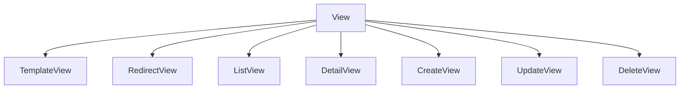
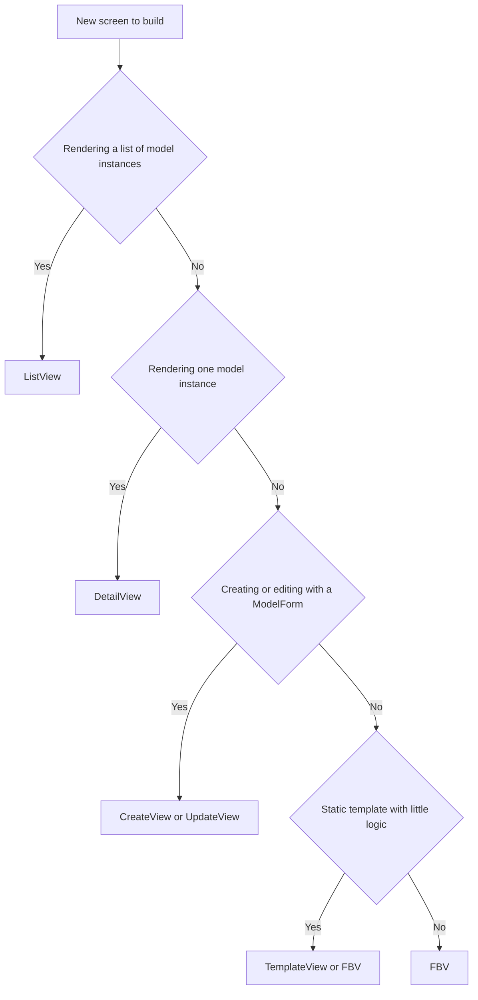

# Lecture 1 — Function-Based Views vs Class-Based Views

> **Duration:** ~2 hours. **Outcome:** You can write the same screen as a function view, as a `View` subclass, and as a `ListView`/`DetailView`/`CreateView` generic — and you can defend which you would ship.

A Django view is one of the simplest contracts in the framework. Once you internalize the contract, everything else — class-based views, generics, mixins — is sugar on top of it.

## 1. The view contract

A view is **any callable that takes an `HttpRequest` and returns an `HttpResponse`**. That is the entire interface.

```python
from django.http import HttpResponse

def hello(request):
    return HttpResponse("hello")
```

The URL conf binds a path to that callable:

```python
# urls.py
from django.urls import path
from . import views

urlpatterns = [
    path("hello/", views.hello, name="hello"),
]
```

GET `/hello/` returns `hello`. There is no extra ceremony, no magic decorator, no inheritance. Every other view you write in Django — every generic, every mixin, every `as_view()` — eventually resolves to "a callable that takes a request and returns a response."

Remembering this saves you on the day a CBV does something unexpected: you can always drop one level lower.

## 2. Function-based views (FBVs)

A function-based view is exactly what the name says.

```python
from django.shortcuts import render
from .models import Article

def article_list(request):
    articles = Article.objects.filter(status="published").select_related("author")
    return render(request, "writer/article_list.html", {"articles": articles})


def article_detail(request, slug):
    try:
        article = Article.objects.select_related("author").get(slug=slug, status="published")
    except Article.DoesNotExist:
        from django.http import Http404
        raise Http404("Article not found")
    return render(request, "writer/article_detail.html", {"article": article})
```

`render(request, template_name, context)` is a thin shortcut that loads a template, renders it with the context, and returns a `HttpResponse` with `Content-Type: text/html` already set.

`get_object_or_404` is the idiomatic version of the try/except above:

```python
from django.shortcuts import get_object_or_404

def article_detail(request, slug):
    article = get_object_or_404(
        Article.objects.select_related("author"),
        slug=slug,
        status="published",
    )
    return render(request, "writer/article_detail.html", {"article": article})
```

### When FBVs are the right choice

- **Endpoints that don't fit a CRUD pattern**: webhooks, ad-hoc redirects, "click this to confirm an email" links, lightweight JSON endpoints.
- **One-off pages**: the home page, an `about` page, a status check.
- **Heavily customized logic**: when overriding three CBV hooks would just hide a straightforward if/else.
- **Teaching code**: an FBV is almost always more readable than the equivalent CBV when introducing a new pattern.

### When FBVs become a liability

- **CRUD on a model** with a form: you will rewrite the form-bind/validate/save dance every time. Use `CreateView` / `UpdateView`.
- **List + paginate + filter + order**: the `ListView` machinery handles this cleanly.
- **Detail page by primary key or slug**: `DetailView` is two lines.

## 3. Handling methods in an FBV

`request.method` tells you GET vs POST. The classic form pattern:

```python
from django.shortcuts import render, redirect
from .forms import CommentForm

def add_comment(request, article_slug):
    if request.method == "POST":
        form = CommentForm(request.POST)
        if form.is_valid():
            form.save()
            return redirect("article_detail", slug=article_slug)
    else:
        form = CommentForm()
    return render(request, "writer/comment_form.html", {"form": form})
```

Notice three properties:

1. **GET renders an empty form. POST tries to bind and save.** A page is one URL but two flows.
2. **On success we `redirect`**, not `render` — this is the Post-Redirect-Get pattern. It prevents the browser from re-submitting on reload.
3. **On failure (form not valid) we fall through to the render** with the bound form, which now contains the errors.

That bind/validate/redirect-or-render shape is the most-repeated pattern in Django. Memorize it.

## 4. Class-based views (CBVs)

A class-based view is a Python class that exposes an `as_view()` classmethod returning a regular view callable. Django ships a tree of CBVs; you subclass and override the bits you need.

```python
from django.views import View
from django.http import HttpResponse

class Hello(View):
    def get(self, request):
        return HttpResponse("hello")

    def post(self, request):
        return HttpResponse("hi from POST")
```

In the URL conf:

```python
path("hello/", views.Hello.as_view(), name="hello"),
```

`Hello.as_view()` returns a function: it instantiates the class on each request, dispatches on `request.method` (lowercased) to the matching method, and returns the response. That is `View.dispatch()` in one sentence.

### Why CBVs exist

Three reasons:

1. **HTTP method dispatch is built in.** No `if request.method == "POST"` ladder.
2. **Composition via mixins.** Login-required, permission-required, paginate, form-handle — each is a mixin you add to a subclass.
3. **Common patterns are pre-implemented.** List a queryset, show a detail page, render a `ModelForm` — Django ships the generic.

The cost: you trade explicitness for inheritance. To know what `CreateView` does on POST, you have to know the MRO across five classes. We come back to that.

## 5. The generic hierarchy

There are five generic CBVs you will use daily:

| CBV | Maps to | Required attributes |
|-----|---------|---------------------|
| `TemplateView` | Static-ish page that just renders a template | `template_name` |
| `ListView` | `GET /things/` — render a queryset | `model` (or `queryset`), `template_name` (or convention) |
| `DetailView` | `GET /things/<id>/` — render one object | `model`, `template_name` (or convention) |
| `CreateView` | `GET + POST /things/new/` — render `ModelForm`, save | `model`, `form_class` (or `fields`), `success_url` |
| `UpdateView` | `GET + POST /things/<id>/edit/` — render bound `ModelForm`, save | `model`, `form_class` (or `fields`), `success_url` |

Plus `DeleteView` (POST to confirm delete) and `FormView` (a generic, non-model form). You'll meet those.

The full hierarchy (simplified):

```text
View
├── TemplateView
├── RedirectView
└── (mixed) ───── ListView           = MultipleObjectTemplateResponseMixin + BaseListView
              ├── DetailView         = SingleObjectTemplateResponseMixin    + BaseDetailView
              ├── CreateView         = ... + ProcessFormView + ModelFormMixin
              ├── UpdateView         = ... + ProcessFormView + ModelFormMixin
              └── DeleteView         = ... + DeletionMixin
```


*The generic CBVs you use daily all inherit from the same base View class.*

You do not need to memorize this. You **do** need to know that `<https://ccbv.co.uk/>` exists — Classy Class-Based Views — and that it shows you every attribute and method on every CBV in one screen. Bookmark it now.

## 6. The same screen, three ways

Let's render the article list three ways. The model is the one from Week 2: `Article` has a `title`, `slug`, `author`, `status`, and `created_at`.

### 6a. FBV

```python
# views.py
from django.shortcuts import render
from .models import Article

def article_list(request):
    articles = (
        Article.objects.filter(status="published")
        .select_related("author")
        .order_by("-created_at")
    )
    return render(request, "writer/article_list.html", {"articles": articles})
```

```python
# urls.py
path("articles/", views.article_list, name="article_list"),
```

### 6b. CBV with `View`

```python
from django.views import View
from django.shortcuts import render
from .models import Article

class ArticleListView(View):
    def get(self, request):
        articles = (
            Article.objects.filter(status="published")
            .select_related("author")
            .order_by("-created_at")
        )
        return render(request, "writer/article_list.html", {"articles": articles})
```

```python
path("articles/", views.ArticleListView.as_view(), name="article_list"),
```

That's not an improvement over the FBV. We've gained one bit — automatic method dispatch — and traded readability. Don't ship this layer unless you need method dispatch.

### 6c. CBV with `ListView`

```python
from django.views.generic import ListView
from .models import Article

class ArticleListView(ListView):
    model = Article
    template_name = "writer/article_list.html"
    context_object_name = "articles"
    paginate_by = 20

    def get_queryset(self):
        return (
            super().get_queryset()
            .filter(status="published")
            .select_related("author")
            .order_by("-created_at")
        )
```

What we get for free:

- **Pagination** via `paginate_by`. The context now has `page_obj`, `paginator`, `is_paginated`.
- **Template defaults**: if you don't set `template_name`, Django looks for `writer/article_list.html` by convention (`<app>/<model>_list.html`).
- **Context defaults**: `object_list` is the queryset; we renamed to `articles` for the template.

You will write `ListView`s like this dozens of times across a Django career. Internalize the four-attribute shape (`model`, `template_name`, `context_object_name`, `paginate_by`) plus the one override (`get_queryset`).

## 7. `DetailView` — by `pk` or `slug`

```python
class ArticleDetailView(DetailView):
    model = Article
    template_name = "writer/article_detail.html"
    slug_field = "slug"
    slug_url_kwarg = "slug"
    context_object_name = "article"

    def get_queryset(self):
        # Only show published articles to anonymous traffic
        return super().get_queryset().filter(status="published").select_related("author")
```

URL conf:

```python
path("articles/<slug:slug>/", views.ArticleDetailView.as_view(), name="article_detail"),
```

Two things to notice:

1. **`<slug:slug>`** — the URL path converter validates the slug regex; the URL kwarg is also called `slug`, which is what `slug_url_kwarg` expects by default.
2. **`get_queryset` filters published** — security: a draft cannot be read at its public URL just because someone guessed the slug. We will tighten this in Week 9.

## 8. `CreateView` — the form CBV

```python
from django.views.generic.edit import CreateView
from django.urls import reverse_lazy
from .models import Article
from .forms import ArticleForm

class ArticleCreateView(CreateView):
    model = Article
    form_class = ArticleForm
    template_name = "writer/article_form.html"
    success_url = reverse_lazy("dashboard")

    def form_valid(self, form):
        form.instance.author = self.request.user
        return super().form_valid(form)
```

What `CreateView` does for you on `POST`:

1. Bind the form (`form_class(request.POST, request.FILES)`).
2. Call `form.is_valid()`.
3. If invalid: re-render the template with the bound form (errors visible).
4. If valid: call `form_valid(form)`, which by default calls `form.save()` and redirects to `success_url`.

We override `form_valid` to assign `request.user` to the new `Article.author` before save. That is the single most common `CreateView` customization in real codebases.

### Why `reverse_lazy`, not `reverse`?

`reverse()` runs at the moment it is called. At class-definition time, the URL conf may not be fully loaded yet — `reverse()` would raise `NoReverseMatch`. `reverse_lazy()` returns a proxy object that is only evaluated when used. Use `reverse_lazy` anywhere at class-body scope (attributes), and `reverse` anywhere inside a method (where it is called at request time).

## 9. The three hooks you will override constantly

Across nearly every CBV, three methods are the customization points:

### `get_queryset()`

Customize the queryset before listing/showing/editing. Filter by user, by status, by tenant.

```python
def get_queryset(self):
    return super().get_queryset().filter(author=self.request.user)
```

### `get_context_data(**kwargs)`

Add extra variables to the template context.

```python
def get_context_data(self, **kwargs):
    ctx = super().get_context_data(**kwargs)
    ctx["categories"] = Category.objects.all()
    return ctx
```

Always call `super()` first. CBVs build the context across the MRO; skip `super()` and you skip `object`, `view`, the form, the page object, etc.

### `get_object()` (DetailView / UpdateView / DeleteView)

Customize how the single object is looked up. Useful when the lookup logic isn't `pk`/`slug`.

```python
def get_object(self, queryset=None):
    qs = queryset or self.get_queryset()
    return qs.get(slug=self.kwargs["slug"], author=self.request.user)
```

## 10. The decision flow

Use this when designing a screen:

1. **Is the screen rendering a list of model instances?** → `ListView`.
2. **Is it rendering one model instance?** → `DetailView`.
3. **Is it creating or editing one model instance with a `ModelForm`?** → `CreateView` / `UpdateView`.
4. **Is it a static-ish template with little logic?** → `TemplateView` or an FBV.
5. **Is it none of the above** (webhook, JSON endpoint, multi-step wizard, redirect with side effects)? → **FBV**.


*Working through the decision flow for picking the right view type.*

This is the same decision flow the Django docs implicitly recommend. There is no "always CBV" or "always FBV" answer. The right answer is the one a teammate can read in 30 seconds.

## 11. URL routing — the partner you can't ignore

URLs come up every time you write a view. The patterns you need this week:

```python
# project/urls.py
from django.contrib import admin
from django.urls import path, include

urlpatterns = [
    path("admin/", admin.site.urls),
    path("accounts/", include("django.contrib.auth.urls")),  # login, logout, password_change, ...
    path("", include("writer.urls")),
]
```

```python
# writer/urls.py
from django.urls import path
from . import views

app_name = "writer"

urlpatterns = [
    path("", views.ArticleListView.as_view(), name="article_list"),
    path("articles/<slug:slug>/", views.ArticleDetailView.as_view(), name="article_detail"),
    path("dashboard/", views.DashboardView.as_view(), name="dashboard"),
    path("dashboard/new/", views.ArticleCreateView.as_view(), name="article_new"),
    path("dashboard/<int:pk>/edit/", views.ArticleUpdateView.as_view(), name="article_edit"),
]
```

### Path converters worth knowing

| Converter | Matches |
|-----------|---------|
| `str` | any non-empty string without `/` (default) |
| `int` | one or more digits |
| `slug` | letters, digits, hyphens, underscores |
| `uuid` | UUID-formatted string |
| `path` | any non-empty string, **including `/`** — use for nested paths |

### Named URLs and ``

Always name your URLs. Then reverse them by name:

- In Python: `reverse("writer:article_detail", kwargs={"slug": s})`
- In templates: ``

The `writer:` prefix is the `app_name` namespace. Set `app_name` in every app's `urls.py` from day one; you will thank yourself when the project grows.

## 12. Common mistakes

1. **Hardcoding paths in templates** — `href="/articles/{{ article.slug }}/"`. Use ``. The day you rename the URL, every template you forgot breaks silently.
2. **Forgetting `as_view()`** — `path("hi/", Hello)` will not work; CBVs require `Hello.as_view()`.
3. **`reverse()` at module scope** — boots fail with `NoReverseMatch` or `AppRegistryNotReady`. Use `reverse_lazy`.
4. **Overriding `get_queryset` without calling `super()`** — works, but you lose the model-based default. Always start from `super().get_queryset()`.
5. **Putting business logic in templates** — templates render. Decisions, filters, and computations belong in the view (or on the model).
6. **Returning `render(...)` after a successful POST** — breaks the Post-Redirect-Get pattern. Always `redirect()` on success.
7. **Forgetting `request` as the first argument** to `render` — gives a confusing template-resolution error rather than a clear "missing positional argument."

## 13. Self-check

- What is the minimal interface of a Django view?
- What does `as_view()` actually return?
- Name three CBV hooks you will override often, and what each is for.
- When would you reach for an FBV over a CBV?
- What is the difference between `reverse` and `reverse_lazy`?
- Why is `app_name` in `urls.py` worth setting from the first commit?
- What does the Post-Redirect-Get pattern prevent?
- In `ListView`, where does pagination state appear in the context?

## Further reading

- **Class-based views topic guide**: <https://docs.djangoproject.com/en/stable/topics/class-based-views/>
- **Generic display views reference**: <https://docs.djangoproject.com/en/stable/ref/class-based-views/generic-display/>
- **Generic editing views reference**: <https://docs.djangoproject.com/en/stable/ref/class-based-views/generic-editing/>
- **Classy Class-Based Views** (the bookmark): <https://ccbv.co.uk/>
- **URL dispatcher reference**: <https://docs.djangoproject.com/en/stable/topics/http/urls/>
