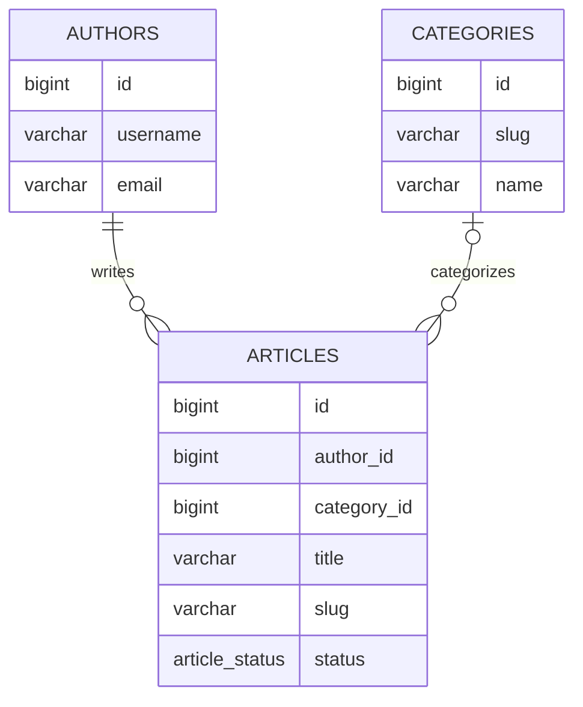
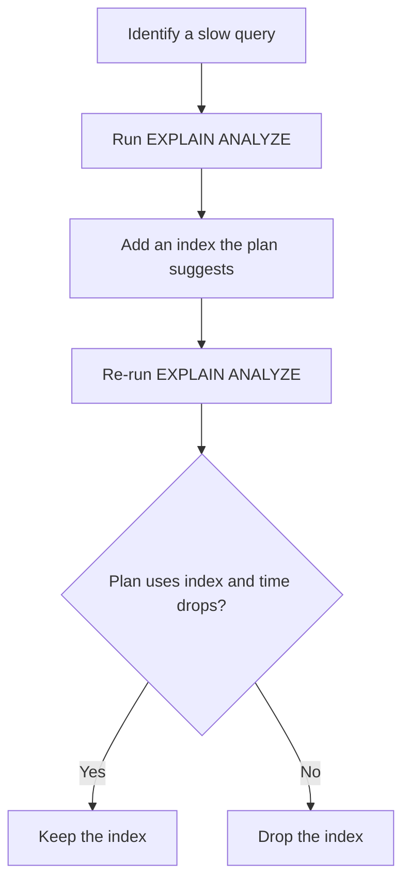

# Lecture 1 — `psql`, Schema Design, and Indexes

> **Duration:** ~2 hours. **Outcome:** You can drive `psql` without a tutorial, design a non-trivial schema that a senior reviewer will not redline, and pick the right index type out of B-tree, GIN, partial, and expression — for the right reason.

The fastest way to slow down a Postgres application is to add too many indexes. The second fastest is to add none. This lecture is about telling the two apart.

## 1. `psql` — the only client guaranteed to be there

Every Postgres install ships `psql`. Every other tool — Postico, DBeaver, pgAdmin, Django's `dbshell` — is a wrapper around what `psql` already does. You learn `psql` once and use it on every database you touch for the next twenty years.

Connect:

```bash
psql crunchwriter
# or fully:
psql -h 127.0.0.1 -p 5432 -U crunch -d crunchwriter
```

Useful flags:

| Flag | Effect |
|------|--------|
| `-d` | Database name |
| `-U` | User (role) |
| `-h` | Host (`127.0.0.1` is not the same as `localhost` — the latter often resolves to a Unix socket on Linux) |
| `-p` | Port |
| `-c "SQL"` | Run one statement and exit |
| `-f file.sql` | Run a file |
| `-X` | Skip `~/.psqlrc` — useful for reproducible scripts |

### Meta-commands

`psql` has its own non-SQL command language; commands start with `\`. The ones worth memorizing:

| Command | What it does |
|---------|--------------|
| `\?` | Help on meta-commands |
| `\h` | Help on SQL syntax (e.g. `\h CREATE INDEX`) |
| `\l` | List databases |
| `\c dbname` | Connect to another database in this session |
| `\dt` | List tables in the current schema |
| `\dt+` | Same, with size and description |
| `\d articles` | Describe the `articles` table — columns, types, indexes, foreign keys |
| `\di` | List indexes |
| `\df` | List functions |
| `\dn` | List schemas (namespaces) |
| `\du` | List roles |
| `\timing` | Toggle execution-time display after every statement |
| `\watch 1` | Re-run the previous query every second |
| `\copy table FROM 'file.csv' CSV HEADER` | Bulk-load from a file you have access to |
| `\e` | Open the last query in `$EDITOR`, edit, run on save |
| `\x` | Toggle expanded display (vertical) — much better for wide rows |
| `\q` | Quit |

Two of these change daily work: `\timing` and `\watch`.

`\timing` puts a millisecond reading after every result; without it you cannot tell whether a query took 4 ms or 400. Turn it on the moment you start a session.

`\watch 1` runs the last query every second until you `Ctrl-C`. Use it to watch a counter move while you `INSERT` from another session, or to confirm an `UPDATE` is making progress.

### `~/.psqlrc`

A `.psqlrc` file in your home directory runs at every session start. A reasonable default:

```sql
\set QUIET 1
\pset null '<null>'
\timing on
\set HISTSIZE 2000
\set HISTFILE ~/.psql_history- :DBNAME
\set COMP_KEYWORD_CASE upper
\set PROMPT1 '%[%033[1;33m%]%n@%/%[%033[0m%]%R%# '
\unset QUIET
```

This prints `<null>` instead of blank for SQL `NULL`, keeps a per-database history, and turns on `\timing`. Drop this in once and forget it.

## 2. A schema beyond toy examples

The Django ORM generated the schema you have today. That is fine — but you must be able to read it as SQL, and you must know which decisions the ORM took on your behalf.

Let's design the `crunchwriter` schema from scratch in SQL, then compare to what Django emitted.

```sql
CREATE TABLE authors (
    id           bigserial PRIMARY KEY,
    username     varchar(150) NOT NULL UNIQUE,
    email        varchar(254) NOT NULL UNIQUE,
    is_staff     boolean      NOT NULL DEFAULT false,
    created_at   timestamptz  NOT NULL DEFAULT now()
);

CREATE TABLE categories (
    id    bigserial PRIMARY KEY,
    slug  varchar(80) NOT NULL UNIQUE,
    name  varchar(120) NOT NULL
);

CREATE TYPE article_status AS ENUM ('draft', 'review', 'published', 'archived');

CREATE TABLE articles (
    id           bigserial PRIMARY KEY,
    author_id    bigint        NOT NULL
                 REFERENCES authors(id) ON DELETE RESTRICT,
    category_id  bigint        REFERENCES categories(id) ON DELETE SET NULL,
    title        varchar(200)  NOT NULL,
    slug         varchar(200)  NOT NULL UNIQUE,
    body         text          NOT NULL,
    status       article_status NOT NULL DEFAULT 'draft',
    word_count   integer       GENERATED ALWAYS AS (length(body) - length(replace(body, ' ', '')) + 1) STORED,
    published_at timestamptz,
    created_at   timestamptz   NOT NULL DEFAULT now(),
    updated_at   timestamptz   NOT NULL DEFAULT now(),

    CONSTRAINT articles_published_requires_timestamp
        CHECK (status <> 'published' OR published_at IS NOT NULL),
    CONSTRAINT articles_title_not_blank
        CHECK (length(trim(title)) > 0)
);
```

Seven decisions on display here. Walk through them.


*Authors and categories relate to articles through foreign keys, each with its own ON DELETE behavior.*

### Surrogate keys (`bigserial`)

`bigserial` is sugar for `bigint` plus a `SEQUENCE` plus a `DEFAULT nextval(...)`. Use `bigint` (not `int`) by default: the cost of widening later, with reverse-cascading foreign keys, is enormous; the cost of the extra four bytes per row is invisible. Postgres 10+ also supports `GENERATED ALWAYS AS IDENTITY` — equivalent and slightly more standards-conformant. Either is acceptable; pick one and be consistent.

### `NOT NULL` by default

Every column declared `NOT NULL` unless you have a reason. `NULL` semantics are a special-case minefield (three-valued logic, `WHERE col = NULL` is never true, indexes have to handle them). If "we don't know" is a real domain value, model it explicitly with a sentinel or a boolean — not by leaning on `NULL`.

`published_at` is the one nullable column in `articles`, because "this article has not been published yet" is a genuine state.

### `UNIQUE` constraints

`slug` is `UNIQUE` because the URL space requires it. `email` and `username` on `authors` are `UNIQUE` for the same reason. A `UNIQUE` constraint automatically creates a unique B-tree index — you do not separately `CREATE INDEX`.

### `FOREIGN KEY` with intentional `ON DELETE`

`articles.author_id` uses `ON DELETE RESTRICT` — deleting an author who has articles raises an error, not a silent cascade. That is almost always what you want for "real" entities. `ON DELETE CASCADE` is for ownership relationships (a `Comment` belongs to an `Article`; deleting the article should delete its comments). `ON DELETE SET NULL` is for optional links (the article's category disappears, the article persists with `category_id = NULL`).

The default in SQL — and Django's `on_delete` parameter when you forget to set it — varies; **never let the framework choose for you**.

### `ENUM` vs `CHECK ... IN (...)`

`article_status` as an `ENUM` is one choice; `status varchar NOT NULL CHECK (status IN (...))` is another. ENUMs are slightly more compact and prevent typos at insert time; adding a value requires `ALTER TYPE ... ADD VALUE`, which is online in modern Postgres but cannot be rolled back inside a transaction. CHECK-constrained varchars are easier to evolve. Pick one and be consistent. Django typically maps `choices=` to a `varchar` with no DB-level constraint, which is the worst of both worlds; you can add the constraint in a `RunSQL` migration.

### Generated columns

`word_count` is a **stored generated column** — Postgres computes it from `body` on every write and stores the result. You can index it like any other column. Use generated columns when the same expression appears in many queries and you do not trust application code to keep it consistent. Postgres 16 only supports `STORED` generated columns, not `VIRTUAL`.

### `CHECK` constraints

`articles_published_requires_timestamp` enforces a domain rule the application could enforce but shouldn't have to: a published article must have a `published_at`. The database is the last line of defence; put rules here that you would lose sleep if the application skipped.

`articles_title_not_blank` rejects strings that are only whitespace. `NOT NULL` does not reject `''`, and most applications treat `''` as a bug. The CHECK is a single line of insurance.

## 3. What does Django emit?

Run, in `crunchwriter`:

```bash
python manage.py sqlmigrate writer 0001 | less
```

You will see Django's version of the same schema. The differences:

- Django uses `serial` (not `bigserial`) by default for primary keys, unless you set `DEFAULT_AUTO_FIELD = "django.db.models.BigAutoField"` — which you should.
- Django writes `CHECK` constraints only when you declare a `CheckConstraint` in `Meta.constraints`.
- Django does not declare ENUMs; `TextChoices` becomes a `varchar` with no DB-level constraint.
- Django adds a B-tree index on every `ForeignKey` automatically — useful, but it is one index per FK whether you query it or not.

Read your project's actual emitted SQL once this week. Do not assume the ORM did what you would have done.

## 4. The four index types you will actually use

Postgres ships six index access methods (B-tree, hash, GiST, SP-GiST, GIN, BRIN). In a typical web application you reach for four: **B-tree, GIN, partial, expression**. The others have specialist uses; learn them when the specialist case arrives.

### 4a. B-tree — the default

`CREATE INDEX articles_author_id_idx ON articles (author_id);`

A B-tree is an ordered, balanced tree of key→row-pointer pairs. It supports:

- **Equality**: `WHERE author_id = 42`
- **Range**: `WHERE created_at > '2026-01-01' AND created_at < '2026-02-01'`
- **`ORDER BY`** — the index already provides sorted output for the indexed expression
- **Prefix `LIKE`**: `WHERE title LIKE 'Post%'` (only when the leading characters are literal)

It does **not** efficiently support:

- Infix `LIKE`: `WHERE title LIKE '%post%'` — leading wildcard defeats the B-tree ordering
- Case-insensitive equality on a case-sensitive column — `WHERE lower(email) = 'x'` does not use a B-tree on `email`
- Membership in a long `IN (...)` list (it scans the index multiple times)

The right mental model: a B-tree is a sorted phone book. You can find Smiths fast and the range Smith–Taylor fast; you cannot find "any name containing 'mit'" fast.

### 4b. Multicolumn B-tree

`CREATE INDEX articles_status_published_idx ON articles (status, published_at DESC);`

Order matters. This index supports:

- `WHERE status = 'published'`
- `WHERE status = 'published' AND published_at > x`
- `WHERE status = 'published' ORDER BY published_at DESC`

It does **not** efficiently support `WHERE published_at > x` alone — the leading column is required.

Rule of thumb: put the most selective equality column first; range/`ORDER BY` columns last. We come back to this in Lecture 2 with the cost model.

### 4c. GIN — the multi-value index

`CREATE INDEX articles_tags_gin ON articles USING gin (tags);`

GIN (Generalized Inverted iNdex) stores, for each value in a multi-value column, the list of rows containing it. It is the right index for:

- Array columns: `WHERE 'python' = ANY(tags)`
- JSONB containment: `WHERE meta @> '{"featured": true}'::jsonb`
- Full-text search: `WHERE tsv @@ to_tsquery('postgres & python')`
- Trigram similarity (with the `pg_trgm` extension): `WHERE title %> 'pstgres'`

GIN indexes are larger and slower to build than B-trees. They are also slower to update — every write touches many index entries. Accept the cost on read-heavy multi-value columns and tune `gin_pending_list_limit` if writes pile up.

### 4d. Partial — index a subset

`CREATE INDEX articles_published_idx ON articles (published_at DESC) WHERE status = 'published';`

A partial index has a `WHERE` clause. Only rows matching the predicate are indexed; queries that include the same predicate use it.

This is the right shape for `crunchwriter`'s public list: 95% of `articles` rows may be drafts; the public list only ever asks for `status = 'published'`. A partial index on `published_at` for just those rows is smaller, faster to scan, and cheaper to maintain than a full B-tree.

The catch: the query must include the **same predicate** for the planner to use the partial index. `WHERE status = 'published' ORDER BY published_at DESC` uses it; `WHERE status = 'published' AND author_id = 5` may not, depending on selectivity.

### 4e. Expression — index the result of a function

`CREATE INDEX authors_lower_email_idx ON authors (lower(email));`

Without this, `WHERE lower(email) = 'a@b.com'` cannot use the regular `email` index (the function defeats the B-tree). The expression index pre-computes `lower(email)` for every row and indexes the result.

The query must use the **exact same expression** — `lower(email)`, not `LOWER(email)` (case differences are fine — Postgres normalizes) and not `email ILIKE 'a@b.com'`. Citext (the `citext` extension) is an alternative: a case-insensitive `varchar` type that "just works" with regular indexes. Either is fine; pick one per project.

## 5. When **not** to add an index

Every index costs:

- **Disk space.** A B-tree on a wide column on a 10 M-row table can easily be 500 MB.
- **Write throughput.** Every `INSERT`, `UPDATE`, `DELETE` updates every index on the table.
- **Planner work.** More indexes means more options for the planner to evaluate.

Do not add an index until a query proves it needs one. The right workflow:

1. Identify a slow query (Lecture 2's job).
2. `EXPLAIN ANALYZE` it.
3. Add an index that the plan suggests.
4. Re-run `EXPLAIN ANALYZE`. If the plan now uses the index and the time drops, keep it.
5. If not, drop it.


*The only good reason to add an index is a query that has already proven it needs one.*

The exception: primary keys, unique constraints, and foreign keys (Django auto-adds these). Those are not "optimisations"; they are correctness.

## 6. Composite indexes vs separate indexes

A common question: I query `WHERE a = ? AND b = ?` — should I have one index on `(a, b)` or two indexes, one on `a` and one on `b`?

Postgres can **combine** two single-column indexes with a Bitmap And — it builds a bitmap from each and intersects them. That works, but a single multicolumn index is usually faster (one scan, not two and a merge). The downside: a multicolumn index on `(a, b)` is much larger than two single-column indexes and only helps queries that filter on `a` (or on `a AND b`).

Rule:

- One column queried often, alone: single-column index.
- Two columns nearly always queried together (and one is always present): multicolumn.
- Two columns sometimes together, sometimes alone: two single-column indexes.

## 7. `CREATE INDEX CONCURRENTLY`

In production, `CREATE INDEX` takes an `ACCESS EXCLUSIVE` lock for the duration — every read and write on the table waits. On a 10 M-row table that is minutes; in a web app that is an outage.

`CREATE INDEX CONCURRENTLY` builds the index in two passes without blocking writers. It takes longer wall-clock, can fail (leaving an `INVALID` index you must drop), and **cannot run inside a transaction**. In Django, you use `AddIndexConcurrently` from `django.contrib.postgres.operations` to express this in a migration. We come back to this in Week 6.

For local dev with seed data, `CREATE INDEX` is fine. Get into the habit of writing `CONCURRENTLY` in migrations from day one anyway.

## 8. Reading `\d articles`

In `psql`, `\d articles` gives you a one-screen summary. Read it left-to-right:

```text
                                       Table "public.articles"
    Column    |           Type           | Collation | Nullable |                Default
--------------+--------------------------+-----------+----------+----------------------------------------
 id           | bigint                   |           | not null | nextval('articles_id_seq'::regclass)
 author_id    | bigint                   |           | not null |
 category_id  | bigint                   |           |          |
 title        | character varying(200)   |           | not null |
 slug         | character varying(200)   |           | not null |
 body         | text                     |           | not null |
 status       | article_status           |           | not null | 'draft'::article_status
 word_count   | integer                  |           |          | (generated stored)
 published_at | timestamp with time zone |           |          |
 created_at   | timestamp with time zone |           | not null | now()
 updated_at   | timestamp with time zone |           | not null | now()
Indexes:
    "articles_pkey" PRIMARY KEY, btree (id)
    "articles_slug_key" UNIQUE CONSTRAINT, btree (slug)
    "articles_published_idx" btree (published_at DESC) WHERE status = 'published'::article_status
Check constraints:
    "articles_published_requires_timestamp" CHECK (status <> 'published' OR published_at IS NOT NULL)
    "articles_title_not_blank" CHECK (length(btrim(title)) > 0)
Foreign-key constraints:
    "articles_author_id_fkey" FOREIGN KEY (author_id) REFERENCES authors(id) ON DELETE RESTRICT
    "articles_category_id_fkey" FOREIGN KEY (category_id) REFERENCES categories(id) ON DELETE SET NULL
```

Everything you need to reason about the table is visible at once: types, nullability, defaults, indexes, constraints, foreign keys. There is no equivalent ORM screen that shows you this much.

## 9. `\copy` — bulk loading without leaving `psql`

`\copy` (the meta-command, not `COPY` the SQL command) reads a file from the client, not the server. It is the right tool for loading seed data, importing CSVs, and dumping query results.

```sql
\copy articles (title, slug, body, author_id, status)
       FROM 'seed.csv' CSV HEADER;
```

Or export:

```sql
\copy (SELECT id, title, length(body) FROM articles ORDER BY id) TO 'sizes.csv' CSV HEADER;
```

Two facts that save time:

- `\copy ... FROM '-'` reads from stdin — useful in shell pipelines.
- `\copy` is significantly faster than row-by-row `INSERT` for any meaningful batch size. The Django bulk-create equivalent ships SQL `COPY` under the hood in `psycopg` 3.

We use `\copy` in Exercise 1 to load 100 k rows in a second or two.

## 10. Common mistakes

1. **Adding an index "just in case."** Every index is a write tax. Don't pay it speculatively.
2. **Indexing low-cardinality columns alone.** A B-tree on `status` (4 distinct values, 1 million rows) is almost useless on its own — the planner usually picks a Seq Scan anyway. Combine with a more selective column, or make it a partial index.
3. **Indexing the wrong column order.** A multicolumn index on `(b, a)` does not serve `WHERE a = ?`. Lead with what you filter most.
4. **Indexing a function-of-column without an expression index.** `WHERE lower(email) = ?` will not use the index on `email`. Index `lower(email)` or use `citext`.
5. **`UPDATE` without `WHERE`** in `psql`. Wrap dangerous statements in `BEGIN; ... ROLLBACK;` while you draft them.
6. **Forgetting `NOT NULL`.** Defaults to nullable in SQL. The DB will not stop you from polluting your data.
7. **Trusting Django's default `on_delete`.** There isn't one in modern Django — `on_delete` is required — but `CASCADE` is the most common copy-paste, and it is rarely the right choice for "real" entities.

## 11. Self-check

- What does `\d articles` show that no Django screen shows in one view?
- What does `\timing` do, and why turn it on in `~/.psqlrc`?
- Name four index types and one query each is the right choice for.
- When is a partial index the right shape?
- When would you use an expression index over plain B-tree?
- Why `bigserial` over `serial` by default?
- What is the cost of an extra index? Name three.
- What does `ON DELETE RESTRICT` do, and when is it the right default?
- What is a generated stored column, and what is one good use?

## Further reading

- **`psql` reference**: <https://www.postgresql.org/docs/16/app-psql.html>
- **DDL chapter**: <https://www.postgresql.org/docs/16/ddl.html>
- **Indexes chapter**: <https://www.postgresql.org/docs/16/indexes.html>
- **Use The Index, Luke — Anatomy of an Index**: <https://use-the-index-luke.com/sql/anatomy>
- **Django databases reference**: <https://docs.djangoproject.com/en/stable/ref/databases/#postgresql-notes>
