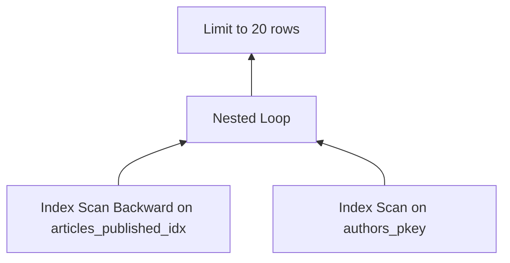
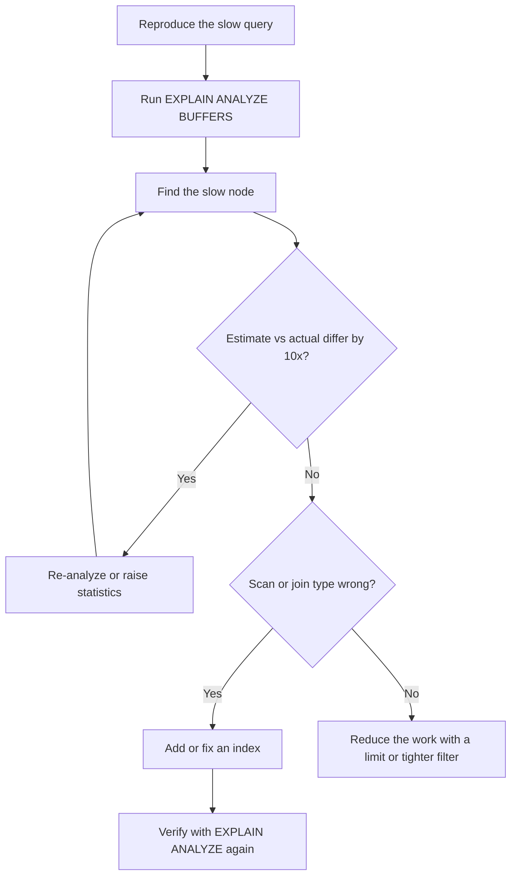

# Lecture 2 — `EXPLAIN ANALYZE` and the Query Planner

> **Duration:** ~2 hours. **Outcome:** You can paste a query into `psql`, prepend `EXPLAIN (ANALYZE, BUFFERS)`, read the plan top-to-bottom, name the bottleneck, and decide whether the fix is an index, a rewrite, an `ANALYZE`, or a config change.

There are exactly two kinds of slow Postgres queries: the ones the planner cannot avoid (genuinely expensive work) and the ones the planner is wrong about (bad estimate, wrong scan type, missing index). Telling the two apart is what this lecture is for.

## 1. `EXPLAIN` vs `EXPLAIN ANALYZE` vs `EXPLAIN (ANALYZE, BUFFERS)`

Three variants. Use the most informative one your patience allows.

```sql
EXPLAIN SELECT ...;
```

Shows the **planner's chosen plan**, with cost estimates. Fast: it does not run the query. Use this when the query takes minutes and you only want to know what shape the planner picked.

```sql
EXPLAIN ANALYZE SELECT ...;
```

**Runs the query** and shows the plan with cost estimates **plus actual row counts and timings**. This is the version you reach for 90% of the time. Be aware: `ANALYZE` actually executes — `EXPLAIN ANALYZE DELETE ...` will delete the rows.

```sql
EXPLAIN (ANALYZE, BUFFERS) SELECT ...;
```

Adds buffer statistics: how many pages came from shared buffer (cache hit) vs the disk (`read`). The number you care about: `shared hit` (good) vs `shared read` (a page fault). If a 100 ms query is mostly `read`, your problem is I/O; if it is mostly `hit`, your problem is CPU.

In Postgres 16 the full parameter list is:

```sql
EXPLAIN (
    ANALYZE,         -- actually run; collect actual timings
    BUFFERS,         -- buffer hit/read/dirtied counts per node
    SETTINGS,        -- non-default planner GUCs in effect
    WAL,             -- write-ahead log usage (writes only)
    FORMAT JSON      -- machine-readable; pipe to explain.dalibo.com
) SELECT ...;
```

Use `FORMAT JSON` when you intend to paste into a visualizer. The default text format is what you read inline.

## 2. A first plan, read top-to-bottom

```sql
EXPLAIN (ANALYZE, BUFFERS)
SELECT a.title, u.username
FROM articles a
JOIN authors u ON a.author_id = u.id
WHERE a.status = 'published'
ORDER BY a.published_at DESC
LIMIT 20;
```

A plausible output:

```text
Limit  (cost=0.43..1.34 rows=20 width=44) (actual time=0.061..0.412 rows=20 loops=1)
  Buffers: shared hit=46
  ->  Nested Loop  (cost=0.43..453.21 rows=10000 width=44) (actual time=0.059..0.402 rows=20 loops=1)
        Buffers: shared hit=46
        ->  Index Scan Backward using articles_published_idx on articles a
              (cost=0.29..120.50 rows=10000 width=20) (actual time=0.040..0.080 rows=20 loops=1)
              Index Cond: (status = 'published'::article_status)
              Buffers: shared hit=4
        ->  Index Scan using authors_pkey on authors u
              (cost=0.14..0.33 rows=1 width=28) (actual time=0.008..0.008 rows=1 loops=20)
              Index Cond: (id = a.author_id)
              Buffers: shared hit=42
Planning Time: 0.310 ms
Execution Time: 0.451 ms
```

Read it as a tree, **inside-out**. The deepest nodes execute first; their output flows up to the parent.


*Execution runs bottom-up: both index scans feed the nested loop, which feeds the limit.*

1. **Bottom-left (Index Scan Backward on `articles_published_idx`)**: walk the partial index in reverse order. Why? Because the query says `ORDER BY published_at DESC` and the index is `(published_at DESC) WHERE status = 'published'`. The planner recognised this — no separate sort node.
2. **`Limit` cuts it off after 20**: the index returns rows in order, so the planner can stop early. Without the `ORDER BY` + index alignment, the planner would have read all 10 000 matching rows and sorted them.
3. **Outer `Nested Loop`**: for each of those 20 articles, look up the author by primary key. `loops=20` on the `authors` scan; each loop hits one row via the index.
4. **`Planning Time: 0.310 ms`** and **`Execution Time: 0.451 ms`** — total ≈ 0.76 ms. Fast.

That last line — the sum of planning and execution — is the single number that matters. Everything else explains how the number got that way.

## 3. The vocabulary

### Scan types

| Node | What it does | When the planner picks it |
|------|-------------|-----------------------------|
| **Seq Scan** | Read every page of the table | No useful index; or the table is small enough that index lookup costs more than a scan; or the predicate matches most rows |
| **Index Scan** | Walk the index, fetch heap rows one at a time | Selective predicate; output order matches index order |
| **Index Only Scan** | Walk the index, never visit the heap | Index covers every column the query needs (a "covering" index), and the visibility map says the page is all-visible |
| **Bitmap Heap Scan** | Walk one or more indexes to build a bitmap of page locations, then read those pages once | Medium-selective predicate, or two indexes combined |
| **Tid Scan** | Look up by physical row id | Rarely; mostly for replication tools |

### Join types

| Node | What it does | When |
|------|-------------|------|
| **Nested Loop** | For each row in the outer, look up matches in the inner (via index or scan) | Small outer set; indexed inner; or no other choice |
| **Hash Join** | Build a hash table of the smaller side, probe with the larger | Larger sets, equality join, no useful index for nested loop |
| **Merge Join** | Sort both sides, walk in order | Both inputs already sorted (often by index); equality join |

The planner picks the cheapest based on its estimate. When the estimate is wrong, it picks the wrong join — that's one of our four shapes of slow.

### Other useful nodes

- **Sort** — explicit sort. If the row count is huge and `work_mem` is small, it spills to disk: look for `Sort Method: external merge Disk: ...kB`. That is your cue to raise `work_mem` or add an index that produces sorted output.
- **Hash Aggregate** / **GroupAggregate** — `GROUP BY`. Hash if the planner can fit the groups in memory; Group if the input is already sorted.
- **Materialize** — cache the inner side of a nested loop so the outer doesn't re-execute it.
- **Gather** / **Gather Merge** — parallel query nodes. Postgres 16 parallelises aggressively; you'll see these on big scans.

## 4. The cost model — what the planner is optimising

The number `cost=0.43..1.34` means "estimated cost to retrieve the first row" and "estimated cost to retrieve all rows," in arbitrary units. Two things matter:

1. The unit is fixed by `seq_page_cost` (default 1.0). Other costs scale relative to it.
2. The numbers do not match real-world ms. They are a planning currency. The planner picks the plan with the lowest total cost; the actual time depends on cache, I/O, hardware.

The cost parameters worth knowing:

| Parameter | Default | What it represents |
|-----------|--------:|--------------------|
| `seq_page_cost` | 1.0 | Cost of fetching one page sequentially |
| `random_page_cost` | 4.0 | Cost of fetching one page randomly |
| `cpu_tuple_cost` | 0.01 | Cost of processing one row |
| `cpu_index_tuple_cost` | 0.005 | Cost of processing one index entry |
| `cpu_operator_cost` | 0.0025 | Cost of one operator (`+`, `=`, etc.) |
| `effective_cache_size` | 4 GB | What the planner assumes the OS will keep in cache |

The defaults are tuned for spinning rust. On SSDs, `random_page_cost = 1.1` (close to `seq_page_cost`) gives the planner a more accurate worldview and steers it toward index scans more often. This is one of the few global Postgres knobs every team should set.

`effective_cache_size` is not actual cache — it is a hint to the planner. Set it to roughly 50–75% of the machine's RAM.

## 5. Estimates vs reality

The single most important diagnostic skill: compare **`rows=` in `(cost=...)`** to **`rows=` in `(actual time=...)`**.

```text
Seq Scan on articles
  (cost=0.00..2500.00 rows=10 width=8)
  (actual time=120.5..120.5 rows=200000 loops=1)
```

Planner estimated 10 rows; reality was 200 000. The planner picked a Seq Scan because at 10 rows, a Seq Scan beats an Index Scan. At 200 000 rows the Seq Scan is fine too — but if this scan is the **inner side of a Nested Loop**, "10 rows" looks fine and "200 000 rows" is a catastrophe.

When estimate and actual diverge by more than 10×, the planner is flying blind. The fix is rarely "rewrite the query"; the fix is usually one of:

1. **`ANALYZE table_name;`** — re-collect statistics. Autovacuum runs `ANALYZE` automatically, but on a freshly loaded table or after a big import the stats are stale.
2. **Raise `default_statistics_target`** from 100 to 1000 for the column (`ALTER TABLE ... ALTER COLUMN ... SET STATISTICS 1000`) when the column has a heavy-tailed distribution.
3. **Add an `extended statistics` object** (`CREATE STATISTICS`) when two columns are correlated and the planner is multiplying their selectivities as if they were independent.

`pg_stats` is the view that shows you what the planner sees:

```sql
SELECT attname, n_distinct, most_common_vals, most_common_freqs
FROM pg_stats
WHERE tablename = 'articles' AND attname = 'status';
```

`n_distinct = 4` with `most_common_vals = {draft,published,review,archived}` and frequencies `{0.83, 0.15, 0.01, 0.01}` — the planner now knows that `status = 'published'` matches roughly 15% of rows.

## 6. The four shapes of "slow"

Almost every slow query falls into one of these.

### 6a. Missing index — Seq Scan where Index Scan should be

```text
Seq Scan on articles  (cost=0.00..2500.00 rows=1 width=...) (actual time=320..320 rows=1 loops=1)
  Filter: (slug = 'a-particular-slug')
  Rows Removed by Filter: 199999
```

200 000 rows scanned to find 1. The fix: a B-tree on `slug` (which `UNIQUE` already gave you — so if you see this, the column is **not** unique).

### 6b. Wrong index — Bitmap Heap Scan with high recheck

```text
Bitmap Heap Scan on articles  (actual time=80..420 rows=50000 loops=1)
  Recheck Cond: (status = 'draft')
  Rows Removed by Index Recheck: ...
  ->  Bitmap Index Scan on articles_status_idx  (actual time=25..25 rows=50000 loops=1)
        Index Cond: (status = 'draft')
```

A B-tree on `status` is being scanned for 50 000 matching rows out of 60 000 — 83% of the table. The planner is using the index because it is there, but a Seq Scan would have been cheaper. The fix: drop the index, or make it a partial index covering only the selective values.

### 6c. Bad estimate — Nested Loop that should be Hash Join

```text
Nested Loop  (cost=0.0..20.0 rows=10) (actual time=0.01..18000 rows=200000 loops=1)
  ->  Seq Scan on articles a  (rows=10)  (actual rows=200000)
  ->  Index Scan on authors u  (rows=1) (actual rows=1 loops=200000)
```

The planner thought 10 rows on the outer side and chose a Nested Loop (one index lookup per outer row — fast at 10 outer rows). The reality is 200 000 outer rows, which means 200 000 index lookups — a catastrophe. A Hash Join would have done one scan of `authors` and one hash probe per outer row.

The fix is upstream: get the planner a better row estimate (re-`ANALYZE`, raise statistics, add `CREATE STATISTICS` for correlated columns). Rewriting the query rarely helps; the planner is using bad inputs.

### 6d. Plan is fine; the query is asking for too much

```text
Seq Scan on big_log  (actual time=0..8500 rows=10000000 loops=1)
```

10 M rows is 10 M rows. No index makes this faster if you genuinely need all of them. The fix is one of:

- Add a `LIMIT`.
- Add a more selective `WHERE`.
- Pre-aggregate (a materialised view, a counter cache, a nightly summary table).
- Decide that 8 s is acceptable for this report and run it from a queue, not a request handler.

Recognising 6d quickly is what stops you from chasing an index that does not exist.

## 7. The `LIMIT` trap

`LIMIT` changes the planner's cost calculation. The planner picks the plan that returns the **first row** fastest, not the plan that returns all rows fastest.

```sql
EXPLAIN ANALYZE
SELECT * FROM articles ORDER BY created_at DESC LIMIT 20;
```

The planner might pick an Index Scan with early exit at row 20. Drop the `LIMIT`:

```sql
EXPLAIN ANALYZE
SELECT * FROM articles ORDER BY created_at DESC;
```

The planner might pick a Seq Scan + Sort, because at full row count the index scan's random I/O is more expensive than reading all pages and sorting in memory.

This is why ORM-generated count queries can be surprisingly slow: Django's `.count()` issues `SELECT COUNT(*) FROM ... WHERE ...` with no `LIMIT`, and the planner reads the full result set even though all you need is the cardinality.

## 8. Reading a sort

```text
->  Sort  (cost=2400..2500 rows=100000 width=20)
      (actual time=180..220 rows=100000 loops=1)
      Sort Key: published_at DESC
      Sort Method: quicksort  Memory: 32MB
```

`Sort Method` tells you what the sort did:

- `quicksort Memory: ...` — fit in memory; fast.
- `top-N heapsort` — for `ORDER BY ... LIMIT n`; just keeps the top n.
- `external merge Disk: ...kB` — spilled to a temp file. If you see this often, raise `work_mem` (per-session) or add an index that produces sorted output (so the sort node disappears).

Postgres 16 added incremental sort improvements; you may see `Incremental Sort` when the input is partially ordered and the planner only needs to sort within groups.

## 9. JIT — read it, don't fear it

In Postgres 16 you may see:

```text
JIT:
  Functions: 8
  Options: Inlining true, Optimization true, Expressions true, Deforming true
  Timing: Generation 0.5 ms, Inlining 1.2 ms, Optimization 12.3 ms, Emission 9.1 ms, Total 23.1 ms
```

The planner enabled JIT compilation for this query. If the **total JIT time exceeds the gain**, JIT was a loss; that's not rare for short queries. Lower `jit_above_cost` to disable, or set `jit = off` per session. For long analytical queries on big data, JIT is usually a win.

## 10. `EXPLAIN ANALYZE` against a transaction you want to discard

A useful trick when profiling a destructive query:

```sql
BEGIN;
EXPLAIN ANALYZE DELETE FROM articles WHERE status = 'archived' AND created_at < '2025-01-01';
ROLLBACK;
```

The `ANALYZE` runs the `DELETE`; the `ROLLBACK` undoes it. You get the real plan, with real timings, with no permanent change. Use this every time you are about to run a `DELETE` or `UPDATE` you have not run before.

## 11. `pg_stat_statements` — the production-grade equivalent

Locally you `EXPLAIN ANALYZE` one query at a time. In production you cannot — you have hundreds of queries per second and no idea which is slow.

`pg_stat_statements` is an extension (`CREATE EXTENSION pg_stat_statements;` plus `shared_preload_libraries = 'pg_stat_statements'` in `postgresql.conf`). It records, per normalized query, the total calls, total time, mean time, rows, and shared-buffer hits.

The query you will run a thousand times:

```sql
SELECT
    calls,
    total_exec_time::int AS total_ms,
    mean_exec_time::int  AS mean_ms,
    rows,
    query
FROM pg_stat_statements
ORDER BY total_exec_time DESC
LIMIT 20;
```

The query with the highest `total_exec_time` is where to spend your day. It is the product of "expensive each call" and "called a lot"; you fix one and re-check.

We come back to `pg_stat_statements` in Week 11 (observability). Get familiar with its existence now.

## 12. Visualisers — use them, especially early

Plain-text plans are hard to read at first. Paste into:

- **<https://explain.dalibo.com/>** — tree view, time on each node, instantly tells you where the time went.
- **<https://explain.depesz.com/>** — same idea, slightly different annotations; both are excellent.

Generate the JSON with `EXPLAIN (ANALYZE, BUFFERS, FORMAT JSON) ...`, copy the whole result, paste. You will read three plans before you stop needing the visualiser; that's fine, the goal is to read the text fluently by the end of Week 5.

## 13. The diagnostic loop

When a query is slow:

1. **Reproduce.** Run the exact query in `psql` with `\timing on`. Note the time.
2. **`EXPLAIN (ANALYZE, BUFFERS)`** the query.
3. **Find the slow node.** It's almost always the one with the highest `actual time` × `loops`.
4. **Estimate vs actual.** If they disagree by 10×, the planner is wrong — re-`ANALYZE` or raise statistics, then re-check.
5. **If the plan is fine** (good estimates, good scan choices), the query is asking for genuine work. Reduce the work: `LIMIT`, more selective `WHERE`, pre-aggregate.
6. **If a scan type looks wrong** (Seq Scan where Index Scan should fit, Nested Loop where Hash should fit), the cause is usually a missing or wrong index. Add it. Re-check.
7. **Verify.** Re-run `EXPLAIN ANALYZE`. The plan should differ; the time should drop.


*The diagnostic loop every Postgres performance fix follows, from a slow query to a verified fix.*

This loop is the entire job. Every Postgres performance engineer you will ever meet runs it. The difference between a beginner and a senior is the speed of step 4.

## 14. Common mistakes

1. **`EXPLAIN` without `ANALYZE`** and treating the cost numbers as ms. They are not ms; they are a relative currency.
2. **Reading the plan top-to-bottom in execution order.** Execution is **inside-out**; reading order is top-to-bottom for hierarchy but bottom-up for what runs first.
3. **Multiplying `actual time` by `loops` mentally and getting it wrong.** Postgres reports per-loop time. A node with `actual time=1ms loops=1000` spent ~1000 ms, not 1 ms.
4. **Adding an index to make a Seq Scan disappear** without checking whether the Seq Scan was actually slow. On a 5 k-row table, a Seq Scan is faster than any index lookup.
5. **Optimising the wrong query.** Use `pg_stat_statements` to pick what to optimise; do not guess.
6. **`EXPLAIN ANALYZE` on production reads** without realising it runs the query (and consumes the same I/O the original request would). For destructive statements, wrap in `BEGIN; ... ROLLBACK;`.

## 15. Self-check

- Difference between `EXPLAIN` and `EXPLAIN ANALYZE`?
- What is the unit of `cost=0.43..1.34`?
- Name three scan types and one situation each is the right choice for.
- What does "Rows Removed by Filter" tell you?
- Estimate vs actual diverging by 100× — what do you do first?
- When is a Seq Scan the right answer?
- How does `LIMIT` change the planner's choice?
- What does `Sort Method: external merge Disk: 50000kB` mean and how do you fix it?
- Which extension would you enable in production to find slow queries?

## Further reading

- **Using `EXPLAIN`** (the chapter): <https://www.postgresql.org/docs/16/using-explain.html>
- **Planner statistics**: <https://www.postgresql.org/docs/16/planner-stats.html>
- **`pg_stat_statements`**: <https://www.postgresql.org/docs/16/pgstatstatements.html>
- **Use The Index, Luke — "Don't do this"**: <https://use-the-index-luke.com/no-offset>
- **Dalibo's explain visualiser**: <https://explain.dalibo.com/>
- **Postgres 16 release notes — performance**: <https://www.postgresql.org/docs/16/release-16.html>
