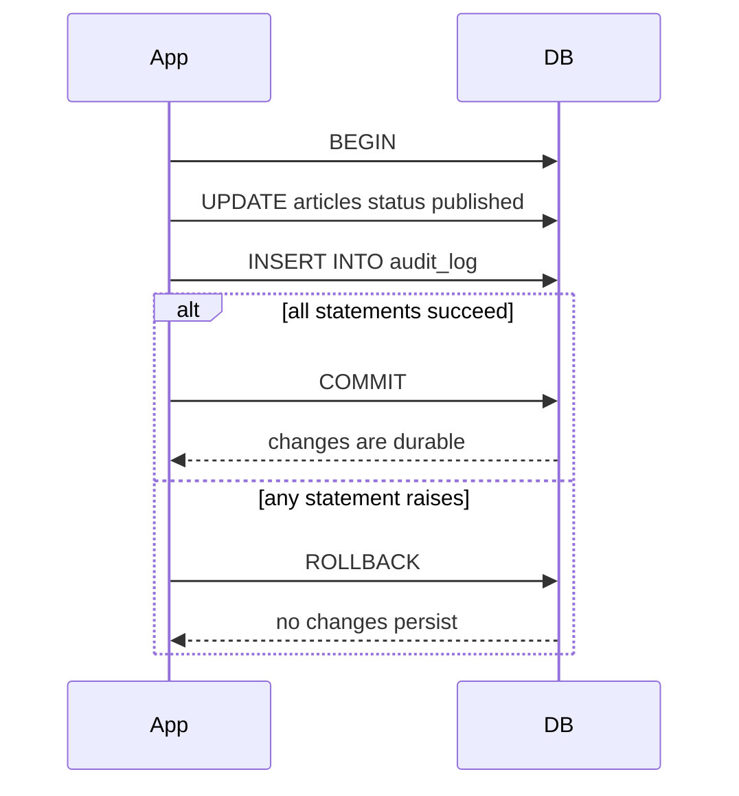
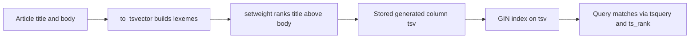

# Lecture 3 — Transactions, Isolation Levels, JSONB, and Full-Text Search

> **Duration:** ~2 hours. **Outcome:** You can pick a transaction isolation level for a given anomaly, store and query JSON in a way that survives a schema-evolution review, and ship a full-text search feature that does not require an external service.

Three topics, one through-line: when you reach past the ORM and use Postgres as Postgres.

## 1. Transactions — the contract

A Postgres transaction is a unit of work that either commits in full or rolls back to nothing. Three statements bracket it:

```sql
BEGIN;
  UPDATE articles SET status = 'published', published_at = now() WHERE id = 42;
  INSERT INTO audit_log(actor_id, action, target_id) VALUES (1, 'publish', 42);
COMMIT;
```

If either statement raises, you can `ROLLBACK` and neither change persists. If both succeed and you `COMMIT`, both are durable.


*A transaction commits every statement inside it together, or rolls back undoing all of them.*

In Django, every view runs in autocommit mode by default — each query is its own transaction. To group several queries, use `transaction.atomic()`:

```python
from django.db import transaction

with transaction.atomic():
    article.status = "published"
    article.save()
    AuditLog.objects.create(actor=request.user, action="publish", target=article)
```

Inside `atomic()`, an exception triggers a rollback of everything in the block. Nested `atomic()` blocks use savepoints. You will use this every time two writes must succeed or fail together.

### `ATOMIC_REQUESTS`

Setting `"ATOMIC_REQUESTS": True` in `DATABASES["default"]["OPTIONS"]` wraps **every view** in a transaction. It is convenient — one less thing to remember — and expensive: it holds row locks for the duration of the view, including any slow template rendering. For most apps, leave it off and use `atomic()` explicitly. We come back to this in Week 5.

## 2. ACID — what Postgres actually guarantees

- **A — Atomicity.** All or nothing per transaction.
- **C — Consistency.** Constraints (CHECK, FK, UNIQUE, NOT NULL) hold at commit time. Postgres enforces this even on deferred constraints, at the latest by commit.
- **I — Isolation.** Concurrent transactions don't see each other's uncommitted changes. The level of isolation is configurable; that's the rest of this section.
- **D — Durability.** Once a transaction commits, its changes survive crashes. Postgres achieves this with the WAL (write-ahead log) and `fsync` on commit.

"ACID" sounds simple. The interesting story is isolation.

## 3. Isolation levels

SQL defines four:

| Level | Dirty read | Non-repeatable read | Phantom read | Serialization anomaly |
|-------|:----------:|:-------------------:|:------------:|:---------------------:|
| READ UNCOMMITTED | possible | possible | possible | possible |
| READ COMMITTED   | impossible | possible | possible | possible |
| REPEATABLE READ  | impossible | impossible | (possible in spec) | possible |
| SERIALIZABLE     | impossible | impossible | impossible | impossible |

Postgres' implementation differs in interesting ways:

- **READ UNCOMMITTED** does not exist in Postgres. Requesting it gives you READ COMMITTED.
- **READ COMMITTED** (the default): every statement sees a snapshot taken at statement start. Within a transaction, two `SELECT`s of the same row can see different values if another transaction committed between them.
- **REPEATABLE READ**: every statement in the transaction sees a snapshot taken at **transaction start**. Postgres also prevents phantom reads at this level (stronger than the SQL spec requires). What it does **not** prevent: a "lost update" pattern where two transactions read the same value, both modify it, both commit; Postgres detects this and aborts the second with a serialization failure (`40001`).
- **SERIALIZABLE**: as if all transactions ran one at a time, in some order. Postgres uses SSI (Serializable Snapshot Isolation); reads track predicate locks; conflicts abort the later transaction with `40001`.

### The vocabulary

- **Dirty read** — see another transaction's uncommitted change. Cannot happen in Postgres.
- **Non-repeatable read** — read the same row twice and get different values, because another transaction committed in between.
- **Phantom read** — re-execute the same `WHERE` clause and get a different set of rows.
- **Serialization anomaly** — two committed transactions, when interleaved, produce a state that no serial order could.

### When to step up from READ COMMITTED

Almost every web app runs the entire request in READ COMMITTED and is fine. You step up when:

- You read a balance, compute a new balance, write it back. READ COMMITTED loses one of two concurrent writes. **REPEATABLE READ** with retry-on-`40001` is the right shape. Or use `SELECT ... FOR UPDATE` to lock the row.
- You read a set of rows, then write a new row that depends on the set. A phantom can appear; **SERIALIZABLE** is the strongest guarantee.
- You're enforcing a business invariant the DB cannot express as a constraint (e.g. "no two reservations can overlap on the same room"). SERIALIZABLE catches the conflict; you retry on `40001`.

The pattern for SERIALIZABLE in Django:

```python
from django.db import transaction, OperationalError
from time import sleep

for attempt in range(3):
    try:
        with transaction.atomic(using="default"):
            connection.cursor().execute(
                "SET TRANSACTION ISOLATION LEVEL SERIALIZABLE"
            )
            # ... your work ...
        break
    except OperationalError:
        sleep(0.05 * (2 ** attempt))
else:
    raise
```

The retry loop is non-negotiable. Any time you raise isolation, you accept that the transaction may abort and your code must handle it.

### `SELECT ... FOR UPDATE`

Often the right tool is not a raised isolation level but an explicit row lock:

```sql
BEGIN;
SELECT balance FROM accounts WHERE id = 7 FOR UPDATE;
-- application computes new balance
UPDATE accounts SET balance = $new WHERE id = 7;
COMMIT;
```

`FOR UPDATE` takes an exclusive row lock; concurrent `FOR UPDATE`s on the same row queue up. Django exposes this via `.select_for_update()`:

```python
with transaction.atomic():
    account = Account.objects.select_for_update().get(id=7)
    account.balance += amount
    account.save()
```

`FOR UPDATE` is precise (it locks rows you've already identified) and predictable (no `40001` retries). It is the right default for the "read-modify-write a single row" pattern.

## 4. MVCC in one paragraph

Every Postgres row has hidden columns `xmin` (the transaction that created the row) and `xmax` (the transaction that deleted/superseded it). A reader's transaction has a snapshot id; it sees rows where `xmin` is visible and `xmax` is not. That is how concurrent readers and writers coexist without locking.

The cost: every `UPDATE` creates a new row version (the old one stays until `VACUUM` reclaims it). A table with high update churn accumulates dead tuples; autovacuum keeps it in check, but if writes outpace autovacuum, you see "bloat." The `pg_stat_user_tables` view (`n_dead_tup`, `last_autovacuum`) is where to look.

## 5. JSONB — the schema-flexible column type

Postgres has two JSON types: `json` (stored as text, re-parsed on each access) and `jsonb` (parsed into a binary tree once; operators and indexes work on it). **Always use `jsonb`** unless you have an exotic reason.

```sql
ALTER TABLE articles ADD COLUMN meta jsonb NOT NULL DEFAULT '{}'::jsonb;
```

Insert:

```sql
UPDATE articles
SET meta = jsonb_set(meta, '{seo, title}', '"How to Postgres"', true)
WHERE id = 42;
```

### The operators

| Operator | Meaning |
|----------|---------|
| `->` | Get JSON value at key (returns jsonb) — `meta->'seo'` |
| `->>` | Get JSON value at key as text — `meta->>'title'` |
| `#>` | Get JSON value at path — `meta#>'{seo,title}'` |
| `#>>` | Same as path, as text |
| `@>` | Contains — `meta @> '{"featured": true}'::jsonb` |
| `<@` | Is contained by |
| `?` | Top-level key exists — `meta ? 'featured'` |
| `?\|` | Any of these keys exist |
| `?&` | All of these keys exist |

The two you will use most: `->>` to read a value and `@>` to filter.

### JSONB indexing

A GIN index on the whole column:

```sql
CREATE INDEX articles_meta_gin ON articles USING gin (meta);
```

This indexes every key/value pair. It supports `@>`, `?`, `?|`, `?&`. It is large and slow to write to.

`jsonb_path_ops` is a more compact GIN variant that supports `@>` only:

```sql
CREATE INDEX articles_meta_gin ON articles USING gin (meta jsonb_path_ops);
```

If your only JSONB filter is `@>`, use this — half the size, faster writes.

Often you only filter on **one extracted value**. In that case, an expression index on the extracted value is smaller than a JSONB-wide GIN:

```sql
CREATE INDEX articles_meta_featured_idx ON articles ((meta->>'featured'));
```

`WHERE meta->>'featured' = 'true'` will use it. If you ever index more than two extracted values from the same JSONB, ask yourself: should this be a real column?

### Postgres 16 — `jsonb_path_query` and SQL/JSON

Postgres 16 substantially expanded the SQL/JSON path support. Brief sketch:

```sql
SELECT id, jsonb_path_query(meta, '$.tags[*] ? (@.type == "topic")')
FROM articles
WHERE jsonb_path_exists(meta, '$.tags[*].type ? (@ == "topic")');
```

Read the [JSON functions reference](https://www.postgresql.org/docs/16/functions-json.html#FUNCTIONS-SQLJSON-PATH) once; the new functions are well-named once you've seen them.

### When JSONB earns its keep — and when it doesn't

**Good fit for JSONB:**

- Genuinely heterogeneous per-row attributes (a `meta` column on an article whose contents depend on the source).
- Audit log payloads (the "before" and "after" of an edit, with no fixed shape).
- External API responses you want to keep raw and query opportunistically.

**Bad fit for JSONB:**

- Anything you query on most of the time. If 90% of queries use `meta->>'featured'`, that should be a `featured boolean` column.
- Anything with a constraint. JSONB does not have CHECK constraints on its inner values; you can simulate but it's ugly.
- Anything you'll need to migrate. A migration from "everything is in JSONB" to "real columns" is a long Saturday.

The challenge for this week (`challenge-01-jsonb-vs-real-columns.md`) explores exactly this trade-off with measurements.

## 6. Full-text search — `tsvector` and `tsquery`

Postgres has a full-text search engine that is good enough to retire your Elasticsearch instance for almost every B2B app and most consumer apps under a few million documents.

### The two types

- **`tsvector`** — a document parsed into normalised lexemes with positions: `'postgres':1 'python':3 'tutori':5`. Built by `to_tsvector('english', text)`.
- **`tsquery`** — a search expression: `to_tsquery('english', 'postgres & python')`. Operators: `&` (and), `|` (or), `!` (not), `<->` (followed by).

The match operator is `@@`:

```sql
SELECT * FROM articles
WHERE to_tsvector('english', body) @@ to_tsquery('english', 'postgres & python');
```

That works — and is slow on every query because `to_tsvector(...)` is called per row. The fix: store the tsvector as a generated column and index it.

### Stored generated tsvector + GIN

```sql
ALTER TABLE articles
  ADD COLUMN tsv tsvector
  GENERATED ALWAYS AS (
    setweight(to_tsvector('english', coalesce(title, '')), 'A') ||
    setweight(to_tsvector('english', coalesce(body, '')), 'B')
  ) STORED;

CREATE INDEX articles_tsv_gin ON articles USING gin (tsv);
```

Three things at once:

1. **Generated column** — Postgres recomputes `tsv` on every write. Your application never has to.
2. **`setweight('A')`** — title matches outrank body matches in `ts_rank`.
3. **GIN index** — `WHERE tsv @@ tsquery` becomes a fast index lookup.


*Text flows from raw columns into a generated, indexed tsvector that search queries match against.*

The search query is now:

```sql
SELECT id, title, ts_rank(tsv, q) AS rank
FROM articles, to_tsquery('english', 'postgres & python') q
WHERE tsv @@ q
ORDER BY rank DESC
LIMIT 20;
```

`ts_rank` produces a relevance score; ordering by it gives you Google-shaped results.

### `websearch_to_tsquery` — what users actually type

`to_tsquery` requires SQL-style operators (`&`, `|`, `!`). Users type `"climate change" -politics`. The function that parses user-style input is `websearch_to_tsquery`:

```sql
SELECT * FROM articles
WHERE tsv @@ websearch_to_tsquery('english', '"climate change" -politics');
```

Quoted phrases, leading `-` for negation, `OR` (uppercase) for alternatives. This is the function you wire to a search box.

### Language configuration

`'english'` is a **text search configuration** — a tuple of (parser, dictionaries). It controls stemming (`running` → `run`), stop-word removal (`the`, `is`), and case folding. Postgres ships configurations for two dozen languages.

If you store mixed-language content, you have three choices: pick the dominant language, store a `language` column and pass it dynamically, or use the `simple` configuration (no stemming, no stop-words) and accept slightly worse recall.

### Django integration

`django.contrib.postgres.search` gives you `SearchVector`, `SearchQuery`, `SearchRank`, and `TrigramSimilarity`:

```python
from django.contrib.postgres.search import SearchVector, SearchQuery, SearchRank

q = SearchQuery("postgres & python", search_type="websearch", config="english")
qs = (
    Article.objects
    .annotate(rank=SearchRank("tsv", q))
    .filter(tsv=q)
    .order_by("-rank")
)
```

The `SearchVectorField` model field tells Django to declare the column as `tsvector`; you still write the migration that adds the GIN index and the `GENERATED ALWAYS` clause. We do this in Week 5.

## 7. Trigram similarity (when FTS isn't enough)

Full-text search is keyword-based: typos miss. For "search-as-you-type" boxes and fuzzy matching, the `pg_trgm` extension gives you trigram similarity:

```sql
CREATE EXTENSION pg_trgm;
CREATE INDEX articles_title_trgm ON articles USING gin (title gin_trgm_ops);

SELECT title, similarity(title, 'pstgres turtorial') AS sim
FROM articles
WHERE title % 'pstgres turtorial'
ORDER BY sim DESC
LIMIT 5;
```

`%` is "similar enough" (threshold configurable via `pg_trgm.similarity_threshold`). Trigram indexes also accelerate `ILIKE '%substring%'` — the one case where `LIKE` with a leading wildcard becomes index-able.

## 8. Common mistakes

1. **Treating READ COMMITTED as REPEATABLE READ.** Two `SELECT`s in the same transaction can return different values. If your code assumes otherwise, it has a bug.
2. **Not retrying on `40001`.** Any time you raise isolation to REPEATABLE READ or SERIALIZABLE, your code must retry on serialization failure. Without retry, the user sees a 500 the first time two of them collide.
3. **Locking with `FOR UPDATE` outside `atomic()`.** Locks only persist for the duration of the transaction; without `atomic()`, the lock is released immediately.
4. **JSONB for what should be a column.** If you `meta->>'foo'` in five queries, `foo` is a column.
5. **Forgetting `gin_trgm_ops`.** A plain GIN on a text column does not give you trigram search; the operator class is required.
6. **Calling `to_tsvector` per-query** instead of storing a generated column. The query "works"; it just scans the whole table on every call.
7. **Mixing language configurations between write-time and read-time.** Write `to_tsvector('english', ...)`; read `to_tsquery('simple', ...)`; mystery zero results. Use the same config for both, always.

## 9. Self-check

- What does Postgres do when you ask for READ UNCOMMITTED?
- Name a query pattern that requires REPEATABLE READ or higher.
- What is the difference between `@>` and `?` on JSONB?
- When is `jsonb_path_ops` the right choice over plain `gin`?
- Why use a generated column for `tsvector` instead of computing it in a trigger?
- What does `setweight` change about `ts_rank` results?
- Which function would you use to parse user input from a search box?
- When does `pg_trgm` beat full-text search?

## Further reading

- **Concurrency control**: <https://www.postgresql.org/docs/16/mvcc.html>
- **Transaction isolation**: <https://www.postgresql.org/docs/16/transaction-iso.html>
- **JSON types**: <https://www.postgresql.org/docs/16/datatype-json.html>
- **JSON functions and operators**: <https://www.postgresql.org/docs/16/functions-json.html>
- **Full-text search**: <https://www.postgresql.org/docs/16/textsearch.html>
- **`pg_trgm`**: <https://www.postgresql.org/docs/16/pgtrgm.html>
- **Django Postgres-specific features**: <https://docs.djangoproject.com/en/stable/ref/contrib/postgres/>
- **Jepsen — PostgreSQL**: <https://jepsen.io/analyses/postgresql-12.3>
