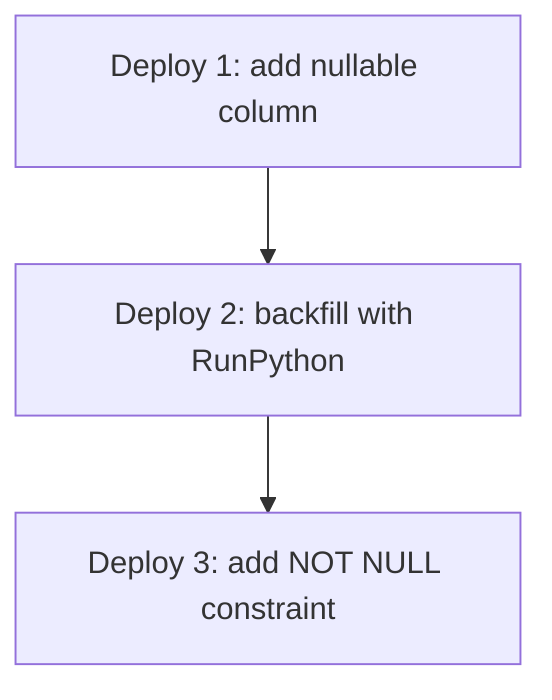
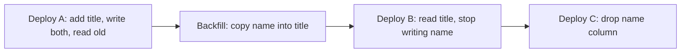

# Lecture 1 — Real-world migrations

> **Duration:** ~2 hours. **Outcome:** You can run any of the four "interesting" migration shapes safely on a populated table: adding a non-null column, renaming a field, splitting a model, backfilling data with `RunPython`. For each, you can name the lock level Postgres will take, the deployment ordering, and the reverse operation.

The Django auto-generated migration is the easy case. `makemigrations` notices you added an optional `description` field; `migrate` runs `ALTER TABLE ... ADD COLUMN description varchar(200) NULL`; the deploy succeeds in 50 ms; nobody notices. Most migrations in a healthy project are this shape, and that is exactly why the **uncommon** migrations are the ones that take projects down. Today is about those.

## 1. The migration framework — what it actually does

A Django migration is a Python file under `app/migrations/`. It contains a `Migration` class with two attributes that matter: `dependencies` (a list of migrations this one depends on, by `(app_label, migration_name)`) and `operations` (a list of `Operation` instances, each of which can apply forward and reverse). The framework:

1. Reads every migration in every app's `migrations/` directory at import time.
2. Builds a directed acyclic graph from the `dependencies`.
3. Computes, for the current state of `django_migrations` (the metadata table), the set of migrations that have **not** been applied.
4. Runs them, in topological order, each inside a transaction (on backends that support DDL transactions — Postgres does, MySQL does not).

`python manage.py showmigrations writer` prints the graph. `python manage.py migrate --plan` shows what the next `migrate` will do, without running it. `python manage.py sqlmigrate writer 0007` prints the SQL the migration will issue.

### The two state spaces

Two state spaces matter, and confusing them is the root of most migration confusion:

- **The model state** — what Django thinks the schema looks like, computed from the migration history. Lives in `app/migrations/`, never in the database.
- **The database state** — what Postgres actually has. Lives in Postgres.

`makemigrations` looks at the difference between the **model state computed from history** and **the current `models.py`** and writes a migration to close the gap. It never inspects the database. This is why `makemigrations` can be run with the database offline — and why it can produce migrations that fail when applied if your model changed via direct SQL outside of Django.

The `SeparateDatabaseAndState` operation manipulates the two state spaces independently. We will use it in section 5 for renames without downtime.

## 2. The auto-generated migration — what to read in it

Run `python manage.py makemigrations writer` after a small model change. The generated file:

```python
from django.db import migrations, models


class Migration(migrations.Migration):
    dependencies = [
        ("writer", "0006_article_view_count"),
    ]

    operations = [
        migrations.AddField(
            model_name="article",
            name="description",
            field=models.CharField(blank=True, default="", max_length=200),
        ),
    ]
```

Two things to verify, every time, before merging:

1. **Read the SQL.** `python manage.py sqlmigrate writer 0007` prints:

    ```sql
    BEGIN;
    ALTER TABLE "writer_article" ADD COLUMN "description" varchar(200) DEFAULT '' NOT NULL;
    ALTER TABLE "writer_article" ALTER COLUMN "description" DROP DEFAULT;
    COMMIT;
    ```

    On Postgres, `ALTER TABLE ... ADD COLUMN ... DEFAULT '' NOT NULL` is a **metadata-only** change since Postgres 11 — it does not rewrite the table, even with millions of rows. This is fast and safe. The lock is `ACCESS EXCLUSIVE`, held only long enough to update the catalog; readers and writers block briefly, then continue.

2. **Read the lock implications.** Older Postgres versions, or migrations that add a `DEFAULT` that is **volatile** (e.g. `default=uuid4`), would rewrite the whole table while holding `ACCESS EXCLUSIVE`. On a 10-million-row table that takes minutes. The `ACCESS EXCLUSIVE` lock blocks every read and write during the rewrite. The load balancer health-checks fail. The deploy stalls. This is the migration that takes a system down.

Read `sqlmigrate` for every change. Five seconds of habit saves the deploy that needs the rollback.

## 3. The "add a non-null column" pattern

The migration:

```python
class Article(models.Model):
    ...
    # NEW: required, no default
    reading_time_minutes = models.PositiveIntegerField()
```

`makemigrations` generates an `AddField` with `null=False`. `sqlmigrate` shows:

```sql
ALTER TABLE writer_article ADD COLUMN reading_time_minutes integer NOT NULL;
```

On a populated table this **fails** at the database level — every existing row has no value for the new column, and `NOT NULL` rejects each one. Postgres returns:

```
ERROR: column "reading_time_minutes" of relation "writer_article" contains null values
```

The fix is the three-step pattern, run as three migrations in three deploys:


*Three deploys turn an unsafe non-null column add into three safe, reversible steps.*

### Step 1 — Add nullable

```python
# 0008_add_reading_time_nullable.py
operations = [
    migrations.AddField(
        model_name="article",
        name="reading_time_minutes",
        field=models.PositiveIntegerField(null=True),
    ),
]
```

Deploy this. The column exists, every row has `NULL`, the application code does not depend on it.

### Step 2 — Backfill with `RunPython`

```python
# 0009_backfill_reading_time.py
from django.db import migrations


def forwards(apps, schema_editor):
    Article = apps.get_model("writer", "Article")
    # batch: process in chunks of 1000 so the transaction does not block too long
    qs = Article.objects.filter(reading_time_minutes__isnull=True).only("id", "body")
    batch = []
    for art in qs.iterator(chunk_size=1000):
        words = len(art.body.split()) if art.body else 0
        art.reading_time_minutes = max(1, words // 200)
        batch.append(art)
        if len(batch) >= 1000:
            Article.objects.bulk_update(batch, ["reading_time_minutes"])
            batch.clear()
    if batch:
        Article.objects.bulk_update(batch, ["reading_time_minutes"])


def reverse(apps, schema_editor):
    # Reversing means setting back to NULL. The data we computed is derivable from `body`, so the
    # reverse is to drop the computed value. Whether you keep the field or null it is a judgement
    # call; `migrations.RunPython.noop` is fine when the data is recoverable.
    Article = apps.get_model("writer", "Article")
    Article.objects.update(reading_time_minutes=None)


class Migration(migrations.Migration):
    dependencies = [("writer", "0008_add_reading_time_nullable")]
    operations = [migrations.RunPython(forwards, reverse)]
```

Deploy this. The column is fully populated, but still nullable. Tests pass; the application reads `reading_time_minutes` and finds a value on every row.

### Step 3 — Add the `NOT NULL` constraint

```python
# 0010_make_reading_time_not_null.py
operations = [
    migrations.AlterField(
        model_name="article",
        name="reading_time_minutes",
        field=models.PositiveIntegerField(),
    ),
]
```

`sqlmigrate` shows:

```sql
ALTER TABLE writer_article ALTER COLUMN reading_time_minutes SET NOT NULL;
```

On Postgres 12+ this is fast **if** every row already has a value (which step 2 guaranteed) and **if** Postgres can verify it with a single sequential scan. The lock is `ACCESS EXCLUSIVE` but brief.

### Why three migrations and not one

Two reasons:

1. **Rollback granularity.** If the backfill is wrong, you reverse migration 0009 without touching the column at all. If the constraint addition slows production unacceptably, you reverse 0010 and the column stays nullable. A monolithic migration is all-or-nothing.
2. **Deploy ordering.** Each migration corresponds to a deploy. Between deploys, the application code can read and write the new column without yet relying on it being non-null. This is the safe shape for any change to a system with running traffic.

For a single-developer project on a 100-row test database, you can collapse the three into one — the lecture's point is the **shape**, not the line count.

## 4. The reversibility contract

Every migration must reverse, or you accept that rollback for that change means "manually restore from backup". The default for auto-generated migrations is reversibility; `AddField` reverses to `RemoveField`, `AlterField` reverses to its previous shape, `RunSQL` requires you to write the `reverse_sql=` argument.

`RunPython` is the case to watch:

```python
migrations.RunPython(forwards, reverse)            # reversible
migrations.RunPython(forwards)                     # NOT reversible
migrations.RunPython(forwards, migrations.RunPython.noop)  # reversible, noop reverse
migrations.RunPython(migrations.RunPython.noop, reverse)   # forward is a noop; reverse does work
```

The third form — `noop` reverse — is the legitimate answer for forward operations whose reverse is "leave the data as it is, the column will be dropped by a later migration". For example, backfilling a column that is about to be deleted — there is nothing meaningful to do on reverse.

The fourth form — `noop` forward — is rarer but useful when a migration is squashed and the forward operation has already been baked into an earlier squash.

A migration that uses `migrations.RunPython(forwards)` (no reverse) is technically valid; running `migrate writer 0008` (rolling back to before this migration) will raise `IrreversibleError`. Some teams treat this as a feature ("you must restore from backup to roll back"); most treat it as a bug.

## 5. Renaming a field — and why the auto-generated migration is wrong for production

Rename a field on the model:

```python
class Article(models.Model):
    # was: name = models.CharField(max_length=200)
    title = models.CharField(max_length=200)  # renamed
```

`makemigrations` will ask:

```
Did you rename article.name to article.title (a CharField)? [y/N]
```

If you answer yes, Django generates:

```python
operations = [
    migrations.RenameField(
        model_name="article",
        old_name="name",
        new_name="title",
    ),
]
```

`sqlmigrate` shows:

```sql
ALTER TABLE writer_article RENAME COLUMN name TO title;
```

On a single-process development machine this is fine. **On a production deploy with rolling release**, it is broken: while the deploy is in progress, half the application servers still run the old code (which queries `WHERE name = ...`) and half run the new (which queries `WHERE title = ...`). Either the rename happens before the new code (the old code breaks) or after (the new code breaks).

The fix is **add-then-deprecate** as two migrations and two deploys:


*Renaming a field safely under rolling deploys means both columns coexist until every process reads the new one.*

### Deploy A — add the new column, write both, read old

Migration 1: `AddField(name="title", null=True)`. Application code: write both `name = X` and `title = X` on save (use a `pre_save` signal or override `save()`). Read from `name` everywhere it is used. After deploy A, every row has both columns populated, with identical values.

Run a backfill migration: `RunPython` that copies `name` to `title` for existing rows.

### Deploy B — read new, stop writing old

Application code: read from `title`. Remove the `pre_save` signal that wrote both. `name` is now unused but still present in the schema.

### Deploy C — drop the old column

Migration: `RemoveField(name="name")`. The application no longer references it; nothing breaks.

This is three deploys for what looks like a one-line rename. In a single-developer project on a feature branch, do not bother. In a production system with rolling deploys and tens of seconds of overlap between old and new processes, this is the only correct shape.

### `SeparateDatabaseAndState` — the surgical case

Sometimes you want Django's model state to reflect a rename without the database column actually changing. The classic case: the database has been renamed manually (via DBA, via raw SQL, via someone-else's-migration) and Django's history is out of sync. The operation:

```python
operations = [
    migrations.SeparateDatabaseAndState(
        state_operations=[
            migrations.RenameField("article", "name", "title"),
        ],
        database_operations=[],  # do nothing in the database
    ),
]
```

This updates Django's idea of the schema (so future `makemigrations` runs work correctly) without issuing any SQL. The companion form — `database_operations=[...]` and `state_operations=[]` — is rarer but exists for the symmetric case.

Use this when you must. Avoid it when you can. A migration that touches one space without the other is a confusion factory for the next engineer to read the history.

## 6. Data migrations with `RunPython` — the rules

The `RunPython` callback receives `(apps, schema_editor)`. The two rules are non-negotiable:

### Rule 1 — never import models directly

Wrong:

```python
def forwards(apps, schema_editor):
    from writer.models import Article    # WRONG
    Article.objects.update(...)
```

Right:

```python
def forwards(apps, schema_editor):
    Article = apps.get_model("writer", "Article")  # historical model
    Article.objects.update(...)
```

`apps.get_model("writer", "Article")` returns the model **as it existed at this point in the migration history**. The direct import returns the model **as it exists in `models.py` right now**, which may have fields, methods, and managers that did not exist when this migration was written. Six months from now, when someone re-runs migrations on a fresh database, the direct import will fail in subtle ways. Always use `apps.get_model`.

### Rule 2 — model methods and managers are not available on the historical model

The historical model has the fields and the default `Manager` (`objects`). It does **not** have custom methods (`article.absolute_url()`), custom managers (`Article.published_objects`), or signals. If your data migration needs to compute something, write the computation as a function inside the migration file. Treat the historical model as a thin data-access object, not as your full ORM.

### Batch iteration for large tables

A migration that does `Article.objects.update(...)` issues one `UPDATE` statement — fine for small tables. For large ones (millions of rows), the `UPDATE` takes a long lock and blocks writers for the duration. The batched form:

```python
def forwards(apps, schema_editor):
    Article = apps.get_model("writer", "Article")
    qs = Article.objects.filter(reading_time_minutes__isnull=True).only("id", "body")
    batch = []
    for art in qs.iterator(chunk_size=1000):   # iterator() avoids loading everything into RAM
        art.reading_time_minutes = compute(art)
        batch.append(art)
        if len(batch) >= 1000:
            Article.objects.bulk_update(batch, ["reading_time_minutes"])
            batch.clear()
    if batch:
        Article.objects.bulk_update(batch, ["reading_time_minutes"])
```

Each `bulk_update` is one short transaction. Other writers can fit in between them. The total wall-clock is similar to the monolithic version, but the system stays usable while the migration runs.

For tables in the hundreds of millions of rows, even this is not enough; the migration must be stop-resumable, often by running in batches **outside** the Django migration framework (a management command that picks up where it left off, idempotently). The mini-project for week 6 does not require this — but recognise the failure mode.

## 7. `RunSQL` — when the ORM cannot help

Some operations have no Django representation:

- `CREATE INDEX CONCURRENTLY` (creates an index without blocking writers; Django's `AddIndex` emits a blocking `CREATE INDEX`)
- `CREATE EXTENSION` for Postgres extensions like `pg_trgm` or `uuid-ossp`
- `ALTER TABLE ... SET (autovacuum_vacuum_scale_factor = 0.01)`
- Database-specific constraints, partial unique indexes outside Django's expression-index support, custom types

The operation:

```python
operations = [
    migrations.RunSQL(
        sql="CREATE EXTENSION IF NOT EXISTS pg_trgm;",
        reverse_sql="DROP EXTENSION IF EXISTS pg_trgm;",
    ),
]
```

`reverse_sql=migrations.RunSQL.noop` is fair when the operation does not need to be undone.

For `CREATE INDEX CONCURRENTLY`, an extra subtlety: it cannot run inside a transaction. Django's migration framework wraps each migration in a transaction on Postgres. You disable the transaction with the migration-level flag:

```python
class Migration(migrations.Migration):
    atomic = False  # required for CREATE INDEX CONCURRENTLY

    operations = [
        migrations.RunSQL(
            sql="CREATE INDEX CONCURRENTLY ix_article_author_status ON writer_article (author_id, status);",
            reverse_sql="DROP INDEX CONCURRENTLY IF EXISTS ix_article_author_status;",
        ),
    ]
```

Loss of atomicity means if the migration fails partway, you do not get an automatic rollback. The trade is intentional — `CONCURRENTLY` is the only way to add an index to a live table without taking writes offline, and the price is manual recovery on partial failure.

## 8. Splitting a model — the two-phase migration

You realise `Article` should split: an `Article` (metadata) and an `ArticleBody` (the heavy text), to make article-list queries narrower. The naive migration:

1. Create `ArticleBody` table.
2. Move every row's `body` column into the new table.
3. Drop `body` from `writer_article`.

In one migration this is broken — between step 2 and step 3, the application code is uncertain which table to read from. The fix is the same shape as the rename:

- **Deploy A:** add the `ArticleBody` table, write to both `article.body` and `articlebody.text`, read from `article.body`.
- **Backfill:** `RunPython` copies every existing row.
- **Deploy B:** read from `articlebody.text`, stop writing to `article.body`.
- **Deploy C:** drop `article.body`.

Three deploys, four migrations. Each individually small, each reversible.

If you find yourself doing this regularly, it is a sign the schema design at week 2 should have been different. That is fine — splitting a table is a known cost of an evolving system. The skill this week is to run the split safely, not to avoid ever needing one.

## 9. Squashing migrations — and the gotcha

After 50+ migrations, fresh-database runs slow down. `squashmigrations` collapses a contiguous range into a single migration that is **equivalent in final state** but faster to apply:

```bash
python manage.py squashmigrations writer 0001 0040
# writes writer/migrations/0001_squashed_0040_xyz.py
```

Two gotchas:

1. **`RunPython` operations are not always squashable.** Django will warn; the operation gets copied verbatim, but if it referenced a model field that was later removed, the squash fails. The fix is to mark the `RunPython` with `elidable=True` so the squash can drop it (only safe if the data migration's effect is captured in a later schema migration's state).
2. **Squashed migrations replace originals only after every database is migrated past them.** While some databases are still on `0023`, you must keep both the originals and the squashed version. Once every database is past `0040`, you can delete the originals.

Squashing is a maintenance task, not a feature. Schedule it once a year. Do not squash mid-deploy.

## 10. The deployment order — the four shapes

Memorise these four orderings. Every migration falls into one of them.

| Migration shape | Deploy order | Why |
|-----------------|--------------|-----|
| Add an optional column | Database, then code | New code can use the column; old code ignores it |
| Add a required column | Database (nullable), backfill, database (NOT NULL), then code | New code can rely on non-null; old code never sees the column |
| Drop a column | Code (stop reading/writing), then database | Old code may still be live; never break it by removing a column it queries |
| Rename a column | Add new + write both, backfill, switch reads, stop writing old, drop old | The intermediate states are all live; every step is reversible |

The pattern across all four: **the database leads when adding, the code leads when removing**, and any change to existing data fits between two safe schema states.

## 11. The local development override

Everything in this lecture is about a deploy with running traffic. On your laptop, with one process and 100 rows, none of it matters. `python manage.py migrate` runs the migrations as quickly as Postgres can apply them, and you carry on.

The skill is to **write migrations the same way locally as in production**, so the muscle memory is intact when production matters. Three habits to adopt this week:

1. Always run `sqlmigrate` before merging a migration. Read the SQL.
2. Always write the `reverse_code=` for `RunPython`. If reverse is genuinely a noop, write `RunPython.noop` explicitly — never leave the second arg blank.
3. Always squash data migrations with `iterator(chunk_size=1000)` and `bulk_update`, even on a 100-row table. The cost is zero; the muscle memory is permanent.

Tomorrow's lecture introduces Celery. By Friday `crunchwriter` will run real background work. Then on Saturday the analytics dashboard learns to cache itself in Redis, and the week's three pieces — migrations, jobs, cache — are wired into one feature.
