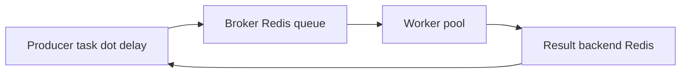
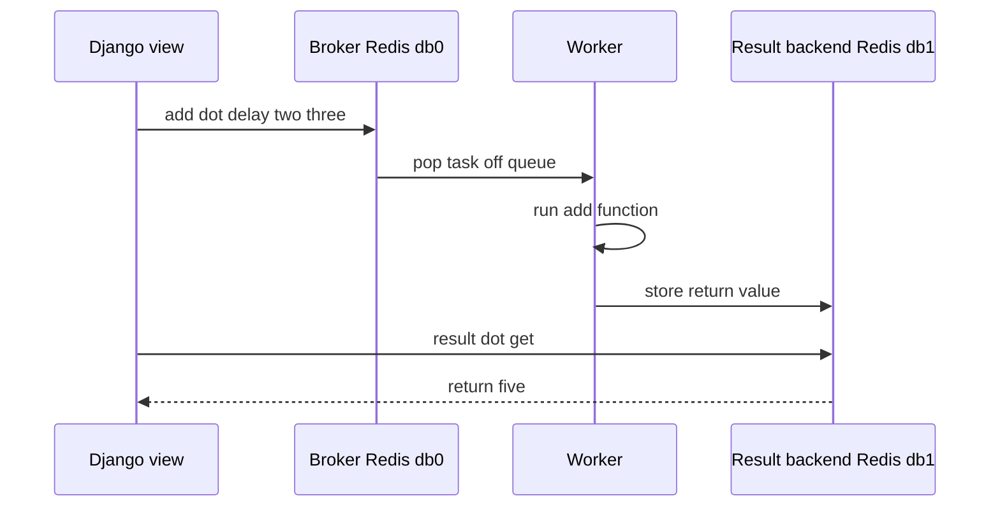

# Lecture 2 — Celery: broker, worker, beat

> **Duration:** ~2 hours. **Outcome:** You can wire Celery 5.x into a Django project, send a task from a view, watch a worker run it, write a retry, and schedule a recurring task with beat. You can answer "why not just `async def`?" with the three cases where Celery is the right answer and async is not.

A web request should return in under 200 ms. The user uploaded a 4 MB image; the server needs to generate three thumbnail sizes, run a CDN upload, scan for inappropriate content, and email the moderator. Each of those takes seconds. None of them can run inside the request — the user would close the tab, and the failure modes (retry, partial success) cannot be expressed inside HTTP. The request hands the work to a queue, returns 202 Accepted, and a separate process finishes the job. That is Celery.

## 1. The four pieces of a Celery deployment

Celery is not one process; it is at least four, separated by responsibility. Confusing them is the first thing that goes wrong.

- **Producer** — the code that calls `task.delay(...)`. Usually a Django view, sometimes another task. The producer does not run the task; it serializes arguments and pushes them onto the broker.
- **Broker** — a message bus. Holds tasks that have been queued but not yet picked up. Redis 7 is the recommended broker for new projects; RabbitMQ is the classic alternative. The broker is **not** the database. If you lose the broker, queued-but-not-yet-running tasks are gone.
- **Worker** — a long-running process, started with `celery -A crunchwriter worker -l info`. Polls the broker, picks up tasks, runs them, reports results. You can run many workers across many machines.
- **Result backend** — storage for task return values and state (`PENDING`, `STARTED`, `SUCCESS`, `FAILURE`). Redis 7 again is fine — Celery uses different database numbers for broker vs result backend. Optional: if no one ever calls `result.get()`, you can disable the result backend (`task_ignore_result=True`).


*The four core Celery pieces and how a task moves between them.*

Beat is a fifth piece, optional: a separate process that pushes tasks onto the broker on a cron-like schedule. We will set it up in section 8.

## 2. The minimal Django + Celery setup

In `crunchwriter/celery_app.py`:

```python
import os
from celery import Celery

os.environ.setdefault("DJANGO_SETTINGS_MODULE", "crunchwriter.settings")

app = Celery("crunchwriter")

# Pull every CELERY_-prefixed setting from Django settings
app.config_from_object("django.conf:settings", namespace="CELERY")

# Auto-discover tasks.py in every installed app
app.autodiscover_tasks()


@app.task(bind=True)
def debug_task(self):
    print(f"Request: {self.request!r}")
```

In `crunchwriter/__init__.py`:

```python
from .celery_app import app as celery_app

__all__ = ("celery_app",)
```

This makes the app available to anything that imports `crunchwriter`. The `autodiscover_tasks()` call instructs Celery to look for a `tasks.py` module in every app in `INSTALLED_APPS` — `writer/tasks.py` is where your tasks will live.

In `crunchwriter/settings.py`:

```python
# Broker and result backend
CELERY_BROKER_URL = "redis://localhost:6379/0"        # database 0
CELERY_RESULT_BACKEND = "redis://localhost:6379/1"    # database 1, deliberate separation

# Reasonable defaults for development
CELERY_TASK_SERIALIZER = "json"
CELERY_RESULT_SERIALIZER = "json"
CELERY_ACCEPT_CONTENT = ["json"]
CELERY_TIMEZONE = "UTC"
CELERY_ENABLE_UTC = True

# Task hygiene
CELERY_TASK_ACKS_LATE = True        # ack only after the task succeeds; survives worker crashes
CELERY_WORKER_PREFETCH_MULTIPLIER = 1  # one task at a time per worker process; safer for long tasks
```

Two settings worth understanding before merging:

- **`CELERY_TASK_ACKS_LATE = True`** — by default, Celery acknowledges a task to the broker the moment it picks it up. If the worker then crashes mid-execution, the task is gone. `ACKS_LATE = True` defers the ack until after success — at the cost of duplicate runs if the worker crashes after the task completed but before the ack. Combine with idempotent tasks (section 5) and the duplicate is harmless.
- **`CELERY_WORKER_PREFETCH_MULTIPLIER = 1`** — by default, a worker grabs four tasks at once from the broker, even if it can only run one at a time. For short tasks (under a second) this is fine; for long tasks, set to 1 so a fast worker is not starved by a slow worker holding three queued.

## 3. Your first task

In `writer/tasks.py`:

```python
from celery import shared_task


@shared_task
def add(x: int, y: int) -> int:
    return x + y
```

`@shared_task` (rather than `@app.task`) decouples the task from any particular Celery app — useful when the same `tasks.py` is imported by both Django and a standalone test runner. Always prefer `@shared_task` for application tasks.

From a Django view, shell, or another task:

```python
from writer.tasks import add

# Non-blocking — sends the task to the broker, returns an AsyncResult immediately
result = add.delay(2, 3)
print(result.id)        # "5b2c..." — the task's unique ID
print(result.ready())   # False if the worker has not finished yet
print(result.get(timeout=5))  # 5 — blocks up to 5 seconds for the worker
```

`delay(args)` is shorthand for `apply_async(args=(args,))`. The full form lets you set per-call options (`countdown=10` to delay 10 seconds, `expires=60` to expire the task if not picked up in 60 seconds, `queue="slow"` to route to a specific worker queue).

Start a worker in a second terminal:

```bash
celery -A crunchwriter worker -l info
```

You should see the worker register the task and pick it up the moment `add.delay(...)` is called. If you do not, three checks: Redis is running (`redis-cli PING`), the worker is on the same broker URL, and `autodiscover_tasks` found the module (`celery -A crunchwriter inspect registered`).

## 4. The lifecycle of a task

Tracing one call end to end:

1. **Producer:** `add.delay(2, 3)` in a Django view.
2. **Serialisation:** Celery serialises the arguments as JSON: `{"args": [2, 3], "kwargs": {}}`. The task name (`"writer.tasks.add"`), an ID, retry metadata, and routing keys are added.
3. **Broker:** the serialised message lands in Redis on database 0, under a list key `celery`. `LPUSH` pushes; the worker's `BRPOP` pops.
4. **Worker:** the worker process picks up the message, deserialises, looks up the registered function, calls it with the deserialised args. If `ACKS_LATE=True`, the ack is deferred; otherwise it is sent before the call.
5. **Result:** the return value is serialised and written to Redis database 1, under a key derived from the task ID, with a TTL (default 1 day, controlled by `CELERY_RESULT_EXPIRES`).
6. **Producer (eventually):** the producer can call `result.get()`, which `BRPOP`s the result key out of database 1 and deserialises.

Knowing this chain helps when something is wrong. "Task is queued but never runs" — check the worker is registered (`inspect registered`) and on the same broker. "Task ran but `get()` times out" — check the result backend URL, and check `task_ignore_result` is not set.


*One task traced end to end, from producer call to result retrieval.*

## 5. Idempotency — the most important concept

Celery's delivery contract is **at-least-once**. The same task can run twice, in two cases:

- `ACKS_LATE=True` and the worker crashed after running the task but before sending the ack.
- A retry was scheduled (section 6) and the original also completed.
- A network glitch caused the broker to re-deliver.

The right defence is **idempotent tasks**: running the task twice produces the same outcome as running it once. Three common shapes:

### Shape A — database flag

```python
@shared_task
def generate_thumbnails(article_id: int) -> None:
    article = Article.objects.get(pk=article_id)
    if article.thumbnails_generated_at:
        return  # already done
    # ... do the work
    article.thumbnails_generated_at = timezone.now()
    article.save(update_fields=["thumbnails_generated_at"])
```

The flag is a column on the relevant model. Cheap, durable, easy to inspect. The race is the gap between the `get` and the `save` — fine for thumbnail generation (a redundant run wastes CPU), wrong for "charge the credit card" (a redundant run double-charges).

### Shape B — Redis `SETNX`

```python
from django.core.cache import cache

@shared_task
def generate_thumbnails(article_id: int) -> None:
    lock_key = f"task:thumbnails:{article_id}"
    if not cache.add(lock_key, "1", timeout=3600):
        return  # another worker is on it (or just finished it)
    try:
        # ... do the work
        pass
    finally:
        # Optionally release; otherwise the lock expires in an hour
        pass
```

`cache.add()` only sets the key if it does not exist (Redis `SETNX` semantics). Two workers racing on the same article — only one wins the lock; the other returns immediately. The TTL acts as a self-healing safety net if the winner crashes.

### Shape C — unique constraint on a side table

For tasks that should run exactly once even across many retries:

```python
@shared_task
def charge_invoice(invoice_id: int, idempotency_key: str) -> None:
    try:
        ChargeRecord.objects.create(invoice_id=invoice_id, idempotency_key=idempotency_key)
    except IntegrityError:
        return  # already charged
    # ... do the work
```

A unique constraint on `(invoice_id, idempotency_key)` makes the first `INSERT` succeed and the second fail. The check is atomic. This is the shape financial systems use; it is overkill for thumbnails.

The principle is non-negotiable: **assume every task runs twice, and design so the second run is a no-op**.

## 6. Retries — failing safely

A task can fail for many reasons: an HTTP API was down, a database row was locked, a temporary disk full. Most of these self-heal in seconds. Celery's retry mechanism:

```python
from celery import shared_task

@shared_task(
    autoretry_for=(requests.RequestException, IOError),
    retry_backoff=True,          # exponential backoff: 1s, 2s, 4s, 8s, ...
    retry_backoff_max=60,        # cap at 60s
    retry_jitter=True,           # ±25% randomness to avoid thundering herd
    max_retries=5,               # then give up
)
def fetch_and_index(url: str) -> int:
    response = requests.get(url, timeout=10)
    response.raise_for_status()
    return len(response.text)
```

The decorator declares: on `RequestException` or `IOError`, retry up to 5 times, with exponential backoff and jitter. After the fifth failure, the task is marked `FAILURE` and the exception is recorded.

For explicit, conditional retry (where the decision depends on the data):

```python
@shared_task(bind=True, max_retries=5)
def fetch_and_index(self, url: str) -> int:
    try:
        response = requests.get(url, timeout=10)
        response.raise_for_status()
        return len(response.text)
    except requests.RequestException as exc:
        # Retry with a custom backoff
        raise self.retry(exc=exc, countdown=2 ** self.request.retries)
```

`self.retry(exc=...)` raises a `Retry` exception, which Celery catches and re-queues. Use this form when the retry decision is based on the response (e.g. "retry on 503 but not 404").

### Retries are not free

Two costs to know:

1. **Each retry runs the whole task body again.** If the task did work before failing, that work is repeated. This is the case for the idempotency rule from section 5.
2. **Long retry chains hide bugs.** A task that retries 5 times over 31 seconds and then fails has been failing for 31 seconds. If the underlying problem is a code bug rather than a transient failure, the retries delay the alert. Set `max_retries` low (3–5) and pipe failures to your error tracker.

## 7. Time limits

A task that hangs (infinite loop, deadlocked network call without a timeout) blocks a worker process indefinitely. Two limits:

```python
@shared_task(
    soft_time_limit=30,   # raise SoftTimeLimitExceeded inside the task at 30s
    time_limit=60,        # kill the worker at 60s (hard limit)
)
def generate_thumbnails(article_id: int) -> None:
    try:
        # ... work that might hang
        pass
    except SoftTimeLimitExceeded:
        # Clean up: close files, release locks, write a "partial" marker
        raise
```

The soft limit raises `SoftTimeLimitExceeded` inside the task, allowing graceful cleanup. The hard limit sends `SIGKILL` to the worker process — no cleanup, but guarantees the task stops.

Set the soft limit to a generous estimate of normal duration. Set the hard limit to 2× the soft limit. Anything longer than the hard limit indicates a bug; the worker should die and restart.

## 8. Beat — periodic tasks

Some work is scheduled, not event-driven. Refreshing the analytics dashboard cache every 60 seconds, sending the daily digest email at 09:00, garbage-collecting stale rows nightly — all are beat work.

In `settings.py`:

```python
from celery.schedules import crontab

CELERY_BEAT_SCHEDULE = {
    "refresh-analytics-every-60s": {
        "task": "writer.tasks.refresh_analytics_cache",
        "schedule": 60.0,   # every 60 seconds
    },
    "daily-digest-09-utc": {
        "task": "writer.tasks.send_daily_digest",
        "schedule": crontab(hour=9, minute=0),
    },
}
```

`schedule: 60.0` runs every 60 seconds. `crontab(...)` accepts `minute`, `hour`, `day_of_week`, `day_of_month`, `month_of_year`. Read the cron docs once; the syntax in Celery matches.

Run beat in a separate process:

```bash
celery -A crunchwriter beat -l info
```

Beat pushes the task onto the broker at the scheduled time; a worker picks it up like any other task. Beat itself does **not** run tasks — running both beat and worker in the same process is technically possible (`celery -A app worker -B -l info`) but only acceptable for development.

### The two-beat problem

Only one beat process should be running per deployment. Two beat processes will both schedule each task, doubling the work. In production, beat runs as a singleton — either as one container, one systemd service, or one Kubernetes pod with `replicas: 1`.

`django-celery-beat` (a separate package) stores the schedule in the database and lets multiple beat processes coordinate via a lock — the right setup once your project has high-availability requirements. For Week 6 the in-settings schedule is enough.

## 9. Async views (Django 5) vs Celery — when each is right

Django 5 supports `async def` views. The temptation: "if Celery is just offloading, can I `await` the work and skip the broker?"

The three cases where Celery is right and async is not:

1. **The work must outlive the request.** If the user closes the tab, the work continues. An async view's task is bound to the ASGI request; closing the connection cancels it. Celery's task is in the broker; the request is irrelevant.
2. **The work must survive a process restart.** Deploys, OOM kills, scale-downs all restart the application processes. In-process async work is lost. Broker-queued work persists.
3. **The work must be retried on failure.** Celery's retry contract is built in. Re-running an `async def` view's logic requires the user to re-submit the request.

Three cases where async is right and Celery is overkill:

1. **The work is short (under a second) and the user is waiting for the result.** Fanning out 3 HTTP calls concurrently from an async view returns the page faster; queueing them through Celery returns the page faster too but adds the broker round-trip cost.
2. **The work is purely I/O and the result is needed inline.** Calling an external API to render the response is async territory.
3. **You have no infrastructure budget for Redis + workers.** A solo project on a single VPS may not want to pay the operational cost of a worker process. The async view is the right answer until requirements force the upgrade.

The decision tree: **"does it need to survive the request?"** Yes — Celery. No — async.

## 10. Production hygiene — five settings to set on day one

1. **`CELERY_TASK_ACKS_LATE = True`** — survives worker crashes. Pair with idempotent tasks.
2. **`CELERY_WORKER_PREFETCH_MULTIPLIER = 1`** for slow tasks; higher for short ones.
3. **`CELERY_WORKER_MAX_TASKS_PER_CHILD = 1000`** — recycle worker processes every N tasks to avoid memory leaks. Lower for memory-hungry tasks; higher for cheap ones.
4. **`CELERY_TASK_SOFT_TIME_LIMIT = 60` / `CELERY_TASK_TIME_LIMIT = 120`** — defaults; override per-task as needed.
5. **Per-queue routing**: separate `slow` and `fast` queues, with a dedicated worker for each. Stops a 30-second task from blocking a 200-ms task behind it.

```python
CELERY_TASK_ROUTES = {
    "writer.tasks.generate_thumbnails": {"queue": "slow"},
    "writer.tasks.refresh_analytics_cache": {"queue": "fast"},
}
```

Then run two workers:

```bash
celery -A crunchwriter worker -Q fast -l info --hostname=fast@%h
celery -A crunchwriter worker -Q slow -l info --hostname=slow@%h --concurrency=2
```

## 11. Watching the work — `flower` and `inspect`

`flower` is a real-time monitoring UI:

```bash
pip install flower
celery -A crunchwriter flower
# visit http://localhost:5555
```

You see every worker, every task, every retry, every failure, with the arguments and the traceback. For development, this is the single most useful diagnostic tool.

`celery inspect` is the CLI equivalent — no UI, but scriptable:

```bash
celery -A crunchwriter inspect active        # tasks currently running
celery -A crunchwriter inspect registered    # tasks the worker knows about
celery -A crunchwriter inspect scheduled     # tasks scheduled for future execution
celery -A crunchwriter inspect stats         # pool size, total tasks, uptime
```

Set up `flower` for local development. Use `inspect` in CI and production scripts. Watching the worker run your first task is the single most clarifying moment of the week — you see the broker push, the worker pull, the result land back. Do not skip it.

## 12. The skeleton you will fill in this week

By end of Tuesday's exercise (Exercise 2):

- `crunchwriter/celery_app.py` — the Celery app.
- `crunchwriter/__init__.py` — exports `celery_app`.
- `crunchwriter/settings.py` — broker, result backend, task settings.
- `writer/tasks.py` — one `@shared_task` that runs successfully.
- `docker-compose.yml` — adds a `worker` service.
- A view that calls `task.delay(...)` and returns `{"task_id": result.id}`.

By end of Friday's mini-project work:

- `writer/tasks.py` — the `generate_thumbnails(article_id)` task with retries, soft time limit, idempotency.
- Settings — beat schedule that refreshes the analytics cache every 60 seconds.
- A test that calls the task synchronously (`CELERY_TASK_ALWAYS_EAGER=True` in test settings) and asserts the side effects.

Tomorrow's lecture is Redis caching. By the end of the week the analytics dashboard learns to cache itself, and the image upload from the mini-project hands its thumbnails to Celery without ever blocking the user.
