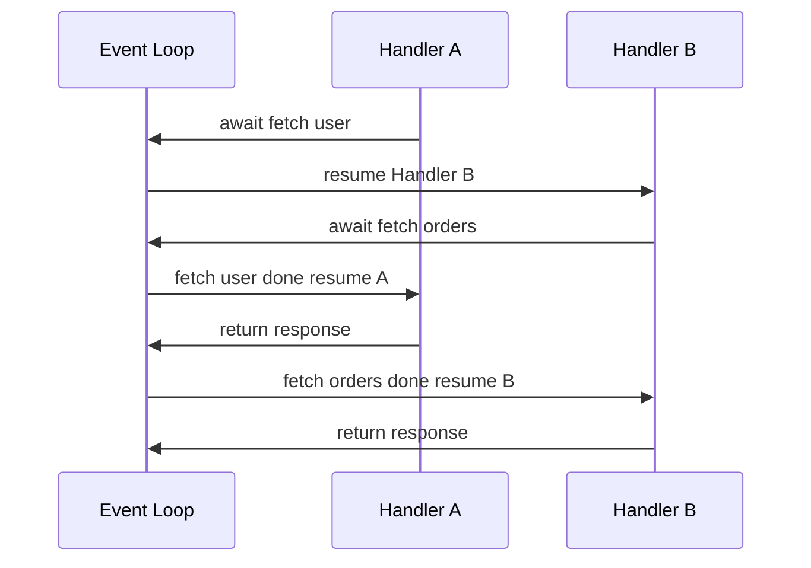
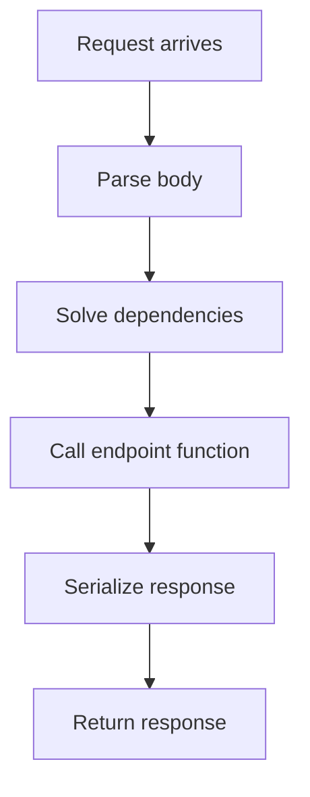

# Lecture 1 — ASGI and async in Python web

> **Duration:** ~2 hours. **Outcome:** You can explain what ASGI is, why FastAPI requires it, and what `async def` means inside an HTTP handler. You can sketch the `scope`/`receive`/`send` triple from memory, name the three protocol types (`http`, `websocket`, `lifespan`), and articulate the three classes of work for which `async` actually helps. You can build a minimal FastAPI application and serve it with `uvicorn`.

Week 1 of C16 taught the wire format — HTTP/1.1 as text over TCP — and the **WSGI** standard, the Python interface that Django and Flask use to expose themselves to a web server. WSGI is synchronous by design. A WSGI application is a callable with the signature `app(environ, start_response)` that *returns* an iterable of bytes; the server invokes it, waits, and gets the response back. There is no `await`. There cannot be: PEP 3333 was written in 2010, four years before `asyncio` landed in the standard library.

FastAPI does not run on WSGI. It runs on **ASGI**, the asynchronous successor. This lecture is about what changes when the standard becomes async — at the interface level, at the runtime level, and at the design level. We do not yet earn the performance claim. We earn the *shape* of the standard, and the right to use `async def` in our route handlers. The performance conversation is Week 8.

## 1. Why ASGI exists

WSGI is a fine interface for the workload it was designed for: short, synchronous, request-then-respond. A browser asks for a page; the server invokes a Python function; the function reads a row from the database, renders a template, returns the bytes. Done in 20 milliseconds. WSGI's synchronous shape is not a limitation here; it is a clean match.

Three classes of work, all of which became common between 2010 and 2018, broke that match:

1. **Long-lived connections.** WebSocket (RFC 6455, 2011) and Server-Sent Events (HTML5 standard, finalised 2015) require the server to keep a connection open for minutes or hours, sometimes pushing data unprompted. WSGI's "call returns the body" shape cannot express this. WSGI workers — Gunicorn, uWSGI — assume the body is finite and finishable.

2. **Concurrent outbound I/O.** A request that fans out to three downstream services — say, "fetch the user, fetch their orders, fetch their preferences" — under WSGI runs the three calls in series. The total latency is the sum. Under an async runtime, the three can be issued concurrently from one thread; the total latency is the maximum. For an aggregator service, the difference is a 3× reduction in p95 latency. Not because the CPU is faster — because the *waiting* is overlapped.

3. **High connection counts with low CPU.** A chat service holding 50 000 idle WebSocket connections, each emitting one message per second, is a workload no WSGI server can serve efficiently. Each connection needs a thread; 50 000 threads is two gigabytes of stack space and a kernel scheduler that gives up. Under an async runtime, those 50 000 connections are 50 000 coroutines on one thread, costing kilobytes each. The kernel is happy.

ASGI exists to express these three workloads at the interface level. The PEP-equivalent is **`asgiref`**'s `specs/main.html`, written by Andrew Godwin (the Django migrations author, later the original Channels author). It is short — read it once before Tuesday's lecture: <https://asgi.readthedocs.io/en/latest/specs/main.html>.

## 2. The ASGI interface

A WSGI application is one function. An ASGI application is also one function, with a different signature:

```python
async def app(
    scope: dict,
    receive: Callable[[], Awaitable[dict]],
    send: Callable[[dict], Awaitable[None]],
) -> None:
    ...
```

Three arguments:

- **`scope`** — a dictionary describing the *connection*, not the message. Set at the start, immutable, populated by the server. For HTTP it contains the method, the path, the headers, the client address, the HTTP version. For WebSocket it contains the subprotocols and the URL. For lifespan it just says `{"type": "lifespan"}`.
- **`receive`** — an `async` callable. Each `await receive()` returns the next event from the client. For HTTP, the first event is `{"type": "http.request", "body": b"...", "more_body": False}`; for WebSocket, it is the next inbound message.
- **`send`** — an `async` callable. Each `await send(event)` pushes an event to the client. For HTTP, the first send is `{"type": "http.response.start", "status": 200, "headers": [...]}`; subsequent sends carry the body.

A trivial ASGI app that returns "hello":

```python
async def app(scope: dict, receive: Callable, send: Callable) -> None:
    assert scope["type"] == "http"
    await send({
        "type": "http.response.start",
        "status": 200,
        "headers": [(b"content-type", b"text/plain")],
    })
    await send({
        "type": "http.response.body",
        "body": b"hello",
    })
```

Save as `hello_asgi.py`. Run with `uvicorn hello_asgi:app`. Visit `http://localhost:8000/`. The browser says "hello".

This is the *interface*. FastAPI is a library that lets you describe HTTP behaviour at a much higher level — routes, types, validation — and generates the `app(scope, receive, send)` callable from it. Nothing FastAPI does at runtime exists outside this three-argument signature.

### The three protocol types

ASGI defines three values for `scope["type"]`:

- **`http`** — the request/response cycle. One `http.request` event in (possibly followed by more if the body is chunked), one `http.response.start` plus one or more `http.response.body` events out.
- **`websocket`** — a long-lived bidirectional connection. `websocket.connect` → `websocket.accept` → arbitrary message exchange → `websocket.close`.
- **`lifespan`** — emitted by the server once per worker process at startup and shutdown. `lifespan.startup` and `lifespan.shutdown`. This is how FastAPI's `lifespan` context manager fires.

This week we work exclusively with `http`. WebSocket is in C16 Week 11. Lifespan we touch in Lecture 3 (it is how the database engine is initialised once per worker).

## 3. `uvicorn` — the reference ASGI server

WSGI's reference server is `gunicorn`, with `uwsgi` and `mod_wsgi` as alternatives. ASGI's reference server is **`uvicorn`** — written in pure Python on top of `uvloop` (a libuv-based event loop), released 2017, and the one the FastAPI tutorial uses throughout. The alternatives are `hypercorn` (HTTP/2 capable, slower), `daphne` (Django Channels' choice, older), and `granian` (Rust-based, newer, fast).

The minimum to know:

```bash
# Run a single worker, foreground, with auto-reload
uvicorn main:app --reload

# Run four workers behind a single master (production shape)
uvicorn main:app --workers 4 --host 0.0.0.0 --port 8000

# Use the FastAPI CLI (wraps uvicorn with sensible defaults)
fastapi dev main.py            # development; reload, debug logs
fastapi run main.py --workers 4 # production
```

`uvicorn` and `fastapi dev` are interchangeable for development; `fastapi dev` is a thin wrapper that imports `app` from `main.py` and calls `uvicorn` with `--reload`. See <https://fastapi.tiangolo.com/fastapi-cli/>.

In production behind nginx or in a container, `uvicorn --workers N` is the standard pattern, with `N = (2 * CPU_count) + 1` as a starting heuristic. Each worker is a separate process with its own event loop. We will discuss the trade-offs against `gunicorn -k uvicorn.workers.UvicornWorker` in Week 12.

## 4. Async — what `async def` does

Three claims you have to accept, in order, to use `async def` correctly.

### Claim 1 — `async def` declares a coroutine function, not an action

```python
async def fetch_user(user_id: int) -> dict:
    response = await httpx_client.get(f"/users/{user_id}")
    return response.json()
```

Calling `fetch_user(42)` does not run the function. It constructs a **coroutine object** — a paused, resumable computation — and returns it. The coroutine runs only when someone `await`s it, or when an event loop schedules it via `asyncio.create_task` / `asyncio.run`. This is the single fact that confuses most people new to async Python: the function call and the function execution are decoupled.

A WSGI/sync world has no such gap. The function call is the function execution. In an async world, the function call is the *promise* of an execution; the `await` is what redeems the promise.

### Claim 2 — `await` is a yield point, not a wait

```python
async def handler() -> dict:
    user = await fetch_user(42)      # ← yield point
    orders = await fetch_orders(42)  # ← yield point
    return {"user": user, "orders": orders}
```

At each `await`, the function *yields control back to the event loop*. The event loop is then free to run other coroutines — other handlers, other tasks — until the awaited operation completes. When the operation completes (the HTTP response arrives, the database query finishes), the event loop schedules the handler to resume from exactly that line.

The handler is not "waiting" in the WSGI sense. It is *paused*. The thread is not blocked. The thread is free to be running someone else's handler.

This is why a single async worker can serve hundreds of concurrent I/O-bound requests on one thread. The thread is never blocked — it is constantly running whichever coroutine has work to do, and whichever coroutines are paused on I/O are simply not consuming the thread.


*One thread, two handlers: each await hands control back to the loop so the other can run.*

### Claim 3 — sync code in an async handler blocks the loop

This is the trap that turns an async server back into a single-threaded WSGI server:

```python
async def slow_handler() -> dict:
    time.sleep(1.0)             # ← BLOCKS the event loop
    return {"status": "ok"}
```

`time.sleep` is a synchronous call. It blocks the *thread*, not the *coroutine*. While it sleeps, no other coroutine on this event loop can run. If one hundred concurrent requests all hit `slow_handler`, they run in series, one second each, total 100 seconds. The async runtime gave you nothing.

The correct version:

```python
async def slow_handler() -> dict:
    await asyncio.sleep(1.0)    # ← yields to the loop
    return {"status": "ok"}
```

`asyncio.sleep` is an async-aware sleep. It yields to the loop for the duration; the thread is free; other coroutines run. One hundred concurrent requests complete in just over one second, total.

The same rule applies to every blocking I/O call:

| Blocking (sync) | Non-blocking (async) |
|---|---|
| `time.sleep` | `asyncio.sleep` |
| `requests.get` | `httpx.AsyncClient.get` |
| `psycopg.connect` (sync mode) | `asyncpg.connect`, `psycopg.AsyncConnection` |
| `redis.Redis().get` | `redis.asyncio.Redis().get` |
| `open(...).read()` | `aiofiles.open(...).read()` |
| Any Django ORM call (sync) | `Article.objects.aget(...)` (Django async ORM) |

A FastAPI route handler that calls a sync database driver inside an `async def` is *worse* than a sync handler: the sync handler at least runs in a thread pool worker (Starlette dispatches sync handlers to `anyio.to_thread`, see below); the async handler with a sync call blocks the main loop directly.

### Sync handlers in an ASGI app — Starlette's escape hatch

Sometimes you have to call sync code from an async server — a third-party library that has no async equivalent, a Django ORM call before Django 5's async additions, an old SDK. Starlette (and therefore FastAPI) handles this for you, *if you declare the handler `def`, not `async def`*:

```python
@app.get("/sync-thing")
def sync_thing() -> dict:
    # FastAPI runs this in a thread pool via anyio.to_thread.run_sync
    result = blocking_library_call()
    return result
```

Behind the scenes, FastAPI sees a non-async handler, schedules it on the `anyio` thread pool, and `await`s the result. The event loop stays free. This is the right shape for sync code. The *wrong* shape is:

```python
@app.get("/wrong")
async def wrong() -> dict:
    result = blocking_library_call()  # blocks the loop
    return result
```

This compiles, runs, and looks correct — but every request to `/wrong` blocks every other request on the same worker. The pattern shows up in code review more often than you would believe.

The rule:

> **If the handler awaits anything, make it `async def`. If the handler calls *any* sync I/O without going through `await anyio.to_thread.run_sync(...)`, make it `def`.**

Mixing the two is the trap.

## 5. When async actually helps (and when it does not)

We have not promised a performance win yet, only the right to use the syntax. The honest answer to "does async make my app faster?" is "it depends, and probably not for the reason you think". Three regimes:

### Regime 1 — I/O-bound concurrent fan-out

Three downstream services, each taking 200 ms. Sync: 600 ms. Async with `asyncio.gather`: 200 ms.

```python
async def fan_out() -> dict:
    user_task = fetch_user(42)
    orders_task = fetch_orders(42)
    prefs_task = fetch_prefs(42)
    user, orders, prefs = await asyncio.gather(user_task, orders_task, prefs_task)
    return {"user": user, "orders": orders, "prefs": prefs}
```

This is the clear win. If your endpoint fans out, async pays for itself. If it does not, this regime does not apply.

### Regime 2 — Many idle connections (WebSocket, SSE, long polling)

If you have 10 000 mostly-idle WebSocket connections holding state, sync workers cannot serve them; async workers can. This is not a latency win; it is a *capacity* win. The capacity matters when the alternative is buying ten times more servers.

### Regime 3 — High request volume, low CPU per request

A health check endpoint. A simple lookup against a fast database. Async can serve 10× the requests per second per worker, because each request's blocking time is mostly I/O wait, and async overlaps the I/O.

### Where async does *not* help

- **CPU-bound work.** Computing a SHA-256 hash, resizing an image, running a regex against a megabyte of text. The GIL holds; `await` does not yield during a `for` loop. Use threads (for I/O concurrency only) or processes (for real parallelism); we discuss this Week 8.
- **A request that does one database call, then renders.** The database call is the latency. Async makes no difference. The framework's serialisation cost, which Pydantic v2 has cut to microseconds, is the only difference, and it is dominated by the database.
- **A team that does not know what `await` does.** Async Python is easy to get wrong and hard to debug. A sync codebase with thread workers is often the correct production choice. We will revisit this honestly in the Week 12 "Production reality" lecture.

## 6. The minimal FastAPI application

Knowing all of the above, here is the minimum FastAPI app. Save to `main.py`:

```python
from fastapi import FastAPI

app = FastAPI(
    title="crunchreader-api",
    description="Read surface for crunchwriter.",
    version="0.1.0",
)


@app.get("/")
async def root() -> dict[str, str]:
    return {"status": "ok"}


@app.get("/articles/{article_id}")
async def get_article(article_id: int) -> dict[str, int | str]:
    return {"id": article_id, "title": "Placeholder"}
```

Run:

```bash
fastapi dev main.py
# Or equivalently:
# uvicorn main:app --reload
```

Visit:

- `http://localhost:8000/` — the JSON `{"status": "ok"}`
- `http://localhost:8000/articles/42` — the JSON `{"id": 42, "title": "Placeholder"}`
- `http://localhost:8000/docs` — the Swagger UI
- `http://localhost:8000/redoc` — the ReDoc rendering
- `http://localhost:8000/openapi.json` — the raw OpenAPI 3.1 document

Six lines of business logic; an entire interactive API explorer; a machine-readable contract. This is the *value proposition*. The next two lectures are about the layers FastAPI lays between `main.py` and `app(scope, receive, send)` to deliver it.

### What FastAPI did, line by line

Inside that minimal app:

1. `FastAPI(...)` constructed an instance that *is* an ASGI application (`app(scope, receive, send)` is callable on it via `__call__`).
2. `@app.get("/")` registered a route in the internal `APIRouter` — a Starlette `Route` with method `["GET"]`, path `"/"`, and the decorated function as the endpoint.
3. The function's signature was *inspected* — `inspect.signature(root)` — to determine what parameters it expected and what return type it declared. For `root()`, there are no parameters; the return type is `dict[str, str]`.
4. The return-type annotation became the **response model**. FastAPI uses it to generate the OpenAPI schema for the response.
5. For `get_article(article_id: int)`, the parameter name matched a path placeholder, and the type became the conversion rule. A request to `/articles/abc` returns a 422 validation error without your code running.
6. At startup, FastAPI walked every registered route and generated the OpenAPI 3.1 document, served at `/openapi.json`. Swagger UI and ReDoc are static HTML pages that load that JSON.

We will spend Lecture 2 on what Pydantic adds (validation, serialisation, the schema of `dict[str, int | str]` becoming a proper response model), and Lecture 3 on what `Depends` adds.

## 7. Reading the FastAPI source — one function

FastAPI is small. The entire framework is around 12 000 lines of Python; one core file (`fastapi/routing.py`) is around 700 lines. Read it once. The function you want to read first is `get_request_handler` in `fastapi/routing.py`:

```python
# fastapi/routing.py (paraphrased)
def get_request_handler(
    dependant: Dependant,
    body_field: Optional[ModelField],
    status_code: Optional[int],
    response_class: Type[Response],
    response_field: Optional[ModelField],
    response_model_include: ...,
    ...,
) -> Callable[[Request], Coroutine[Any, Any, Response]]:
    async def app(request: Request) -> Response:
        # 1. Parse the body if there is one
        body: Any = None
        if body_field:
            body = await get_body(request, body_field)
        # 2. Solve the dependency graph
        solved_result = await solve_dependencies(
            request=request, dependant=dependant, body=body, ...
        )
        values, errors, background_tasks, sub_response, _ = solved_result
        if errors:
            raise RequestValidationError(errors, body=body)
        # 3. Call the user's endpoint with the resolved values
        raw_response = await run_endpoint_function(
            dependant=dependant, values=values, is_coroutine=is_coroutine
        )
        # 4. Validate and serialise the response
        response_data = await serialize_response(
            field=response_field, response_content=raw_response, ...
        )
        return response_class(content=response_data, status_code=status_code or 200)
    return app
```

That is the shape of every FastAPI request. Four phases: body, dependencies, endpoint, response. Each phase is a Pydantic validation pass. The framework is small because it does the same four things every time, and Pydantic does most of the work.


*The four phases every FastAPI request handler runs, in order.*

The full source: <https://github.com/fastapi/fastapi/blob/master/fastapi/routing.py>. Read it Sunday after the quiz; it will change how you think about the rest of the week.

## 8. The framework choice — FastAPI vs Django REST Framework, honestly

Three honest comparisons to carry into the rest of C16:

| Dimension | FastAPI | Django REST Framework |
|---|---|---|
| Type-driven validation | First-class via Pydantic v2 | Optional via serializers |
| Async support | Native, idiomatic | Available, less idiomatic |
| OpenAPI generation | Free, accurate | Available via `drf-spectacular` |
| Auth flexibility | Compose with `Depends` | First-class but Django-shaped |
| Admin, forms, sessions | None | Django gives you all of this |
| When to choose | New JSON-only service | API on top of a Django app |

The Phase 3 architecture for `crunchwriter` is the canonical "use both" answer: Django for the writer surface, FastAPI for the reader surface, both speaking to one Postgres database. Each plays to its strengths.

## Lecture summary

- **ASGI** is the asynchronous successor to WSGI; FastAPI runs on ASGI exclusively. The interface is `async def app(scope, receive, send)`.
- The three ASGI protocol types are `http`, `websocket`, and `lifespan`. This week we use only `http`.
- **`uvicorn`** is the reference ASGI server; `fastapi dev` is a thin wrapper.
- `async def` declares a **coroutine function**; calling it returns a coroutine object. The coroutine runs only when awaited or scheduled on the event loop.
- `await` is a **yield point**. The coroutine pauses and the event loop is free to run another. Calling sync I/O inside an `async def` handler blocks the loop and erases the async benefit.
- Async helps in three regimes: I/O-bound fan-out, many idle long-lived connections, and high request volume per worker. Async does not help with CPU-bound work or single-call request handlers.
- A FastAPI app is an ASGI application. `@app.get(...)` registers a route on Starlette's internal router. Type hints become validators and serialisers. The OpenAPI 3.1 document is generated from the registered routes plus the Pydantic schemas.

Next lecture: Pydantic v2 — what `BaseModel` actually does, how validation runs, and why `model_dump` is not `dict`.

## Further reading

- ASGI specification: <https://asgi.readthedocs.io/en/latest/specs/main.html>
- FastAPI first steps: <https://fastapi.tiangolo.com/tutorial/first-steps/>
- FastAPI path parameters: <https://fastapi.tiangolo.com/tutorial/path-params/>
- `uvicorn` settings: <https://www.uvicorn.org/settings/>
- RFC 9110 §9 (HTTP methods) — what `GET` and `POST` are *contracted* to do: <https://datatracker.ietf.org/doc/html/rfc9110#section-9>
- RFC 7231 §4 (Request methods) — the older but still-cited equivalent: <https://datatracker.ietf.org/doc/html/rfc7231#section-4>
