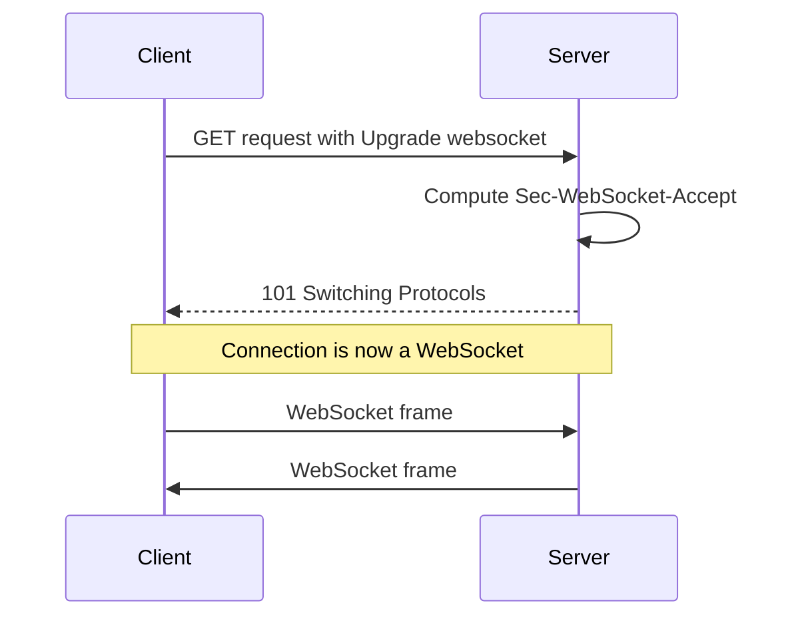
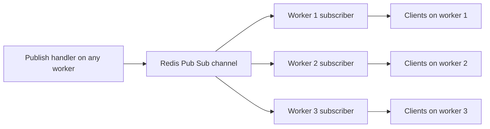

# Lecture 1 — WebSockets: the protocol and the handler

> **Duration:** ~2 hours. **Outcome:** You can describe the WebSocket handshake at the byte level, name the four close codes worth memorising, and write a FastAPI WebSocket handler that accepts connections, exchanges JSON messages, and survives an abrupt client disconnect. You can sketch the connection-manager pattern from memory and name the limit (single worker) that motivates Lecture 1's second half — the Redis Pub/Sub broadcast.

Every endpoint we have written in Weeks 1 through 7 follows the same lifecycle: a TCP connection opens, the client sends one HTTP request, the server returns one HTTP response, the connection (in HTTP/1.1 with `Connection: keep-alive`) is reused for the next *separate* request-response pair. The server never speaks first. The client controls every cycle. The protocol is a strict turn-taking dialogue.

WebSocket breaks that. After the opening handshake — which *is* an HTTP request and an HTTP response — the protocol upgrades to a long-lived, bidirectional, full-duplex channel where either side can send a frame at any time, until either side sends a close frame. This lecture is about that upgrade: what the bytes look like, what the FastAPI handler signature looks like, and the connection-manager pattern that turns the one-handler-one-client model into a one-handler-many-clients model.

## 1. Why WebSocket, not "long polling" or "Comet"

Between 1996 and 2011, the web had three serial attempts at server-initiated push:

1. **Long polling.** The client opens an HTTP request that the server holds open until it has something to say. When the server replies, the client immediately opens another request. Cheap to implement; expensive at scale (every message costs a full HTTP round-trip of headers); fragile across proxies (some idle-time out after 30 seconds, some at 60, some at 100).
2. **"Comet" / HTTP streaming.** The server keeps the HTTP response open and writes more body bytes as new data arrives. The client parses them as they stream in. This is, recognisably, what Server-Sent Events (Lecture 2) eventually standardised. In its pre-SSE form, every implementation had its own framing convention.
3. **Flash / Silverlight sockets.** A browser plug-in opened a real TCP socket to the server. Worked. Required a plug-in. Both technologies have been dead since 2020.

WebSocket — RFC 6455, finalised December 2011 — replaced all three. It uses one TCP connection. The opening handshake is a normal HTTP/1.1 request, so it travels through any HTTP-aware proxy. After the handshake, both sides send framed binary or text messages with negligible per-message overhead (2 to 14 bytes of header per frame, versus several hundred for an HTTP request). The result is a protocol that is genuinely cheap for sustained low-rate traffic — chat, live-cursor positions, log tails, dashboards — and that every browser and every backend language has supported for over a decade.

Read **RFC 6455 §1.2** for the design rationale in the authors' own words: <https://datatracker.ietf.org/doc/html/rfc6455#section-1.2>.

## 2. The opening handshake — what the bytes look like

A WebSocket connection starts with an HTTP/1.1 GET request that asks the server to switch protocols. The client sends:

```text
GET /ws/articles HTTP/1.1
Host: api.crunch.example
Upgrade: websocket
Connection: Upgrade
Sec-WebSocket-Key: dGhlIHNhbXBsZSBub25jZQ==
Sec-WebSocket-Version: 13
Origin: https://crunch.example
```

Four headers do all the work. `Upgrade: websocket` and `Connection: Upgrade` together signal that the client wants the protocol switch; either header alone is ignored. `Sec-WebSocket-Version: 13` declares the only version of the protocol RFC 6455 standardises (versions 1 through 12 were development drafts; production deployments use 13). `Sec-WebSocket-Key` is a base64-encoded 16-byte nonce, generated freshly per connection.

The server's job, per **RFC 6455 §4.2.2**, is to compute the response key. The recipe is exact: take the client's `Sec-WebSocket-Key` value as a string, concatenate the literal GUID `258EAFA5-E914-47DA-95CA-C5AB0DC85B11`, SHA-1-hash the resulting bytes, and base64-encode the 20-byte digest. The result goes into `Sec-WebSocket-Accept`. The server then returns:

```text
HTTP/1.1 101 Switching Protocols
Upgrade: websocket
Connection: Upgrade
Sec-WebSocket-Accept: s3pPLMBiTxaQ9kYGzzhZRbK+xOo=
```

The `101 Switching Protocols` status code is reserved by RFC 9110 §15.2.2 specifically for this kind of upgrade. After the client receives the 101, both sides treat the TCP connection as a WebSocket connection: no more HTTP framing, no more headers, only WebSocket frames.


*The handshake is one HTTP request-response pair; every frame after it flows on the same TCP connection.*

The GUID is *constant*. It is not a secret; it is in the RFC. Its purpose is purely to prevent a non-WebSocket server from accidentally producing a valid-looking response — an old HTTP server that echoes the request back would not happen to include the GUID in its SHA-1. The accept handshake is a *liveness check*, not an authenticator.

You will never type this calculation by hand: every WebSocket library does it for you. But knowing that the value of `Sec-WebSocket-Accept` is mechanically derivable from `Sec-WebSocket-Key` is the difference between "WebSocket is magic" and "WebSocket is a documented byte sequence I could reproduce in `curl` and `openssl dgst -sha1 -binary | base64`".

Try it. Open three terminals:

```bash
# Terminal 1 — start a FastAPI app with a WebSocket endpoint (we write this in §5)
uvicorn ws_app:app --port 8000

# Terminal 2 — observe the handshake with curl
curl --include \
  --no-buffer \
  --header "Connection: Upgrade" \
  --header "Upgrade: websocket" \
  --header "Sec-WebSocket-Key: dGhlIHNhbXBsZSBub25jZQ==" \
  --header "Sec-WebSocket-Version: 13" \
  http://localhost:8000/ws/echo
# You see HTTP/1.1 101 with Sec-WebSocket-Accept and then garbled binary frames

# Terminal 3 — verify the accept value
echo -n "dGhlIHNhbXBsZSBub25jZQ==258EAFA5-E914-47DA-95CA-C5AB0DC85B11" \
  | openssl dgst -sha1 -binary | base64
# s3pPLMBiTxaQ9kYGzzhZRbK+xOo=
```

The Terminal 2 response and the Terminal 3 calculation agree, byte for byte.

## 3. Frames — the wire format

After the handshake, every message in either direction is a *frame*. A frame is a small binary header followed by payload. The header layout is in **RFC 6455 §5.2**; the load-bearing fields are:

- **FIN** (1 bit) — `1` if this is the last fragment of a message; `0` if more fragments follow. Most messages are single-fragment.
- **Opcode** (4 bits) — `0x1` text, `0x2` binary, `0x8` close, `0x9` ping, `0xA` pong, `0x0` continuation. The ones a FastAPI handler actually emits are text and binary; ping/pong are handled by the library; close is handled by `ws.close()`.
- **MASK** (1 bit) — `1` if the payload is XOR-masked with a 4-byte key; `0` if not. **All client-to-server frames must be masked. All server-to-client frames must not be masked.** RFC 6455 §5.3 explains why: it is not for confidentiality (the mask is sent in clear, alongside the masked payload) — it is to prevent a class of *cache-poisoning* attacks on legacy intermediaries that were unaware of WebSocket. A proxy that mistook a masked frame for an HTTP request would see random bytes, not a forgeable HTTP method.
- **Payload length** (7, 7+16, or 7+64 bits) — the variable-length integer encoding the payload size. 0–125 bytes fit in 7 bits; 126–65 535 bytes use 7+16; larger use 7+64.

A 5-byte text message — `"hello"` — from server to client is:

```text
81 05 68 65 6C 6C 6F
```

Seven bytes total: one byte (`0x81` = FIN + opcode text), one byte (`0x05` = unmasked length 5), five bytes of payload. The overhead is two bytes. Compare to an HTTP/1.1 response carrying the same five bytes: ~150 bytes of headers minimum. For a message rate of one hello per second, WebSocket is 75× cheaper *on the wire*. The number rarely matters; the *order of magnitude* always does.

We do not write the frame parser. The `websockets` library or Starlette's `WebSocket` class hides it. You should know the shape because the day you see a frame in a packet capture or a hex dump, you want to recognise it.

## 4. FastAPI's WebSocket handler

FastAPI's WebSocket route is declared with `@app.websocket(path)`, not `@app.get(path)` or any of the other HTTP method decorators. The handler is `async def` (synchronous WebSocket handlers do not exist; the protocol is too async-shaped for that to make sense). The handler receives a `WebSocket` instance and is responsible for calling `await ws.accept()` before any send.

```python
from __future__ import annotations

from fastapi import FastAPI, WebSocket, WebSocketDisconnect

app = FastAPI()


@app.websocket("/ws/echo")
async def echo(ws: WebSocket) -> None:
    await ws.accept()
    try:
        while True:
            text = await ws.receive_text()
            await ws.send_text(f"echo: {text}")
    except WebSocketDisconnect:
        # The client closed the connection. Nothing to send back.
        return
```

Six observations, each load-bearing:

1. **`await ws.accept()`** is what triggers the 101 response. Until you call it, the connection is in handshake-pending state. You can `await ws.close(code=1008)` *before* `accept` to reject a connection with a policy-violation close code without ever upgrading the protocol — the client sees a normal HTTP error.
2. **`await ws.receive_text()`** is the inbound side. Its variants are `receive_text`, `receive_bytes`, `receive_json` (which is just `json.loads(await receive_text())`), and the lower-level `receive` that returns the raw event dict.
3. **`await ws.send_text(...)`** is the outbound side. Its variants are `send_text`, `send_bytes`, `send_json`. There is no "broadcast" or "reply-all"; one `WebSocket` instance corresponds to one client.
4. **`WebSocketDisconnect`** is raised by `receive_*` when the client has closed. It carries `code` and `reason`. You catch it; you do not propagate it; you let the handler return normally.
5. **The handler is `async def`.** Anything synchronous inside it (a `time.sleep`, a blocking DB call) freezes this *and every other* WebSocket on the worker. Rule from Week 7 carries over: synchronous I/O belongs on the `anyio` thread pool or in a background process, never in an async handler.
6. **No `response_model`**, no Pydantic-on-the-way-out. Pydantic is happy to validate inbound JSON (`Article(**(await ws.receive_json()))`) and serialise outbound (`await ws.send_json(article.model_dump())`); FastAPI just does not have a decorator-level integration the way it does for HTTP.

The full FastAPI WebSocket tutorial is at <https://fastapi.tiangolo.com/advanced/websockets/>. The Starlette underlying `WebSocket` class is at <https://www.starlette.io/websockets/>. Skim both before you write code; the surface area is small.

### The four close codes you will actually use

RFC 6455 §7.4 defines the close-code numbering plan. The list is long; the four you will use in practice are:

| Code | Name                | When                                                                   |
|-----:|---------------------|------------------------------------------------------------------------|
| 1000 | Normal closure      | The client is done, no error. The default if you call `ws.close()` without arguments. |
| 1001 | Going away          | The server is shutting down (worker restart). Send before SIGTERM gives the connection 5 seconds to close. |
| 1008 | Policy violation    | The server rejected the connection on policy grounds — most commonly authentication failure. |
| 1011 | Internal error      | The server raised an exception it could not recover from. Avoid by catching everything; report on this if no other code fits. |

Application-specific close codes live in the **3000–3999** range (per RFC 6455 §7.4.2). If your protocol distinguishes "session expired" from "permission revoked" and you want the client to react differently, allocate `3001` and `3002` in your application's own table. Codes **4000–4999** are private — you can use them, but they will collide with whatever the client's library does with them, so do not.

## 5. A connection manager — the process-local broadcast

A WebSocket echo handler talks to one client. A WebSocket *broadcast* handler — "tell every editor that an article was published" — needs to fan a single event out to *every connected* client. The naive way is a process-local registry:

```python
from __future__ import annotations

import asyncio
from typing import Any

from fastapi import FastAPI, WebSocket, WebSocketDisconnect


class ConnectionManager:
    """A process-local registry of accepted WebSocket connections.

    Limit: only the connections accepted on *this* worker are reachable.
    Two workers under uvicorn --workers 2 will each have their own
    ConnectionManager, and broadcasts on one will not reach clients on
    the other. The fix is §6 below: a Redis Pub/Sub broadcaster.
    """

    def __init__(self) -> None:
        self._connections: set[WebSocket] = set()
        self._lock = asyncio.Lock()

    async def connect(self, ws: WebSocket) -> None:
        await ws.accept()
        async with self._lock:
            self._connections.add(ws)

    async def disconnect(self, ws: WebSocket) -> None:
        async with self._lock:
            self._connections.discard(ws)

    async def broadcast(self, payload: dict[str, Any]) -> None:
        # Snapshot under the lock to allow concurrent disconnects.
        async with self._lock:
            connections = list(self._connections)
        # Send outside the lock so a slow client does not block disconnects.
        for ws in connections:
            try:
                await ws.send_json(payload)
            except Exception:
                # The client died mid-send. Let the disconnect path remove it.
                pass


app = FastAPI()
manager = ConnectionManager()


@app.websocket("/ws/articles")
async def articles_feed(ws: WebSocket) -> None:
    await manager.connect(ws)
    try:
        while True:
            # We do not expect inbound messages on this stream, but we
            # await receive to detect the client disconnect.
            await ws.receive_text()
    except WebSocketDisconnect:
        await manager.disconnect(ws)


@app.post("/articles/{article_id}/publish")
async def publish(article_id: int) -> dict[str, str]:
    # ... do the actual publish work ...
    await manager.broadcast({"event": "published", "article_id": article_id})
    return {"status": "ok"}
```

Four things to notice:

1. **The lock guards mutation, not iteration.** We hold the lock only long enough to add, remove, or *copy out* the membership. The actual `send_json` calls happen outside the lock, so one slow client cannot block another client from disconnecting.
2. **Disconnects are best-effort cleanup.** If the `await ws.send_json` fails because the TCP connection is half-open, we swallow the exception. The next `await ws.receive_text` in the handler raises `WebSocketDisconnect`, the manager removes the entry, and we move on.
3. **The `while True: await ws.receive_text()` loop is there to detect disconnect**, not to process inbound messages. For a strictly one-way stream we could replace it with `await ws.wait_disconnect()` (Starlette has this helper in current versions); the receive loop is the older, more portable form.
4. **`/articles/{article_id}/publish` is a normal HTTP handler.** The broadcast call from inside it works because `manager.broadcast` is async and the handler is async. If the handler were synchronous, we would need `anyio.from_thread.run_sync` or a refactor.

This works for one worker. As soon as you scale to `uvicorn --workers 4`, the four processes each have their own `manager` and the publish call from worker 3 reaches only the WebSocket clients connected to worker 3. The other three quarters of your audience hear nothing.

## 6. The broadcast pattern with Redis Pub/Sub

The standard fix is to bus the broadcast through Redis. Every worker subscribes to a Redis channel; when any worker wants to fan out, it `PUBLISH`es to that channel; Redis delivers the message to every subscriber; each subscriber's local `ConnectionManager.broadcast` re-fans-out to its local clients. The pattern is documented in the Redis Pub/Sub docs (<https://redis.io/docs/latest/develop/interact/pubsub/>) and implemented (for reference) in Tom Christie's `broadcaster` library (<https://github.com/encode/broadcaster>).


*Redis fans the publish out to every worker; each worker then re-fans-out to only the clients it holds locally.*

The shape:

```python
from __future__ import annotations

import asyncio
import json
from typing import Any

import redis.asyncio as redis
from fastapi import FastAPI, WebSocket, WebSocketDisconnect


class RedisBroadcaster:
    """A connection manager that fans out via Redis Pub/Sub.

    Each worker process runs one of these. They share state through Redis.
    """

    def __init__(self, url: str, channel: str) -> None:
        self._url = url
        self._channel = channel
        self._connections: set[WebSocket] = set()
        self._lock = asyncio.Lock()
        self._redis: redis.Redis | None = None
        self._pubsub_task: asyncio.Task[None] | None = None

    async def start(self) -> None:
        self._redis = redis.from_url(self._url, decode_responses=True)
        self._pubsub_task = asyncio.create_task(self._pubsub_loop())

    async def stop(self) -> None:
        if self._pubsub_task is not None:
            self._pubsub_task.cancel()
        if self._redis is not None:
            await self._redis.aclose()

    async def _pubsub_loop(self) -> None:
        assert self._redis is not None
        pubsub = self._redis.pubsub()
        await pubsub.subscribe(self._channel)
        try:
            async for message in pubsub.listen():
                if message["type"] != "message":
                    continue
                payload = json.loads(message["data"])
                await self._fanout_local(payload)
        except asyncio.CancelledError:
            await pubsub.unsubscribe(self._channel)
            raise

    async def _fanout_local(self, payload: dict[str, Any]) -> None:
        async with self._lock:
            connections = list(self._connections)
        for ws in connections:
            try:
                await ws.send_json(payload)
            except Exception:
                pass

    async def connect(self, ws: WebSocket) -> None:
        await ws.accept()
        async with self._lock:
            self._connections.add(ws)

    async def disconnect(self, ws: WebSocket) -> None:
        async with self._lock:
            self._connections.discard(ws)

    async def publish(self, payload: dict[str, Any]) -> None:
        assert self._redis is not None
        await self._redis.publish(self._channel, json.dumps(payload))
```

The wiring into FastAPI uses the `lifespan` context manager from Week 7:

```python
from contextlib import asynccontextmanager
from collections.abc import AsyncIterator

broadcaster = RedisBroadcaster("redis://localhost:6379/0", "articles")


@asynccontextmanager
async def lifespan(app: FastAPI) -> AsyncIterator[None]:
    await broadcaster.start()
    try:
        yield
    finally:
        await broadcaster.stop()


app = FastAPI(lifespan=lifespan)
```

Three properties worth noting:

1. **Every worker subscribes on startup.** When the second worker boots, Redis sees a new SUBSCRIBE on the same channel; from then on, every PUBLISH is delivered to both. Redis Pub/Sub fans out at the broker; the workers do not coordinate.
2. **There is no persistence.** Pub/Sub is fire-and-forget. A worker that is down at the moment of the PUBLISH misses the message forever. If "guaranteed delivery to every worker, even ones currently restarting" is a requirement, you need Redis Streams or a Kafka-shaped broker, not Pub/Sub. Most chat-style workloads — where missing one update during a 2-second restart is acceptable — are fine with Pub/Sub.
3. **The HTTP publish handler stays simple.** A `POST /articles/{id}/publish` calls `await broadcaster.publish(...)`. The local fan-out happens via the Redis loop; the worker that received the HTTP request is *also* a subscriber, so its own connected clients hear the message via the round-trip through Redis. This makes the code symmetric — no special-casing the local worker — at the cost of one Redis RTT per broadcast.

Challenge 1 this week makes you write the broadcaster. The full FastAPI WebSocket tutorial has a smaller, non-Redis version of the connection manager: <https://fastapi.tiangolo.com/advanced/websockets/#handling-disconnections-and-multiple-clients>.

## 7. Authentication on a WebSocket

The HTTP authentication primitives we wired in Week 7 — the `Authorization: Bearer ...` header — work on the WebSocket *handshake request*. The handshake is HTTP. The token is in the headers like any other request. You can extract it inside a FastAPI dependency:

```python
from __future__ import annotations

from fastapi import Depends, WebSocket, WebSocketException, status


async def ws_current_user(ws: WebSocket) -> dict[str, str]:
    token = ws.headers.get("authorization", "").removeprefix("Bearer ").strip()
    if not token or not _token_valid(token):
        raise WebSocketException(code=status.WS_1008_POLICY_VIOLATION)
    return _user_from_token(token)


def _token_valid(token: str) -> bool:
    return token == "test-token"


def _user_from_token(token: str) -> dict[str, str]:
    return {"id": "u-1", "name": "Demo"}


@app.websocket("/ws/articles")
async def articles_feed(
    ws: WebSocket,
    user: dict[str, str] = Depends(ws_current_user),
) -> None:
    await manager.connect(ws)
    ...
```

`WebSocketException(code=1008)` rejects the handshake — the client sees a clean HTTP response, no protocol upgrade — without leaking *why*. Three other places people put WebSocket tokens, and why each has trade-offs:

- **Query parameter** (`/ws/articles?token=...`). Works, no header needed, but the token appears in the access log and the URL bar. Acceptable for short-lived tokens; bad for the bearer JWTs we issue in Week 9.
- **Cookie** (`Cookie: session=...`). Works in the browser without JS configuration. Vulnerable to CSRF unless `SameSite` is set. The choice for in-browser-only apps; awkward for native clients.
- **Subprotocol** (`Sec-WebSocket-Protocol: bearer.token.value`). The standardised channel for protocol-version negotiation; bending it to carry an auth token is a community pattern documented in the WebSocket WG's mailing list. Works; obscure.

For this week we use the `Authorization` header. Week 9 revisits this when we issue JWTs.

## 8. Heartbeats and the silent-disconnect problem

TCP has no built-in liveness check on the application's timescale. A connection that has not exchanged data for an hour can be in any of three states the kernel cannot distinguish: alive and idle, alive and the peer's NIC died, alive and a stateful firewall in the middle dropped the entry from its table. The first state is fine; the second and third look the same from the kernel's `recv()` — `recv` blocks until the next byte that may never come.

WebSocket's answer is the ping/pong frames (opcodes `0x9` and `0xA`). The server periodically sends a ping; the client must respond with a pong within a configurable timeout; if it does not, the server closes the connection with code `1011` or `1001`. Starlette / FastAPI does not enable this automatically. You either run with `uvicorn --ws-ping-interval 20 --ws-ping-timeout 10` (the recommended defaults), or you implement a heartbeat at the application layer (an empty JSON message every 30 seconds).

The number to memorise: **Cloudflare closes idle WebSocket connections at 100 seconds**. Most cloud load balancers close at 60 to 300 seconds. A `--ws-ping-interval 20` is comfortably under all of them and costs effectively nothing per connection.

## 9. When *not* to use WebSocket

WebSocket is a great answer to a workload that genuinely needs bidirectional, low-latency, sustained communication. It is the wrong answer when:

- **The traffic is one-way (server-to-client only).** A live progress bar, a tail of a log file, a stock-ticker stream — none of them need the client side of the WebSocket. SSE (Lecture 2) is simpler, plays nicer with proxies, and reconnects automatically.
- **The message rate is low (< 1 per minute) and bursty.** Long polling or a plain HTTP poll every 30 seconds is operationally simpler and consumes less server resource than 10 000 idle WebSocket connections.
- **The clients are short-lived (page open for ~30 seconds).** The handshake overhead dominates; a plain HTTP request is cheaper.
- **The deployment runs through a proxy that does not understand `Upgrade: websocket`.** This is a small list in 2026 (Cloudflare, Nginx, HAProxy, Envoy, AWS ALB all support it correctly), but old corporate proxies and some content-delivery networks still strip the `Upgrade` header. SSE goes through every HTTP proxy unmodified.

The exam question "should this be WebSocket or SSE?" is the topic of Lecture 2. Until then, you should be comfortable enough with the WebSocket *implementation* — the handshake, the framing, the FastAPI handler shape, the manager pattern, the Redis broadcast — to write one when it is the right answer.

## 10. The seven-bullet summary

1. WebSocket upgrades an HTTP/1.1 connection via `Upgrade: websocket` + `Connection: Upgrade` + `Sec-WebSocket-Key` + `Sec-WebSocket-Version: 13`; the server replies `101 Switching Protocols` with `Sec-WebSocket-Accept`.
2. The `Sec-WebSocket-Accept` value is `base64(sha1(client_key + "258EAFA5-E914-47DA-95CA-C5AB0DC85B11"))`. Mechanical. Verifiable with `openssl dgst -sha1`.
3. Frames carry 2 to 14 bytes of header; client-to-server frames are always XOR-masked, server-to-client frames are never masked. The masking is not for confidentiality — it is for legacy proxy safety.
4. FastAPI handlers are `@app.websocket("/path")` over `async def(ws: WebSocket) -> None`. Call `await ws.accept()` before any send. Catch `WebSocketDisconnect` and return.
5. The four useful close codes: 1000 normal, 1001 going away, 1008 policy violation (auth fail), 1011 internal error. Application codes live in 3000–3999.
6. The process-local `ConnectionManager` pattern handles one worker. The Redis Pub/Sub broadcaster handles many. Use the `lifespan` context manager to start and stop the subscriber loop.
7. Heartbeats are not optional: configure `uvicorn --ws-ping-interval 20 --ws-ping-timeout 10`, or send an application-level keepalive every 30 seconds, or your idle connections die at the cloud load balancer.

## Reading for next time

Before Lecture 2:

- The HTML living standard's [Server-Sent Events section](https://html.spec.whatwg.org/multipage/server-sent-events.html). Two pages.
- The MDN page on [Using Server-Sent Events](https://developer.mozilla.org/en-US/docs/Web/API/Server-sent_events/Using_server-sent_events). One page.
- The Starlette docs on [`StreamingResponse`](https://www.starlette.io/responses/#streamingresponse). One paragraph plus a code block.

Lecture 2 builds the SSE endpoint and the WS-vs-SSE decision. Lecture 3 builds the ARQ worker that the SSE endpoint streams from. The mini-project is the integration.
