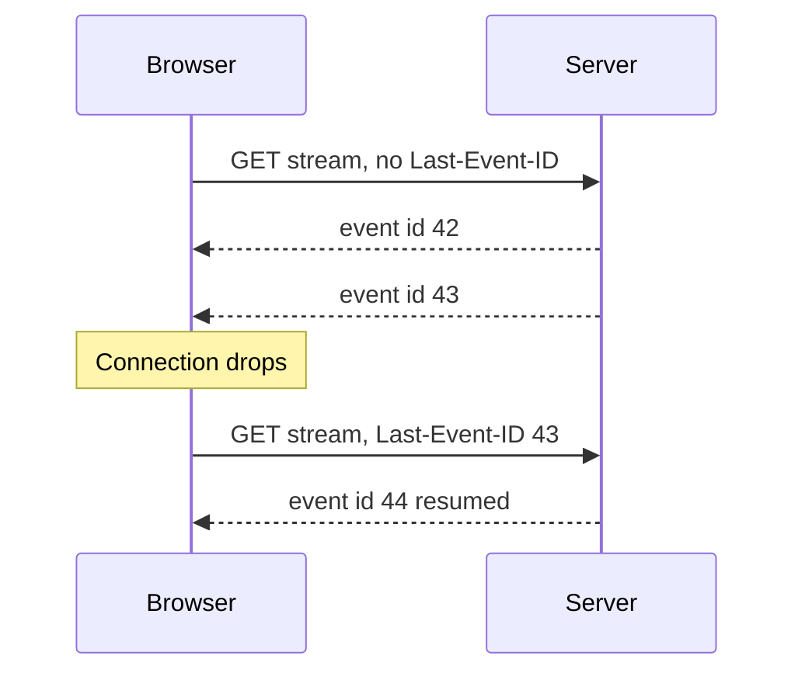
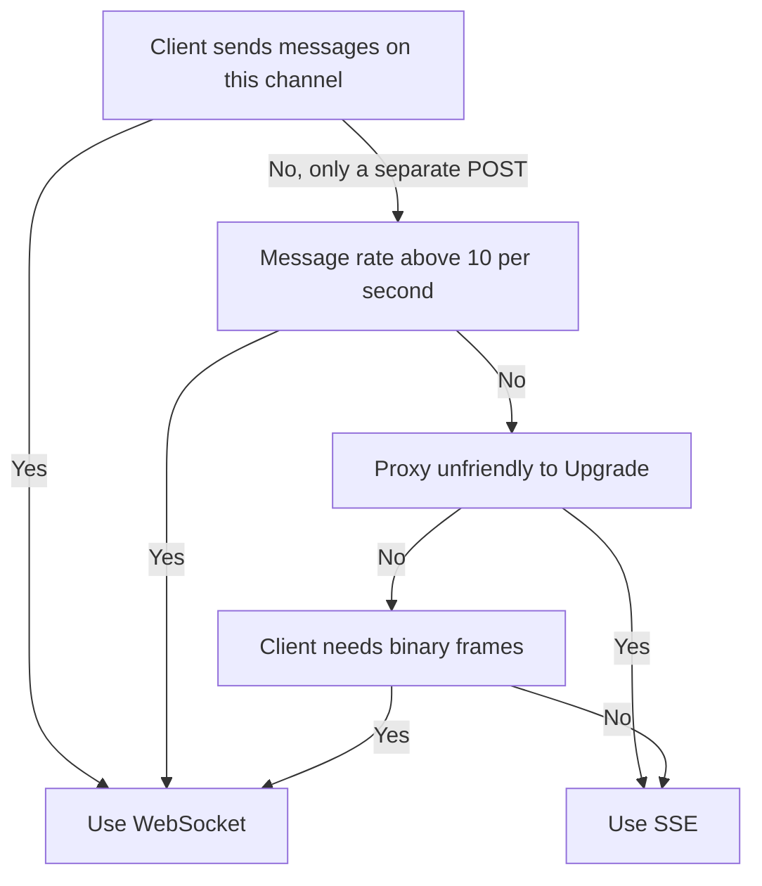

# Lecture 2 — Server-Sent Events and when to pick them

> **Duration:** ~2 hours. **Outcome:** You can sketch the SSE wire format from memory, write a FastAPI SSE endpoint with a `StreamingResponse`, consume it with five lines of browser JavaScript, and defend the choice of SSE over WebSocket for one-way streams in a code review. You know what `Last-Event-ID` does and what `retry:` controls. You can recite the four lines of Nginx config that keep an SSE stream from being buffered into uselessness.

Lecture 1 built a WebSocket endpoint and the connection manager behind it. WebSocket is the right tool when the traffic is genuinely bidirectional — chat, collaborative editing, live cursors. This lecture covers the other half of the long-lived-connection story: **Server-Sent Events**, the technology that solves the *one-way* version of the same problem with about a tenth of the moving parts. SSE is older than WebSocket (the SSE pattern goes back to the late-2000s Comet streaming hacks), simpler (it is plain HTTP), and easier to operate (it survives every proxy, debugger, and corporate firewall that already passes HTTP).

The discipline this lecture installs: **default to SSE for one-way streams; escalate to WebSocket only when the client genuinely needs to talk back.** Most teams default the other way, end up with a WebSocket where SSE would have done, and pay the operational cost every time the load balancer is touched.

## 1. The shape of the protocol

Server-Sent Events is documented in the [HTML living standard, §9.2.6 Server-Sent Events](https://html.spec.whatwg.org/multipage/server-sent-events.html). The protocol is two lines of description:

> The server sends a single HTTP response with `Content-Type: text/event-stream` and keeps the response body open. The body is a sequence of text frames, each framed by a blank line.

That is it. There is no framing in the WebSocket sense, no opcodes, no length fields, no masking. The body is UTF-8 text. The browser parses it line by line.

A frame is a sequence of field lines (`name: value`) followed by a blank line. Four field names are defined by the spec:

- **`event:`** — names the event type. If absent, the event type is `"message"` and the browser dispatches it on `EventSource.onmessage`. If present, the event must be subscribed to with `eventSource.addEventListener("name", ...)`.
- **`data:`** — the payload. Multiple `data:` lines in one frame concatenate with newlines. The browser passes them to your handler as a single string in `event.data`.
- **`id:`** — the last-event-ID. The browser remembers it; on reconnect it sends it back as the `Last-Event-ID` header so the server can resume from where it left off.
- **`retry:`** — milliseconds the browser should wait before reconnecting after a disconnect. Default is implementation-defined (Chrome and Firefox use ~3 seconds). The server can adjust by sending `retry: 10000`.

A minimal SSE response body — three events of types "ping", "progress", and "done":

```text
event: ping
data: {"t": 0}

event: progress
id: 42
data: {"done": 12, "total": 100}

event: done
id: 43
data: {"result": "ok"}

```

Note the trailing blank line after the last event: it terminates that event. Any subsequent bytes start the next event. To keep the connection open without sending an event, send a comment line — a line beginning with `:`:

```text
: heartbeat
```

The browser silently ignores it. This is the SSE equivalent of a WebSocket ping: send one every ~15 seconds and proxies stop closing your connection.

There is no client-to-server channel in SSE. If the client needs to talk back, it makes a separate HTTP request. This is the protocol's defining limitation and its defining feature: the asymmetry buys simplicity. The client API is five lines.

## 2. The five-line client

The browser API for SSE is `EventSource`. The full read-only event-stream consumer:

```javascript
const es = new EventSource("/sse/jobs/job-123");
es.addEventListener("progress", (ev) => {
  const { done, total } = JSON.parse(ev.data);
  document.querySelector("#bar").style.width = `${(100 * done) / total}%`;
});
es.addEventListener("done", () => es.close());
```

That is the entire client side. Compare to the WebSocket equivalent — `new WebSocket(...)` plus an `onmessage` handler that has to demultiplex its own event types out of a single `message` event, plus an `onclose` handler that has to decide whether to reconnect, plus the reconnection logic itself — and the asymmetry of effort is visible.

`EventSource` has four `readyState` values: `CONNECTING (0)`, `OPEN (1)`, `CLOSED (2)`. The browser reconnects automatically when the connection drops. On reconnection it sends a `Last-Event-ID: <last-seen-id>` header, so a well-written server can resume the stream without re-sending events the client has already acknowledged.

The full MDN reference: <https://developer.mozilla.org/en-US/docs/Web/API/EventSource>.

One important footnote: `EventSource` does **not** let you set custom headers. The token you used in Week 7's HTTP routes cannot be added as an `Authorization` header on an `EventSource` request. The four canonical workarounds are:

1. **Cookie auth.** The browser sends cookies on the request, including SSE. This works in same-origin deployments and is the most idiomatic. Watch `SameSite`.
2. **Query parameter.** `new EventSource("/sse/jobs/123?token=abc")`. The token appears in access logs and the URL bar. Use only for short-lived, one-time-use tokens.
3. **A short-lived ticket.** The browser calls `POST /sse-tickets` over normal HTTPS with the proper auth header, receives a 60-second one-time ticket, then opens `new EventSource("/sse/jobs/123?ticket=...")`. The ticket is consumed on use.
4. **The `eventsource` polyfill** (e.g. `event-source-polyfill` on npm) — supports custom headers because it does the work in JavaScript instead of using the native API. Adds 4 KB to the bundle.

We use option 3 in the mini-project. It is the cleanest answer for any service that already issues Bearer tokens on the JSON API.

## 3. The FastAPI SSE endpoint

FastAPI delegates the streaming to Starlette's `StreamingResponse`. The body is an async generator that yields `bytes` chunks (or strings, which are encoded as UTF-8). The headers must include `Content-Type: text/event-stream`; we also set `Cache-Control: no-cache` (browsers and proxies should never cache an event stream) and `X-Accel-Buffering: no` (a Cloudflare/Nginx hint to disable proxy buffering).

```python
from __future__ import annotations

import asyncio
from collections.abc import AsyncIterator

from fastapi import FastAPI
from starlette.responses import StreamingResponse

app = FastAPI()


async def event_generator() -> AsyncIterator[bytes]:
    yield b": opening stream\n\n"
    for i in range(1, 6):
        await asyncio.sleep(1)
        frame = f"event: progress\nid: {i}\ndata: {{\"i\": {i}}}\n\n"
        yield frame.encode("utf-8")
    yield b"event: done\ndata: {}\n\n"


@app.get("/sse/demo")
async def sse_demo() -> StreamingResponse:
    return StreamingResponse(
        event_generator(),
        media_type="text/event-stream",
        headers={
            "Cache-Control": "no-cache",
            "X-Accel-Buffering": "no",
            "Connection": "keep-alive",
        },
    )
```

Eight observations:

1. **The handler is an `async def` HTTP handler**, not a special decorator. SSE *is* an HTTP response. FastAPI does not need a new route shape for it.
2. **The generator yields bytes, with `\n\n` terminators on every frame.** Forgetting the second `\n` is the most common mistake: the browser does not dispatch the event until it sees the blank line.
3. **The `: opening stream` comment** is a "the stream is alive" signal that fires immediately, before any real event. Some proxies hold a response open until the first body chunk arrives; the comment forces that to happen at connect time.
4. **Heartbeats**: insert `yield b": heartbeat\n\n"` every ~15 seconds. The exercise has a worked version using `asyncio.wait_for` to interleave heartbeats with real events.
5. **The `id:` field is set per event.** On reconnect, the browser sends `Last-Event-ID: <last-seen>`; the server reads it from `request.headers["last-event-id"]` and resumes.
6. **No `response_model`.** The streaming generator produces raw bytes; Pydantic does not participate. You serialise with `json.dumps(...)` inside the generator.
7. **Cleanup on client disconnect.** Starlette signals client disconnect by *cancelling the async task running the generator*. Wrap any teardown in `try / finally` inside the generator.
8. **No `Content-Length`.** A streaming response is `Transfer-Encoding: chunked` (HTTP/1.1) or HTTP/2 streaming frames; the length is unknown at response start.

A more honest production version uses `sse-starlette` (<https://github.com/sysid/sse-starlette>), which wraps the heartbeat and the disconnect-detection logic for you:

```python
from sse_starlette.sse import EventSourceResponse


@app.get("/sse/demo")
async def sse_demo() -> EventSourceResponse:
    async def gen() -> AsyncIterator[dict[str, str]]:
        for i in range(1, 6):
            await asyncio.sleep(1)
            yield {"event": "progress", "id": str(i), "data": f'{{"i": {i}}}'}

    return EventSourceResponse(gen(), ping=15)
```

`sse-starlette` handles the framing, the heartbeats, and the disconnect detection. It is what the mini-project uses. The hand-rolled `StreamingResponse` version above is shown so you can recognise what the library is doing for you.

## 4. Resuming with `Last-Event-ID`

SSE's reconnection story is the one place where the protocol genuinely earns its weight. When the browser drops the connection — Wi-Fi flap, laptop sleep, proxy close — it waits `retry` milliseconds and reconnects to the same URL, sending `Last-Event-ID: <last-id-it-saw>` as a request header. A well-written server uses that header to skip events the client has already acknowledged:


*The next request after a drop carries the last id seen, so the server can resume without replaying old events.*

```python
from fastapi import Request


@app.get("/sse/jobs/{job_id}")
async def job_stream(job_id: str, request: Request) -> StreamingResponse:
    last_event_id = request.headers.get("last-event-id")
    start_from = int(last_event_id) + 1 if last_event_id else 0

    async def gen() -> AsyncIterator[bytes]:
        async for event in iter_events_for_job(job_id, start_from):
            frame = f"id: {event.id}\nevent: {event.type}\ndata: {event.json}\n\n"
            yield frame.encode("utf-8")

    return StreamingResponse(gen(), media_type="text/event-stream")


async def iter_events_for_job(job_id: str, start: int) -> AsyncIterator[object]:
    # Backed by a Redis Stream, a Postgres LISTEN/NOTIFY channel, or
    # the in-memory log of a single-worker dev deployment.
    if False:
        yield None
```

Three constraints make this work:

- **Event IDs must be monotonically increasing per stream.** Reusing IDs across streams is fine; reusing within a stream defeats resume.
- **The server must retain enough history to resume.** If the client was offline for an hour and the in-memory queue is 10 minutes deep, the server resumes from the oldest event it has and accepts that the client missed some. For payment events you would persist; for progress bars you accept the gap.
- **The client opens the *same URL* on reconnect.** The browser does this automatically; you do not need to write reconnection logic on the JavaScript side.

`Last-Event-ID` is *transactional* in the HTTP sense: the client acknowledges receipt by *not asking for that ID again*. There is no separate ACK protocol. The next request *is* the ACK.

## 5. SSE versus WebSocket — the actual decision matrix

A row-by-row comparison for the real questions:

| Question                                                  | SSE                          | WebSocket                       |
|-----------------------------------------------------------|------------------------------|---------------------------------|
| Server can push?                                          | Yes                          | Yes                             |
| Client can push?                                          | No (use a separate POST)     | Yes                             |
| Plain HTTP?                                               | Yes                          | After 101 upgrade, no           |
| Survives an HTTP-only proxy?                              | Yes                          | Only if proxy understands `Upgrade` |
| Automatic reconnect?                                      | Yes (browser-built-in)       | No (you write it)               |
| Resume from disconnect?                                   | Yes (`Last-Event-ID`)         | No (you design it)              |
| Custom headers from `EventSource`?                        | No                           | Yes (any header on the handshake) |
| Binary frames?                                             | No (UTF-8 text only)         | Yes                             |
| Compression on by default?                                 | Whatever HTTP gives you      | `permessage-deflate` extension  |
| Per-message overhead                                       | ~10 bytes                    | ~2-14 bytes                     |
| Browser support (2025)                                     | Universal except IE          | Universal                       |
| Server-side: what FastAPI gives you                        | `StreamingResponse` / `sse-starlette` | `@app.websocket`           |
| Mental model                                              | "An HTTP response that never ends" | "A persistent socket"      |
| Debugging                                                  | `curl --no-buffer` reads it raw | Browser DevTools or `wscat`  |

The decision rule that holds up under most operator scrutiny:

1. **Is the client genuinely going to send messages on this channel?** If yes, WebSocket. If "client sends a message" means "client makes a separate REST POST", that is not bidirectional traffic — that is two unidirectional channels glued together, and you should use SSE for the server-to-client side and a normal POST for the client-to-server side.
2. **Is the message rate above ~10/second sustained?** WebSocket has lower per-message overhead, so it wins on bandwidth at high rates. Most SSE traffic is < 1/second; the difference does not show up in the bill.
3. **Is the deployment going through an unfamiliar proxy?** SSE goes through anything that speaks HTTP. WebSocket needs `Upgrade` support. The number of HTTP proxies that mishandle `Upgrade` in 2025 is small but non-zero.
4. **Does the client need to send binary?** WebSocket. SSE is text only.


*Walking the four questions in order lands on SSE for almost every one-way streaming case.*

For a "live job progress bar" — the mini-project's headline use case — every answer points to SSE. The job runner streams events one way; the client never needs to send anything back; the message rate is < 1/second; we want it to work behind every load balancer in every customer's deployment; the payload is JSON, not binary.

## 6. The operational gotchas

SSE is simpler than WebSocket but it has its own operational sharp edges. Three you will hit in production:

### 6.1. Proxy buffering

Some HTTP proxies (Nginx is the classic, plus a few content-delivery networks) buffer HTTP response bodies for performance — they wait for a few kilobytes to accumulate before sending them downstream. This destroys SSE: events arrive late or in batches. The fix is a header the proxy reads and respects:

```text
X-Accel-Buffering: no
```

Nginx documents this in <https://nginx.org/en/docs/http/ngx_http_proxy_module.html#proxy_buffering>; Cloudflare honours the same header. The same configuration on the proxy side:

```text
location /sse/ {
    proxy_buffering off;
    proxy_cache off;
    proxy_http_version 1.1;
    proxy_set_header Connection "";
}
```

The four lines are: turn buffering off, turn caching off, force HTTP/1.1 (some HTTP/2 proxies do not stream cleanly), clear `Connection` so Nginx does not add a `close` token.

### 6.2. The Chrome 6-stream limit per domain

Browsers cap the number of concurrent connections per origin. Chrome's cap on HTTP/1.1 is six. Every open `EventSource` counts. If a user has six tabs open on the same domain, each with an SSE stream, the seventh tab will not connect. The cure is HTTP/2: under HTTP/2 the cap is on streams within one connection, and 100 concurrent streams is the default. Run SSE behind a TLS-terminating proxy that speaks HTTP/2 to the browser.

This limit is a real bug in production. Users with admin dashboards open in multiple tabs report "the dashboard stopped updating in one tab"; the fix is HTTP/2.

### 6.3. The 100-second cloud load balancer timeout

This number is from Lecture 1 but applies equally to SSE. Cloudflare closes idle connections at 100 seconds; most cloud load balancers close at 60-300 seconds. An SSE stream that sends one event every five minutes will be killed at 100 seconds and your reconnection logic will kick in, leaving you with one continuous-looking stream that is actually 50 reconnects per hour.

The fix is the heartbeat from §3: send a `: heartbeat\n\n` comment every 15 seconds. The client ignores it. The proxy sees a live connection. The bill stays flat.

## 7. Auth, revisited

`EventSource` cannot set headers. The four workarounds were listed in §2. The mini-project uses option 3 — the short-lived ticket. The protocol:

1. Client calls `POST /sse-tickets` with `Authorization: Bearer <jwt>`. Server validates the JWT (Week 9), mints a 60-second one-use ticket, returns `{"ticket": "..."}`. The ticket is a random opaque string stored in Redis with a TTL of 60 seconds.
2. Client opens `new EventSource("/sse/jobs/123?ticket=...")`. Server reads the ticket from the query string, looks it up in Redis with `GETDEL` (atomic get-and-delete), and on hit treats the connection as authenticated for the user the ticket was issued to. On miss, returns `401` and the `EventSource` errors immediately.
3. The connection runs as long as the user keeps the tab open; the ticket is irrelevant after step 2.

This pattern is the one most production SSE systems converge on. It is documented (informally) in countless blog posts; the variant we use is the cleanest small version.

## 8. Testing an SSE endpoint

`httpx.AsyncClient.stream` is the test-time consumer:

```python
import httpx
import pytest
from httpx import ASGITransport


@pytest.mark.asyncio
async def test_sse_emits_progress_and_done() -> None:
    transport = ASGITransport(app=app)
    async with httpx.AsyncClient(
        transport=transport, base_url="http://test"
    ) as client:
        async with client.stream("GET", "/sse/demo") as response:
            assert response.status_code == 200
            assert response.headers["content-type"].startswith("text/event-stream")
            frames: list[str] = []
            async for chunk in response.aiter_text():
                frames.append(chunk)
                if "event: done" in chunk:
                    break
            full = "".join(frames)
            assert "event: progress" in full
            assert "event: done" in full
```

Three points:

1. **`client.stream` returns an async context manager.** Inside it, iterate over `aiter_text` (or `aiter_bytes`). The body is *not* one big string; it is the chunks as they arrive.
2. **Break out when you have seen enough.** The generator on the server side will keep running until the client disconnects; the test should disconnect early by leaving the `async with` block.
3. **Parsing the framing is your test's job.** The test above does substring matching; a fuller version splits on `\n\n` and asserts on the field values.

For the mini-project's tests, we use a small `parse_sse_frames(text: str) -> list[dict]` helper. The exercise SOLUTIONS.md ships one.

## 9. SSE on Python — the framework picture

FastAPI is a happy host for SSE; Django (until 5.0) was not, because Django's view system assumed a finite response. Django 4.2's `StreamingHttpResponse` plus an async view does work, but the integration is rougher than FastAPI's. Flask 3.x can do it via `Response` with a generator; the ergonomics are similar to FastAPI's hand-rolled version in §3. AIOHTTP and Starlette are first-class.

The cross-language version: SSE works in every backend that can keep an HTTP response open. Java's Spring WebFlux, .NET's `IAsyncEnumerable<ServerSentEvent>`, Node's `res.write(...)` — every backend has a one-page recipe. The point of SSE is that the *protocol* is portable; you are not buying into a stack.

## 10. The seven-bullet summary

1. SSE is `Content-Type: text/event-stream` on a normal HTTP response, kept open. Events are field lines (`event:`, `data:`, `id:`, `retry:`) followed by a blank line.
2. The browser client is five lines: `new EventSource(url)`, two `addEventListener` calls, an `.close()`. Reconnects on its own. Resumes with `Last-Event-ID`.
3. FastAPI's SSE is `StreamingResponse` over an async generator yielding bytes, with `media_type="text/event-stream"` and `Cache-Control: no-cache`. Or `sse-starlette`, which wraps the heartbeat and disconnect logic.
4. Pick SSE over WebSocket when the traffic is one-way, the message rate is below ~10/second, and you want every HTTP proxy in the world to leave it alone. Pick WebSocket when the client genuinely needs to send messages on the same channel.
5. Heartbeats are mandatory in production: a `: comment\n\n` every 15 seconds keeps the stream alive past every cloud load balancer's idle timeout.
6. Authentication uses a short-lived ticket (POST for the ticket, query string for the `EventSource`), because `EventSource` cannot set custom headers.
7. The two operational gotchas: proxy buffering (add `X-Accel-Buffering: no`) and the Chrome six-stream-per-origin cap (use HTTP/2 to lift it to 100).

## Reading for next time

Before Lecture 3:

- The ARQ documentation, from the top: <https://arq-docs.helpmanual.io/>. Read end to end; it is short.
- The Celery user guide on tasks: <https://docs.celeryq.dev/en/stable/userguide/tasks.html>. Skim.
- The RQ home page: <https://python-rq.org/>. One page; you will recognise the shape.

Lecture 3 walks the job-runner anatomy, picks ARQ as the headline, and explains the exact circumstances under which you would reach for Celery instead. The mini-project ties SSE (this lecture) to ARQ (next lecture): the FastAPI app accepts a request, enqueues a job on ARQ, returns 202 with a stream URL, and streams progress to the browser over SSE while the ARQ worker does the work.
