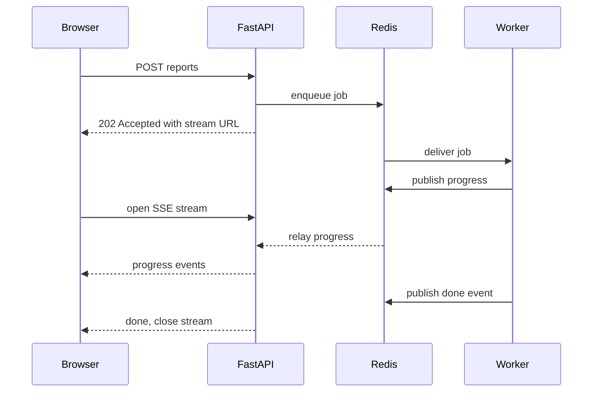

# Lecture 3 — Background jobs: ARQ, Celery, RQ

> **Duration:** ~2 hours. **Outcome:** You can name the four parts of every job-runner architecture (broker, worker, result backend, scheduler), write an ARQ worker and enqueue from FastAPI, defend the choice of ARQ over Celery on a small async-native service, and name the four conditions under which Celery's surface area is genuinely justified. You can wire an ARQ task to publish progress through a Redis Pub/Sub channel that a FastAPI SSE endpoint relays to the browser.

A FastAPI route that takes 60 seconds to respond is a bug. So is a route that takes 10 seconds. The cut-off where it becomes a bug is operator-defined, but it falls somewhere between 100 ms (your user notices) and 2 seconds (your user gives up). Past that threshold, the work belongs *off* the request thread — handed to a worker pool whose lifetime is independent of any one HTTP exchange, with a different scaling story, a different failure model, and a different observability surface.

This lecture is about that worker pool. The Python ecosystem has three healthy answers — **ARQ**, **Celery**, **RQ** — and a few less-healthy ones (Dramatiq, Huey, RPyQueue). The three healthy ones map cleanly to three project profiles, and "which one to pick" is the kind of decision a senior backend engineer is expected to defend in writing. We pick ARQ this week because it is the closest match to the async-FastAPI shape we are already working in; we cover Celery in enough depth to know when to escalate to it; we cover RQ because it remains the most boringly reliable option in the Python ecosystem and you will see it in older Flask and Django services.

## 1. The four-part anatomy

Every job-runner — Python, Ruby, Node, Java — has the same four parts. Naming them gives you a vocabulary to compare implementations:

1. **The broker.** The middle layer that holds jobs between enqueue and execution. Redis, RabbitMQ, Postgres, SQS, in-memory. The broker is the one thing your application talks to from both the "enqueue" side and the "consume" side.
2. **The worker.** A separate process (or pool of them) that consumes from the broker, runs the task code, and reports the result. The worker is *not* the same process as the FastAPI app; this is the whole point.
3. **The result backend.** Where the worker writes the result so the producer can read it. Often the same Redis instance as the broker; sometimes a Postgres table; sometimes "nowhere" (fire-and-forget tasks have no result).
4. **The scheduler.** A separate process (or a built-in feature of the worker) that enqueues tasks on a clock — every Monday at 3am, every five minutes, every first of the month. Celery has `celery beat`; ARQ has the `@cron` decorator inside the worker; RQ has `rq-scheduler` as a separate package.

Different runners answer these four questions differently:

| Question                | ARQ                | Celery                                | RQ                |
|-------------------------|--------------------|---------------------------------------|-------------------|
| Broker                  | Redis only         | Redis, RabbitMQ, SQS, Kafka, …        | Redis only        |
| Worker concurrency      | Async (asyncio)    | Prefork (default), threads, gevent, eventlet, solo | Fork-per-job (default) |
| Result backend          | Redis (or none)    | Many (Redis, DB, S3, Memcached)       | Redis             |
| Scheduler               | `@cron` (in-worker)| `celery beat` (separate process)      | `rq-scheduler` (separate package) |
| Source size             | ~1 500 lines        | ~60 000 lines across the org           | ~5 000 lines       |
| First released          | 2018                | 2009                                   | 2012               |
| Active maintenance (2025)| Yes                | Yes                                    | Yes                |
| Documentation quality   | Sparse but accurate | Excellent and extensive                | Excellent           |
| Async support           | Native              | Via gevent/eventlet pool (adapter)     | None (sync only)    |

The picture in one sentence: **Celery is the powerful one, RQ is the simple one, ARQ is the async one.** All three are free, all three are open source, all three have active maintenance in 2025.

## 2. The path the work travels — by hand

Independent of library, the path a task takes through the system is:

1. The HTTP request handler in FastAPI receives a `POST /reports`. It validates the body via Pydantic.
2. The handler computes a `job_id` (UUID v4) and enqueues a payload — `{"job_id": "...", "kind": "report_export", "params": {...}}` — onto the broker. The broker stores it. The handler does not wait for it to execute.
3. The handler returns `202 Accepted` with a body containing the `job_id` and a `Location: /sse/jobs/{job_id}` header per RFC 9110 §15.3.3.
4. A separate worker process, polling the broker, sees the new job. It runs the task code. As the task runs, it publishes progress events to a Redis Pub/Sub channel keyed by `job_id`.
5. The browser, on receiving the 202, opens `new EventSource("/sse/jobs/{job_id}")`. The SSE endpoint in FastAPI subscribes to the Redis channel for `job_id` and relays every event to the open response.
6. The worker finishes (success or failure), writes the result to the result backend, publishes a final `done` event to Redis, and acknowledges the broker.
7. The browser receives the `done` event, calls `eventSource.close()`, and may issue a follow-up `GET /reports/{job_id}` to retrieve the persisted result.

Seven steps; four moving parts (FastAPI process, ARQ worker, Redis broker/pubsub, browser); one HTTP/SSE channel for the user and one Redis-internal channel for the workers. The architecture diagram is small enough to draw on a napkin and large enough to fail in interesting ways. The mini-project builds exactly this.


*The request thread only enqueues and streams; the worker does the actual job on its own process and timeline.*

## 3. ARQ — the headline

[ARQ](https://arq-docs.helpmanual.io/) is small enough to read. The whole library is about 1 500 lines of Python. Its operating assumption: you are an async-native FastAPI/Starlette application, your broker is Redis, and you do not want to learn a framework for the privilege of running background work.

### 3.1 The worker definition

```python
from __future__ import annotations

from typing import Any

from arq.connections import RedisSettings


async def report_export(ctx: dict[str, Any], report_id: str) -> dict[str, str]:
    """Render the report identified by report_id and write it to disk."""
    redis = ctx["redis"]
    channel = f"job-progress:{report_id}"
    for step in range(1, 6):
        await redis.publish(
            channel,
            f'{{"step": {step}, "of": 5}}',
        )
    return {"status": "ok", "report_id": report_id}


class WorkerSettings:
    """ARQ workers are configured by a class with these attributes."""

    functions = [report_export]
    redis_settings = RedisSettings(host="localhost", port=6379, database=0)
    max_jobs = 10
    job_timeout = 600  # seconds
    keep_result = 3600  # seconds
```

Six observations:

1. **The task is `async def`.** It runs *inside the worker's event loop*. Anything you `await` inside the task — Redis publishes, `asyncpg` queries, `httpx.AsyncClient` calls — is concurrent with other in-flight tasks in the same worker process.
2. **`ctx` is a dict the worker passes in.** It carries `ctx["redis"]` (the worker's `ArqRedis` pool, which is also usable as a normal `redis.asyncio.Redis`), `ctx["job_id"]`, `ctx["job_try"]` (the retry counter), and any keys you put in `WorkerSettings.on_startup`.
3. **The function's positional arguments are the job's positional arguments.** When the FastAPI side calls `await pool.enqueue_job("report_export", "rep-123")`, the worker dispatches to `report_export(ctx, "rep-123")`.
4. **The return value goes to the result backend.** Available via `await pool.get_job_result(job_id)` from the FastAPI side. If the return value is `None`, ARQ stores `None`.
5. **The `WorkerSettings` class is the entry point.** Run with `arq path.to.module.WorkerSettings`. ARQ inspects the class for the function list, the Redis settings, the lifecycle hooks (`on_startup`, `on_shutdown`, `on_job_start`, `on_job_end`), and a handful of tuning knobs.
6. **`max_jobs = 10`** sets concurrency: ten tasks running in parallel on this worker. Tune to match the CPU/IO mix of the task. CPU-bound tasks belong on Celery's prefork pool, not ARQ; ARQ's strength is IO-bound async work.

The full settings reference is at <https://arq-docs.helpmanual.io/#arq.worker.Worker>.

### 3.2 The FastAPI side — enqueue

```python
from __future__ import annotations

import uuid
from contextlib import asynccontextmanager
from collections.abc import AsyncIterator

from arq import create_pool
from arq.connections import ArqRedis, RedisSettings
from fastapi import FastAPI


_REDIS_SETTINGS = RedisSettings(host="localhost", port=6379, database=0)


@asynccontextmanager
async def lifespan(app: FastAPI) -> AsyncIterator[None]:
    pool = await create_pool(_REDIS_SETTINGS)
    app.state.arq = pool
    try:
        yield
    finally:
        await pool.aclose()


app = FastAPI(lifespan=lifespan)


@app.post("/reports", status_code=202)
async def enqueue_report() -> dict[str, str]:
    job_id = str(uuid.uuid4())
    pool: ArqRedis = app.state.arq
    await pool.enqueue_job("report_export", job_id, _job_id=job_id)
    return {"job_id": job_id, "stream_url": f"/sse/jobs/{job_id}"}
```

Four observations:

1. **`create_pool` returns an `ArqRedis` pool.** It is both a Redis client (you can `await pool.publish(...)` on it) and an ARQ enqueue surface (`await pool.enqueue_job(...)`).
2. **`_job_id=job_id` forces the ARQ-internal job ID.** ARQ defaults to a UUID it picks; passing `_job_id` lets the caller pick. This is how we make the ARQ job ID match the `job_id` we send to the browser, which we then subscribe to as `job-progress:{job_id}`.
3. **The status code is `202`.** RFC 9110 §15.3.3: "The 202 (Accepted) status code indicates that the request has been accepted for processing, but the processing has not been completed."
4. **The response body is a stream URL.** The browser opens that URL with `EventSource`. We could also include a `Location:` header for symmetry with the RFC 9110 §15.3.2 example for 201s.

### 3.3 The FastAPI side — relay progress over SSE

The SSE endpoint subscribes to the per-job Redis channel and yields each message as an event:

```python
import json

import redis.asyncio as redis
from fastapi import Request
from sse_starlette.sse import EventSourceResponse


@app.get("/sse/jobs/{job_id}")
async def stream_progress(job_id: str, request: Request) -> EventSourceResponse:
    client = redis.from_url("redis://localhost:6379/0", decode_responses=True)

    async def gen() -> AsyncIterator[dict[str, str]]:
        pubsub = client.pubsub()
        await pubsub.subscribe(f"job-progress:{job_id}")
        try:
            async for message in pubsub.listen():
                if await request.is_disconnected():
                    break
                if message["type"] != "message":
                    continue
                yield {"event": "progress", "data": message["data"]}
                if json.loads(message["data"]).get("step") == 5:
                    yield {"event": "done", "data": "{}"}
                    break
        finally:
            await pubsub.unsubscribe(f"job-progress:{job_id}")
            await client.aclose()

    return EventSourceResponse(gen(), ping=15)
```

Three observations:

1. **The endpoint subscribes per request.** Every open SSE stream is one Redis subscription. For a job with 10 watchers, that is 10 subscriptions, all on the same channel. Redis Pub/Sub fans out at no per-subscriber cost; this is cheap.
2. **`await request.is_disconnected()` is the client-disconnect detector.** Without it, a client who closed the tab leaves the generator running until the next Redis message. With it, we exit cleanly on the next iteration.
3. **The "done" event terminates the stream.** We emit it after seeing the final progress message, then break. The client's `EventSource.close()` on the `done` event handler closes the request.

This is the integration. The full mini-project ships a tested, paginated, error-handled version.

### 3.4 Retries, timeouts, idempotency

ARQ retries failed tasks. The defaults are:

- `max_tries = 5` — five attempts per job.
- `retry_jobs = True` — failures (any unhandled exception) cause a retry.
- The retry delay follows `2 ** (job_try - 1)` seconds, capped at 300 — exponential backoff with jitter.

The task author's responsibility is **idempotency**. Every task must accept the same inputs twice without producing duplicate side effects. The pattern:

```python
async def report_export(ctx: dict[str, Any], report_id: str) -> dict[str, str]:
    redis = ctx["redis"]
    lock_key = f"job-lock:{report_id}"
    # SET ... NX EX returns "OK" only if the key was newly created.
    acquired = await redis.set(lock_key, ctx["job_id"], nx=True, ex=600)
    if not acquired:
        # Another invocation (a retry or a duplicate enqueue) is already running.
        return {"status": "skipped", "reason": "duplicate"}
    try:
        # ... do the actual work ...
        return {"status": "ok", "report_id": report_id}
    finally:
        await redis.delete(lock_key)
```

Three rules from real production:

1. **The dedupe key is the application-meaningful ID, not the ARQ job ID.** Retries reuse the ARQ job ID; the application-meaningful ID is what the user sees.
2. **The TTL on the dedupe key is the worst plausible runtime.** Not the typical; the worst. If a 60-second task gets a 60-second lock and the task takes 90 seconds because the disk was slow, the next retry collides with the still-running first invocation.
3. **Cleanup on success is `finally: delete(lock_key)`.** Cleanup on failure is *not* delete-on-finally; if the task crashed, the lock expires on TTL. Deleting on failure would let the retry run before the original gave up, which is the bug we are preventing.

The official ARQ docs cover retries at <https://arq-docs.helpmanual.io/#retries>. The Celery user guide on tasks covers acknowledgment and idempotency at <https://docs.celeryq.dev/en/stable/userguide/tasks.html#avoid-launching-synchronous-subtasks> (worth reading even if you stay on ARQ).

## 4. Celery — when its surface is justified

Celery is 16 years old, runs on every Python web stack, supports five brokers, three result backends, and a half-dozen execution pools. Its documentation is the best in the Python ecosystem. Its tooling is the most mature (Flower, sentry integration, Datadog APM). It has been deployed at six- and seven-figure RPS scales. It is the safe choice on any large project.

It is also the wrong default for a small, async-native, Redis-only FastAPI service, for four reasons:

1. **Synchronous worker by default.** Celery's prefork pool forks a process per worker slot; each worker is a sync Python process. Async tasks are possible (via `eventlet` or `gevent` adapters, or via the experimental `solo_async` pool) but the integration is rougher than ARQ's native async.
2. **Configuration surface.** Celery has ~200 settings. ARQ has ~20. Most Celery deployments use 10 settings and the other 190 lurk waiting to be misconfigured. The first failure-mode question on a new Celery project is "is this an `acks_late` bug, a `task_acks_on_failure_or_timeout` bug, a `worker_prefetch_multiplier` bug, or a `task_reject_on_worker_lost` bug?"
3. **Two processes to run.** Celery requires the worker (`celery -A app worker`) and the scheduler (`celery -A app beat`) as separate processes. ARQ folds both into one. For Kubernetes deployments this matters operationally.
4. **The mental model is heavier.** Celery's task is a class; ARQ's task is a function. Celery's `apply_async` has 30 keyword arguments; ARQ's `enqueue_job` has 8. Celery rewards expertise; ARQ rewards reading.

The four circumstances under which Celery is the right pick:

| Condition                                | Why Celery                                                              |
|------------------------------------------|-------------------------------------------------------------------------|
| You need RabbitMQ or SQS as the broker   | ARQ is Redis-only. Celery speaks every common broker.                   |
| You have scheduled tasks (cron-like)     | `celery beat` is mature and integrates cleanly. ARQ's `@cron` works but is less ergonomic. |
| You need Flower or Datadog APM           | Both are first-class for Celery. ARQ has minimal monitoring tooling.    |
| The team already knows Celery deeply     | Switching cost is real. ARQ is easier to learn, but Celery experience is a finished investment. |

For `crunchexports` (this week's mini-project) — small, async-native, Redis-only, single scheduled task at most — none of these apply, so we pick ARQ. For a multi-tenant SaaS where 50 task types route through three queues to different worker pools, with `celery beat` driving nightly billing aggregation, with Flower as the dashboard the support team trusts — pick Celery, and pay the surface-area cost willingly.

The Celery user guide on tasks: <https://docs.celeryq.dev/en/stable/userguide/tasks.html>. Read once. Refer back when you stop reaching for ARQ.

## 5. RQ — the third option

[RQ (Redis Queue)](https://python-rq.org/) is the third healthy Python job runner. It is the simplest of the three by a wide margin:

```python
from rq import Queue
from redis import Redis

q = Queue(connection=Redis())
job = q.enqueue("module.path.report_export", "rep-123")
```

The worker is one command:

```bash
rq worker
```

That is the whole API surface for the 80% case. RQ tasks are *synchronous* — they run in a forked subprocess of the worker. There is no async story; you run as many workers as you have CPU cores plus a fudge factor.

When RQ wins:

- The application is a Flask or Django service (not async).
- The team values "I can read the whole source in an afternoon" over "the docs are extensive".
- The deployment is small enough that one worker pool is enough.
- The tasks are short-to-medium (1 second to 5 minutes) and CPU-bound or sync-IO-bound.

When RQ does not win: anything that needs async-native task code, anything that needs more than one broker option, anything where `rq-scheduler` (a separate package) feels like a missing built-in.

For this week we do not write RQ code, but you should be able to recognise it in older codebases and explain when it remains the right answer. The home page lists every detail in 30 seconds.

## 6. The "FastAPI BackgroundTasks" trap

FastAPI ships [`BackgroundTasks`](https://fastapi.tiangolo.com/tutorial/background-tasks/), a small utility that lets you schedule a function to run *after the response has been sent*:

```python
from fastapi import BackgroundTasks, FastAPI

app = FastAPI()


def write_audit_log(user_id: str, action: str) -> None:
    # Append to a log file or write to a DB.
    ...


@app.post("/items")
async def create_item(background: BackgroundTasks, user_id: str) -> dict[str, str]:
    background.add_task(write_audit_log, user_id, "create_item")
    return {"status": "ok"}
```

Three properties to memorise about this primitive:

1. **It runs in the same process and the same event loop as the request handler.** It is not on a worker pool. It is not in a separate scheduler. The response is sent to the client, then the background function runs *before* the worker becomes available to serve the next request from the same connection.
2. **It does not survive a worker crash.** If the worker process dies between sending the response and running the background task, the task is lost. No retries, no broker.
3. **It does not parallelise across processes.** If your worker is doing 100 RPS and every request schedules a 200ms background task, the worker is now 50% blocked even though the user thinks the response was instant.

`BackgroundTasks` is the right choice for *tiny, fire-and-forget, in-process* work: appending an audit log entry, sending a single email, invalidating a cache key. It is the wrong choice for anything that benefits from a worker pool, retries, observability, or scaling independent of the web tier. The line is roughly: under 100ms of CPU/IO and no durability requirement, use `BackgroundTasks`; otherwise reach for ARQ.

## 7. The seven-bullet summary

1. Every job runner has four parts: broker, worker, result backend, scheduler. Ask about each one when comparing libraries.
2. ARQ is the right default for new async-native FastAPI services on Redis. ~1 500 lines of source, asyncio-native, one worker process, one decorator for cron.
3. Celery is the right choice when you need RabbitMQ/SQS, mature monitoring tooling (Flower), scheduled tasks at scale, or your team already knows it deeply. Pay the surface-area cost willingly.
4. RQ is the right choice for Flask/Django services that value boring reliability over async support. The whole API is `q.enqueue(...)` and `rq worker`.
5. Idempotency is the task author's job. The runner gives you at-least-once; your task code makes the side effects exactly-once. A Redis dedupe key with a TTL equal to the worst-case runtime is the cheap pattern.
6. The integration shape: FastAPI receives the request, enqueues on ARQ, returns `202` with a stream URL, the SSE endpoint subscribes to a Redis Pub/Sub channel that the worker publishes to, the browser sees progress events live.
7. `FastAPI.BackgroundTasks` is *not* a job runner. It runs in-process, has no retries, has no durability. Use it for sub-100ms fire-and-forget work; reach for ARQ for anything else.

## Where to look next

- Read the ARQ docs end-to-end before the mini-project: <https://arq-docs.helpmanual.io/>.
- Read the Celery docs on tasks for the alternative: <https://docs.celeryq.dev/en/stable/userguide/tasks.html>.
- Read **RFC 9110 §15.3.3** for the 202 Accepted semantics: <https://datatracker.ietf.org/doc/html/rfc9110#section-15.3.3>.
- Skim the `broadcaster` library for the Redis Pub/Sub pattern cross-referenced from Lecture 1: <https://github.com/encode/broadcaster>.

The mini-project glues SSE (Lecture 2) to ARQ (this lecture) into one running system. The challenges push the architecture further: Challenge 1 builds the multi-worker WS broadcast via Redis Pub/Sub; Challenge 2 re-implements the mini-project's task in Celery and asks you to defend the choice in writing. Both are training for the design conversations you will own in your second year as a backend engineer.
