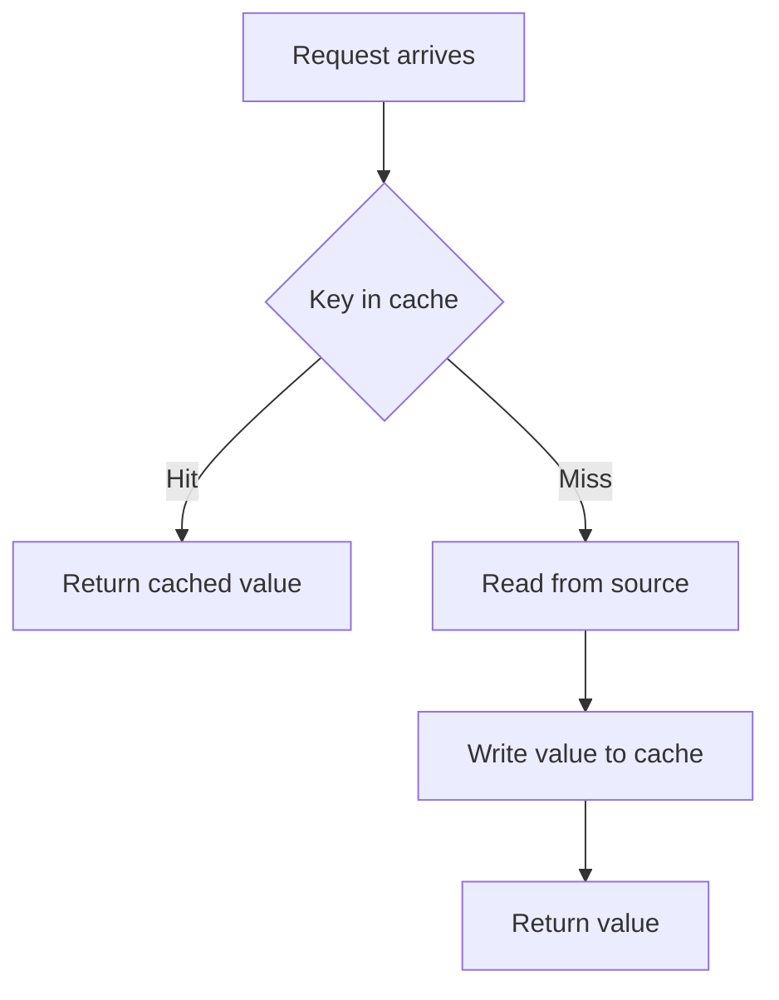
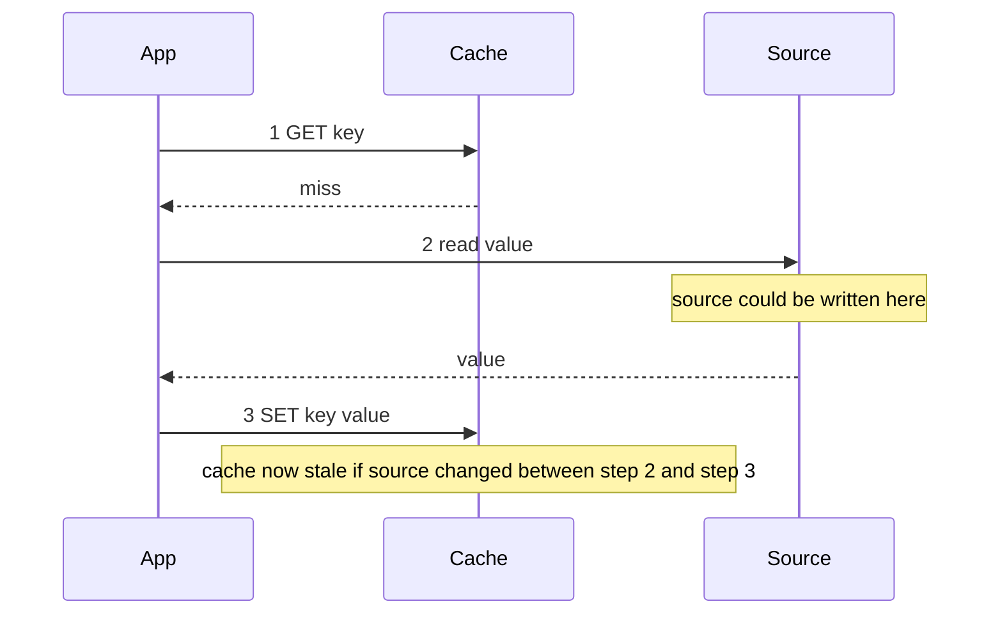

# Lecture 1 — Redis data types and the four cache patterns

> **Duration:** ~2 hours. **Outcome:** You can name and pick between Redis's five data types for caching shapes; you can implement the cache-aside pattern in `redis-py` from memory; you can describe the three alternatives (read-through, write-through, write-behind) and the consistency model each provides; you can read a cache-hit and a cache-miss path in production code and explain in one sentence why each line is there.

Every endpoint we have written through Week 8 follows the same data-access shape: the request handler asks the database (or the source-of-truth service) for the bytes it needs, transforms them, and returns the response. The database does the expensive work twice — once for the first user who asks, once for the hundredth. Caching is the discipline of doing the expensive work *once* and serving the rest from memory.

The component we put between the handler and the database is Redis. Redis is, in one sentence, a single-threaded in-memory key-value store with a small but well-chosen set of data types and a microsecond-scale latency budget. We do not run it as our primary database (durability is opt-in and the trade-offs of running Redis-as-database are a separate conversation). We run it as a cache: a layer that is allowed to be empty, allowed to be wrong-but-quickly-correctable, and allowed to be entirely offline without taking the service with it.

This lecture covers the two halves of "knowing Redis well enough to cache with it": the data types you have to pick from, and the four patterns that move data between the source-of-truth and the cache.

## 1. The five data types worth caching with

Redis ships ten data types in its public manual. The five we use this week are string, hash, list, set, and sorted set; we touch streams once and skip bitmaps, hyperloglogs, geo-indexes, and bitfields. The full overview is at <https://redis.io/docs/latest/develop/data-types/>; bookmark that page.

### 1.1 String — the workhorse

The Redis "string" is a binary-safe sequence of bytes, up to 512 MB per value. We use it for three things: serialised JSON values (the cached representation of an object), counters (`INCR`, `DECR`, with atomic increment), and lock tokens (`SET key value NX EX 5`).

The commands worth memorising are five: `SET`, `GET`, `DEL`, `INCR`, and `EXPIRE`. The `SET` command alone has eight flags worth knowing — `EX seconds`, `PX milliseconds`, `EXAT unix_seconds`, `PXAT unix_milliseconds`, `NX` (set only if not exists), `XX` (set only if exists), `KEEPTTL`, `GET` (return the old value as part of the set). Read the [SET command page](https://redis.io/commands/set/) once, end to end; the trick is that `SET k v EX 60 NX` is one round-trip and does what an entire `if not r.exists(k): r.set(k, v); r.expire(k, 60)` block almost does — almost, because the block has a race the single command does not.

A typical cache-aside read of a JSON-serialised value, in `redis-py` (sync), looks like:

```python
from __future__ import annotations

import json
from typing import Any

import redis


def get_article(r: redis.Redis, article_id: int) -> dict[str, Any]:
    key = f"article:{article_id}"
    cached = r.get(key)
    if cached is not None:
        return json.loads(cached)
    article = _load_from_db(article_id)
    r.set(key, json.dumps(article), ex=60)
    return article


def _load_from_db(article_id: int) -> dict[str, Any]:
    # The expensive query lives here.
    return {"id": article_id, "title": "Cached", "body": "..."}
```

Three observations. `r.get(key)` returns `None` on a miss (or on a key that exists but has been evicted; the caller cannot tell the difference, which is fine). `json.dumps` and `json.loads` are the boundary between Python objects and the bytes Redis stores; the value Redis stores is opaque to it, and the application owns the schema. `ex=60` sets a TTL of 60 seconds, which means the staleness budget for this value is 60 seconds — write that number down in the comment, because someone in code review will ask why it is not 30 or 600.

For the async variant — the one we use everywhere FastAPI is involved — the import changes and every method gets `await`:

```python
import redis.asyncio as redis


async def get_article(r: redis.Redis, article_id: int) -> dict[str, Any]:
    key = f"article:{article_id}"
    cached = await r.get(key)
    if cached is not None:
        return json.loads(cached)
    article = await _load_from_db(article_id)
    await r.set(key, json.dumps(article), ex=60)
    return article
```

The shape is identical; the `await` is the only difference. Cite the [`redis-py` async examples](https://redis-py.readthedocs.io/en/stable/examples/asyncio_examples.html).

### 1.2 Hash — the typed string-keyed map

A Redis hash is a flat string-to-string map stored at one key. Where strings give you `key -> value`, hashes give you `key -> {field1: value1, field2: value2, ...}`. The commands are `HSET`, `HGET`, `HMGET` (batch get), `HGETALL` (get every field), `HDEL` (delete a field), `HINCRBY` (atomic increment on one field).

The case for a hash over a JSON string is: you want to update one field without rewriting the whole record. `HSET article:42 view_count 1001` rewrites one field; the JSON-string equivalent is "read the whole JSON, decode, modify, re-encode, write" — four operations and a serialisation round-trip. For the *cache* layer specifically the choice matters less than it does for primary storage, because you usually invalidate the whole record rather than update one field. We use hashes when the cached shape is genuinely a flat object you want to query field-by-field: user profile pages, session payloads, configuration records.

```python
async def cache_user_profile(r: redis.Redis, user: dict[str, str]) -> None:
    key = f"user:{user['id']}:profile"
    await r.hset(key, mapping={
        "name": user["name"],
        "email": user["email"],
        "tier": user["tier"],
    })
    await r.expire(key, 300)


async def get_user_field(r: redis.Redis, user_id: str, field: str) -> str | None:
    return await r.hget(f"user:{user_id}:profile", field)
```

Note that `HSET key mapping={...}` is a `redis-py` convenience; the underlying command is `HSET key field1 value1 field2 value2 ...`. The hash itself has no per-field TTL — the TTL applies to the whole key — which is the limit you must remember. Per-field TTLs arrived in Redis 7.4 (the `HEXPIRE` command); they are recent enough that most production deployments do not yet use them.

### 1.3 List — the queue or the recent-items feed

A Redis list is a doubly-linked list of strings, with `O(1)` push and pop at either end (`LPUSH`, `RPUSH`, `LPOP`, `RPOP`). The blocking variants (`BLPOP`, `BRPOP`) are how the ARQ worker pool from Week 8 actually picks up jobs. For caching specifically, lists are the right type for "the last N items" feeds: recent searches, recent activity, the user's last 10 viewed articles. You bound the list with `LTRIM key 0 9` after each `LPUSH`, which keeps the length at 10.

```python
async def push_recent_view(r: redis.Redis, user_id: str, article_id: int) -> None:
    key = f"user:{user_id}:recent"
    await r.lpush(key, str(article_id))
    await r.ltrim(key, 0, 9)  # Keep at most 10 items
    await r.expire(key, 86400)


async def get_recent_views(r: redis.Redis, user_id: str) -> list[int]:
    items = await r.lrange(f"user:{user_id}:recent", 0, -1)
    return [int(v) for v in items]
```

The `LTRIM` keeps the list bounded; without it, an active user accumulates a list of ten thousand article IDs over a few months. The TTL on the key resets every `EXPIRE` call — which is what we want for "drop the list 24 hours after the user's last view".

### 1.4 Set — membership and deduplication

A set is an unordered, no-duplicates collection of strings, with `O(1)` add (`SADD`), remove (`SREM`), and membership test (`SISMEMBER`). The set operations — `SUNION`, `SINTER`, `SDIFF` — work in Redis itself, so you can compute "articles the user has read AND articles tagged 'python'" without round-tripping the membership to the application.

The cache use cases are two: deduplication ("have we seen this article ID in the last hour?") and tag-based invalidation (the topic of Exercise 3 — "which cached pages depend on article 42?").

```python
async def remember_seen(r: redis.Redis, article_id: int) -> bool:
    key = "seen:articles"
    added = await r.sadd(key, str(article_id))
    await r.expire(key, 3600)
    return bool(added)  # True if this was a new addition; False if already there


async def tag_keys_for(r: redis.Redis, tag: str) -> set[str]:
    members = await r.smembers(f"tag:{tag}:keys")
    return {m.decode() if isinstance(m, bytes) else m for m in members}
```

A set's TTL is on the whole key, like a hash. If you need member-level TTL ("this article ID has been seen for the last 60 seconds"), you reach for a sorted set with the score as a timestamp, and prune with `ZREMRANGEBYSCORE`.

### 1.5 Sorted set — leaderboards, rate limiters, time-ordered indexes

A sorted set is a set whose members carry a floating-point score. The store keeps the members ordered by score; range queries (`ZRANGE`, `ZRANGEBYSCORE`, `ZREVRANGEBYSCORE`) are `O(log n + m)` where `m` is the result size. The three canonical uses are leaderboards (score = points), rate limiters (score = unix timestamp, range = recent window), and time-ordered indexes ("most recent 20 articles" by `created_at`).

```python
async def record_view(r: redis.Redis, user_id: str, ts: float) -> None:
    key = f"user:{user_id}:views"
    await r.zadd(key, {f"view:{ts}": ts})
    await r.expire(key, 86400)


async def views_in_last_minute(r: redis.Redis, user_id: str, now: float) -> int:
    key = f"user:{user_id}:views"
    cutoff = now - 60
    await r.zremrangebyscore(key, 0, cutoff)  # prune old
    return await r.zcard(key)
```

The "score = timestamp" pattern is the foundation of every sliding-window rate limiter you will ever build. The `ZREMRANGEBYSCORE` call prunes the obsolete entries; the `ZCARD` returns the current count. We pick this pattern up properly in Week 11 (rate limiting); for this week, the relevant point is that sorted sets exist and the `ZRANGEBYSCORE / ZREMRANGEBYSCORE` pair is the load-bearing API.

### 1.6 Streams — the durable log, contrasted to Pub/Sub

Redis streams (`XADD`, `XREAD`, consumer groups via `XGROUP`) are a durable, append-only log — closer in shape to Kafka than to Pub/Sub. Each entry has a server-assigned ID, the consumer's read position is tracked, and a stream can be replayed from any past ID. The persistence story is the difference: a Pub/Sub message that arrives while a subscriber is offline is gone forever; a stream entry waits.

We do not use streams this week — Pub/Sub is the right tool for the fire-and-forget cache-invalidation broadcast we build in Lecture 2. But you should know streams exist for the day "I need invalidation events that survive a Redis restart" appears in a requirements document. The reference is the [streams documentation page](https://redis.io/docs/latest/develop/data-types/streams/).

## 2. Key naming — the discipline you owe yourself

Redis itself does not care what your keys look like. The community convention is colon-separated namespaces: `article:42`, `user:7:profile`, `article:42:render:en`. The reason is not aesthetic. Three operational benefits follow:

1. **`SCAN MATCH "article:*"`** lets you enumerate all article-related keys when you need to. (Never use `KEYS` in production — it is `O(n)` and blocks the server. `SCAN` is the cursor-based, non-blocking alternative; <https://redis.io/commands/scan/>.)
2. **Logical grouping** in observability tools. Most Redis dashboards group keys by their first colon-separated segment; `RedisInsight` does this automatically. A consistent prefix scheme makes the "which namespace is using all the memory?" question answerable in two clicks.
3. **Versioned invalidation.** When you change the cached representation of an article — adding a field, renaming one — the old cached values are wrong. Bumping the prefix (`v1:article:42` → `v2:article:42`) is the simplest possible "invalidate everything" that does not require a `FLUSHDB`. Old values age out under TTL; new requests write to the new prefix.

A pragmatic naming scheme for the rest of this week:

```text
<service>:<entity>:<id>[:<variant>][:<version>]
```

`crunchreader:article:42:render:en` — the rendered English version of article 42 in the crunchreader service. The version segment (`:v2`) is what you bump on schema change.

## 3. TTL — the staleness budget you have to write down

`TTL key` returns one of three values. `-2` means the key does not exist. `-1` means the key exists but has no TTL set. `n` (a positive integer) means the key has `n` seconds remaining before expiry. The `PTTL` variant returns milliseconds.

The four ways to set a TTL, in order of frequency in real code:

1. **`SET key value EX seconds`** — atomic set + TTL, one round-trip. The right default.
2. **`SET key value PX milliseconds`** — same, with millisecond resolution. Use for short-lived locks (5 000 ms is the canonical lock TTL).
3. **`EXPIRE key seconds`** — adds a TTL to an existing key. Two round-trips when paired with `SET`, so prefer `SET ... EX ...` instead. Use `EXPIRE` when you want to extend the TTL of an already-cached value ("the user is active; keep the session alive another 30 minutes").
4. **`EXPIREAT key unix_timestamp`** — TTL to an absolute time. Useful for "this token expires at midnight UTC".

Every cached value should have a TTL. The keys that should not — counters that must survive arbitrarily long, lock servers, durable feature flags — are the keys that should *not be on the cache instance in the first place*. The discipline is: the cache instance has every key TTL-bearing; the queue / lock-server / counters instance has every key TTL-less. Mixing them in one Redis is allowed but obscures the intent.

When a key without a TTL appears in your cache, your eviction policy (Lecture 2) controls what happens at memory pressure. `noeviction` is the default and is the wrong choice for a cache: it returns an error on `SET` when memory is full, which presents as a partial outage. `allkeys-lru` is the right choice for a cache and is what we configure on Tuesday.

## 4. The four caching patterns

Phil Bernstein's "Principles of Transaction Processing" (Chapter 6) defines the four patterns we are about to walk through. Every cache architecture is one of these, sometimes two stacked. The cloud-vendor documentation reproduces the definitions; AWS's [caching strategies overview](https://docs.aws.amazon.com/AmazonElastiCache/latest/mem-ug/Strategies.html) and Microsoft's [cache-aside pattern page](https://learn.microsoft.com/en-us/azure/architecture/patterns/cache-aside) are good cross-references.

### 4.1 Cache-aside (lazy loading)

The application owns the cache logic. On read: check the cache; on miss, read the source, write the cache, return. On write: write the source; invalidate the cache (or update it). The consistency model is "eventually consistent within the TTL".


*Cache-aside on read: a miss falls through to the source and repopulates the cache before answering.*

```python
async def cache_aside_get(r: redis.Redis, key: str, loader: Callable[[], Awaitable[T]],
                           ttl: int) -> T:
    cached = await r.get(key)
    if cached is not None:
        return json.loads(cached)
    value = await loader()
    await r.set(key, json.dumps(value), ex=ttl)
    return value
```

**When to pick it.** Default. It is the simplest pattern, gives the application total control, and degrades cleanly to "no cache" when Redis is offline.

**Failure modes.** (1) Stampede on key expiry — N concurrent misses each rebuild the same value. Lecture 3 fixes this. (2) Stale data between the write and the invalidation — if the write path forgets to invalidate, the cache serves stale until the TTL expires.

### 4.2 Read-through

A cache library hides the cache-aside logic behind a single `get(key, loader)` call. Conceptually the same as cache-aside, but the orchestration moves out of the request handler and into the library. `aiocache` and `fastapi-cache2` are read-through libraries; the Django cache framework's per-view cache and template-fragment cache are read-through, too.

```python
from aiocache import cached
from aiocache.serializers import JsonSerializer


@cached(ttl=60, key_builder=lambda func, *args, **kw: f"article:{args[0]}",
        serializer=JsonSerializer())
async def get_article(article_id: int) -> dict[str, Any]:
    return await _load_from_db(article_id)
```

**When to pick it.** When you have several endpoints with the same cache-aside shape and you want to factor the logic out. Or when you want the framework to apply caching declaratively (Django's `@cache_page(60 * 5)`).

**Failure modes.** Same as cache-aside, plus the magic — the library hides the cache hit/miss path, which makes debugging harder. Always know where to put a breakpoint.

### 4.3 Write-through

Every write to the source goes through the cache: the cache is updated synchronously *before* the write returns. The consistency guarantee is stronger: a write that returns 200 has already updated the cache.

```python
async def write_through_set(r: redis.Redis, article: dict[str, Any]) -> None:
    await _save_to_db(article)
    key = f"article:{article['id']}"
    await r.set(key, json.dumps(article), ex=60)
```

**When to pick it.** When stale reads are not acceptable and you cannot tolerate the post-write invalidation window. Common in financial dashboards, read-after-write display flows.

**Failure modes.** (1) The cache becomes part of the write critical path. If Redis is slow, every write is slow. (2) The cache is written even for entities nobody is reading — you fill the cache with things, then evict them under memory pressure, wasting work.

### 4.4 Write-behind (write-back)

The application writes to the cache; a background process propagates the write to the source asynchronously. The cache becomes the de-facto write store from the request handler's perspective; the durable write happens *eventually*.

```python
async def write_behind_set(r: redis.Redis, article: dict[str, Any]) -> None:
    key = f"article:{article['id']}"
    await r.set(key, json.dumps(article))
    await r.lpush("write_behind_queue", json.dumps({"action": "save_article", "data": article}))
```

A background worker reads the `write_behind_queue` list and performs the durable write.

**When to pick it.** When the source write is slow and the application can tolerate the eventual-consistency window. The pattern's poster child is high-throughput counters (write to Redis at 100 000/s; flush to Postgres in batches).

**Failure modes.** (1) Data loss on cache failure between the cache write and the durable write. (2) Operational complexity — you now have a queue, a worker, and an invariant that "every cache write must eventually be persisted". (3) Ordering issues — concurrent writes to the same key may interleave in the queue.

We will not use write-behind on the mini-project. The Week 7 service's writes are slow enough that we want the durability guarantee of write-through (or, for less critical paths, cache-aside with TTL). Knowing write-behind exists is enough.

### 4.5 The decision matrix

| Pattern        | Read latency       | Write latency       | Staleness window    | Operational complexity | When                                              |
|----------------|--------------------|---------------------|---------------------|-----------------------|---------------------------------------------------|
| Cache-aside    | Hit: fast; Miss: full | Same as no cache  | TTL                 | Low                   | Default — covers 80% of read-heavy endpoints     |
| Read-through   | Hit: fast; Miss: full | Same as no cache  | TTL                 | Low                   | Many similar endpoints; framework-declared caching|
| Write-through  | Always fast        | Cache + source       | None (in steady state) | Medium             | Read-after-write display; stale reads unacceptable|
| Write-behind   | Always fast        | Cache only          | Until flush          | High                  | Write-heavy; source is slow; eventual-consistency OK|

The first row is what you reach for first. The other three are answers to specific failure modes of the first.

## 5. A worked cache-aside example, end-to-end

We put it together. A FastAPI endpoint that returns the most-viewed articles, currently hitting the database on every request:

```python
from __future__ import annotations

import json
from typing import Any

import redis.asyncio as redis
from fastapi import APIRouter, Depends

router = APIRouter()
_redis_client: redis.Redis | None = None


async def get_redis() -> redis.Redis:
    global _redis_client
    if _redis_client is None:
        _redis_client = redis.from_url("redis://localhost:6379/0", decode_responses=True)
    return _redis_client


@router.get("/articles/popular")
async def popular_articles(
    limit: int = 10,
    r: redis.Redis = Depends(get_redis),
) -> list[dict[str, Any]]:
    key = f"v1:articles:popular:{limit}"
    cached = await r.get(key)
    if cached is not None:
        return json.loads(cached)
    articles = await _query_popular(limit)
    await r.set(key, json.dumps(articles), ex=30)
    return articles


async def _query_popular(limit: int) -> list[dict[str, Any]]:
    # The expensive SQL lives here.
    return [{"id": i, "title": f"Article {i}", "views": 1000 - i * 10}
            for i in range(limit)]
```

Six observations:

1. **The dependency `get_redis` reuses one client across requests.** A new client per request would open a new TCP connection each time, and the connection cost dominates the cache savings. The `redis.asyncio.Redis` client maintains a connection pool internally.
2. **`decode_responses=True`** is set on the client so `r.get` returns `str`, not `bytes`. The trade-off: a global decode applies to every call, including ones where you wanted bytes. For mixed workloads, drop the flag and decode at the call site.
3. **The key includes `limit`.** Different `limit` values are different cache entries. This is correct; a cached value for `limit=10` is wrong for `limit=20`. The trap is cardinality explosion — if your endpoint accepts twenty query parameters, the cache fills with twenty-dimensional combinations and the hit ratio collapses. The discipline: cache by canonicalised parameters (`limit=10` and `limit=10&limit=10` produce the same key) and refuse to cache uncommon combinations.
4. **`v1:` is the schema version.** Bumping it to `v2:` invalidates every cached popular-articles list without touching the source.
5. **`ex=30`** is the staleness budget. Why 30 seconds, not 60 or 5? Because the source data updates every few minutes, the page is high-traffic, and 30 seconds is the largest window for which "the leaderboard is at most 30 seconds stale" is an acceptable answer. Write that explanation in the commit message.
6. **No invalidation on write.** This endpoint is read-only. If we also exposed `POST /articles` that changes the popular set, the write path would `await r.delete("v1:articles:popular:*")` — or, more precisely, would publish an event that subscribers translate into a delete. Lecture 2 covers the invalidation strategies; for now, the simplest answer is "let the TTL handle it".

The latency improvement, measured against the bare endpoint, is the topic of Exercise 1 and Challenge 1. The order of magnitude you should expect: a 50 ms database query becomes a 1 ms cache hit, and the throughput at fixed concurrency goes up by the same factor.

## 6. The cache-as-aside transaction

The cache-aside read has a subtle correctness property that is worth naming. Read this carefully:

```python
async def cache_aside_get_naive(r, key, loader, ttl):
    cached = await r.get(key)        # (1) READ from cache
    if cached is not None:
        return json.loads(cached)
    value = await loader()           # (2) READ from source
    await r.set(key, json.dumps(value), ex=ttl)  # (3) WRITE to cache
    return value
```

Between (1) and (2), the source could have been written. Between (2) and (3), the source could have been written *again*. The value we write at (3) is whatever the source said at the moment of (2). If the source was written after (2) but before (3), the cache now holds stale-from-the-moment-it-was-written data — for the duration of the TTL.


*The race window between reading the source and writing the cache back is the consistency window.*

This is the *consistency window* of cache-aside. It is unavoidable without coordination (a `WATCH/MULTI/EXEC` on Redis paired with an SQL-level lock on the source, which is the kind of thing you build for financial ledgers and avoid otherwise). For most read-heavy caches, the window is small enough — milliseconds — that it does not matter. The discipline is to know the window exists, write it in the comment, and stop worrying.

The window grows when (3) is slow. If Redis is unreachable for 5 seconds and your `set` is retried, you have a 5-second window where the source could have been written and the eventual cache write is older than the latest source. The fix is timeouts and degradation: set a 100 ms timeout on the `set` call, and if it fails, do not retry — just return the value and let the next reader fill the cache.

## 7. The seven-bullet summary

1. Redis has five data types worth caching with: string (the workhorse, for JSON values and counters), hash (flat object map, update one field), list (recent-items feed, queue), set (membership, dedup), sorted set (leaderboards, rate limiters, time-indexed lookups).
2. Keys are colon-separated, prefixed by service and entity, and versioned where the schema can change. `v1:article:42:render:en` is a fine key; `article42en` is not.
3. Every cached value has a TTL. `SET key value EX seconds` is the one-round-trip atomic form. The TTL is the staleness budget — write it down in seconds, in the comment, and own it.
4. Cache-aside is the default pattern: read the cache; on miss, read the source, write the cache, return. The application owns the orchestration; degradation to "no cache" is one `try/except` away.
5. Read-through hides cache-aside behind a library call (`aiocache`, `fastapi-cache2`, Django's `@cache_page`). Same consistency, less code, harder to debug.
6. Write-through writes the cache synchronously on every source write; tighter consistency at the cost of write latency. Write-behind writes the cache and propagates to the source asynchronously; great throughput at the cost of operational complexity.
7. The consistency window of cache-aside is unavoidable without coordination. For most reads it is milliseconds and does not matter. Know it; comment it; stop worrying.

## Reading for next time

Before Lecture 2:

- The Redis [eviction documentation](https://redis.io/docs/latest/develop/reference/eviction/). Two pages.
- The Redis [`maxmemory-policy` config reference](https://redis.io/docs/latest/operate/oss_and_stack/management/config/#maxmemory-policy). One paragraph plus a table.
- The Redis [Pub/Sub overview](https://redis.io/docs/latest/develop/interact/pubsub/) — refresh from Week 8.

Lecture 2 covers eviction policies and the three invalidation strategies (event-driven, TTL-based, tag-based). Lecture 3 covers the cache stampede and Redis sessions.
