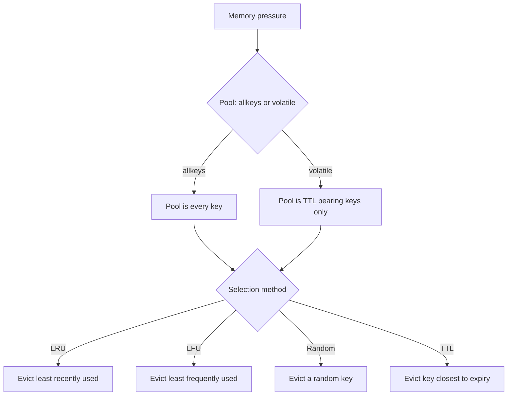
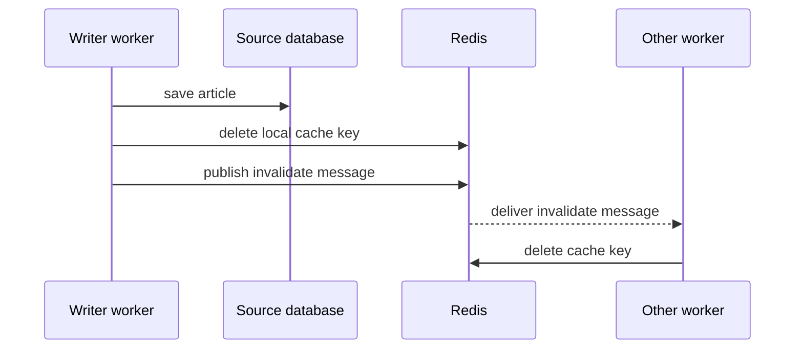

# Lecture 2 — Eviction policies and invalidation strategies

> **Duration:** ~2 hours. **Outcome:** You can name and pick between the eight Redis eviction policies; you can describe the sampled-LRU approximation Redis actually implements and explain why it is good enough; you can pick between event-driven, TTL-based, and tag-based invalidation by listing the trade-offs of each; you can write the invalidation map for a small service from scratch and explain which writes touch which cache keys.

Lecture 1 was the *write* side of caching: the data types, the patterns, the way values get into the cache. Lecture 2 is the *remove* side: the way values get out. Two mechanisms are in play and they are independent of each other.

The first is **eviction** — what Redis does on its own when memory is full. Redis is configured with a `maxmemory` ceiling and a `maxmemory-policy` rule that says "when you would exceed the ceiling, which key do you delete to make room?". This is the cache's automatic forgetting; it happens whether the application asked for it or not, and it happens at the granularity of single keys chosen by the policy.

The second is **invalidation** — what the application does on purpose when it knows a cached value is wrong. A write to the source-of-truth that the cache is fronting is the canonical trigger: someone updated the article, the cached render is now stale, *the application* tells the cache to drop the key. Eviction does not know about your application; invalidation is your application telling Redis what it knows.

This lecture covers both. The two mechanisms compose: a well-run cache uses TTLs to bound staleness automatically, eviction to bound memory automatically, and targeted invalidation to react to specific writes immediately. Knowing all three lets you tune the cache without surprises.

## 1. `maxmemory` — the ceiling

Redis is configured with a memory ceiling via the `maxmemory` directive. The value is a byte count (`maxmemory 1gb`, `maxmemory 256mb`) or zero for "no limit, use all the RAM you can". For a cache, zero is wrong; you must set a ceiling. The OOM killer is a worse outcome than a graceful eviction.

```text
# In redis.conf, or set at runtime via CONFIG SET
maxmemory 1gb
maxmemory-policy allkeys-lru
```

The runtime version:

```bash
redis-cli CONFIG SET maxmemory 1gb
redis-cli CONFIG SET maxmemory-policy allkeys-lru
redis-cli CONFIG GET maxmemory*
```

The `CONFIG SET` change is in-memory only; it does not survive a restart unless you also write the config file. The production discipline is to set the values in `redis.conf` (or the equivalent managed-service configuration), then mirror with `CONFIG SET` for the running instance.

`INFO memory` reports the current state:

```bash
redis-cli INFO memory | grep -E "used_memory_human|maxmemory_human|maxmemory_policy"
# used_memory_human:120.4M
# maxmemory_human:1.00G
# maxmemory_policy:allkeys-lru
```

The two numbers to watch over time are `used_memory` (the working-set size) and `evicted_keys` from `INFO stats` (how many keys Redis has dropped to stay under the ceiling). A non-zero `evicted_keys` per second is a healthy cache under pressure; a zero `evicted_keys` per second with a `used_memory` that climbs every day is a cache that is filling without bounds and will eventually OOM. Lecture 1's habit-of-the-week — every cached value has a TTL — is what keeps `evicted_keys` mostly idle.

## 2. The eight eviction policies

When `used_memory` exceeds `maxmemory`, Redis picks a policy to decide which key to delete. The policies form a 2x4 matrix: the choice between *all keys* and *only TTL-bearing keys*, crossed with the choice of LRU, LFU, random, and TTL-ordered.


*The eight eviction policies are just this pool choice crossed with this selection method.*

| Policy            | Pool                 | Choice within pool                | Behaviour summary                                   |
|-------------------|----------------------|-----------------------------------|-----------------------------------------------------|
| `noeviction`      | (none — error)        | (none)                            | Return error on `SET` that would exceed `maxmemory` |
| `allkeys-lru`     | every key             | Least Recently Used                | Classic cache; the right default for cache-only Redis |
| `allkeys-lfu`     | every key             | Least Frequently Used              | Better for skewed access; one hot key stays hot     |
| `allkeys-random`  | every key             | Random                            | Cheap; surprising; rarely the right choice          |
| `volatile-lru`    | keys with TTL only    | Least Recently Used                | Cache + queues in one Redis; never evict the queue  |
| `volatile-lfu`    | keys with TTL only    | Least Frequently Used              | Same caveat as LRU variant                          |
| `volatile-random` | keys with TTL only    | Random                            | Mostly for testing                                  |
| `volatile-ttl`    | keys with TTL only    | Closest to expiry                  | Useful when every key has TTL; predictable churn    |

The [`maxmemory-policy` configuration reference](https://redis.io/docs/latest/operate/oss_and_stack/management/config/#maxmemory-policy) lists all eight with one sentence each. The [eviction deep dive](https://redis.io/docs/latest/develop/reference/eviction/) explains the sampling implementation.

### 2.1 `noeviction` — the default that is wrong for caches

`noeviction` returns an error on every `SET` (and every write-bearing command) once the memory ceiling is hit. The error is `OOM command not allowed when used memory > 'maxmemory'`. For a cache, this is exactly the wrong behaviour: the cache stops accepting new entries and becomes increasingly stale. For a *queue* — where dropping a job randomly is unacceptable — `noeviction` is correct, and you back-pressure by sizing the broker generously and refusing new enqueues at the application layer.

The hint: `noeviction` is the right choice for a Redis instance that holds queues and lock servers. It is the wrong choice for a Redis instance that holds cache entries. Run them as separate instances if you can; if you cannot, use `volatile-*` so the TTL-less queue keys survive the eviction.

### 2.2 `allkeys-lru` — the canonical cache policy

`allkeys-lru` is the policy ninety-five percent of cache-only Redis instances should run. On every memory-pressure event, Redis picks the key that has not been touched (read or written) for the longest time and deletes it. The intuition is the working-set hypothesis: recently used keys are likely to be used again soon; the least-recently-used key is the most likely to be irrelevant.

The implementation detail worth knowing is that Redis does not maintain a perfect LRU list. A doubly-linked list across every key would double the memory cost and add an `O(1)` mutation to every read. Instead, Redis stores a 24-bit access timestamp per key and, on eviction, **samples** a small pool of keys (`maxmemory-samples`, default 5), picks the worst from the sample, and deletes it. The approximation is not perfect — a truly LRU key might survive while a slightly-less-LRU key in the sample gets evicted — but the deviation is small and the cost saved is large.

Read `src/evict.c` if you have curiosity time: <https://github.com/redis/redis/blob/unstable/src/evict.c>. The function `evictionPoolPopulate` is the sampler. The whole approximation is in 60 lines of C.

You can tune `maxmemory-samples` higher (10 makes the sample better at the cost of slightly more CPU per eviction). The default is fine for the workload we have.

### 2.3 `allkeys-lfu` — better for skewed access

LFU (Least Frequently Used) tracks how often a key has been accessed, not when it was last accessed. The key that has been touched 1 000 times stays in cache even if it was last touched 10 minutes ago; the key that was touched once a moment ago is the first to go.

The trade-off versus LRU: LFU is better when the access distribution is *skewed* — a few keys account for most accesses, and you want those to dominate the cache regardless of recency. LRU is better when the access distribution is *temporal* — what is hot now is what was hot recently. Most caches are somewhere in between; the default is `allkeys-lru` because LRU is simpler to reason about, but `allkeys-lfu` is the right choice for the "popular content" page where one item gets ten thousand reads per day and the next gets ten.

The Redis LFU implementation uses a logarithmic counter (`LFUDecayTime`, `LFULogFactor` configurables) to prevent an old key with a once-high access count from staying forever. A key not touched for a configurable interval has its counter decayed. The details are at <https://redis.io/docs/latest/develop/reference/eviction/#approximated-lfu-algorithm>.

### 2.4 `volatile-ttl` — predictable churn

`volatile-ttl` evicts, from the pool of TTL-bearing keys, the one whose TTL is closest to expiring. The intuition is "this key was going to expire soon anyway; expire it now and save the memory for something useful".

The policy works well when *every* key has a TTL (which is the discipline we install on Monday for caches). The pool is effectively "every key", and the choice within the pool is predictable: the cache churns in time-order, and the eviction pressure prefers the things that were going to leave shortly.

`volatile-ttl` is the right pick for a cache instance where the lifetime distribution of keys is wide — some keys are TTL-bearing 1 hour, others 1 minute — and you want the short-lived ones to be the eviction candidates. For a uniform-TTL cache, `allkeys-lru` is simpler and serves the same purpose.

### 2.5 The other four

- `allkeys-random` and `volatile-random` evict a random key from the relevant pool. Cheap CPU; surprising behaviour; rarely the right choice. Useful when you cannot characterise the access pattern and just want to bound memory.
- `volatile-lru` and `volatile-lfu` are the same as their `allkeys` counterparts, but the pool is restricted to keys with TTL. The case for them is "the same Redis instance holds cache (TTL'd) and queue (TTL-less) keys, and the queue must never be evicted". Use them if your operational reality requires the shared instance.

## 3. Observing eviction in real time

Two `INFO` sections tell you what is happening:

```bash
redis-cli INFO memory
# used_memory:128432848
# used_memory_human:122.48M
# maxmemory:1073741824
# maxmemory_human:1.00G
# maxmemory_policy:allkeys-lru

redis-cli INFO stats | grep -E "evicted|keyspace"
# evicted_keys:1247
# keyspace_hits:382041
# keyspace_misses:7841
```

The four numbers to plot on a dashboard:

1. **`used_memory` over time.** Should oscillate; a monotonic climb says the cache is unbounded.
2. **`evicted_keys` per second.** A small steady rate is healthy under pressure; zero with a climbing `used_memory` says the TTLs are missing or wrong; a large spike says the cache has fallen into thrashing.
3. **`keyspace_hits / (keyspace_hits + keyspace_misses)`** — the hit ratio. Below 50% means the cache is doing less than half its job; below 20% says the cache is hurting more than helping (every miss is a Redis round-trip *and* a source query).
4. **`keyspace_misses` per second.** Useful for spotting cold-start patterns: every restart of the application gives the cache an empty miss period.

We will instrument these on Week 10 with `redis-exporter` and a Grafana panel. For now, the discipline is "open `redis-cli INFO stats` once a day on your local instance and read the numbers". The MTTR on a cache problem is dominated by whether you noticed it.

## 4. The three invalidation strategies

Eviction is what Redis does on its own. Invalidation is what the application does on purpose. The three strategies are TTL-based (set-and-forget), event-driven (publish a message when a write happens), and tag-based (group keys that share a dependency and sweep the group). Real systems combine all three; the discipline is to know which one is doing the work for each cached value.

### 4.1 TTL-based — the staleness-budget strategy

Every cached value carries a TTL. The TTL is the *staleness budget*: the maximum amount of time the cached value is allowed to be wrong. When the TTL expires, the value is gone; the next read is a miss and fetches a fresh copy.

```python
await r.set(key, json.dumps(value), ex=60)
```

**Pros.** Simplest possible invalidation. No coordination. No event bus. The cache is correct after the TTL expires; until then, it is at-most-N-seconds stale. Works when there is no clean "write" event the cache can subscribe to — for instance, "the popularity rank computed by a nightly batch job" updates without an application-level write.

**Cons.** Staleness window is exactly the TTL. The choice of TTL is a trade-off: small TTL means low staleness but low hit ratio (every value rebuilt frequently); large TTL means high hit ratio but high staleness. There is no way to tell the cache "this specific key is stale now" without supplementing TTL with one of the other strategies.

**When to pick it.** Default. Every value has a TTL. The other strategies layer on top.

### 4.2 Event-driven — the publish-on-write strategy

When a write to the source happens, the application *publishes* an invalidation event. Every cache subscriber listens on a channel and deletes the affected keys. The Pub/Sub mechanism we built in Week 8 carries over directly.

```python
import redis.asyncio as redis


class InvalidationBus:
    def __init__(self, r: redis.Redis, channel: str) -> None:
        self._r = r
        self._channel = channel

    async def publish_invalidate(self, key: str) -> None:
        await self._r.publish(self._channel, key)

    async def listen(self, on_invalidate: Callable[[str], Awaitable[None]]) -> None:
        pubsub = self._r.pubsub()
        await pubsub.subscribe(self._channel)
        async for message in pubsub.listen():
            if message["type"] != "message":
                continue
            await on_invalidate(message["data"])
```

The write path:

```python
async def update_article(r: redis.Redis, bus: InvalidationBus, article: dict[str, Any]) -> None:
    await _save_to_db(article)
    await r.delete(f"v1:article:{article['id']}")
    await bus.publish_invalidate(f"v1:article:{article['id']}")
```

Notice the local delete *and* the publish. The local delete is what makes the writing worker's own cache consistent immediately; the publish is what makes every other worker's cache consistent. If you only publish, the writing worker has to wait for the message to round-trip through Redis to invalidate its own cache — which works, but is a needless RTT.


*The writer deletes its own copy immediately, then Pub/Sub tells every other worker to do the same.*

**Pros.** Near-zero staleness — invalidation propagates within one Redis Pub/Sub message, which is microseconds. The cache can have a long TTL (`ex=3600`) because the active invalidation handles the freshness; the TTL is just the safety net for "what if we missed an event".

**Cons.** Coordination. The write path must know which cache keys depend on the entity being written. In a small service this is tractable; in a large one with template fragments depending on multiple entities, the dependency graph gets complicated quickly — which is what tag-based invalidation solves.

**Pub/Sub is fire-and-forget.** A cache process that is restarting when the invalidation is published misses the message. The TTL is the recovery: the missed invalidation persists for at most the TTL; the cache is wrong-but-self-healing.

**When to pick it.** When staleness matters and the write paths are few enough to enumerate. Editorial content systems with a "publish" button are the canonical fit.

### 4.3 Tag-based — the dependency-graph strategy

Each cached value declares the tags it depends on. When a tag is invalidated, every value carrying that tag is dropped. The implementation: a Redis set per tag, storing the keys that depend on it; the write path `SMEMBERS tag:author:7` then `DEL` on every member, plus `DEL tag:author:7`.

```python
async def cache_with_tags(r: redis.Redis, key: str, value: Any,
                          tags: list[str], ttl: int) -> None:
    pipe = r.pipeline()
    pipe.set(key, json.dumps(value), ex=ttl)
    for tag in tags:
        pipe.sadd(f"tag:{tag}", key)
        pipe.expire(f"tag:{tag}", ttl * 2)  # The tag set outlives its members
    await pipe.execute()


async def invalidate_tag(r: redis.Redis, tag: str) -> int:
    tag_key = f"tag:{tag}"
    members = await r.smembers(tag_key)
    if not members:
        return 0
    pipe = r.pipeline()
    for member in members:
        pipe.delete(member)
    pipe.delete(tag_key)
    await pipe.execute()
    return len(members)
```

The cache write declares "this rendered page depends on `article:42` and `author:7`". The author's display name change triggers `invalidate_tag("author:7")`, which sweeps every cached page that mentioned author 7 — possibly hundreds of cached entries, all at once, without the write path having to know they exist.

**Pros.** The write path knows what *entity* changed; it does not need to know which *cache keys* depend on that entity. The cache layer figures it out. This decoupling is the right shape for template-fragment caches and rendered-page caches with rich dependencies.

**Cons.** The cache writes are more expensive (one `SADD` per tag) and the keys-per-tag sets can grow unbounded if you do not TTL them. The set membership represents the *current* dependency graph; if a cached page is evicted without the corresponding `SREM tag:author:7 page:key`, the tag set holds a dangling reference. The dangling references are harmless (the `DEL` of a non-existent key is a no-op) but they bloat memory; periodic cleanup is the discipline.

**When to pick it.** When the write path knows which entity changed but does not know which cached pages mention it. Wikipedia's Varnish cache is the canonical example: edit an article, sweep every cached HTML page that links to it.

We build a tag-based cache in Exercise 3. It is the most code of the three strategies and the most satisfying when it works.

### 4.4 Comparison

| Strategy        | Code complexity | Staleness         | Best for                                              |
|-----------------|-----------------|-------------------|-------------------------------------------------------|
| TTL-based       | Trivial          | TTL window        | Default; every value carries one                       |
| Event-driven    | Moderate         | Microseconds      | Enumerable write paths; editorial content              |
| Tag-based       | High             | Microseconds      | Rich dependency graphs; rendered pages with N entities |

Real systems use all three. TTL is the floor. Event-driven covers the entity-write paths you can enumerate. Tag-based handles the rendered fragments that depend on multiple entities. The architectural drawing is one column per strategy and one row per cached endpoint, and the answer is the mark in the cell.

## 5. The invalidation map — a discipline for your code review

Before you ship a cache, write the *invalidation map* in the README. It is a small table:

| Cache key pattern                  | TTL    | Invalidated by (writes)                                  | Strategy        |
|------------------------------------|--------|----------------------------------------------------------|-----------------|
| `v1:article:{id}`                  | 1 h    | `PATCH /articles/{id}`, `DELETE /articles/{id}`           | Event-driven    |
| `v1:articles:popular:{limit}`      | 30 s   | (none — TTL covers it)                                    | TTL-based       |
| `v1:render:article:{id}:{lang}`    | 1 h    | Any write touching `article:{id}` or its author/tags      | Tag-based       |
| `v1:session:{session_id}`          | 30 m   | Logout, password change                                   | Event-driven    |

The table is the contract between the cache and the rest of the service. It answers, in one sheet:

- "How long can this value be wrong?" — column 2.
- "Which writes touch this cache?" — column 3.
- "What is the mechanism?" — column 4.

A new endpoint is added to the cache by adding a row. A new write path is reviewed by checking which rows it touches. The map is small enough to read in a code review and rich enough to catch the "we cached this and forgot the invalidation" bug before production sees it.

## 6. Cache observability — the four numbers worth a dashboard

You measured the latency improvement in Lecture 1. The four numbers you should *keep* measuring, once the cache is in production, are:

1. **Hit ratio** — `keyspace_hits / (keyspace_hits + keyspace_misses)`. If it drops below 50%, the cache is doing less than half its job. If it drops sharply, an invalidation event probably swept too many keys.
2. **Eviction rate** — `evicted_keys` per second. A steady small rate is healthy under pressure; a sudden climb says the working set has outgrown `maxmemory`.
3. **Used memory** — `used_memory` over time. The shape tells you whether the cache is bounded (oscillates) or filling without limit (monotonic climb).
4. **Operations per second** — `instantaneous_ops_per_sec` from `INFO stats`. The volume of Redis traffic. Spikes correlate with cache stampede (Lecture 3) and with thundering herds.

The Grafana dashboard at <https://grafana.com/grafana/dashboards/763> displays these and seven others. Week 10 wires it up. For this week, learn to read `INFO` by hand:

```bash
watch -n 5 'redis-cli INFO stats | grep -E "keyspace|evicted|ops_per"'
```

`watch -n 5` re-runs the command every 5 seconds. Open a terminal next to your `ab` run and watch the numbers move.

## 7. A trap to avoid — the two-tier cache anti-pattern

A common mistake: adding an in-process LRU cache (via `functools.lru_cache` or `cachetools.TTLCache`) on top of the Redis cache, on the grounds that "in-process is faster than Redis". The in-process cache has microsecond reads where Redis has millisecond reads — true. The trade-off is invalidation: every worker has its own in-process cache, and an invalidation has to reach every worker. The Pub/Sub strategy from Section 4.2 does that, but you are now maintaining two cache layers and the invalidation has to handle both.

The cost is rarely worth it for a service whose Redis lives on the same network. The Redis hit at 1 ms is fast enough; the savings of 0.99 ms from a process-local LRU are not worth the doubled invalidation complexity. The exception is "the Redis instance is across a network with 10 ms latency"; then the in-process cache wins, and you accept the invalidation cost. For local-network Redis, do not do this.

The other case for in-process caching is when the value is *cheap to compute* — a function with no I/O. `@functools.lru_cache` on a pure function is fine; that has nothing to do with Redis. The trap is specifically the "Redis plus in-process for the same I/O-bearing value" combination.

## 8. The seven-bullet summary

1. Set `maxmemory` and `maxmemory-policy` explicitly. The default `noeviction` is wrong for a cache.
2. `allkeys-lru` is the canonical cache policy. `allkeys-lfu` is better when the access distribution is skewed. `volatile-ttl` is useful when every key has TTL.
3. Redis's LRU is sampled, not exact — 5 keys per eviction round, the worst gets dropped. The approximation is fine.
4. TTL-based invalidation is the default. Every cached value has a TTL. It is the staleness budget; write it in the comment.
5. Event-driven invalidation uses Pub/Sub. The write path publishes; subscribers delete the key. Near-zero staleness; needs co-ordination.
6. Tag-based invalidation maintains a set per tag, of the keys that depend on it. The write knows the *entity*, the cache layer knows the *keys*. Right for rendered-page caches.
7. The invalidation map is a small table in the README: cache key, TTL, what invalidates it, which strategy. It is the contract; check it in code review.

## Reading for next time

Before Lecture 3:

- The [Vattani et al. 2015 paper](https://arxiv.org/abs/1504.00922) (free arXiv PDF). Read sections 2 and 3. The algorithm is two lines of Python at the end.
- The [Django sessions framework page](https://docs.djangoproject.com/en/5.1/topics/http/sessions/). One page.
- The [FastAPI middleware tutorial](https://fastapi.tiangolo.com/tutorial/middleware/). One page.

Lecture 3 covers the cache stampede in depth — the failure mode, the two fixes — and the Redis-as-session-store pattern for both frameworks.
