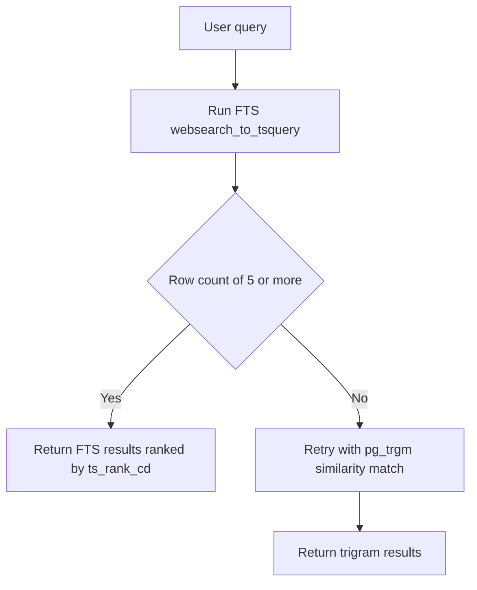

# Lecture 1 — Postgres full-text search: `tsvector`, `tsquery`, `ts_rank`, `GIN`, and `pg_trgm`

> *The cheapest production-grade search you can ship is the one that lives in the database you already have. Postgres has shipped full-text search since 8.3, has a working dictionary chain, has a stable `tsvector` data type with positional information, has both `GIN` and `GiST` indexes that make it fast, and has a fuzzy extension (`pg_trgm`) bolted to the side for the misspelled-query case. The right question is not "is Postgres FTS good enough?". The right question is "at what corpus size, query volume, and relevance ceiling does it stop being good enough?". The answer, on a 2026 commodity box, is "comfortably ten million rows, often more". For the W7/W8/W9 service that is more headroom than the team can fill in two years.*

## 1 — The inverted index in three sentences

Before any Postgres syntax: a search engine is an *inverted index*. A regular index maps `row_id → row_value` (a `B-tree` on `articles.id` lets you find row 42 in `O(log n)`). An *inverted* index maps `term → list_of_row_ids_containing_that_term` (an index on the tokens of `articles.body` lets you find every row containing the term `python` in `O(log n)`). The "inverted" name is unfortunate; "term-to-row index" would be clearer. Either way, the data structure is what makes search fast — without it, finding rows containing a term requires scanning every row, which is `O(n)` and unacceptable above a few thousand rows.

Postgres stores its inverted index in a `tsvector` column plus a `GIN` index on that column. The `tsvector` is a per-row data structure (one row = one inverted index slice — the list of terms in *that* row); the `GIN` index aggregates across rows (one term entry = one posting list of row IDs). The `tsvector` column is *per-row* state; the `GIN` index is the *aggregate* across rows. Both are needed; the column without the index is `Seq Scan` slow.

## 2 — `tsvector`: the per-row, normalised term list

A `tsvector` is a sorted, deduplicated list of `(lexeme, positions, weights)` triples. The `lexeme` is the normalised term — the result of running the original text through the *parser* (tokeniser) and then the *dictionary chain* (lowercase, stop-word strip, stem). The `positions` are byte offsets into the original text, with optional weight labels `A`, `B`, `C`, `D`.


*Write-time transformation from raw text to a stored tsvector.*

A worked example. The input text:

```text
The quick brown fox jumps over the lazy dog.
```

Run through the default `'english'` configuration, `to_tsvector('english', 'The quick brown fox jumps over the lazy dog.')` produces:

```text
'brown':3 'dog':9 'fox':4 'jump':5 'lazi':8 'quick':2
```

Six lexemes, sorted alphabetically, with the position of each within the original token stream. Notice:

- `the` is gone (stop word, dropped by the `english_stop` filter).
- `jumps` became `jump` (stemmed by the Snowball English stemmer).
- `lazy` became `lazi` (Snowball normalisation — the `y` becomes `i`).
- Positions are 1-indexed and skip the dropped stop words.

This is the **write-time** transformation. It happens when you compute the `tsvector` — either at `INSERT` time (via a trigger or a generated column) or at query time (which is fine for one-off `SELECT` but is `O(n)` if you do it in a `WHERE` clause without an index).

### 2.1 — The generated-column pattern

The right way to build a `tsvector` column in Postgres 12+ is as a `GENERATED ALWAYS AS ... STORED` column. The database recomputes the `tsvector` automatically on every `INSERT`/`UPDATE` of the source columns; you never see the recomputation in application code; you cannot forget to update it.

```sql
ALTER TABLE articles ADD COLUMN tsv tsvector
  GENERATED ALWAYS AS (
    setweight(to_tsvector('english', coalesce(title, '')), 'A') ||
    setweight(to_tsvector('english', coalesce(body, '')), 'B')
  ) STORED;
```

Three pieces:

1. **`coalesce(col, '')`**. Required — `to_tsvector(NULL)` returns `NULL`, and a `NULL` `tsvector` does not match anything. The `coalesce` makes the column robust to nullable source columns.
2. **`setweight(...)`** assigns the weight label to every lexeme in the resulting `tsvector`. `A` (highest weight) goes on the title; `B` on the body. The `ts_rank` function (next section) honours these labels when scoring.
3. **`||`** is the `tsvector` concatenation operator. It merges the two vectors, keeping the positions and weights from each side.

The `STORED` keyword means the value is materialised — written to disk, read back like any other column. The alternative `VIRTUAL` (Postgres 18+; check your version) recomputes on read, which makes index updates cheaper but read-time access slower. For search, `STORED` is the right answer almost always.

### 2.2 — The `GIN` index

A `tsvector` column with no index is useless — every search becomes a sequential scan. The fix is a `GIN` (Generalised Inverted iNdex) index:

```sql
CREATE INDEX articles_tsv_idx ON articles USING GIN (tsv);
```

`GIN` is the right pick for `tsvector` columns whose contents change *occasionally*. It is read-optimised: lookups are `O(log n)` in the number of distinct terms; the data structure compresses well; the posting lists are dense and cache-friendly. Updates are slower than for `B-tree` because every lexeme in the new row needs to be added to its posting list, but for a read-heavy workload that is the right trade.

The alternative `GiST` (Generalised Search Tree) index is the other supported index type. It is *lossy* — a `GiST` hit might be a false positive, and Postgres has to recheck the row. It is also *write-optimised* — updates are cheap. Use `GiST` if your `articles` table sees more `UPDATE` traffic than read traffic on the `tsv` column, which in practice is rare for a CMS-shaped table.

Verify the index is being used. Run an `EXPLAIN ANALYZE` on a search query and look for `Bitmap Index Scan on articles_tsv_idx`. If you see `Seq Scan`, the planner has decided the cost of using the index is higher than the cost of the scan — usually because the table is small or the statistics are stale. Run `ANALYZE articles;` and try again.

## 3 — `tsquery`: the four front-doors

The query side has four parser functions, each producing a `tsquery`:

- **`to_tsquery('english', 'python & async')`** — the strict, operator-aware parser. `&` is AND; `|` is OR; `!` is NOT; `<->` is positional (immediately followed by); `<n>` is positional (n tokens apart). Punctuation matters — `to_tsquery('python async')` is a syntax error.
- **`plainto_tsquery('english', 'python async')`** — the friendly default. Splits on whitespace; ANDs the terms. Never errors on user input. The right pick for "I do not want to think about query syntax".
- **`phraseto_tsquery('english', 'python async generators')`** — phrase matching. Splits on whitespace; combines with `<->` (immediately-adjacent positional). Matches only documents containing the phrase in that exact order.
- **`websearch_to_tsquery('english', '"python async" -django OR or "asyncio"')`** — the Google-style parser. Quoted strings are phrases; `-` is exclusion; `OR` (uppercase) is disjunction. The right pick for a user-facing search bar.

The four are not interchangeable. Pick `websearch_to_tsquery` for any search input that comes from a human typing in a box; pick `phraseto_tsquery` if your product specifically requires phrase match; pick `plainto_tsquery` if your input is already tokenised by another system; reserve `to_tsquery` for internal, programmatic queries where you control the input.

### 3.1 — The match operator

The match between a `tsvector` and a `tsquery` is the `@@` operator:

```sql
SELECT id, title FROM articles WHERE tsv @@ websearch_to_tsquery('english', 'python async');
```

This is the *boolean* match. The result is `true` or `false` per row: does the document contain the query terms in a way that satisfies the boolean structure? It is not ranked. For ranking, you need `ts_rank` or `ts_rank_cd`.

## 4 — Ranking: `ts_rank` versus `ts_rank_cd`

Postgres ships two built-in ranking functions:

- **`ts_rank(tsv, tsq[, normalization])`** — a term-frequency score. The more times a query term appears in the document, the higher the rank. Weights are honoured (`A` lexemes count more than `B`).
- **`ts_rank_cd(tsv, tsq[, normalization])`** — a *cover-density* score. Considers not just the term frequency but the *proximity* of the query terms within the document. A document where "python" and "async" appear in the same sentence ranks higher than one where they appear in different paragraphs.

The full ranking query:

```sql
SELECT id,
       title,
       ts_rank_cd(tsv, websearch_to_tsquery('english', 'python async'), 32) AS score
FROM articles
WHERE tsv @@ websearch_to_tsquery('english', 'python async')
ORDER BY score DESC
LIMIT 25;
```

The `32` is the *normalisation flag bitmask*. The flags are documented at <https://www.postgresql.org/docs/current/textsearch-controls.html#TEXTSEARCH-RANKING> — the relevant ones:

| Flag | Effect                                                                                      |
|-----:|---------------------------------------------------------------------------------------------|
|    0 | Ignore document length.                                                                      |
|    1 | Divide the rank by `1 + log(document length)`.                                              |
|    2 | Divide the rank by the document length.                                                      |
|    4 | Divide the rank by the mean harmonic distance between extents.                              |
|    8 | Divide the rank by the number of unique words in the document.                              |
|   16 | Divide the rank by `1 + log(number of unique words)`.                                        |
|   32 | Divide the rank by `rank + 1` (smooths the rank into the `[0, 1)` range).                   |

The flags are a bitmask — you can OR them. The default `0` ignores document length, which means a 10 000-word document and a 100-word document with the same term frequency get the same score, which is almost never what you want. Flag `32` (smooth into `[0, 1)`) is the safe default for ordering; flag `1` (divide by `log(length)`) is the right normalisation if you have variable-length documents and want to avoid the "longer documents always win" bias.

### 4.1 — Why `ts_rank_cd` is the right default

For most modern corpora, `ts_rank_cd` produces results closer to what a user expects. "Python async generators" should rank higher on a document where those three words appear in the same sentence than on a document where "python" appears on page 1 and "async" appears on page 12. `ts_rank` does not know this; `ts_rank_cd` does.

The "cd" stands for *cover density*, a concept from Clarke et al., "Relevance Ranking for One to Three Term Queries" (Information Processing and Management, 2000). The intuition: the score is the inverse of the size of the smallest window in the document that covers all query terms.

## 5 — Phrase search

Phrase search is "find documents containing this exact sequence of words". Postgres supports it via the positional `<->` operator in `tsquery`:

```sql
SELECT id, title
FROM articles
WHERE tsv @@ phraseto_tsquery('english', 'python async generators');
```

`phraseto_tsquery` produces the `tsquery`: `'python' <-> 'async' <-> 'generators'` — three lexemes connected by the immediately-adjacent positional operator. The `@@` match returns `true` only for documents where those three lexemes appear *in that order*, with no other tokens between them.

A looser variant: `'python' <2> 'async'` — "python within 2 tokens of async, in that order". Useful for "we want phrase-ish matching but stop words should not break it".

## 6 — `pg_trgm`: the fuzzy fallback

Postgres FTS does not handle misspellings. A user who types `pythn` will get zero results, because `pythn` is not a token in any document. The fix is the `pg_trgm` extension — a trigram-based similarity index that works alongside FTS.

### 6.1 — What a trigram is

A trigram is a 3-character sliding window over a string. `'python'` decomposes into:

```text
'  p', ' py', 'pyt', 'yth', 'tho', 'hon', 'on '
```

Seven trigrams, including padded start (`'  p'`, `' py'`) and end (`'on '`) trigrams that capture the word boundaries.

The trigram *similarity* of two strings is the size of the intersection of their trigram sets divided by the size of the union (the Jaccard similarity). `similarity('python', 'pythn')` is `0.5` — six trigrams of `'python'`, six of `'pythn'`, with three in common. The default threshold is `0.3`; the `%` operator returns `true` when similarity is above the threshold.

### 6.2 — The setup

```sql
CREATE EXTENSION IF NOT EXISTS pg_trgm;

CREATE INDEX articles_title_trgm_idx
  ON articles
  USING GIN (title gin_trgm_ops);

CREATE INDEX articles_body_trgm_idx
  ON articles
  USING GIN (body gin_trgm_ops);
```

The `gin_trgm_ops` opclass is what tells `GIN` to index the trigrams of the column, not the column value as a whole.

### 6.3 — The fuzzy query

```sql
SELECT id, title, similarity(title, 'pythn async') AS score
FROM articles
WHERE title % 'pythn async'
ORDER BY score DESC
LIMIT 25;
```

The `%` operator uses the index; `similarity(...)` computes the actual score for ordering.

### 6.4 — The FTS-then-trigram fallback

The right composition: try the FTS query first; if it returns fewer than (say) 5 results, retry with the trigram match.


*The FTS-then-trigram fallback decision path.*

```python
async def search(conn: "asyncpg.Connection", q: str, limit: int = 25) -> list[dict[str, Any]]:
    """Try FTS first; fall back to trigram on a sparse result."""
    fts_rows = await conn.fetch(
        """
        SELECT id, title,
               ts_rank_cd(tsv, websearch_to_tsquery('english', $1), 32) AS score
        FROM articles
        WHERE tsv @@ websearch_to_tsquery('english', $1)
        ORDER BY score DESC
        LIMIT $2;
        """,
        q,
        limit,
    )
    if len(fts_rows) >= 5:
        return [dict(r) for r in fts_rows]

    trgm_rows = await conn.fetch(
        """
        SELECT id, title, similarity(title, $1) AS score
        FROM articles
        WHERE title %% $1
        ORDER BY score DESC
        LIMIT $2;
        """,
        q,
        limit,
    )
    return [dict(r) for r in trgm_rows]
```

This is the cheapest typo-tolerance you can ship inside Postgres. It will not beat Meilisearch's tolerance — Meilisearch indexes for tolerance from the start; trigram is a similarity-on-the-side — but it covers 80% of the misspelled-query case at zero operational cost.

## 7 — When Postgres FTS is enough

Postgres FTS is "good enough" if all of the following hold:

- **Corpus size**: under ~10 million rows. Above 10 million, `GIN` index rebuild times become painful; the `pg_trgm` similarity scan slows; the lack of distributed scoring (one Postgres = one node = one shard) starts to bite. The hard limit is much higher (people have run FTS on hundreds of millions of rows) but the operational comfort zone is ten million.
- **Query volume**: under ~1 000 searches per second per Postgres instance. Above that, you are competing with the primary `OLTP` workload for the buffer cache; the read-replica option helps but adds complexity.
- **Relevance ceiling**: BM25 is *not* available natively. Postgres ships `ts_rank` (TF-style) and `ts_rank_cd` (cover-density). If your product specifically requires BM25 — for parity with other search systems or because the BM25 ranking is in the spec — Postgres FTS is the wrong pick.
- **Language coverage**: the bundled dictionaries (English, Spanish, French, German, etc. via Snowball) are fine for most Western European languages. Asian-language tokenisation (CJK) requires a custom parser; it is doable but not in-the-box.
- **No facets / no aggregations beyond what SQL gives you**: if you need "count documents by tag, by author, by month, all in one round-trip with the search hits", SQL `GROUP BY` works but is awkward. OpenSearch's `aggs` block is purpose-built for this.

If any of those is *no*, you graduate to OpenSearch (Lecture 2) or Meilisearch (Lecture 3). If all of them are *yes*, you stay in Postgres and put the savings into hiring more people.

## 8 — A worked example: adding FTS to the W7 articles service

Take the W7 `articles` table:

```sql
CREATE TABLE articles (
    id          bigserial PRIMARY KEY,
    title       text NOT NULL,
    body        text NOT NULL,
    author      text NOT NULL,
    published_at timestamptz NOT NULL DEFAULT now()
);
```

The migration:

```sql
-- Step 1: enable pg_trgm
CREATE EXTENSION IF NOT EXISTS pg_trgm;

-- Step 2: add the tsvector generated column
ALTER TABLE articles ADD COLUMN tsv tsvector
  GENERATED ALWAYS AS (
    setweight(to_tsvector('english', coalesce(title, '')), 'A') ||
    setweight(to_tsvector('english', coalesce(body, '')), 'B')
  ) STORED;

-- Step 3: add the GIN index
CREATE INDEX articles_tsv_idx ON articles USING GIN (tsv);

-- Step 4: add the trigram fallback indexes
CREATE INDEX articles_title_trgm_idx ON articles USING GIN (title gin_trgm_ops);

-- Step 5: refresh statistics
ANALYZE articles;
```

The Python read path, in `asyncpg`:

```python
from __future__ import annotations

from typing import Any

try:
    import asyncpg
except ImportError:  # pragma: no cover
    asyncpg = None  # type: ignore[assignment]


async def search_articles(
    pool: "asyncpg.Pool",
    query: str,
    limit: int = 25,
    offset: int = 0,
) -> list[dict[str, Any]]:
    """Run the FTS-then-trigram search against the articles table."""
    fts_sql = """
        SELECT id, title, author, published_at,
               ts_rank_cd(tsv, websearch_to_tsquery('english', $1), 32) AS score,
               ts_headline(
                   'english',
                   body,
                   websearch_to_tsquery('english', $1),
                   'StartSel=<em>,StopSel=</em>,MaxFragments=2,FragmentDelimiter=...'
               ) AS snippet
        FROM articles
        WHERE tsv @@ websearch_to_tsquery('english', $1)
        ORDER BY score DESC
        LIMIT $2 OFFSET $3
    """
    async with pool.acquire() as conn:
        rows = await conn.fetch(fts_sql, query, limit, offset)
        if len(rows) >= 5:
            return [dict(r) for r in rows]

        trgm_sql = """
            SELECT id, title, author, published_at,
                   similarity(title, $1) AS score,
                   title AS snippet
            FROM articles
            WHERE title %% $1
            ORDER BY score DESC
            LIMIT $2 OFFSET $3
        """
        rows = await conn.fetch(trgm_sql, query, limit, offset)
        return [dict(r) for r in rows]
```

The `ts_headline` function generates the highlighted snippet. The fourth argument is the option string: `StartSel`/`StopSel` are the wrapping tags, `MaxFragments` is how many snippets to return, `FragmentDelimiter` is the separator. The full list of options is in <https://www.postgresql.org/docs/current/textsearch-controls.html#TEXTSEARCH-HEADLINE>.

## 9 — What we did not cover

Three things deliberately omitted from this lecture, that you should know exist:

- **Custom text-search configurations**. The `english` configuration is one of about twenty bundled with Postgres. To support a domain-specific synonym dictionary (`API → application programming interface`), you build a custom configuration via `CREATE TEXT SEARCH CONFIGURATION`. Section 12.7 of the manual is the recipe.
- **The `dict_xsyn`, `dict_int`, `unaccent`, and `ispell` add-ons**. The `unaccent` extension strips diacritics, which is non-negotiable for any application supporting Romance-language text. The `ispell` integration brings Hunspell-style spell-checking dictionaries — much richer than Snowball.
- **The `pg_search` and `paradedb` projects**. Third-party Postgres extensions that aim to bring BM25 and richer search to Postgres natively. Promising but newer than the rest of this stack; not in our default toolbox.

## 10 — What the next lecture builds on

Lecture 2 takes the same corpus and indexes it into OpenSearch. The contrast is the lesson: the same documents, with a different scorer (BM25 versus `ts_rank_cd`), different analyzer plumbing (configurable per-field versus per-database-configuration), different operational profile (separate service versus an extension of your existing Postgres). By Tuesday afternoon you will have two implementations of "search the article corpus" and a comparison you can defend.

## References

- [Postgres docs Chapter 12 — Full Text Search](https://www.postgresql.org/docs/current/textsearch.html), end to end. Sections 12.2 (`tsvector`), 12.3 (queries and ranking), 12.6 (dictionaries), 12.9 (`GIN` and `GiST`).
- [pg_trgm extension docs](https://www.postgresql.org/docs/current/pgtrgm.html). Sections "Functions and operators" and "Index support".
- Clarke, Cormack, Tudhope, "Relevance Ranking for One to Three Term Queries", *Information Processing and Management*, 2000. The cover-density paper that `ts_rank_cd` implements.
- Bost, "Postgres Full-Text Search: A Search Engine in a Database", *Crunchy Data blog*, 2021: <https://www.crunchydata.com/blog/postgres-full-text-search-a-search-engine-in-a-database>. A working-through-it tutorial, longer than this lecture and complementary.
