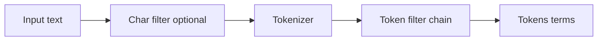
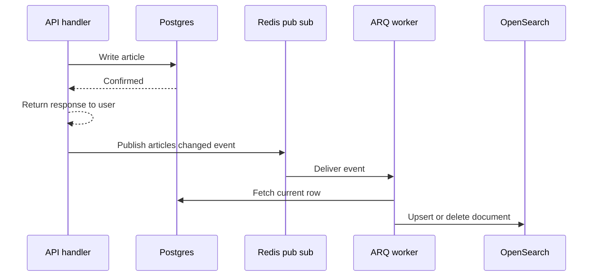

# Lecture 2 — OpenSearch: analyzers, BM25, and the search DSL

> *Postgres FTS shows you how far you can get without a search server. OpenSearch shows you what you give up to stay there. The same corpus, indexed into OpenSearch, gets you BM25 scoring (the de facto industry-standard relevance algorithm); per-field analyzer chains (so the title can stem differently from the body); a JSON query DSL with first-class boolean combinators; aggregations that compute facets in the same round-trip as the search hits; highlighting with per-field tag control; and a horizontal-scaling story (shards across nodes) that Postgres does not have. The cost is a separate service, a separate operational story, and an indexing pipeline that has to keep the OpenSearch index in sync with the source-of-truth database. The exchange is fair for corpora above ten million documents and for products where relevance is in the spec.*

## 1 — What OpenSearch is, and is not

OpenSearch is the **Apache-2.0 fork of Elasticsearch** that AWS started in 2021 after Elastic relicensed Elasticsearch 7.11 under SSPL. Up through Elasticsearch 7.10, the projects share a codebase; from OpenSearch 1.0 (released July 2021) onward they diverge but the search core remains substantially compatible. The scorer, the analyzer pipeline, the query DSL, and the index API are all near-identical. If you have read Elasticsearch documentation in the past, you already know 90% of OpenSearch.

The "Search" half of the name is misleading — OpenSearch is also a log analytics platform, a vector-search platform, and a security-analytics platform. We use only the search half this week. We do not use the OpenSearch Dashboards UI; we drive everything from `opensearch-py` and read responses as JSON.

OpenSearch is **not**:

- a relational database (no joins; no transactions across documents)
- a real-time index (writes are visible after a refresh interval, default 1 second — fine for search, wrong for "fetch the row I just wrote")
- a source of truth (every document indexed into OpenSearch must also live somewhere durable — usually Postgres; OpenSearch is a *view* on that source)
- a key-value store (you *can* `GET /index/_doc/id` to retrieve a document, but Redis is faster and cheaper for that workload)

## 2 — The index: documents, mappings, settings

An OpenSearch *index* is the unit of search. It is conceptually one table, with one schema (the *mapping*), one set of analyzer definitions (the *settings*), and a sharding configuration. A document in the index is a JSON object.

Creating an index is one API call:

```python
from opensearchpy import AsyncOpenSearch

client = AsyncOpenSearch(
    hosts=[{"host": "localhost", "port": 9200}],
    http_auth=("admin", "Crunch_Pro_W10_pw"),
    use_ssl=True,
    verify_certs=False,
)

await client.indices.create(
    index="articles",
    body={
        "settings": {
            "number_of_shards": 1,
            "number_of_replicas": 0,
            "analysis": {
                "analyzer": {
                    "crunch_english": {
                        "type": "custom",
                        "tokenizer": "standard",
                        "filter": ["lowercase", "english_stop", "english_stemmer"],
                    }
                },
                "filter": {
                    "english_stop": {"type": "stop", "stopwords": "_english_"},
                    "english_stemmer": {"type": "stemmer", "language": "english"},
                },
            },
        },
        "mappings": {
            "properties": {
                "title": {
                    "type": "text",
                    "analyzer": "crunch_english",
                    "fields": {"keyword": {"type": "keyword"}},
                },
                "body": {"type": "text", "analyzer": "crunch_english"},
                "author": {"type": "keyword"},
                "tags": {"type": "keyword"},
                "published_at": {"type": "date"},
            }
        },
    },
)
```

Five things to understand:

1. **`number_of_shards: 1`** — for development, this is correct. Production: pick the shard count by data volume; each shard holds up to ~30 GB comfortably. A 60 GB index wants 2 primary shards.
2. **`number_of_replicas: 0`** — for development with one node, replicas are pointless. Production: at least 1 (and ideally 2) so that the loss of one node does not lose data and a search can serve from any replica.
3. **`analysis`** is where you define your custom analyzer chain. `crunch_english` here is `standard` tokenizer plus three filters in order: `lowercase` (built-in), `english_stop` (defined just below it), `english_stemmer` (also defined just below). The filter order matters — lowercasing first, then stop-word removal, then stemming.
4. **`mappings.properties`** declares the document schema. `text` fields are analysed and full-text-searchable; `keyword` fields are stored verbatim and used for exact-match filters and aggregations. The `title` field has a sub-field `title.keyword` — a common pattern: search by `title` (analysed) but aggregate (facet) by `title.keyword` (exact).
5. **`published_at: date`** — OpenSearch parses ISO-8601 strings into dates automatically. The `date_histogram` aggregation (for "documents per month") needs this type.

## 3 — The analyzer chain in detail

An *analyzer* is a pipeline:

```text
input text  →  char_filter (optional)  →  tokenizer  →  token_filter*  →  tokens (terms)
```

- **`char_filter`**: pre-processing on the raw character stream. The common one is `html_strip` (drops HTML tags). Optional.
- **`tokenizer`**: splits the text into tokens. `standard` (the default, Unicode-aware word boundary) is the right pick for prose. `keyword` keeps the entire input as one token (rare; usually used on `keyword` fields directly). `whitespace` splits on spaces only (preserves punctuation; rare for prose).
- **`token_filter`**: a chain that transforms tokens. `lowercase`, `stop` (drops stop words), `stemmer` (Snowball or Porter stemmer), `synonym` (`car => automobile`), `ngram` (generates n-grams from each token), `asciifolding` (strips diacritics).


*The analyzer pipeline stages that turn raw text into indexed terms.*

The built-in `english` analyzer is `standard` + `lowercase` + `english_possessive_stemmer` + `english_stop` + `english_stemmer`. The custom `crunch_english` we built above is the same minus the possessive stemmer, which is fine.

### 3.1 — Inspecting the analyzer output

The `_analyze` endpoint lets you see what an analyzer produces for a given input. Useful for "why is this query not matching that document?" debugging:

```python
result = await client.indices.analyze(
    index="articles",
    body={"analyzer": "crunch_english", "text": "Python async generators are cool"},
)
# result["tokens"] is:
# [{"token": "python", ...}, {"token": "async", ...},
#  {"token": "gener", ...}, {"token": "cool", ...}]
```

Notice `generators` became `gener` (Snowball stem) and `are` was dropped (stop word).

### 3.2 — Write-time versus read-time analyzers

The `mappings.properties.title.analyzer` setting controls the **write-time** analyzer — the chain that runs at index time. By default, the same analyzer runs at query time (over the user's query string). You can override read-time with `search_analyzer`:

```python
"title": {
    "type": "text",
    "analyzer": "crunch_english",          # write-time
    "search_analyzer": "crunch_english_loose",  # read-time
}
```

The classic use case: index with a strict stemmer; search with a looser stemmer to catch a wider set of matches. Or index with a synonym filter at index time (so the synonyms are stored in the inverted index) and search without it (so queries are fast). The trade-off: changing the write-time analyzer requires reindexing; changing the read-time analyzer does not.

## 4 — BM25: the default scorer

OpenSearch scores every search hit with **BM25** (the Okapi BM25 formula). The formula:

```text
score(D, Q) = sum over terms q_i in Q of:
    IDF(q_i) * (f(q_i, D) * (k1 + 1)) / (f(q_i, D) + k1 * (1 - b + b * |D| / avgdl))
```

Where:

- `f(q_i, D)` is the term frequency of `q_i` in document `D`
- `|D|` is the length of document `D` in terms
- `avgdl` is the average document length in the index
- `IDF(q_i) = log((N - n(q_i) + 0.5) / (n(q_i) + 0.5) + 1)` with `N` the total document count and `n(q_i)` the number of documents containing `q_i`
- `k1` controls term-frequency saturation (default `1.2`)
- `b` controls length normalisation (default `0.75`)

In plain English: a document's score for a query is the sum, over the query terms, of three factors:

1. The **rarity** of the term in the corpus (`IDF`) — rare terms count more than common terms.
2. The **frequency** of the term in this document, with diminishing returns (the `k1` saturation curve) — the 10th occurrence adds less than the 2nd.
3. A **length normalisation** factor (`b`) — long documents are penalised, on the theory that they have more terms by accident.

The two tunable parameters:

- **`k1`** between `1.0` and `2.0` is sensible. Higher `k1` means term frequency matters more (the 5th occurrence still counts a lot). Lower `k1` saturates faster (the 2nd occurrence already adds little). For prose corpora, `1.2` is a good default. For very short documents (titles only), try `0.5`–`1.0`.
- **`b`** between `0.5` and `1.0` is sensible. Higher `b` punishes long documents harder. Lower `b` ignores length. For mixed-length corpora, `0.75` is the default; for short-text-only, try `0.0` (no length normalisation).

The Elastic blog series ([Practical BM25 Part 2](https://www.elastic.co/blog/practical-bm25-part-2-the-bm25-algorithm-and-its-variables) and [Part 3](https://www.elastic.co/blog/practical-bm25-part-3-considerations-for-picking-b-and-k1-in-elasticsearch)) is the canonical explainer; the formula is identical between Elasticsearch and OpenSearch.

### 4.1 — Per-field BM25 tuning

You can override `k1` and `b` per field:

```python
"settings": {
    "similarity": {
        "title_bm25": {"type": "BM25", "k1": 0.5, "b": 0.0},
    }
},
"mappings": {
    "properties": {
        "title": {"type": "text", "analyzer": "crunch_english", "similarity": "title_bm25"},
        "body":  {"type": "text", "analyzer": "crunch_english"},  # uses default BM25
    }
}
```

For titles (short text where length normalisation is mostly noise), `k1=0.5, b=0.0` produces tighter rankings than the default. The body uses the default. Tune only when the relevance harness (Lecture 3) tells you to.

## 5 — The search DSL

A search request is a POST to `/<index>/_search` with a JSON body. The body has several optional top-level keys:

```json
{
  "query":  { ... },
  "size":   25,
  "from":   0,
  "sort":   [ ... ],
  "highlight": { ... },
  "aggs":   { ... },
  "_source": ["id", "title", "author"]
}
```

`query` is the only required field. The rest control pagination, sorting, highlighting, faceting, and field projection.

### 5.1 — Leaf queries

The bread-and-butter leaf queries are:

- **`match`**: a single field, analysed. The user's query string is run through the field's analyzer, then matched.
  ```json
  {"query": {"match": {"body": "python async"}}}
  ```
- **`match_phrase`**: like `match`, but the tokens must appear in order and adjacent.
  ```json
  {"query": {"match_phrase": {"body": "python async generators"}}}
  ```
- **`multi_match`**: a single query string against multiple fields, with optional per-field boosts.
  ```json
  {"query": {"multi_match": {
      "query": "python async",
      "fields": ["title^3", "body"],
      "type": "best_fields"
  }}}
  ```
  The `^3` is a boost — matches on `title` count 3x as much as matches on `body`. The `type: "best_fields"` is the default — score is the best-matching field. Alternatives: `most_fields` (sum of all matching fields), `phrase` (treat as `match_phrase`), `cross_fields` (treat all fields as one combined field).
- **`term`** and **`terms`**: exact-match against `keyword` fields. Not analysed.
  ```json
  {"query": {"term": {"author": "Avrot, Lætitia"}}}
  {"query": {"terms": {"tags": ["python", "async"]}}}
  ```
- **`range`**: numeric or date range.
  ```json
  {"query": {"range": {"published_at": {"gte": "2025-01-01", "lt": "2026-01-01"}}}}
  ```

### 5.2 — Combining: `bool`

The `bool` query is the combinator. Four clauses:

```json
{
  "query": {
    "bool": {
      "must":     [ { "match": {"body": "python async"} } ],
      "should":   [ { "match": {"tags": "tutorial"} } ],
      "must_not": [ { "term":  {"author": "spammer"} } ],
      "filter":   [ { "range": {"published_at": {"gte": "2024-01-01"}} } ]
    }
  }
}
```

- **`must`** — clauses that must match; contribute to score.
- **`should`** — clauses that boost the score if they match; do not have to match (unless there is no `must`, in which case at least one `should` must match — the `minimum_should_match` parameter overrides).
- **`must_not`** — clauses that must not match; do not contribute to score.
- **`filter`** — clauses that must match but do not contribute to score (and are cached aggressively). The right place for date ranges and exact-match filters.

The rule of thumb: put **scoring** clauses in `must`/`should` (the things that should influence the ranking); put **filtering** clauses in `filter` (the things that just narrow the set). A date range is almost always a `filter`; a free-text query is almost always a `must`.

## 6 — Highlighting

The `highlight` block returns the matched substring wrapped in `<em>` tags (or whatever tags you specify):

```python
search_body = {
    "query": {"multi_match": {"query": "python async", "fields": ["title^3", "body"]}},
    "size": 25,
    "highlight": {
        "pre_tags": ["<mark>"],
        "post_tags": ["</mark>"],
        "fields": {
            "title": {"number_of_fragments": 0},
            "body":  {"number_of_fragments": 2, "fragment_size": 150},
        },
    },
}
result = await client.search(index="articles", body=search_body)
```

The response includes a `highlight` key per hit:

```json
{
  "hits": {"hits": [
    {
      "_id": "42",
      "_score": 3.14,
      "_source": {"title": "Python async generators", ...},
      "highlight": {
        "title": ["<mark>Python async</mark> generators"],
        "body":  ["...the <mark>async</mark> generator yields...", "...<mark>python</mark>'s generator protocol..."]
      }
    }
  ]}
}
```

The `number_of_fragments: 0` on `title` means "do not fragment; highlight the whole field". For `body` (long text), `number_of_fragments: 2` and `fragment_size: 150` produces two ~150-character snippets with ellipsis between them.

## 7 — Aggregations: the facets

Aggregations are the "count documents grouped by something" half of the API. They run in the same request as the search hits — one round-trip, two answers.

```python
search_body = {
    "query": {"match": {"body": "python"}},
    "size": 25,
    "aggs": {
        "by_author": {
            "terms": {"field": "author", "size": 10}
        },
        "by_month": {
            "date_histogram": {"field": "published_at", "calendar_interval": "month"}
        },
        "by_tag": {
            "terms": {"field": "tags", "size": 20}
        }
    }
}
```

The response includes an `aggregations` key alongside `hits`:

```json
{
  "hits": { ... },
  "aggregations": {
    "by_author": {"buckets": [
      {"key": "Avrot, Lætitia", "doc_count": 17},
      {"key": "Manning, Christopher", "doc_count": 12}
    ]},
    "by_month": {"buckets": [
      {"key_as_string": "2025-01-01", "doc_count": 8},
      {"key_as_string": "2025-02-01", "doc_count": 11}
    ]},
    "by_tag": {"buckets": [
      {"key": "python", "doc_count": 25},
      {"key": "tutorial", "doc_count": 19}
    ]}
  }
}
```

Three facet buckets, all computed alongside the 25 search hits, in one request. This is what makes "search with facets" so much cheaper on OpenSearch than on Postgres — Postgres needs a `GROUP BY` per facet, each a separate index scan.

## 8 — Indexing: single, bulk, and pipelines

Single-document index:

```python
await client.index(
    index="articles",
    id="42",
    body={
        "title": "Python async generators",
        "body": "Long body text ...",
        "author": "Avrot, Lætitia",
        "tags": ["python", "async"],
        "published_at": "2025-09-15T10:30:00Z",
    },
    refresh=False,  # do not refresh; the index becomes searchable on next periodic refresh
)
```

Bulk index (when seeding or reindexing a corpus):

```python
from opensearchpy.helpers import async_bulk

async def gen() -> Any:
    async for article in fetch_articles_from_postgres():
        yield {
            "_index": "articles",
            "_id": str(article["id"]),
            "_source": article,
        }

success, failed = await async_bulk(client, gen(), chunk_size=500)
```

The `async_bulk` helper batches the documents into `bulk` API calls of 500 per request. For a million-document corpus, this finishes in tens of minutes; doing one-at-a-time indexing of the same corpus takes hours.

### 8.1 — `refresh` and the eventual-consistency window

OpenSearch is not real-time. A document indexed at time T is not searchable until the next *refresh* (default every 1 second). For most workloads this is fine; for "I just indexed it; now I want to search for it" tests, set `refresh=True` (or call `client.indices.refresh(index="articles")` after a batch).

Production: leave the default 1-second refresh interval; do not set `refresh=True` on every write (it serialises the index and kills throughput).

## 9 — Operating the indexing pipeline

The right architecture: Postgres is the source of truth; OpenSearch is a derived view. Every `INSERT`/`UPDATE`/`DELETE` on `articles` publishes an event; an ARQ worker (from W8) consumes the event and updates OpenSearch.


*Postgres stays the source of truth while an ARQ worker keeps OpenSearch eventually consistent.*

```python
# In the article-create handler:
async def create_article(article: ArticleCreate) -> Article:
    row = await postgres.create(article)
    await redis.publish("articles:changed", json.dumps({"id": row.id, "op": "upsert"}))
    return row

# In the ARQ worker:
async def reindex_article(ctx: dict[str, Any], article_id: int) -> None:
    row = await postgres.get(article_id)
    if row is None:
        await opensearch.delete(index="articles", id=str(article_id), ignore=[404])
    else:
        await opensearch.index(index="articles", id=str(article_id), body=row.dict())
```

The handler does not block on OpenSearch; the user's `POST /articles` returns as soon as Postgres confirms. The OpenSearch index is *eventually* consistent — typically within a few seconds.

The failure modes to plan for:

- **Worker is down**: events accumulate in the queue; the OpenSearch index lags. Acceptable for short windows; alarm-worthy if the lag grows past minutes. Solution: monitor the queue length.
- **OpenSearch is down**: the worker's `client.index(...)` raises; the worker should retry with exponential backoff. ARQ supports this directly.
- **OpenSearch and Postgres disagree on document content**: a write to Postgres succeeded but the worker's reindex failed. Solution: a nightly reconciliation job — `SELECT id, updated_at FROM articles` then `GET /articles/_doc/{id}` and compare; reindex the diffs.

## 10 — When OpenSearch is the right answer

You graduate from Postgres FTS to OpenSearch when one of:

- **The corpus exceeds ~10 million documents** and Postgres `GIN` rebuild times become operational pain.
- **You need BM25 scoring** for parity with another system or for a relevance ceiling Postgres `ts_rank_cd` cannot reach.
- **You need faceting in the same round-trip as the search hits** for a UI that shows result counts per category. Postgres `GROUP BY` does it, but at multiple-index-scan cost.
- **You need per-field analyzer chains** — different stemmer for titles versus body, or different stop-word list for tags versus prose.
- **You need horizontal scale** — sharding across nodes, read replicas across data centres.
- **Your team has the operational capacity** for a second service: monitoring, backups, capacity planning, JVM tuning if you use the Java distribution.

If none of those, stay in Postgres. If two or more, OpenSearch is correct.

## 11 — What we did not cover

Deliberately out of scope this week:

- **Vector search and k-NN**: OpenSearch ships a strong vector-search story for embeddings-based retrieval. Out of scope for "we are indexing text and searching it with keywords".
- **Cross-cluster search**: federating queries across multiple OpenSearch clusters. Out of scope for our one-cluster topology.
- **Index Lifecycle Management (ILM)**: time-series index rotation. Useful for logs; irrelevant for an article corpus that does not rotate.
- **Reindexing under heavy write load**: the `_reindex` API and the alias-swap pattern. Covered in Lecture 3 §6 and in Challenge 2.

## 12 — What the next lecture builds on

Lecture 3 indexes the same corpus into Meilisearch, then introduces the **relevance harness** — the methodology for asking "which backend produces better results for our queries?" with a precision-at-5 number. By Wednesday afternoon you will have three implementations of "search the article corpus" and a comparison you can defend not just on latency, but on relevance.

## References

- [OpenSearch documentation root](https://opensearch.org/docs/latest/).
- [OpenSearch query DSL](https://opensearch.org/docs/latest/query-dsl/).
- [OpenSearch analyzers](https://opensearch.org/docs/latest/analyzers/).
- [Elastic — "Practical BM25 Part 2"](https://www.elastic.co/blog/practical-bm25-part-2-the-bm25-algorithm-and-its-variables) — the BM25 formula with worked examples.
- Robertson and Zaragoza, "The Probabilistic Relevance Framework: BM25 and Beyond", *Foundations and Trends in IR*, 2009. PDF: <https://www.staff.city.ac.uk/~sbrp622/papers/foundations_bm25_review.pdf>.
- [opensearch-py async client docs](https://opensearch-project.github.io/opensearch-py/api-ref/clients/async_client.html).
