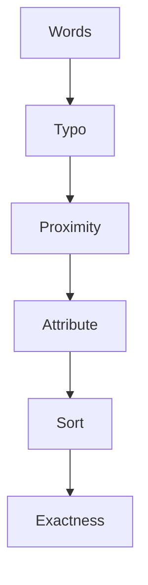
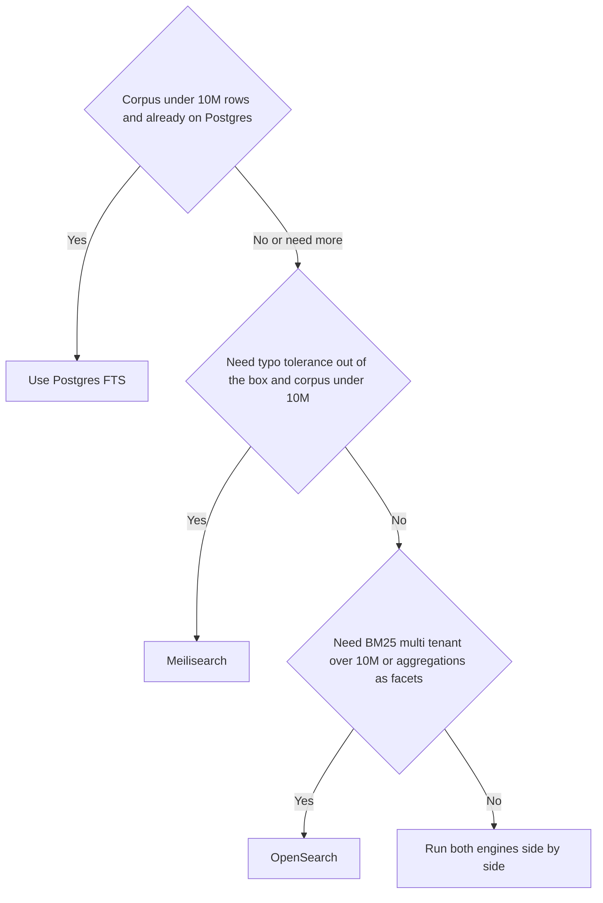

# Lecture 3 — Meilisearch, the relevance harness, and picking a backend

> *Postgres FTS gives you cheap and predictable. OpenSearch gives you tunable and scalable. Meilisearch gives you **typo-tolerant out of the box**, with a configuration surface so small that a junior engineer can ship it in an afternoon. Where OpenSearch's ranking is a tunable BM25, Meilisearch's ranking is a fixed pipeline of six rules — words, typo, proximity, attribute, sort, exactness — that the team has spent years iterating into a sensible default. You can reorder them; you can add custom rules; you cannot turn them off. The trade-off is a much smaller knob count: faster to ship, harder to extract that last 5% of relevance. For product search, autocomplete, in-app search-as-you-type, and most documentation-search use cases, Meilisearch is the right answer in the first conversation.*

## 1 — Meilisearch in five facts

1. **Open-source MIT**, written in Rust, started in 2018. Single binary, no JVM, single-process. Storage is LMDB.
2. **Designed for sub-50ms search**, including on devices the size of a Raspberry Pi. This is not marketing — the engine is genuinely fast on small-to-medium corpora because it pre-computes a lot at index time.
3. **Typo tolerance is on by default**. A user who types `pythn async` finds documents containing `python async` without you having to do anything. The thresholds are tunable (one typo if word length ≥ 5; two typos if word length ≥ 9, by default).
4. **No SQL-like query language.** You pass a search string and optional filters; you get back ranked documents. There is no equivalent of OpenSearch's `bool` query or Postgres's `JOIN`.
5. **Bounded corpus size.** Meilisearch loads index data into memory aggressively; on commodity hardware the comfortable upper bound is ~10 million small documents or ~1 million long ones. Above that you graduate to OpenSearch.

## 2 — The minimal Meilisearch app

Three operations cover 80% of the API:

```python
from __future__ import annotations

from typing import Any

try:
    from meilisearch_python_sdk import AsyncClient
except ImportError:  # pragma: no cover
    AsyncClient = None  # type: ignore[assignment, misc]


async def main() -> None:
    """Index three documents, then search them."""
    async with AsyncClient("http://localhost:7700", "Crunch_Pro_W10_key") as client:
        # Create or update the index by adding documents.
        index = client.index("articles")
        await index.add_documents(
            [
                {"id": 1, "title": "Python async generators", "body": "..."},
                {"id": 2, "title": "Asynchronous Django views", "body": "..."},
                {"id": 3, "title": "FastAPI dependencies",     "body": "..."},
            ]
        )
        # Search.
        result = await index.search("python async")
        for hit in result.hits:
            print(hit["id"], hit["title"])
```

Three things to notice:

1. **`index("articles")` does not create the index** in a separate step. Adding a document to a non-existent index creates it. (You can be explicit with `client.create_index("articles", primary_key="id")` if you want; not required.)
2. **`primary_key` is auto-detected**. Meilisearch looks at the first document and picks a field named `id`, `uid`, or `<index_name>_id` as the primary key. Override with `primary_key=` on the `create_index` call.
3. **Indexing is asynchronous server-side too**. `add_documents` returns a `TaskInfo` object describing a background task; the index is not searchable until the task finishes. For tests, you can `await client.wait_for_task(task.task_uid)`.

## 3 — The six ranking rules

Meilisearch applies six ranking rules **in order** to score and sort the results. The default order is:

1. **`words`** — documents containing more of the query's terms rank higher.
2. **`typo`** — documents matching with fewer typos rank higher.
3. **`proximity`** — documents where the matched terms appear closer together rank higher.
4. **`attribute`** — matches in fields earlier in `searchableAttributes` rank higher.
5. **`sort`** — apply any `sort` parameters from the search request.
6. **`exactness`** — documents whose terms match the query exactly (no stemming, no typo) rank higher.

Each rule is a *tiebreaker* for the previous rule. A document that "wins" on `words` (matches more terms) is ranked higher than one that does not, regardless of subsequent rules. Within the same `words` bucket, `typo` decides; within the same `(words, typo)` bucket, `proximity` decides; and so on.


*Each rule breaks ties left over from the rule before it, in this fixed order.*

You can reorder the rules per index:

```python
await client.index("articles").update_settings(
    settings={
        "rankingRules": [
            "words",
            "exactness",   # Promote exact matches above typo-corrected ones.
            "typo",
            "proximity",
            "attribute",
            "sort",
        ]
    }
)
```

You can also add **custom rules** based on a numeric field:

```python
"rankingRules": [
    "words", "typo", "proximity", "attribute", "sort", "exactness",
    "view_count:desc",   # Higher view_count breaks ties.
]
```

This puts `view_count` as the final tiebreaker — for documents that tie on all six default rules, the one with more views wins. The right place for popularity-style boosts.

### 3.1 — Why this design

OpenSearch / Elasticsearch make the ranking score a single number computed from BM25. The advantage: tunable. The disadvantage: it is a single number, and a tiny relevance bug can require re-derivation of the score across multiple fields, multiple analyzers, and function-score rewrites.

Meilisearch makes the ranking a *pipeline of tiebreakers*. The advantage: easy to reason about. "Why did document X rank above document Y?" has a step-by-step answer ("X matched more words; if you tie on words, X had fewer typos"). The disadvantage: you cannot say "this document is 0.3 better than that one"; the score is a tuple, not a number.

For most product-search applications, the tiebreaker model produces *more sensible* results out of the box than a tuned BM25. For research-style retrieval (where you want the score to be a tunable continuous quantity), BM25 wins.

## 4 — Searchable, filterable, sortable

Three settings determine what fields are searchable, filterable, and sortable:

```python
await client.index("articles").update_settings(
    settings={
        "searchableAttributes": ["title", "body"],          # search across these; order = attribute rule
        "filterableAttributes": ["author", "tags", "published_at"],
        "sortableAttributes":   ["published_at", "view_count"],
        "displayedAttributes":  ["id", "title", "body", "author", "tags", "published_at"],
    }
)
```

- **`searchableAttributes`** — only these are searched. The order matters: matches in earlier fields rank higher (the `attribute` ranking rule).
- **`filterableAttributes`** — fields that can appear in the `filter` query parameter (`author = 'Avrot'`, `tags IN ['python']`).
- **`sortableAttributes`** — fields that can appear in the `sort` query parameter (`published_at:desc`).
- **`displayedAttributes`** — only these are returned in search hits. Useful for hiding internal fields.

### 4.1 — Filtering and faceting

A search with a filter and faceting:

```python
result = await client.index("articles").search(
    "python async",
    {
        "limit": 25,
        "filter": "tags IN ['python', 'tutorial'] AND published_at > 1735689600",
        "facets": ["author", "tags"],
        "attributesToHighlight": ["title", "body"],
        "cropLength": 30,
    },
)
```

The response:

```text
SearchResults(
    hits=[...],
    facet_distribution={
        "author": {"Avrot": 12, "Manning": 8, ...},
        "tags":   {"python": 25, "tutorial": 19, "async": 14, ...}
    },
    estimated_total_hits=42,
    processing_time_ms=4,
)
```

`facet_distribution` is the equivalent of OpenSearch's `terms` aggregation — counts per facet bucket, computed in the same round-trip. The processing time on a small index is typically under 10 ms.

## 5 — Typo tolerance in detail

The default typo settings:

```python
"typoTolerance": {
    "enabled": True,
    "minWordSizeForTypos": {
        "oneTypo": 5,
        "twoTypos": 9,
    },
    "disableOnWords": [],
    "disableOnAttributes": [],
}
```

- Words shorter than 5 characters: no typo tolerance. ("`pyt`" must match `pyt` exactly.)
- Words 5–8 characters: 1 typo allowed. (`pythn` matches `python`.)
- Words 9+ characters: 2 typos allowed. (`asycnhronus` matches `asynchronous`.)

A "typo" is a Damerau-Levenshtein edit: a single-character insertion, deletion, substitution, or transposition. The typo tolerance is implemented in the index: Meilisearch stores, for every term, the set of terms within distance 1 and 2. This is why the index is bigger than a BM25 index — it precomputes the typo neighbourhood — and why search is fast at query time (no online distance computation; just look up the neighbourhood).

For an exact-match field (a product SKU, an ISBN, an internal identifier) where typo tolerance is wrong:

```python
"typoTolerance": {
    "disableOnAttributes": ["sku", "isbn"]
}
```

Or for specific words that should never be typo-corrected:

```python
"typoTolerance": {
    "disableOnWords": ["FastAPI", "Pydantic"]
}
```

## 6 — Reindexing strategies (cross-backend)

This section applies to all three backends; we put it here because reindexing pain is most acute in the OpenSearch/Meilisearch world (Postgres FTS reindexes automatically via the generated column).

### 6.1 — Stop-the-world

The simplest: delete the index, recreate it, re-bulk-index. Search is offline for the duration. Right for: development, batch nightly jobs, the first time you ship search. Wrong for: production with users actively searching.

### 6.2 — Alias swap (OpenSearch)

The production standard. The application points at an *alias* (`articles`), not the underlying index (`articles_v1`). To reindex with a new schema:

```python
# 1. Create the new index.
await client.indices.create(index="articles_v2", body=NEW_MAPPING)

# 2. Bulk-index every document into articles_v2.
await async_bulk(client, gen_from_postgres(), chunk_size=500)

# 3. Atomically swap the alias.
await client.indices.update_aliases(body={
    "actions": [
        {"remove": {"index": "articles_v1", "alias": "articles"}},
        {"add":    {"index": "articles_v2", "alias": "articles"}},
    ]
})

# 4. (Optional, after a soak period.) Delete the old index.
await client.indices.delete(index="articles_v1")
```

Step 3 is atomic in OpenSearch — the alias points at `_v1` one moment, at `_v2` the next, with no in-between state. The application code never changes; it always queries `articles`.

The double-write window: while step 2 runs, ongoing writes need to land in both `articles_v1` (so the live alias keeps serving fresh data) and `articles_v2` (so the new index has the latest data when the swap happens). Solution: dual-write in the indexing worker for the duration of the reindex, then drop the `_v1` write after the swap.

### 6.3 — Alias-equivalent (Meilisearch)

Meilisearch does not have first-class index aliases (as of v1.10). The closest equivalent is **index swapping**, available since v1.0:

```python
# 1. Build the new index.
await client.create_index("articles_v2")
await client.index("articles_v2").update_settings(NEW_SETTINGS)
await client.index("articles_v2").add_documents_in_batches(docs)

# 2. Wait for the indexing task to finish.
await client.wait_for_task(task.task_uid)

# 3. Atomically swap.
await client.swap_indexes([("articles", "articles_v2")])

# 4. Delete the now-superseded "articles_v2" (which holds the old content).
await client.delete_index("articles_v2")
```

The `swap_indexes` call atomically exchanges the contents of the two indexes — `articles` now contains what `articles_v2` contained, and vice versa. Then you delete the old index.

### 6.4 — Incremental reindex

For huge corpora where rebuilding from scratch is too expensive, use an incremental strategy: maintain a `last_indexed_at` timestamp per backend; reindex only rows changed since.

```sql
SELECT id, title, body, author, tags, published_at, updated_at
FROM articles
WHERE updated_at > $1
ORDER BY updated_at
LIMIT 1000;
```

The Python loop processes batches and advances `$1` to the most recent `updated_at` seen. Run nightly to keep all three backends within 24 hours of source-of-truth Postgres; run more often if your application demands lower lag.

## 7 — The relevance harness

The hardest question this week is "which backend is better?". The answer is *measured*, not asserted. The methodology:

1. **Define a query set.** Pick 50 queries the way real users phrase them — including misspellings, including very short queries (one word), including specific phrases. Add 10 adversarial queries (synonyms, plurals, words with diacritics, queries with stop words).
2. **Hand-label the expected top-5 results.** For each query, decide which 5 documents *should* appear at the top. This is the hardest step; it is also the only step that gives the answer meaning.
3. **Run each query against each backend.** Capture the top-25 IDs.
4. **Compute precision-at-5.** For each query, count how many of the top-5 returned IDs are in the expected-top-5 set. Average across the 50 queries.
5. **Defend the choice.** "Meilisearch p@5 = 0.71, OpenSearch p@5 = 0.68, Postgres p@5 = 0.54. We will use Meilisearch for the user-facing search and Postgres FTS for the admin search where typo tolerance is not needed."

```python
from __future__ import annotations

from typing import Any


def precision_at_k(returned: list[int], expected: set[int], k: int = 5) -> float:
    """Fraction of the top-k returned IDs that are in the expected set."""
    top_k = returned[:k]
    if not top_k:
        return 0.0
    hits = sum(1 for doc_id in top_k if doc_id in expected)
    return hits / k


def evaluate_backend(
    queries: list[dict[str, Any]],
    search_fn: Any,
) -> dict[str, float]:
    """Compute mean precision-at-5 across the query set."""
    scores: list[float] = []
    for q in queries:
        returned = search_fn(q["query"], limit=25)
        scores.append(precision_at_k(returned, set(q["expected_ids"]), k=5))
    return {"mean_p_at_5": sum(scores) / len(scores) if scores else 0.0}
```

The full harness is built in Exercise 4 and used in Challenge 1.

### 7.1 — Why precision-at-5, not recall or MRR

For user-facing search, the user looks at the top 5 (occasionally 10). The bottom of the results page is irrelevant. **Precision-at-5** measures exactly the surface a user sees.

**Recall-at-5** ("of the relevant documents in the corpus, how many made it into the top 5") matters for completeness-style retrieval (legal e-discovery, academic search). For product search, it does not — you do not care if document #842 is relevant if document #1 is also relevant; the user clicked the first one and moved on.

**Mean Reciprocal Rank (MRR)** ("for each query, what is `1 / rank_of_first_relevant`?") is also defensible, especially when there is *exactly one* right answer per query (a "find my order" search). For multi-result product search, p@5 is more honest.

## 8 — The three-backend picker

Bringing it together:

| Criterion | Postgres FTS | OpenSearch | Meilisearch |
|----|----|----|----|
| Operational cost | None (you already have Postgres) | High (separate cluster) | Medium (one binary) |
| Corpus size sweet spot | < 10M rows | 10M–1B rows | < 10M small docs |
| Latency on 1M docs | 20–50ms | 5–20ms | 2–10ms |
| Typo tolerance | None (use `pg_trgm` fallback) | Configurable (fuzzy query) | Default-on |
| Scoring | `ts_rank_cd` (cover density) | BM25 (tunable) | Six-rule pipeline |
| Faceting | `GROUP BY` (multiple scans) | `aggs` (one round-trip) | `facets` (one round-trip) |
| Highlighting | `ts_headline` | `highlight` block | `attributesToHighlight` |
| Custom analyzers | Per-config (per-database) | Per-field | Fixed (configurable typo only) |
| Reindexing | Automatic (generated column) | Alias swap | Index swap |
| Horizontal scale | One node | Many nodes | One node |
| Best fit | Internal tools, admin search, MVP search | Logs, multi-tenant search, search-with-aggregations | Product search, in-app search, documentation search |

The picker is a tree:

```text
Is the corpus < 10M rows AND you already have Postgres?
├── Yes → Use Postgres FTS. (Stop here unless one of the below applies.)
│   ├── Need typo tolerance? Add pg_trgm fallback.
│   └── Need faceting? GROUP BY works; revisit if it slows.
└── No, or you need more:
    ├── Need typo tolerance out-of-the-box AND corpus is < 10M?
    │   └── Meilisearch.
    ├── Need BM25, multi-tenant, > 10M, or aggregations-as-facets?
    │   └── OpenSearch.
    └── Need both? Run both. They are not mutually exclusive.
```


*The same backend picker, as a decision tree.*

The "run both" answer is more common than people expect. A common pattern: OpenSearch for the admin search (long, ad-hoc queries with filters); Meilisearch for the user-facing search bar (short, typo-tolerant queries with autocomplete). The cost of running both is two services; the benefit is the right tool for each job.

## 9 — When to upgrade from Meilisearch to OpenSearch

The signals:

- **Corpus growth past 1M long documents or 10M short ones**, with index memory pressure on the Meilisearch host.
- **Need for shard-level parallelism** — you cannot scale Meilisearch horizontally; OpenSearch scales by adding nodes.
- **Need for multi-tenancy at index level** — OpenSearch's per-index analyzers and per-index settings give you cleaner isolation between tenants.
- **A relevance ceiling you cannot reach with Meilisearch's ranking rules** — the BM25 tunable surface is genuinely wider once you know what you are doing.
- **Logging or observability use cases on the same cluster** — OpenSearch's log-analytics features (and dashboards) make it a two-for-one if you already use it for metrics.

Conversely, downgrade signals (OpenSearch → Meilisearch):

- **The team finds the OpenSearch operational surface burdensome** (JVM, multi-node coordination, capacity planning).
- **The corpus is small enough that the per-query latency win from Meilisearch is worth the migration**.
- **The product requires typo tolerance as a first-class feature**, and tuning OpenSearch fuzzy queries to match Meilisearch's defaults is consuming engineering time.

## 10 — What the next mini-project ties together

The W10 mini-project takes the W7 article service and adds a `/search` endpoint backed by all three engines, switchable by a query parameter. The relevance harness from Exercise 4 runs against each backend; the `BENCHMARK.md` reports the numbers; the README defends the default. By the end of the week you have working code, working benchmarks, and a written justification for the picker that future you (and future code reviewers) can read.

## References

- [Meilisearch documentation](https://www.meilisearch.com/docs).
- [Meilisearch ranking rules](https://www.meilisearch.com/docs/learn/relevancy/ranking_rules).
- [Meilisearch typo tolerance](https://www.meilisearch.com/docs/learn/relevancy/typo_tolerance_settings).
- [Meilisearch swap-indexes API](https://www.meilisearch.com/docs/reference/api/swap_indexes).
- Manning, Raghavan, Schütze, *Introduction to Information Retrieval*, Chapter 8 (Evaluation in information retrieval). Open-access at <https://nlp.stanford.edu/IR-book/>.
- Doug Turnbull and John Berryman, *Relevant Search* (Manning, 2016) — book-length treatment of the relevance-tuning methodology.
