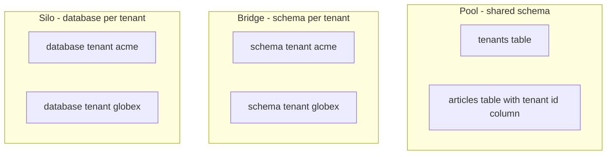
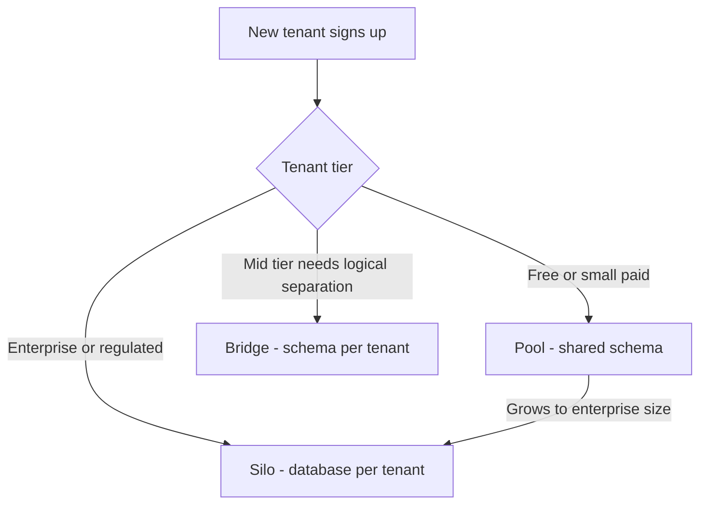

# Lecture 1 — Isolation models: pool (shared schema), bridge (schema-per-tenant), silo (database-per-tenant)

> *Multi-tenancy is not a feature; it is an architecture. The decision happens on day one and constrains the next three years. The AWS SaaS Lens calls the three options "pool", "bridge", and "silo"; the academic literature calls them "level 4", "level 3", and "level 1" of the maturity model; the rest of us say "shared schema", "schema-per-tenant", and "database-per-tenant". The names matter less than the question they answer: how much of the database do Tenant A and Tenant B share? In pool, everything but a column. In bridge, the schema. In silo, nothing. Cost goes down as sharing goes up; isolation goes up as sharing goes down. The good news is that every backend in production today is one of these three. The bad news is that picking the wrong one costs you eighteen months of migration work. The job of this lecture is to make the pick deliberate.*

## 1 — The vocabulary

The AWS SaaS Lens (a free whitepaper at <https://docs.aws.amazon.com/wellarchitected/latest/saas-lens/tenant-isolation.html>) is the industry-standard reference. It defines three isolation strategies. We will use these three names through Week 11 because they are the names you will see in every senior-engineer SaaS conversation from now until 2030.

- **Pool**. All tenants share the same database, the same schema, the same tables. Tenant identity lives in a `tenant_id` column on every row of every tenant-scoped table. Every query filters by that column (or relies on RLS to filter for it). One table, one set of indexes, one Postgres instance — many tenants.
- **Bridge**. All tenants share the same database, but each tenant has its own *schema* (in the Postgres `CREATE SCHEMA` sense). Tenant `acme` has tables `acme.articles`, `acme.users`; tenant `globex` has tables `globex.articles`, `globex.users`. The application sets the `search_path` per connection to pick the right tenant's tables.
- **Silo**. Each tenant has their own database (or, in cloud-native deployments, their own RDS instance, their own Aurora cluster, their own Postgres VM). Tenant identity lives in the *connection string*. Tenant A and Tenant B do not even share a process; their bytes do not pass through the same RAM.


*How much of the database Tenant A and Tenant B share, from everything in pool to nothing in silo.*

The Microsoft Research paper that originated the vocabulary (Chong & Carraro, 2006) called these "Level 4", "Level 3", and "Level 1" of a *maturity model*. The implication was that pool was the most "mature" choice. That implication is wrong; the choice is workload-dependent, not maturity-dependent. The 2026 industry consensus, set by the AWS SaaS Lens, is that pool, bridge, and silo are *peer* options chosen by tenant tier and regulatory requirement, not a ladder you climb.

## 2 — Pool: the shared-schema model

Pool is the model the SaaS industry standardised on for small-to-medium tenants because it is the only one where onboarding a new tenant is an `INSERT`.

### 2.1 — The data model

Every tenant-scoped table gets a `tenant_id` column. The convention is:

```sql
CREATE TABLE tenants (
    id          uuid PRIMARY KEY DEFAULT gen_random_uuid(),
    slug        text NOT NULL UNIQUE,
    name        text NOT NULL,
    created_at  timestamptz NOT NULL DEFAULT now()
);

CREATE TABLE articles (
    id          bigserial,
    tenant_id   uuid NOT NULL REFERENCES tenants(id) ON DELETE CASCADE,
    title       text NOT NULL,
    body        text NOT NULL,
    author      text NOT NULL,
    published_at timestamptz NOT NULL DEFAULT now(),
    PRIMARY KEY (tenant_id, id)
);

CREATE INDEX articles_by_tenant_published ON articles (tenant_id, published_at DESC);
```

Three details that matter.

First: **the primary key is composite** — `(tenant_id, id)`. This is deliberate. A `bigserial` `id` alone is unique within the table, but the *natural* unit of locality is "all articles for tenant X". Composite primary keys cluster the table by `tenant_id` (in Postgres, `CLUSTER` against the primary key index will physically reorder the heap by tenant), which keeps tenant A's rows together on disk. Cache locality follows.

The alternative — `id bigserial PRIMARY KEY` with a separate `tenant_id uuid NOT NULL` and a `CREATE INDEX ON articles (tenant_id)` — is also valid and is what some shops prefer. The composite-PK approach has a stronger guarantee (you cannot accidentally write a query like `SELECT * FROM articles WHERE id = 42` without a tenant filter, because the PK index requires `tenant_id` for a lookup), and it is the pattern Citus expects when you distribute by `tenant_id`. We will use composite PKs through the W11 exercises.

Second: **every secondary index includes `tenant_id` as the leading column**. The reasoning is the same as for the PK: every query worth indexing for is, fundamentally, a per-tenant query. `(tenant_id, published_at DESC)` lets the planner answer "the 25 most recent articles for tenant X" with a clean `Index Scan`. `(published_at DESC)` alone would let the planner answer "the 25 most recent articles globally" — which is a query you should not be running in a multi-tenant pool.

Third: **the foreign key cascades on delete**. `ON DELETE CASCADE` from `articles.tenant_id` to `tenants.id` means that deleting a tenant deletes all their articles atomically. This is the tenant-offboarding pattern: `DELETE FROM tenants WHERE id = $1` and everything tenant-scoped follows. For tenants with large data volumes the cascade can be slow; the production-scale variation is to soft-delete the tenant (set `tenants.deleted_at = now()`) and let a background job clean up the rows, but the cascade is the right starting point.

### 2.2 — The query story

Every query against a tenant-scoped table must filter by `tenant_id`. There are two ways to enforce this:

1. **Explicit filter in every query**. `SELECT * FROM articles WHERE tenant_id = $1 AND id = $2`. The engineer is responsible. The compiler is not helping. The day one engineer forgets is the day Tenant A's article is returned to Tenant B's user.
2. **RLS policy** that adds the filter automatically. Lecture 2 covers this end to end; the summary is that Postgres can apply a `WHERE tenant_id = current_setting('app.current_tenant')` clause to every query against the table without the application needing to write it.

The 2026 best practice is **do both**. RLS is the safety net; explicit filters are still cheaper to reason about and easier to read in code review. Belt and braces.

### 2.3 — The onboarding story

A new tenant in pool is one row:

```sql
INSERT INTO tenants (slug, name) VALUES ('acme', 'Acme Corporation') RETURNING id;
```

That is it. The tenant exists. They can be granted users, they can be billed, they can start using the API the moment the row is committed. There is no DDL, no migration, no Terraform run, no infrastructure provisioning. This is the operational advantage that makes pool the default for free-tier and small-paid-tier tenants.

### 2.4 — The cost curve

The economic argument for pool is simple: every tenant pays a fraction of the cost of one Postgres instance. With 10 000 tenants on one `db.r6g.xlarge` (8 vCPU, 32 GB RAM, roughly USD 290/month at on-demand 2026 prices), the per-tenant infrastructure cost is USD 0.029/month. With each tenant on their own `db.t4g.micro` (the smallest viable RDS instance, USD 12/month), the per-tenant cost is USD 12/month — 400× more expensive. For free-tier and low-margin tenants, the pool model is the only one that makes financial sense.

The non-economic cost of pool is the engineering discipline required to keep tenants isolated. Every query must filter by `tenant_id`. Every cache key must include the tenant ID. Every search index must be partitioned or filtered by tenant. Every migration must be aware that "this table has 10 000 tenants in it". The first time you find a query that does `SELECT count(*) FROM articles` (no tenant filter) and it counts every tenant's articles, you understand why bridge and silo exist.

### 2.5 — The failure modes

Three classes of failures define the pool model:

- **The leaked-row failure**. An engineer writes a query without the `tenant_id` filter. The query returns rows from another tenant. The fix is RLS. The discovery is usually after a customer complaint.
- **The noisy-neighbour failure**. One tenant's traffic dominates the database. Their query plans evict useful pages from `shared_buffers`. Their slow queries hold locks that block other tenants. The fix is per-tenant rate limits and per-tenant connection-pool quotas (Lecture 3).
- **The migration-blast-radius failure**. A migration that locks a table locks it for *every* tenant. A migration that fails halfway leaves *every* tenant in a half-migrated state. The fix is the Stripe online-migration pattern: never lock the table; always add nullable, backfill, set not null, deploy. (Cited at <https://stripe.com/blog/online-migrations>.)

## 3 — Bridge: schema-per-tenant

Bridge keeps the database shared but gives each tenant their own *schema*. Tenant `acme` has tables `acme.articles`, `acme.users`; tenant `globex` has tables `globex.articles`, `globex.users`. The same Postgres process, the same connection pool, but different namespaces.

### 3.1 — The data model

```sql
-- One schema per tenant.
CREATE SCHEMA tenant_acme;
CREATE SCHEMA tenant_globex;

-- The same DDL applied to each schema.
CREATE TABLE tenant_acme.articles (
    id          bigserial PRIMARY KEY,
    title       text NOT NULL,
    body        text NOT NULL,
    author      text NOT NULL,
    published_at timestamptz NOT NULL DEFAULT now()
);

CREATE TABLE tenant_globex.articles (
    id          bigserial PRIMARY KEY,
    title       text NOT NULL,
    body        text NOT NULL,
    author      text NOT NULL,
    published_at timestamptz NOT NULL DEFAULT now()
);
```

Note: **no `tenant_id` column needed**. The schema *is* the tenant identifier. Application code that does `SELECT * FROM articles WHERE id = 42` will, once the `search_path` is set, hit the right tenant's table automatically.

### 3.2 — The `search_path` mechanism

The application sets the schema search path on every connection at the start of the request:

```sql
SET search_path TO tenant_acme, public;
```

This tells Postgres "when you see an unqualified table name, look it up first in `tenant_acme`, then in `public`". A query `SELECT * FROM articles` now resolves to `tenant_acme.articles`. A query `SELECT * FROM tenants` (a shared admin table, presumably in `public`) resolves to `public.tenants` because there is no `tenant_acme.tenants`.

The application changes are smaller than in pool: the model layer stays the same; only the connection-acquisition path changes. A FastAPI dependency that resolves the tenant and sets the `search_path` at the start of the transaction is sufficient.

The Postgres `SET search_path` documentation is at <https://www.postgresql.org/docs/current/runtime-config-client.html#GUC-SEARCH-PATH>. The right pattern is `SET LOCAL search_path` for the same reason as `SET LOCAL app.current_tenant` — transaction-scoped, not connection-scoped, so a returned-to-pool connection does not inherit Tenant A's search path for Tenant B's next request.

### 3.3 — The onboarding story

A new tenant in bridge is a script:

```bash
psql -d crunchreader -c "CREATE SCHEMA tenant_widgets"
psql -d crunchreader -c "SET search_path TO tenant_widgets, public" -f schema.sql
```

The script runs the same DDL against the new schema. It is automated; it is fast (typically under a second per tenant for our table count); it is idempotent if written correctly. But it is *more* than the single `INSERT` of pool, and that matters when the onboarding flow runs from a web hook and must complete in under 30 seconds.

### 3.4 — The migration story

Bridge migrations are the hardest of the three models. The same DDL must run against every tenant schema. A migration runner walks the `pg_namespace` table for schemas matching `tenant_*` and applies the DDL to each. Three production gotchas:

- **Order matters across tenants under load.** If the migration runs for 10 minutes against tenant 1 and then 10 minutes against tenant 2, tenant 1 is on the new schema while tenant 2 is still on the old. The application code must handle both states (the "dual-read" stage of the Stripe online-migrations pattern).
- **Failure handling is per-tenant.** If the migration succeeds against 47 tenants and fails against the 48th, do you roll back all 47? Continue and retry the 48th? The runbook for each option is different.
- **Catalog bloat.** With 10 000 tenants × 50 tables per tenant = 500 000 entries in `pg_class`. Postgres handles this, but plan caches grow, `\d` becomes slow, and `pg_dump` of "just one tenant" requires a schema filter.

### 3.5 — When bridge is the right answer

Bridge is the right answer when:

- **Per-tenant backups and restores matter.** A tenant says "please restore our data to last Tuesday's state". In pool, that is a complex selective restore; in bridge, it is `pg_dump --schema=tenant_acme` and `pg_restore`.
- **Per-tenant migrations are sometimes desirable.** Tenant A is on Plan A with feature X; Tenant B is on Plan B without feature X. In bridge, you can apply the migration that adds the table for feature X only to Plan A tenants. In pool, the column exists for everybody whether they use it or not.
- **Compliance requires "logical separation" but not "physical separation"**. Some regulatory frameworks accept "different schemas" as sufficient isolation; others demand "different databases". When the auditor is satisfied with bridge, you do not need silo.

The Microsoft Azure SQL Database documentation has a thorough discussion of when bridge wins; see <https://learn.microsoft.com/en-us/azure/azure-sql/database/saas-tenancy-app-design-patterns>.

## 4 — Silo: database-per-tenant

Silo is the strongest isolation and the most expensive operation. Each tenant gets their own database. Tenant A and Tenant B do not share a query planner, a buffer pool, a WAL, or a `pg_stat_activity` view. They are physically separate.

### 4.1 — The data model

There is no special data model. The single-tenant schema you started Week 7 with *is* the silo schema. Each tenant database holds:

```sql
CREATE TABLE articles (
    id          bigserial PRIMARY KEY,
    title       text NOT NULL,
    body        text NOT NULL,
    author      text NOT NULL,
    published_at timestamptz NOT NULL DEFAULT now()
);
```

Identical across tenants. The tenant identifier lives in the connection string, not in any column or schema name.

### 4.2 — The connection mechanism

The application holds a per-tenant connection pool, typically a `dict[uuid, asyncpg.Pool]`:

```python
class TenantPoolRegistry:
    def __init__(self) -> None:
        self._pools: dict[uuid.UUID, asyncpg.Pool] = {}

    async def get_pool(self, tenant_id: uuid.UUID) -> asyncpg.Pool:
        if tenant_id not in self._pools:
            dsn = await self._lookup_dsn(tenant_id)
            self._pools[tenant_id] = await asyncpg.create_pool(dsn=dsn, min_size=1, max_size=5)
        return self._pools[tenant_id]
```

The first request for a tenant after a process restart pays the cold-start cost — opening a TCP connection, completing the TLS handshake, authenticating, allocating the connection pool. Subsequent requests reuse the pool.

Two production considerations:

- **The pool registry grows linearly with tenant count.** With 10 000 silo tenants × 5 max connections each, the application holds 50 000 potential connections. Postgres's `max_connections` is, by default, 100. The mismatch is the reason silo deployments use a connection pooler like `pgbouncer` in front of each tenant database, or use Postgres versions with connection-pooling improvements (Postgres 14+ has multiple improvements; `pgcat` is the actively-developed Rust pooler).
- **The DSN lookup must be cached.** Reading "which database does tenant X live in?" from a central tenant-registry database on every request would itself be a multi-tenant bottleneck. Cache the DSN locally (and invalidate when the tenant is migrated between databases, which is a rare but real operation).

### 4.3 — The onboarding story

A new tenant in silo is an infrastructure operation:

```bash
# Create the RDS instance (or Postgres VM, or Aurora cluster).
aws rds create-db-instance --db-instance-identifier tenant-widgets ...

# Wait for it to come up.
aws rds wait db-instance-available --db-instance-identifier tenant-widgets

# Run the schema migration against the new database.
psql -h tenant-widgets.cluster-xxx.amazonaws.com -f schema.sql

# Register the tenant in the central tenant-registry.
psql -d tenant_registry -c "INSERT INTO tenants (slug, name, dsn) VALUES (...)"
```

Onboarding time: minutes to tens of minutes, depending on the cloud provider's provisioning latency. This is why silo is not the default — you cannot have a user sign up at the marketing site and start using the product 30 seconds later if their database has not finished provisioning.

The standard mitigation is a **pool of pre-provisioned silo instances**. Keep N empty Postgres instances warm; when a tenant signs up, claim one from the pool and start their migration in parallel with the rest of the onboarding flow. The user gets a "your environment is provisioning" message; their database is ready by the time they click through the welcome wizard.

### 4.4 — The cost curve (again)

Silo is the most expensive model per tenant. A managed Postgres instance — even the smallest viable one — is typically USD 10–25/month. With 10 000 tenants, that is USD 100 000–250 000/month in pure database cost, not counting application servers, monitoring, backup storage, or operational overhead. Silo is the right answer for tenants who *pay* enough to justify that cost: enterprise contracts at USD 1 000+/month per tenant, where database cost is a single-digit-percent line item.

### 4.5 — When silo is the right answer

Silo is the right answer when:

- **Data residency requirements demand physical separation.** "Tenant X's data must reside in the EU." In pool, every row is in the same database; you cannot place rows in different regions. In bridge, schemas live in the same database too. In silo, each tenant has their own database, and that database can live in their region.
- **Regulatory compliance demands "single-tenant infrastructure".** Some HIPAA, GDPR, and SOC 2 contracts explicitly require single-tenant database infrastructure. Pool and bridge are non-starters; only silo qualifies.
- **A single tenant's load is bursty and would dominate a pool.** A B2B service whose tenants are themselves at-scale companies often has one or two tenants who drive 90% of the load. Silo prevents their bursts from impacting smaller tenants.
- **Tenant-specific feature flags require schema variations.** When customising the schema per tenant (extra tables, different columns) is a routine business operation, silo's per-tenant DDL is the right tool.

## 5 — The picker

The decision is not binary. Most production SaaS deployments are *hybrid*: pool for free and small-paid tiers, silo for enterprise customers, sometimes bridge for the middle tier. The picker is a matrix.

| Factor                              | Pool                                   | Bridge                              | Silo                                  |
|-------------------------------------|----------------------------------------|-------------------------------------|---------------------------------------|
| **Per-tenant infrastructure cost**  | ~USD 0.03/month per tenant             | ~USD 0.30/month per tenant          | USD 10–25/month per tenant            |
| **Onboarding latency**              | One `INSERT` — milliseconds            | One script — under a second         | Minutes to tens of minutes            |
| **Isolation strength**              | Application + RLS                      | Postgres schema + RLS               | Full process separation               |
| **Migration cost**                  | One DDL across one schema              | One DDL × N schemas                 | One DDL × N databases                 |
| **Per-tenant backup**               | Selective restore from full dump       | `pg_dump --schema=tenant_x`         | Whole-database backup per tenant      |
| **Data residency**                  | Single region only                     | Single region only                  | Per-tenant region selection           |
| **Noisy-neighbour exposure**        | High; needs explicit rate limits       | Medium; same DB but separate tables | Minimal; physically isolated          |
| **Catalog bloat at 10 000 tenants** | Negligible                             | Significant (500 000 `pg_class` rows) | None per-DB                         |
| **Typical tenant tier**             | Free tier, small paid                  | Mid-tier paid                       | Enterprise, regulated, single-tenant  |
| **Industry examples**               | Salesforce, Slack free, GitHub free    | Atlassian (some products), Notion (historical) | Stripe enterprise, SAP large enterprise |

The 2026 industry consensus, set by the AWS SaaS Lens, is that the picker should not produce a single answer for the whole product. A typical SaaS service runs:

- **80–95% of tenants in pool.** Free tier, small paid tier, mid paid tier. The economics demand it.
- **5–15% in bridge.** Tenants whose contracts include "logical separation" clauses, or tenants who need per-tenant schema customisation without the operational cost of silo.
- **0–5% in silo.** Enterprise tenants paying USD 1 000+/month, regulated-industry tenants, single-tenant-by-contract.

The tiers can graduate. A tenant who starts in pool and grows to enterprise size is migrated to silo via the Stripe online-migration pattern (dual-write to both old and new, backfill, dual-read, decommission old). Migrating *down* — from silo to pool — is rare and usually a sign that someone over-provisioned.


*The picker in practice: tier decides the starting model, and tenants graduate up, never down.*

## 6 — Per-tenant Redis: the cache story preview

The same picker applies to the cache layer, with the same trade-offs:

- **Shared Redis with tenant-prefixed keys.** `tenant:{tenant_id}:article:{article_id}`. One Redis instance, all tenants. The "pool" of the cache world. Cheap, fast, but subject to noisy-neighbour eviction.
- **Per-tenant Redis databases.** Redis supports 16 numbered databases per instance (`SELECT 0` through `SELECT 15`); you can put each tenant on a different number. Capped at 16 tenants per instance; not a viable strategy at scale.
- **Per-tenant Redis instances.** Each tenant gets their own Redis container. The "silo" of the cache world. Strong isolation, high operational cost.

The 2026 best practice is shared Redis with tenant-prefixed keys, with a per-tenant cache-size *budget* tracked by `MEMORY USAGE` and enforced by a sweeper job that evicts the oldest entries for over-budget tenants. Lecture 3 walks through this.

## 7 — Comparing to NoSQL: DynamoDB, Cosmos DB

The pool / bridge / silo vocabulary maps to NoSQL too, with different mechanisms:

- **DynamoDB pool**: one table with `tenant_id` as the partition key. Cheap; the AWS SaaS Lens has a worked example. The "hot partition" problem is the NoSQL equivalent of the noisy-neighbour problem.
- **DynamoDB bridge**: one table per tenant. DynamoDB tables are cheap to create (no provisioning); this is more viable than schema-per-tenant in Postgres.
- **DynamoDB silo**: one DynamoDB *account* per tenant. Used for the most isolated enterprise tenants. The AWS SaaS Lens has a "silo with AWS account isolation" reference architecture.

The pattern translation is direct. The cost curves are different (DynamoDB's per-tenant infrastructure cost is dominated by the read/write capacity unit count, not the table count), but the same three models exist.

## 8 — Practitioner summary

Three things to remember out of Lecture 1:

1. **The decision is workload-dependent, not maturity-dependent.** Pool is not "better than" silo or vice versa; they answer different questions. The right answer for your free tier may be the wrong answer for your enterprise tier; running both is normal.
2. **The default starting point in 2026 is pool with RLS.** Free-tier and small-paid tenants need pool's economics; the RLS safety net (Lecture 2) makes pool's isolation acceptable. The exception is regulated-industry products that start at silo because the contract requires it.
3. **Graduate up, never down.** A tenant who grows from pool to silo is a successful tenant. A tenant who has to be moved from silo to pool is a tenant the product mis-tiered. Plan for upward migration paths; ignore the downward ones.

Lecture 2 turns to the implementation: how do you actually keep tenants isolated, in code, under load, with a connection pool and a request-scoped tenant context? The answer is row-level security plus `SET LOCAL`, and there are gotchas.

---

### References cited in this lecture

- AWS SaaS Lens — Tenant isolation: <https://docs.aws.amazon.com/wellarchitected/latest/saas-lens/tenant-isolation.html>
- AWS SaaS Architecture Fundamentals whitepaper: <https://docs.aws.amazon.com/whitepapers/latest/saas-architecture-fundamentals/saas-architecture-fundamentals.html>
- Stripe Engineering — "Online migrations at scale": <https://stripe.com/blog/online-migrations>
- Stripe Engineering — "Scaling our database infrastructure": <https://stripe.com/blog/scaling-database-infrastructure>
- Microsoft Azure — "Multi-tenant SaaS database tenancy patterns": <https://learn.microsoft.com/en-us/azure/azure-sql/database/saas-tenancy-app-design-patterns>
- Citus Data — Multi-tenant applications: <https://docs.citusdata.com/en/stable/use_cases/multi_tenant.html>
- Chong & Carraro, "Architecture Strategies for Catching the Long Tail" (MSDN, 2006) — the original tenant-isolation maturity model: <https://learn.microsoft.com/en-us/previous-versions/dotnet/articles/aa479069(v=msdn.10)>
- Postgres `SET search_path`: <https://www.postgresql.org/docs/current/runtime-config-client.html#GUC-SEARCH-PATH>
