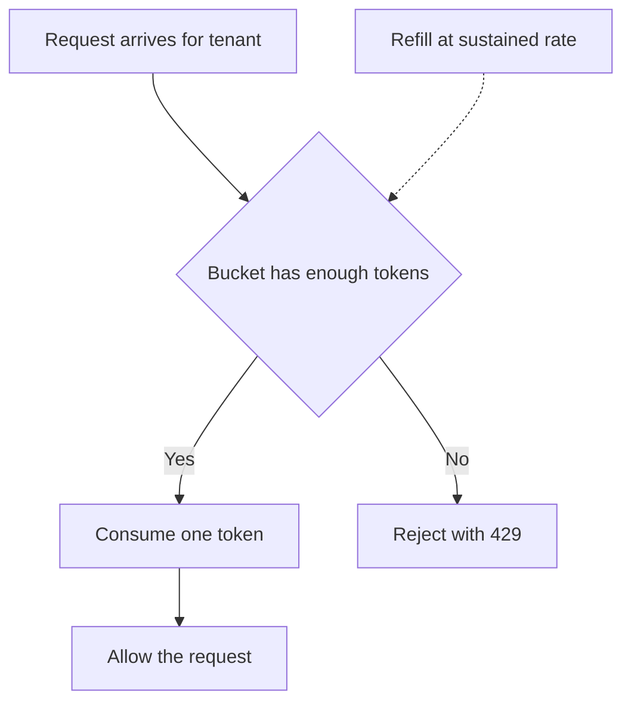
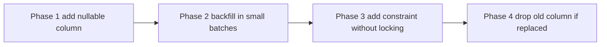

# Lecture 3 — Tenant-aware caching, per-tenant rate limits, and cross-tenant migrations

> *Lecture 2 isolated the bytes at rest; the database now refuses to leak a row across tenants. Lecture 3 isolates the bytes in motion: the cache layer, the rate-limit layer, the connection-pool layer. The hard part of multi-tenancy is not "can Tenant A see Tenant B's article". The hard part is "can Tenant A's traffic make Tenant B's API feel slow". A noisy neighbour with no rate limit consumes the whole database connection pool; a noisy neighbour with no cache budget evicts every other tenant's hot keys; a noisy neighbour with no work-queue priority drowns the ARQ workers. The fix is per-tenant quotas everywhere: in Redis, in the rate limiter, in the connection pool, in the job queue. And once the quotas are in place, the next question is how to migrate the schema across all of them without one tenant's failure blocking the others.*

## 1 — The cache layer: keys, evictions, budgets

The W9 cache is a shared Redis instance with cache keys like `article:42`. In multi-tenancy, that key shape is wrong. `article:42` for Tenant A's article and `article:42` for Tenant B's article are different articles, but they share a key. The first write wins; subsequent reads return whichever tenant's article was cached last.

### 1.1 — The tenant-prefixed key pattern

The fix is to include the tenant ID in every key:

```text
tenant:{tenant_id}:article:{article_id}
tenant:{tenant_id}:user:{user_id}:session
tenant:{tenant_id}:search:{query_hash}
```

Six bytes of prefix (`tenant:`) plus the tenant ID (typically a UUID rendered as 36 characters) plus the original key. The cost per key is roughly 50 bytes; the cost per million cached entries is 50 MB. Acceptable.

The implementation is a small wrapper around the Redis client:

```python
from typing import Any
import uuid

from redis.asyncio import Redis


class TenantCache:
    def __init__(self, redis: Redis, tenant_id: uuid.UUID) -> None:
        self._redis = redis
        self._tenant_id = tenant_id

    def _key(self, key: str) -> str:
        return f"tenant:{self._tenant_id}:{key}"

    async def get(self, key: str) -> str | None:
        value = await self._redis.get(self._key(key))
        return value.decode("utf-8") if value is not None else None

    async def set(self, key: str, value: str, ex: int | None = None) -> None:
        await self._redis.set(self._key(key), value, ex=ex)

    async def delete(self, key: str) -> None:
        await self._redis.delete(self._key(key))

    async def scan_keys(self, pattern: str) -> list[str]:
        prefix = f"tenant:{self._tenant_id}:"
        full_pattern = f"{prefix}{pattern}"
        keys: list[str] = []
        cursor = 0
        while True:
            cursor, batch = await self._redis.scan(cursor=cursor, match=full_pattern, count=100)
            keys.extend(k.decode("utf-8").removeprefix(prefix) for k in batch)
            if cursor == 0:
                break
        return keys
```

The wrapper is constructed per request, with the request's tenant ID. Every cache operation through it is tenant-scoped automatically. There is no path through `TenantCache` that touches another tenant's keys. The discipline-by-construction approach is the point.

### 1.2 — Why `SCAN`, not `KEYS`

Two Redis commands enumerate keys: `KEYS pattern` and `SCAN cursor MATCH pattern`. `KEYS` is `O(N)` over the entire keyspace and blocks Redis for the duration. On a Redis instance with 10 million keys, `KEYS tenant:acme:*` is a multi-second stall; the whole service hangs.

`SCAN` is a cursor-based incremental enumeration. Each call returns up to `COUNT` keys (configurable, default 10) and a cursor for the next call. The whole iteration is `O(N)` in aggregate but each call is `O(1)`-ish; other commands continue to serve during the iteration. The Redis documentation at <https://redis.io/docs/latest/commands/scan/> states it plainly: "production code should use `SCAN`, not `KEYS`".

The `scan_keys` method above is the right shape. Note the `cursor == 0` termination: `SCAN` returns `0` when iteration is complete, not when no keys match.

### 1.3 — The eviction-fairness problem

Redis with `maxmemory-policy allkeys-lru` evicts the least-recently-used keys when memory fills up. Across tenants, this is *unfair*: the tenant with the largest working set keeps its keys in cache; the tenant with the smaller working set gets evicted first, even if their access pattern is dense within the smaller set.

Concrete scenario:
- Tenant A is a heavy user with 1 million cached articles and 10 reads/second.
- Tenant B is a light user with 1 000 cached articles and 100 reads/second on a hot subset of 100 articles.
- Redis has `maxmemory` set; total entries exceed it.
- LRU evicts based on per-key access time. Tenant A's million keys are accessed at 10/second — most have not been touched in hours. Tenant B's 1 000 keys are accessed at 100/second; the hot 100 are touched every second.
- Eviction starts. The first keys evicted are the cold tail of *both* tenants. Eventually, Tenant A's 990 000 cold keys are evicted, leaving Tenant A's 10 000 warm keys and all of Tenant B's keys.

This sounds fair. It is not the worst case. The worst case is:
- Tenant C runs a one-time analytical job that reads 5 million distinct articles in a minute.
- Each article is read once, so each lands in cache and is never read again.
- LRU classifies these as "more recently used than Tenant B's hot 100" because they were just touched.
- Redis evicts Tenant B's hot 100 to make room for Tenant C's cold 5 000 000.

This is the classic cache-pollution-by-scan failure. The fix is `maxmemory-policy allkeys-lfu` (least-frequently-used), which considers access *frequency* not just *recency*. Tenant C's scan hits each key once; the frequency stays low; LFU does not promote these into the long-term set.

The 2026 best practice is **`allkeys-lfu` for shared multi-tenant Redis**. The Redis documentation at <https://redis.io/docs/latest/operate/oss_and_stack/management/security/> recommends LFU for any multi-tenant cache.

### 1.4 — Per-tenant cache budgets

LFU helps with fairness but does not give *guarantees*. If you need "Tenant B is guaranteed 10% of cache memory regardless of what other tenants do", LFU is insufficient. The options:

- **Separate Redis instances per tenant tier**. Free-tier tenants share one Redis instance; paid-tier tenants share a larger one with a smaller per-tenant share; enterprise-tier tenants get a dedicated Redis instance. This is the cache-layer analogue of pool/bridge/silo at the database layer.
- **A sweeper job that enforces per-tenant memory caps**. Periodically, the job runs `MEMORY USAGE` over every tenant's keys (via `SCAN` and a sum), and evicts the oldest entries for tenants over their per-tenant budget. The job is a cron or an ARQ worker; the budgets come from a per-tenant settings table.
- **Application-level cache-size tracking**. Every `SET` increments a counter; every eviction decrements it. When the counter hits the tenant's budget, the next `SET` first calls `DELETE` on the oldest key for that tenant. This is the most accurate; it is also the most code.

For most shops, `allkeys-lfu` plus per-tier instance separation is enough. Per-tenant budgets are the answer for the rare case where one tenant's cache behaviour cannot be allowed to affect another's — usually enterprise-tier customers with SLAs.

## 2 — Per-tenant rate limits

The W9 cache and the W8 rate limiter assumed a single tenant. The rate limit was "100 requests per minute per user", with the user resolved from the request. In multi-tenancy, that limit is wrong in two ways.

First: if Tenant A has 1 000 users and Tenant B has 1 user, Tenant A can drive 100 000 requests per minute and Tenant B can drive 100. The per-user limit is identical; the per-tenant volume is wildly different. Tenant A's traffic dominates.

Second: the global limit "the service can handle 10 000 requests per second" is shared across tenants. One tenant in a bursty phase consumes the headroom; every other tenant sees 503s during the burst.

The fix is per-tenant rate limits.

### 2.1 — The token-bucket pattern, refreshed

The token-bucket algorithm:

- Each tenant has a *bucket* with a capacity (the burst limit) and a refill rate (the sustained limit).
- The bucket starts full. Every request consumes one token.
- The bucket refills at the refill rate (e.g. 100 tokens/second).
- If the bucket is empty, the request is rejected with a 429 `Too Many Requests`.


*A per-tenant token bucket: refill keeps the gate open, an empty bucket closes it until the next refill.*

In Redis, the implementation is a single key per tenant per endpoint:

```text
ratelimit:tenant:{tenant_id}:{endpoint}
```

The key holds two values (the current token count and the last-refill timestamp), updated atomically with a Lua script. The Lua-script approach is the right one because incrementing-then-decrementing the bucket from the application has a race condition under concurrent requests.

```python
import time
from typing import Optional
import uuid

from redis.asyncio import Redis


# The Lua script is atomic on Redis: token count and timestamp update happen
# without interleaving from other requests.
RATE_LIMIT_LUA = """
local key = KEYS[1]
local capacity = tonumber(ARGV[1])
local refill_rate = tonumber(ARGV[2])
local now = tonumber(ARGV[3])
local cost = tonumber(ARGV[4])

local data = redis.call('HMGET', key, 'tokens', 'last_refill')
local tokens = tonumber(data[1]) or capacity
local last_refill = tonumber(data[2]) or now

local elapsed = now - last_refill
tokens = math.min(capacity, tokens + elapsed * refill_rate)

if tokens < cost then
    redis.call('HMSET', key, 'tokens', tokens, 'last_refill', now)
    redis.call('EXPIRE', key, 3600)
    return 0
end

tokens = tokens - cost
redis.call('HMSET', key, 'tokens', tokens, 'last_refill', now)
redis.call('EXPIRE', key, 3600)
return 1
"""


async def consume_tenant_token(
    redis: Redis,
    tenant_id: uuid.UUID,
    endpoint: str,
    capacity: int,
    refill_rate: float,
) -> bool:
    """Return True if the request is allowed; False if rate-limited."""
    key = f"ratelimit:tenant:{tenant_id}:{endpoint}"
    now = time.time()
    result: int = await redis.eval(
        RATE_LIMIT_LUA, 1, key, capacity, refill_rate, now, 1
    )
    return bool(result)
```

The two parameters `capacity` and `refill_rate` come from the per-tenant rate-limit table:

```sql
CREATE TABLE rate_limits (
    tenant_id   uuid NOT NULL REFERENCES tenants(id) ON DELETE CASCADE,
    endpoint    text NOT NULL,
    capacity    int  NOT NULL,
    refill_rate float NOT NULL,
    PRIMARY KEY (tenant_id, endpoint)
);
```

A default-tier tenant gets `capacity=100, refill_rate=10/sec`. A paid-tier tenant gets `capacity=1000, refill_rate=100/sec`. An enterprise tenant gets whatever the contract says. The application looks up the rate limit for the current tenant at the start of each request and feeds it to the consumer.

### 2.2 — The middleware integration

In FastAPI:

```python
from fastapi import Request, HTTPException, Depends

@app.middleware("http")
async def rate_limit_middleware(request: Request, call_next):
    tenant_id = request.state.tenant_id  # Set by the tenant resolver.
    endpoint = request.url.path
    limit = await get_rate_limit_for(tenant_id, endpoint)  # From DB or cache.
    allowed = await consume_tenant_token(
        redis=app.state.redis,
        tenant_id=tenant_id,
        endpoint=endpoint,
        capacity=limit.capacity,
        refill_rate=limit.refill_rate,
    )
    if not allowed:
        raise HTTPException(
            status_code=429,
            detail="rate limit exceeded",
            headers={"Retry-After": "1"},
        )
    return await call_next(request)
```

Three production additions worth knowing:

- **Cache the `get_rate_limit_for` lookup.** Reading the per-tenant rate limit from Postgres on every request would itself be a multi-tenant bottleneck. Cache the lookup in Redis with a TTL of 60 seconds (so changes propagate within a minute) or invalidate the cache when the rate-limit row is updated.
- **Emit metrics on rate-limit hits.** A counter `rate_limit_rejected_total{tenant_id="...", endpoint="..."}` lets you see which tenants are hitting their limits. The pattern of "one tenant is constantly at 100% of their budget" is a signal to upsell, or to mitigate, or to investigate a bug.
- **Differentiate between tiers in the 429 response body.** Free-tier tenants get "upgrade to paid for higher limits"; paid-tier tenants get "contact support to discuss higher limits". The Cloudflare engineering team's post at <https://blog.cloudflare.com/counting-things-a-lot-of-different-things/> is the canonical reference for per-tenant rate limiting at scale.

## 3 — Per-tenant connection-pool quotas

A second noisy-neighbour vector: connection pool exhaustion. The database has `max_connections` (Postgres's hard ceiling, typically 100 to 500). Each application instance has a `Pool` with `max_size` (typically 10 to 50). A burst of traffic from one tenant can hold every connection in the pool, blocking every other tenant's requests until connections free up.

### 3.1 — The application-level cap

The simplest mitigation is a per-tenant semaphore in the application:

```python
import asyncio
from collections import defaultdict
import uuid

class PerTenantPoolGuard:
    """Limits in-flight DB requests per tenant."""

    def __init__(self, per_tenant_max: int) -> None:
        self._per_tenant_max = per_tenant_max
        self._semaphores: dict[uuid.UUID, asyncio.Semaphore] = defaultdict(
            lambda: asyncio.Semaphore(per_tenant_max)
        )

    def acquire(self, tenant_id: uuid.UUID) -> asyncio.Semaphore:
        return self._semaphores[tenant_id]
```

Use it as a dependency:

```python
async def get_db_with_guard(
    tenant_id: uuid.UUID = Depends(get_tenant_id),
):
    guard = app.state.pool_guard.acquire(tenant_id)
    async with guard:
        async with app.state.pool.acquire() as conn:
            async with conn.transaction():
                await conn.execute("SET LOCAL app.current_tenant = $1", str(tenant_id))
                yield conn
```

With `per_tenant_max=3` and a pool of 30, no single tenant can hold more than 3 of the 30 connections at once. The other 27 are available to other tenants.

### 3.2 — `pgbouncer` user limits

The application-level guard is per-process. With multiple application instances behind a load balancer, each has its own guard; the aggregate per-tenant slots is `per_tenant_max × num_instances`.

For a global cap, use `pgbouncer` between the application and Postgres. `pgbouncer` is a single-process connection pooler with per-user (and per-database) connection limits configurable in `pgbouncer.ini`:

```ini
[users]
crunchreader_app = pool_size=20

[databases]
crunchreader = host=localhost port=5432 dbname=crunchreader pool_size=100
```

This is the simplest configuration; for per-tenant limits, you would have one `pgbouncer` user per tenant (which means one Postgres role per tenant, which means a more complex `GRANT` story). Most shops do not go this far; the application-level semaphore is sufficient for most tenant tiers, and `pgbouncer` cluster-wide pooling handles the rest.

### 3.3 — The trade-off: queueing versus rejecting

When a tenant hits their per-tenant connection cap, the application has two options: *queue* the request (wait for a connection to free) or *reject* it (return 503).

Queueing is the polite default. The semaphore in §3.1 blocks; the request waits for a free slot. The total time-in-system goes up but the success rate stays at 100%.

Rejecting is the right answer when queues would grow unboundedly. Add a `wait_timeout`:

```python
try:
    await asyncio.wait_for(guard.acquire(), timeout=2.0)
except asyncio.TimeoutError:
    raise HTTPException(status_code=503, detail="tenant is over capacity")
```

After 2 seconds of waiting, return 503. The tenant's client retries; the alternative is a request that holds an event-loop slot indefinitely.

The 2026 best practice is **queue with a short timeout** — 2 to 5 seconds, fail-fast after that. The right number depends on the typical request latency; a service whose p99 is 200ms should not have requests waiting 5 seconds for a connection.

## 4 — Per-tenant work-queue priority

The W8 ARQ workers consume jobs from a Redis queue. Across tenants, the queue is FIFO by default — Tenant A's job submitted first runs first, even if Tenant A is on the free tier and Tenant B is enterprise.

The fix is multiple queues, one per tier:

```python
# In the ARQ worker config:
class WorkerSettings:
    queue_names = ["arq:enterprise", "arq:paid", "arq:free"]
    # Worker polls in priority order: enterprise first, then paid, then free.
```

When a job is enqueued, the application picks the queue based on the tenant's tier:

```python
async def enqueue_search_index(redis: ArqRedis, tenant_id: uuid.UUID, article_id: int) -> None:
    tier = await get_tenant_tier(tenant_id)
    queue = f"arq:{tier}"
    await redis.enqueue_job("index_article", article_id, _queue_name=queue)
```

The free-tier queue gets serviced only when the enterprise and paid queues are empty. Under load, the free-tier wait time grows; the enterprise wait time stays bounded. This is the right trade — enterprise customers paid for it.

Three production additions:

- **Reserve a worker for the free-tier queue.** Pure priority-based scheduling can starve the free-tier queue indefinitely if the enterprise queue is never empty. A dedicated worker for free-tier (one out of ten, say) prevents starvation.
- **Per-tenant per-queue rate limits.** A single enterprise tenant should not be able to monopolise the enterprise queue. Apply rate limits at enqueue time.
- **Job timeout per tier.** Free-tier jobs can have a shorter timeout (60 seconds); enterprise-tier jobs can run longer (10 minutes). A free-tier tenant cannot tie up a worker forever.

## 5 — Cross-tenant migrations: the runbook

Schema changes in a multi-tenant system are not a single `ALTER TABLE`. The migration must run against every tenant in the chosen isolation model — once in pool, N times in bridge, N times in silo. Each model has a different runbook.

### 5.1 — Pool: one DDL, many tenants

In pool, there is one schema. One `ALTER TABLE` runs once and is done. The catch is that the table has rows for all tenants; locking the table during the migration blocks every tenant's queries until the migration completes.

The Stripe online-migrations pattern (<https://stripe.com/blog/online-migrations>) is the right tool. The four phases:

1. **Phase 1 — Add the new column, nullable.** `ALTER TABLE articles ADD COLUMN read_time_seconds int;` — an `ADD COLUMN` with no default is metadata-only in Postgres 11+; it does not rewrite the table. Fast.
2. **Phase 2 — Backfill.** Run a background job that fills the column in batches: `UPDATE articles SET read_time_seconds = compute_read_time(body) WHERE id BETWEEN $1 AND $2;`. The batches are small (1 000 to 10 000 rows); each runs in its own transaction; the table is never locked for more than a fraction of a second.
3. **Phase 3 — Add constraints.** Once every row is backfilled: `ALTER TABLE articles ALTER COLUMN read_time_seconds SET NOT NULL;`. This re-validates every row, which requires a brief table lock; in production, use `ALTER TABLE ... ADD CONSTRAINT ... NOT VALID;` followed by `ALTER TABLE ... VALIDATE CONSTRAINT ...` to avoid the lock.
4. **Phase 4 — Drop the old way.** If the migration is replacing an old column, drop it. If not, this phase is empty.


*The Stripe four-phase pattern: no phase holds a long table lock, so the table stays available throughout.*

For pool, this pattern runs *once*. The cost is the cost of backfilling N rows; "N" is the sum across all tenants.

### 5.2 — Bridge: same DDL, N schemas

In bridge, the same migration runs against every tenant schema. The runner:

```python
import asyncpg

async def migrate_all_tenants(pool: asyncpg.Pool, migration_sql: str) -> dict[str, str]:
    """Apply migration_sql to every tenant_<id> schema. Returns per-schema status."""
    results: dict[str, str] = {}
    async with pool.acquire() as conn:
        schemas = await conn.fetch(
            "SELECT nspname FROM pg_namespace WHERE nspname LIKE 'tenant_%'"
        )
    for row in schemas:
        schema = row["nspname"]
        try:
            async with pool.acquire() as conn:
                async with conn.transaction():
                    await conn.execute(f"SET LOCAL search_path = {schema}, public")
                    await conn.execute(migration_sql)
            results[schema] = "ok"
        except Exception as exc:  # noqa: BLE001
            results[schema] = f"failed: {exc}"
    return results
```

Three production realities:

- **The migration must be idempotent.** Use `CREATE TABLE IF NOT EXISTS`, `ALTER TABLE ... ADD COLUMN IF NOT EXISTS` (Postgres 9.6+), `CREATE INDEX IF NOT EXISTS`. The runner must be safe to re-run after a partial failure.
- **Order matters under load.** If the migration takes a minute per schema and there are 1 000 schemas, the migration takes 16 hours. The first schema finishes 16 hours before the last. During that window, the application must handle both old and new schema states. The Stripe four-phase pattern handles this — every schema is "Phase 1 done; Phase 2 in progress" before any schema reaches Phase 3.
- **Failure isolation.** If the migration fails against schema 47, the runner records the failure and continues. The runbook for the failure is per-schema: investigate why; fix; re-run the migration against just that schema. The other 999 schemas are unaffected.

### 5.3 — Silo: same DDL, N databases

In silo, the migration runs against every tenant database. This is the most expensive of the three models: each tenant database has its own connection, its own lock manager, its own potential for failure. The runner is similar in shape to the bridge runner but with `dict[tenant_id, dsn]` instead of `pg_namespace` enumeration.

The mitigation strategies are the same — idempotent migrations, four-phase rollout, per-tenant failure isolation — plus one more: **migration ordering by tenant tier**. Run the migration against free-tier tenants first (smaller blast radius if something goes wrong); then mid-tier; then enterprise. The migration is, in effect, a slow rollout, with each tier acting as a canary for the next.

## 6 — Per-tenant observability

The W11 service generates per-tenant data: per-tenant request counts, per-tenant latency, per-tenant error rates. The observability stack must surface this; otherwise, "Tenant X is slow" becomes "the service is slow", and debugging is harder.

Three patterns (Week 12 will go deeper):

- **Tenant ID as a log field.** Every log line has `tenant_id=<uuid>`. The `structlog` or `logging` filter that adds it lives in the FastAPI middleware. Searching logs by tenant becomes one filter.
- **Tenant ID as a metric label.** A counter `requests_total{tenant_id="...", endpoint="..."}` lets the Grafana dashboard split by tenant. **Cardinality cost is the constraint** — 10 000 tenants × 50 endpoints = 500 000 time series, which Prometheus handles but Grafana queries get slower. The mitigation: aggregate to *tenant tier* (free/paid/enterprise) for most dashboards, and surface individual tenants only on detail panels.
- **Tenant ID as a trace attribute.** OpenTelemetry traces include `tenant_id` as a span attribute. The trace UI shows "all spans for tenant X in the last hour"; debugging a tenant-specific issue does not require log diving.

The single most valuable per-tenant metric is **per-tenant cost**: an estimate of database CPU-seconds, Redis bytes, application CPU-seconds attributable to each tenant. The "who is using 80% of the database CPU this month?" report drives upsells, abuse detection, and resource-planning decisions. The AWS SaaS Lens has a whole section on cost attribution; the implementation is non-trivial but the value is high.

## 7 — Tenant lifecycle: onboarding, offboarding, suspension

Three operations every multi-tenant service needs to support.

### 7.1 — Onboarding

Pool: a single `INSERT INTO tenants (slug, name) VALUES ($1, $2) RETURNING id;`. Atomic. Reversible (`DELETE FROM tenants WHERE id = $1`).

Bridge: a `CREATE SCHEMA tenant_<id>` followed by the schema migration. The migration is the same as the one used to set up the original schema. Failure mode: schema creation succeeds, migration fails — leaves a half-set-up schema. The fix is to wrap both in a transaction (Postgres supports transactional DDL), or to make the runbook for "rolled-back schema" explicit.

Silo: provision the database (Terraform or the cloud provider's API), wait for it to come up, run the schema migration, register the connection string in the tenant registry. Minutes to tens of minutes. The standard mitigation is to pre-provision a pool of empty databases and claim from it on onboarding.

### 7.2 — Offboarding

Pool: `DELETE FROM tenants WHERE id = $1` cascades to every tenant-scoped table. Atomic. Fast. The cascade may take time for tenants with large data volumes; for that case, batch the deletion.

Bridge: `DROP SCHEMA tenant_<id> CASCADE` removes the schema and every table in it. Fast for small tenants; slow for large ones, but no cross-tenant impact.

Silo: deprovision the database (Terraform or the cloud provider's API). Take a final backup first — regulatory or contractual requirements often demand a 30-day data-retention window after offboarding. The actual database destruction comes 30 days later.

### 7.3 — Suspension

Suspending a tenant means "they can no longer access the service, but their data is preserved". Three implementations:

- **Pool**: set `tenants.suspended_at = now()` and add a check in the auth middleware: "if `tenants.suspended_at IS NOT NULL`, reject with 402". The data stays in place; the access path is closed.
- **Bridge**: same as pool, plus revoke `USAGE` on the schema from the application role. The application is no longer allowed to set `search_path` to the suspended tenant's schema.
- **Silo**: same as pool, plus stop the database instance (in cloud providers, this is "stop" not "terminate" — the data is preserved, the instance is not running, and the cost drops to storage-only).

For all three, the unsuspension reverses the operation. Pool and bridge are reversible in seconds; silo's "start the instance" takes a few minutes.

## 8 — Practitioner summary

Six things to remember out of Lecture 3:

1. **Tenant-prefixed cache keys are non-optional**. Six bytes of prefix; the alternative is cross-tenant data leakage through the cache.
2. **`SCAN`, not `KEYS`**. Always. The convenience of `KEYS` is a production outage.
3. **Per-tenant rate limits at the entry point**. Token bucket per tenant per endpoint. The Redis Lua script for atomicity. Cache the per-tenant limit lookup.
4. **Per-tenant connection-pool quotas**. Application-level semaphores; `pgbouncer` for cluster-wide. Queue-with-timeout, not unbounded wait.
5. **Per-tenant work-queue priorities**. Enterprise queue, paid queue, free queue; reserved capacity for free to avoid starvation.
6. **Cross-tenant migrations follow the Stripe pattern**. Four phases; idempotent migrations; per-tenant failure isolation; tier-by-tier rollout for silo.

Week 11 ends with a service that isolates bytes at rest (RLS), in motion (per-tenant rate limits and connection caps), and in flight (per-tier work queues). The architecture is multi-tenant in every layer that matters. Week 12 will make it observable.

---

### References cited in this lecture

- Redis — `SCAN`: <https://redis.io/docs/latest/commands/scan/>
- Redis — Memory optimisation: <https://redis.io/docs/latest/operate/oss_and_stack/management/optimization/memory-optimization/>
- Cloudflare — "How we built rate limiting capable of scaling to millions of domains": <https://blog.cloudflare.com/counting-things-a-lot-of-different-things/>
- Stripe Engineering — "Online migrations at scale": <https://stripe.com/blog/online-migrations>
- AWS SaaS Lens — Noisy neighbour: <https://docs.aws.amazon.com/wellarchitected/latest/saas-lens/noisy-neighbor.html>
- AWS SaaS Lens — Cost and usage attribution: <https://docs.aws.amazon.com/wellarchitected/latest/saas-lens/cost-and-usage-attribution.html>
- `pgbouncer` documentation: <https://www.pgbouncer.org/config.html>
